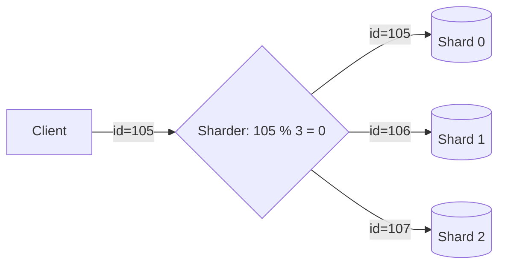

# 🔪 3. Sharding

## 📑 Table of Contents
1. [The Scalability Problem](#the-scalability-problem)
2. [Horizontal vs. Vertical Scaling](#horizontal-vs-vertical-scaling)
3. [How Sharding Works](#how-sharding-works)
4. [The Challenges of Sharding](#the-challenges-of-sharding)

---

## 1. 📈 The Scalability Problem

When a dataset becomes massive (terabytes) or the request volume grows too high (e.g., 100k RPS), a single machine—even a very powerful one—will eventually hit its performance limit.

### Vertical Scaling (Scale Up)
**"Buy a more expensive server."**
This involves adding more CPU, RAM, or SSD storage to an existing server.
*   ✅ **Pros**: Does not require any changes to the application code.
*   ❌ **Cons**: There is a physical limit. A server with 100TB of RAM is either prohibitively expensive or simply doesn't exist.

### Horizontal Scaling (Scale Out)
**"Buy many cheaper servers."**
This involves distributing data across 10, 100, or 1,000 standard machines.
*   ✅ **Pros**: Theoretically infinite growth—just add more servers.
*   ❌ **Cons**: Significant increase in the complexity of both the code and system administration.

---

## 2. 🧩 What is Sharding?

**Sharding** is a method of horizontal scaling where **one logical database** is divided into several physical parts called **shards**. Each shard lives on its own separate server.

> [!NOTE]
> A **shard** is an independent database that holds a *portion* of the total data. Together, all shards form the complete global dataset.

---

## 3. ⚙️ How Does It Work?

We need a way to decide which server should store or retrieve a specific piece of data. This is done using a **Shard Key**.

### Example: Sharding by UserID

Assuming we have 3 servers (Shards).
A client sends a request: `GET /user?id=105`

1.  **Algorithm**: `Shard_ID = User_ID % 3` (Modulo operator)
2.  `105 % 3 = 0` -> The data is located on **Shard 0**.

### Shard Selection Methods:
1.  **Range-Based Sharding**: ID 1-1000 -> Shard 1, 1001-2000 -> Shard 2.
    *   *Problem*: If all new users are added sequentially, only the last shard will be heavily loaded.
2.  **Hash-Based Sharding**: `hash(id) % N`. This provides a more uniform distribution of data across all shards.
3.  **Directory-Based Sharding**: A lookup table is maintained that maps records to specific shards (e.g., "ID 1 -> Shard 5").

---

## 4. 🤯 The Challenges of Sharding

Sharding shifted complexity from hardware to software. It should be considered a **last resort**. If you can avoid sharding, do so.

1.  **Resharding (Rebalancing)**:
    *   If you have 3 servers and they become full, adding a 4th server breaks the `ID % 3` logic. You have to recalculate the keys and physically move terabytes of data between servers. This is a complex and time-consuming operation.
2.  **Cross-Shard JOINs**:
    *   If your `Users` table is on Shard 1 and your `Orders` table is on Shard 2, you cannot perform a `JOIN` with a single SQL query. 
    *   You must fetch the data from both shards and join them within your application logic.
3.  **Global Transactions**:
    *   Performing a `COMMIT` across two different servers is difficult (requiring protocols like Two-Phase Commit, 2PC) and is often slow and unreliable. Most systems avoid transactions that span multiple shards.

> [!IMPORTANT]
> **Conclusion**: Sharding increases architectural complexity tenfold. Before sharding, first optimize your SQL, configure indexes properly, and implement caching and replication. Sharding is for when there is no other path forward (as seen with Google, Facebook, and Telegram).
