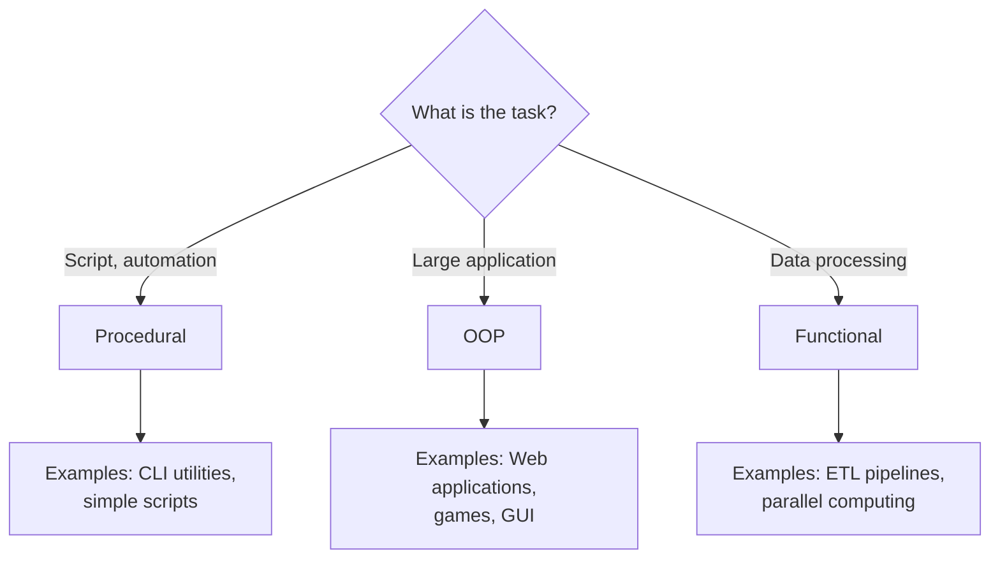

# 🎯 Programming Paradigms

## 📑 Table of Contents
1. [What is a paradigm?](#what-is-a-paradigm)
2. [Procedural Programming](#procedural-programming)
3. [Object-Oriented Programming (OOP)](#object-oriented-programming-oop)
4. [Functional Programming](#functional-programming)
5. [Comparison of Paradigms](#paradigm-comparison)
6. [Multi-paradigm Languages](#multi-paradigm-languages)

---

## 🤔 What is a paradigm?

A **programming paradigm** is a way or style of writing a program. It’s like different approaches to solving the same problem.

> [!TIP]
> **Analogy**: Imagine you need to get from point A to point B. You can walk, drive a car, or fly on a plane. The goal is the same, but the methods are different. It’s the same in programming!

Three main paradigms:
- **Procedural** — a program as a list of instructions (a step-by-step recipe)
- **Object-Oriented (OOP)** — a program as the interaction of objects (a city made of buildings)
- **Functional** — a program as calculations through functions (mathematical formulas)

---

## 🔧 Procedural Programming

### Core Idea 💡

A program is a **sequence of commands** that the computer executes one after another. Like a cooking recipe: take eggs → crack → whisk → fry.

### Key Elements 🔗

1. **Variables** — store data
2. **Functions/Procedures** — groups of instructions
3. **Conditions** — `if/else`
4. **Loops** — `for/while`

### Example in C

```c
#include <stdio.h>

// Function to calculate sum
int sum(int a, int b) {
    return a + b;
}

// Function to print result
void printResult(int result) {
    printf("Result: %d\n", result);
}

int main() {
    int x = 5;
    int y = 10;
    
    // Step 1: Calculate
    int result = sum(x, y);
    
    // Step 2: Print
    printResult(result);
    
    return 0;
}
```

### Example in Go

```go
package main

import "fmt"

// Function to calculate sum
func sum(a, b int) int {
    return a + b
}

// Function to print result
func printResult(result int) {
    fmt.Printf("Result: %d\n", result)
}

func main() {
    x := 5
    y := 10
    
    // Step 1: Calculate
    result := sum(x, y)
    
    // Step 2: Print
    printResult(result)
}
```

### Pros and Cons

✅ **Pros**:
- **Simplicity**: Easy to understand and learn  
- **Straightforwardness**: Code executes from top to bottom  
- **Performance**: Close to how the processor works  

❌ **Cons**:
- **Hard to scale**: Large programs easily become confusing  
- **Repeating code**: Often leads to copying similar code  
- **Global variables**: Can create issues in large projects  

> [!NOTE]
> **Where it’s used**: System programming (drivers, OS), embedded systems, automation scripts.

---

## 🧱 Object-Oriented Programming (OOP)

### Core Idea 💡

A program is the **interaction of objects**. An object contains both data and the functions to work with it. Like in the real world: a car has properties (color, speed) and actions (drive, brake).

> [!TIP]
> Read more about OOP in the file [`1_OOP.md`](file:///Users/ilasgibadullin/Documents/develop/projects/brave_monkey_education/materials/eng/computer_science/architecture/1_OOP.md)

### Quick Example in Go 📝

```go
package main

import "fmt"

// Structure (class) - blueprint of an object
type BankAccount struct {
    owner   string
    balance int
}

// Method - function associated with an object
func (acc *BankAccount) Deposit(amount int) {
    acc.balance += amount
    fmt.Printf("%s deposited %d into the account\n", acc.owner, amount)
}

func (acc *BankAccount) GetBalance() int {
    return acc.balance
}

func main() {
    // Create an object
    account := BankAccount{
        owner:   "Ivan",
        balance: 1000,
    }
    
    account.Deposit(500)
    fmt.Printf("Balance: %d\n", account.GetBalance())
}
```

**Output:**
```
Ivan deposited 500 into the account
Balance: 1500
```

### Benefits of OOP ✨

✅ Data and functions together (encapsulation)  
✅ Code reuse (inheritance)  
✅ Easy to model the real world  

---

## 🧮 Functional Programming

### Core Idea 💡

A program is **calculation through functions**, like in mathematics: `f(x) = x + 2`. Functions do not change data; they create new data.

### Key Principles 🧩

1. **Pure Functions**: Same input → same output (no side effects)
2. **Immutability**: Data is not changed; new data is created
3. **Higher-Order Functions**: Functions can take and return other functions

### Example: Pure Function

```go
// ❌ NOT pure - depends on an external variable
var counter = 0

func incrementBad() int {
    counter++ // Modifies external state!
    return counter
}

// ✅ Pure - always the same result for the same arguments
func increment(n int) int {
    return n + 1
}
```

### Example: Immutability

```go
// ❌ Procedural style - modifying the array
func doubleValuesMutable(nums []int) {
    for i := range nums {
        nums[i] = nums[i] * 2 // Changes the original!
    }
}

// ✅ Functional style - creating a new array
func doubleValuesImmutable(nums []int) []int {
    result := make([]int, len(nums))
    for i, v := range nums {
        result[i] = v * 2 // Create new
    }
    return result
}

func main() {
    original := []int{1, 2, 3}
    
    doubled := doubleValuesImmutable(original)
    
    fmt.Println(original) // [1, 2, 3] - unchanged!
    fmt.Println(doubled)  // [2, 4, 6] - new array
}
```

### Example: Higher-Order Functions

```go
package main

import "fmt"

// Function takes another function as an argument
func applyOperation(nums []int, operation func(int) int) []int {
    result := make([]int, len(nums))
    for i, v := range nums {
        result[i] = operation(v)
    }
    return result
}

func main() {
    numbers := []int{1, 2, 3, 4, 5}
    
    // Double each number
    doubled := applyOperation(numbers, func(x int) int {
        return x * 2
    })
    
    // Square each number
    squared := applyOperation(numbers, func(x int) int {
        return x * x
    })
    
    fmt.Println(doubled) // [2, 4, 6, 8, 10]
    fmt.Println(squared) // [1, 4, 9, 16, 25]
}
```

### Closures 🔐

A function "remembers" variables from its outer scope.

```go
package main

import "fmt"

// Function returns a function
func makeCounter() func() int {
    count := 0 // This variable is "captured"
    
    return func() int {
        count++ // Changes on each call
        return count
    }
}

func main() {
    counter1 := makeCounter()
    counter2 := makeCounter()
    
    fmt.Println(counter1()) // 1
    fmt.Println(counter1()) // 2
    fmt.Println(counter1()) // 3
    
    fmt.Println(counter2()) // 1 (its own counter!)
    fmt.Println(counter2()) // 2
}
```

### Pros and Cons

✅ **Pros**:
- **Predictability**: Pure functions are easy to test  
- **Concurrency**: Immutable data is safe in multi-threading  
- **Readability**: Code is like mathematical formulas  

❌ **Cons**:
- **Complexity for beginners**: Unfamiliar way of thinking  
- **Performance**: Creating new data instead of modifying can be slower  
- **Not for everything**: Some tasks (e.g., file operations) are more natural in a procedural style  

> [!NOTE]
> **Where it’s used**: Data processing (map/reduce), asynchronous programming, parallel computing.

---

## 📊 Comparison of Paradigms

| Feature | Procedural | OOP | Functional |
|:---|:---|:---|:---|
| **Foundation** | Functions and procedures | Objects and classes | Pure functions |
| **Data** | Global variables | Encapsulated in objects | Immutable |
| **State Change** | ✅ Frequent | ✅ Controlled | ❌ Avoided |
| **Code Reuse** | Via functions | Via inheritance | Via function composition |
| **Complexity** | 🟢 Low | 🟡 Medium | 🔴 High (for beginners) |
| **Suitable For** | Scripts, systems | Large applications | Data, concurrency |
| **Example Languages** | C, Pascal, Go (basic) | Java, C++, Python, Go | Haskell, Erlang, Clojure |

### Example of One Task in Different Styles

**Task**: Find the sum of squares of even numbers

```go
package main

import "fmt"

// ===== PROCEDURAL STYLE =====
func sumSquaresEvenProcedural(nums []int) int {
    sum := 0
    for i := 0; i < len(nums); i++ {
        if nums[i]%2 == 0 {
            sum += nums[i] * nums[i]
        }
    }
    return sum
}

// ===== OOP STYLE =====
type NumberProcessor struct {
    numbers []int
}

func (np *NumberProcessor) SumSquaresEven() int {
    sum := 0
    for _, num := range np.numbers {
        if np.isEven(num) {
            sum += np.square(num)
        }
    }
    return sum
}

func (np *NumberProcessor) isEven(n int) bool {
    return n%2 == 0
}

func (np *NumberProcessor) square(n int) int {
    return n * n
}

// ===== FUNCTIONAL STYLE =====
func filter(nums []int, predicate func(int) bool) []int {
    result := []int{}
    for _, n := range nums {
        if predicate(n) {
            result = append(result, n)
        }
    }
    return result
}

func mapFunc(nums []int, fn func(int) int) []int {
    result := make([]int, len(nums))
    for i, n := range nums {
        result[i] = fn(n)
    }
    return result
}

func reduce(nums []int, initial int, fn func(int, int) int) int {
    result := initial
    for _, n := range nums {
        result = fn(result, n)
    }
    return result
}

func sumSquaresEvenFunctional(nums []int) int {
    evens := filter(nums, func(n int) bool { return n%2 == 0 })
    squares := mapFunc(evens, func(n int) int { return n * n })
    sum := reduce(squares, 0, func(a, b int) int { return a + b })
    return sum
}

func main() {
    numbers := []int{1, 2, 3, 4, 5, 6}
    
    // All three ways yield the same result
    fmt.Println("Procedural:", sumSquaresEvenProcedural(numbers)) // 56
    
    processor := NumberProcessor{numbers: numbers}
    fmt.Println("OOP:", processor.SumSquaresEven()) // 56
    
    fmt.Println("Functional:", sumSquaresEvenFunctional(numbers)) // 56
}
```

**Output:**
```
Procedural: 56
OOP: 56
Functional: 56
```

---

## 🌈 Multi-paradigm Languages

Modern languages support **multiple paradigms** simultaneously!

### Go — Multi-paradigm

**Procedural**:
```go
func calculateTotal(prices []float64) float64 {
    total := 0.0
    for _, price := range prices {
        total += price
    }
    return total
}
```

**OOP** (via structures and methods):
```go
type Cart struct {
    items []float64
}

func (c *Cart) GetTotal() float64 {
    total := 0.0
    for _, item := range c.items {
        total += item
    }
    return total
}
```

**Functional** (via higher-order functions):
```go
func calculateTotalFunctional(prices []float64, discount func(float64) float64) float64 {
    total := 0.0
    for _, price := range prices {
        total += discount(price)
    }
    return total
}
```

### Python, JavaScript — Also Multi-paradigm

You can choose the style based on the task!

---

## 💡 When to Use Which Paradigm?



### Recommendations

| Task | Paradigm | Why |
|:---|:---|:---|
| CLI utility | Procedural | Simplicity, straightforwardness |
| Web application | OOP | Structure, reuse |
| Large data processing | Functional | Immutability, concurrency |
| Game | OOP | Objects (players, enemies) are natural |
| Configuration script | Procedural | Readability, simplicity |
| Asynchronous system | Functional | Predictability, statelessness |

> [!TIP]
> **Key Tip**: In real projects, use a **combination of paradigms**! For example, in Go, developers often use:
> - Procedural style for simple functions
> - OOP via structures for organizing code
> - Functional approach for data processing (via `map`, `filter`, closures)

---

## 🎯 Summary

- **Procedural** — step-by-step instructions (simple and straightforward code)
- **OOP** — objects and their interaction (good for large systems)
- **Functional** — calculation via pure functions (reliable for concurrency)

Top programmers **know all paradigms** and choose the right one for the specific task! 🚀
