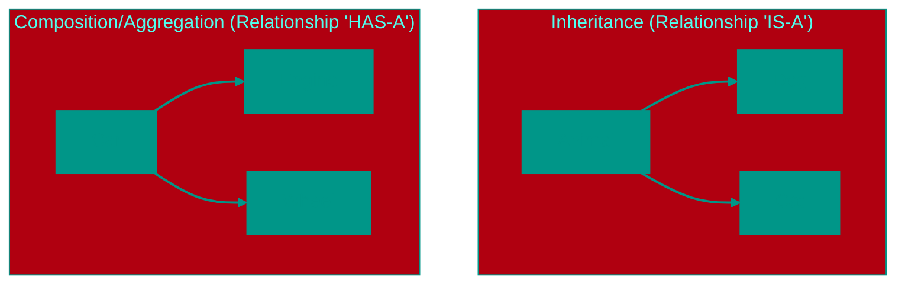

# 🧱 OOP Basics (Object-Oriented Programming)


## 📑 Table of Contents
1. [What is OOP?](#what-is-oop)
2. [Core Principles ("The Big Four")](#core-principles-the-big-four)
3. [Relationships Between Objects](#relationships-between-objects)

---


## 1. 🤔 What is OOP?

**Object-Oriented Programming** is an approach to writing code where the program is built from "objects."

> [!TIP]
> **An Object** is like an item in the real world (e.g., a Car or a User) that combines:
> *   **Data** (properties): color, name, age.
> *   **Behavior** (methods): drive, change name, say hello.

A class is a "blueprint" or "template," and an object is a specific thing made according to that blueprint.

---


## 2. 🎡 Core Principles ("The Big Four")


### 🛡️ Encapsulation
The bundling of data and the methods that operate on that data into a single "unit" (class) and restricting direct access to them from the outside.

*   **Why**: To prevent anyone from accidentally changing important data "under the hood." It hides implementation details.
*   **Analogy**: A coffee machine has buttons on the outside (interface), but you don't see how the beans are ground and water is heated inside (hidden implementation).


### 🔍 Abstraction
Focusing on only the essential characteristics of an object while discarding the details.

*   **Why**: To concentrate on *what* an object does, rather than *how* it does it.
*   **Example**: When you drive a car, you care that the steering wheel turns the wheels, not exactly how the power steering system works.


### 🧬 Inheritance
Allows you to create a new class based on an existing one, inheriting its "abilities."

*   **Why**: To avoid writing the same code multiple times.
*   **Example**: A `Bird` class knows how to fly. An `Eagle` class inherits this ability from `Bird`.


### 🎭 Polymorphism
The ability of a program to work with different objects through the same interface without knowing their specific types.

*   **Why**: It allows for writing more universal and flexible code.
*   **Example**: You have a list of animals. You call the `MakeSound()` method on each. The dog barks, the cat meows, but the code remains the same.

---


## 3. 🤝 Relationships Between Objects

In OOP, objects can interact and relate in different ways. The main debate is usually between inheritance and composition.


### 🏗️ Inheritance vs Composition


```mermaid
%%{init: { 'theme': 'base', 'themeVariables': { 'lineColor': '#009688', 'primaryColor': '#009688', 'primaryTextColor': '#009688', 'attributeBkg': '#009688', 'attributeTextColor': '#009688', 'signalColor': '#009688', 'actorLineColor': '#009688', 'nodeBorder': '#009688', 'clusterBorder': '#009688', 'textColor': '#009688', 'fontSize': '16px' } } }%%
graph TD
    subgraph Inheritance ["Inheritance (Relationship 'IS-A')"]
        Animal["Animal"] --> Dog["Dog"]
        Animal --> Cat["Cat"]
    end

    subgraph Composition ["Composition/Aggregation (Relationship 'HAS-A')"]
        Car["Car"] --> Engine["Engine"]
        Car --> Wheel["Wheel"]
    end


linkStyle default stroke:#009688,stroke-width:2px;


```


#### 📎 Aggregation ("Whole-Part" relationship, but loose)
The objects can exist independently of each other.
*   **Example**: A Wheel and a Hub. If you remove the wheels from a car, the wheels still exist.


#### 💎 Composition (Strong "Whole-Part" relationship)
The parts cannot exist without the whole.
*   **Example**: A room in a house. If you destroy the house, the room also ceases to exist.


### 🔄 Delegation
When an object passes the execution of a task to another object.

> [!IMPORTANT]
> **Principle**: Don't do yourself what an expert can do.
> Instead of a `Printer` class figuring out how to format text, it delegates that task to a `Formatter` class.


### 🧩 More Details About Composition and Inheritance

#### 🧱 Inheritance
Inheritance is a mechanism where one class (child) inherits properties and methods from another class (parent).

**Java Example:**

```java
// Parent class
class Animal {
    protected String name;
    
    public Animal(String name) {
        this.name = name;
    }
    
    public void eat() {
        System.out.println(name + " is eating");
    }
}

// Child class inheriting from Animal
class Dog extends Animal {
    public Dog(String name) {
        super(name); // calling parent constructor
    }
    
    public void bark() {
        System.out.println(name + " is barking");
    }
}

// Usage
Dog dog = new Dog("Rex");
dog.eat();  // inherited method
dog.bark(); // own method
```

**Advantages:**
- Code reuse
- Establishing class hierarchies
- Method overriding possibilities

**Disadvantages:**
- Tight coupling between classes
- Difficulties when changing the base class
- Multiple inheritance problems (not in Java, but in other languages)

#### 🔗 Composition
Composition is when one class contains an instance of another class as part of itself. This is a "HAS-A" relationship.

**Go Example:**

```go
package main

import "fmt"

// Engine struct
type Engine struct {
    Type string
}

func (e Engine) Start() {
    fmt.Println("Engine", e.Type, "started")
}

// Car struct
type Car struct {
    engine Engine  // composition - Car has an Engine
}

func (c Car) StartCar() {
    fmt.Println("Car is ready to drive")
    c.engine.Start()  // using engine's method
}

// Usage
func main() {
    car := Car{
        engine: Engine{Type: "gasoline"},
    }
    car.StartCar()
}
```

**Advantages:**
- Flexibility: components can be easily replaced
- Better testability: mocks can be substituted
- Avoiding inheritance hierarchy problems
- Following the "composition over inheritance" principle

**Disadvantages:**
- May require more code for simple cases
- Need to explicitly delegate method calls

### 🔄 Comparison: Java (inheritance) vs Go (composition)

| Characteristic | Java (inheritance) | Go (composition) |
|----------------|---------------------|------------------|
| Relationship | IS-A | HAS-A |
| Implementation | `extends` | Struct embedding |
| Multiplicity | Limited (single parent, interfaces) | Full freedom (multiple structs) |
| Flexibility | Lower (rigid hierarchy) | Higher (dynamic behavior) |
| Example | `class Dog extends Animal` | `type Car struct { Engine }` |

**When to use what:**
- **Inheritance** is better when there's a clear "IS-A" hierarchy, e.g., `Dog IS-A Animal`.
- **Composition** is preferred when you need a "HAS-A" relationship, e.g., `Car HAS-A Engine`.

> [!NOTE]
> Modern programming often recommends using composition instead of inheritance because it provides greater flexibility and easier maintenance.


### 🌍 Real-Life Analogies

#### 🏗️ Inheritance - Like Family Genetics
Imagine you inherited certain traits from your parents:
- Eye color (inherited from parents)
- Personality features (passed down through generations)
- But you can develop your unique skills (method overriding)

**Example**: 
- `Person` (parent) → `Student` (child)
- Student inherits common traits (name, age) from Person, but adds specific ones (student ID, GPA)

#### 🔧 Composition - Like Building a Car
A car consists of various components:
- Engine (can be swapped for a different type)
- Wheels (can be changed to others)
- Transmission (can be from a different manufacturer)

**Example**:
- `Car` IS NOT AN `Engine`, but `HAS` an engine
- You can easily replace the engine without changing the whole car
- Different components can come from different manufacturers

#### 🎭 Another Analogy: Restaurant Kitchen
**Inheritance**:
- `Cook` (base class) → `CookPasta` (child class)
- All child classes must follow the general structure of the parent class

**Composition**:
- `Restaurant` HAS `Chef`, `Cashier`, `Waiter`
- Each component can be replaced independently
- You can easily adapt the restaurant to different formats (fast food, fine dining, etc.)

#### 🧩 When to Use What?

| Situation | Better to Use | Why |
|----------|-------------------|--------|
| Common functionality among multiple classes | Inheritance | Code reuse |
| Need flexibility and component replacement | Composition | Easy to swap parts of the system |
| Creating "IS-A" hierarchy | Inheritance | Clear relationship between objects |
| Building complex system from modules | Composition | Better testability and maintainability |

---


## 💡 Summary
OOP helps us model a complex world into understandable and independent pieces that are easy to change and evolve.

<!-- QUIZ_START 
[
    {
        "question": "Which OOP principle is responsible for hiding internal implementation details and protecting data from direct access?",
        "options": ["Inheritance", "Encapsulation", "Polymorphism", "Abstraction"],
        "correctIndex": 1
    },
    {
        "question": "What is the essence of Polymorphism?",
        "options": ["The ability of a class to have many fields", "The ability of a program to work with different objects through the same interface without knowing their specific types", "Creating copies of objects", "Automatic data deletion"],
        "correctIndex": 1
    },
    {
        "question": "Which relationship best describes 'Composition'?",
        "options": ["IS-A", "HAS-A (the part cannot exist without the whole)", "TALKS-TO", "WANTS-TO"],
        "correctIndex": 1
    }
]
QUIZ_END -->