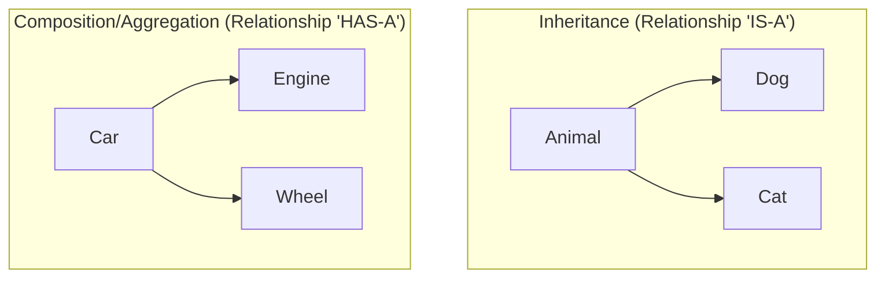

# 🧱 OOP Basics (Object-Oriented Programming)

## 📑 Table of Contents
1. [What is OOP?](#what-is-oop)
2. [Core Principles ("The Big Four")](#core-principles-the-big-four)
3. [Relationships Between Objects](#relationships-between-objects)

---

## 1. 🤔 What is OOP?

**Object-Oriented Programming** is an approach to writing code where the program is built from "objects."

> [!TIP]
> **An Object** is like an item in the real world (e.g., a Car or a User) that combines:
> *   **Data** (properties): color, name, age.
> *   **Behavior** (methods): drive, change name, say hello.

A class is a "blueprint" or "template," and an object is a specific thing made according to that blueprint.

---

## 2. 🎡 Core Principles ("The Big Four")

### 🛡️ Encapsulation
The bundling of data and the methods that operate on that data into a single "unit" (class) and restricting direct access to them from the outside.

*   **Why**: To prevent anyone from accidentally changing important data "under the hood." It hides implementation details.
*   **Analogy**: A coffee machine has buttons on the outside (interface), but you don't see how the beans are ground and water is heated inside (hidden implementation).

### 🔍 Abstraction
Focusing on only the essential characteristics of an object while discarding the details.

*   **Why**: To concentrate on *what* an object does, rather than *how* it does it.
*   **Example**: When you drive a car, you care that the steering wheel turns the wheels, not exactly how the power steering system works.

### 🧬 Inheritance
Allows you to create a new class based on an existing one, inheriting its "abilities."

*   **Why**: To avoid writing the same code multiple times.
*   **Example**: A `Bird` class knows how to fly. An `Eagle` class inherits this ability from `Bird`.

### 🎭 Polymorphism
The ability of a program to work with different objects through the same interface without knowing their specific types.

*   **Why**: It allows for writing more universal and flexible code.
*   **Example**: You have a list of animals. You call the `MakeSound()` method on each. The dog barks, the cat meows, but the code remains the same.

---

## 3. 🤝 Relationships Between Objects

In OOP, objects can interact and relate in different ways. The main debate is usually between inheritance and composition.

### 🏗️ Inheritance vs Composition

#### 📎 Aggregation ("Whole-Part" relationship, but loose)
The objects can exist independently of each other.
*   **Example**: A Wheel and a Hub. If you remove the wheels from a car, the wheels still exist.

#### 💎 Composition (Strong "Whole-Part" relationship)
The parts cannot exist without the whole.
*   **Example**: A room in a house. If you destroy the house, the room also ceases to exist.

### 🔄 Delegation
When an object passes the execution of a task to another object.

> [!IMPORTANT]
> **Principle**: Don't do yourself what an expert can do.
> Instead of a `Printer` class figuring out how to format text, it delegates that task to a `Formatter` class.

---

## 💡 Summary
OOP helps us model a complex world into understandable and independent pieces that are easy to change and evolve.