# 📚 GoF Design Patterns (Gang of Four)

## 📋 Table of Contents
1. [Introduction](#introduction)
2. [Pattern Classification](#pattern-classification)
3. [Creational Patterns](#creational-patterns)
    - [Singleton](#singleton)
    - [Factory Method](#factory-method)
    - [Abstract Factory](#abstract-factory)
    - [Builder](#builder)
    - [Prototype](#prototype)
4. [Structural Patterns](#structural-patterns)
    - [Adapter](#adapter)
    - [Bridge](#bridge)
    - [Composite](#composite)
    - [Decorator](#decorator)
    - [Facade](#facade)
    - [Flyweight](#flyweight)
    - [Proxy](#proxy)
5. [Behavioral Patterns](#behavioral-patterns)
    - [Chain of Responsibility](#chain-of-responsibility)
    - [Command](#command)
    - [Interpreter](#interpreter)
    - [Iterator](#iterator)
    - [Mediator](#mediator)
    - [Memento](#memento)
    - [Observer](#observer)
    - [State](#state)
    - [Strategy](#strategy)
    - [Template Method](#template-method)
    - [Visitor](#visitor)
6. [Conclusion](#conclusion)

---

## Introduction

**Gang of Four (GoF)** refers to a group of four authors (Erich Gamma, Richard Helm, Ralph Johnson, and John Vlissides) who published the book "Design Patterns: Elements of Reusable Object-Oriented Software" in 1994. In this book, they described 23 fundamental design patterns that became the standard in object-oriented programming.

> [!IMPORTANT]
> **Design Pattern** is a proven solution to a recurring problem in software design. It's not ready code, but a description of how to solve a problem that can be used repeatedly in various situations.

### Why Do We Need Patterns?

- **Code Unification**: Patterns provide a common language for developers
- **Proven Solutions**: Solutions that have been used multiple times and shown their effectiveness
- **Improved Architecture**: Help create flexible, reusable, and comprehensible systems
- **Communication Enhancement**: Developers can speak the same language using pattern names

---

## Pattern Classification

All 23 GoF patterns are divided into three categories:

| Category | Purpose | Number of Patterns |
|:---|:---|:---:|
| **Creational** | Object creation | 5 |
| **Structural** | Class/object composition | 7 |
| **Behavioral** | Object interaction | 11 |

---

## Creational Patterns

These patterns abstract the instantiation process. They allow a system to be independent of how its objects are created, composed, and represented.

### 🔐 Singleton

**Description**:
The Singleton pattern ensures that a class has only one instance and provides a global point of access to that instance.

- **Problem**: Sometimes it's necessary to have only one instance of a class in the system (for example, for a logger, application settings, or a database connection pool).
- **Solution**: Hide the class constructor and provide a static method that creates an instance on the first call and returns the already created instance on subsequent calls.
- **Analogy**: Imagine you have a president of a country. There can only be one president in a country, and all citizens refer to the same person when they need the president.

#### Advantages and Disadvantages

✅ **Pros**:
1. **Guaranteed single instance**: Control over the number of class instances
2. **Global access point**: Easy access to the instance from any part of the application
3. **Lazy initialization**: Instance is created only when needed

❌ **Cons**:
1. **Violation of single responsibility principle**: The class is responsible for both its business logic and instance management
2. **Testing difficulties**: Harder to test because it creates global state
3. **Hidden dependencies**: May complicate understanding of dependencies in the application

**When to use**: When a class should have only one instance, and this instance should be globally accessible.

---

**Visualization**:

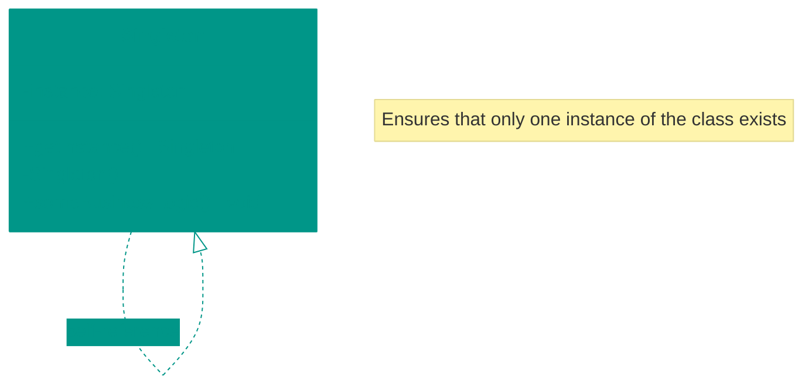
```mermaid
%%{init: { 'theme': 'base', 'themeVariables': { 'lineColor': '#009688', 'primaryColor': '#009688', 'primaryTextColor': '#009688', 'attributeBkg': '#009688', 'attributeTextColor': '#009688', 'signalColor': '#009688', 'actorLineColor': '#009688', 'nodeBorder': '#009688', 'clusterBorder': '#009688', 'textColor': '#009688', 'fontSize': '16px' } } }%%
classDiagram
    class Singleton {
        -instance: Singleton
        +getInstance() Singleton
        -Singleton()
        +someBusinessLogic() void
    }

    note "Ensures that only one instance of the class exists"
    Singleton ..|> Singleton : self-reference
```

**Complexity**:

| Metric | Complexity |
|:---|:---:|
| Time (when getting instance) | O(1) |
| Space | O(1) |

---

## 💻 Implementation

```go
package singleton

import (
    "sync"
)

// Database represents a class for which we need a Singleton
type Database struct {
    // some fields for database connection
    connection string
}

var (
    instance *Database
    once     sync.Once
)

// GetInstance returns the single instance of Database
func GetInstance() *Database {
    once.Do(func() {
        instance = &Database{
            connection: "connection_string",
        }
        // Here could be initialization of database connection
    })
    return instance
}

// SomeMethod demonstrates the use of the instance
func (db *Database) SomeMethod() string {
    return "Executing method from Singleton Database"
}
```

```javascript
/**
 * Database class for which we implement Singleton
 */
class Database {
    constructor(connection) {
        if (Database.instance) {
            return Database.instance;
        }
        
        this.connection = connection || "default_connection";
        Database.instance = this;
        return this;
    }
    
    someMethod() {
        return "Executing method from Singleton Database";
    }
}

/**
 * Alternative implementation using a module
 */
const DatabaseModule = (() => {
    let instance;
    
    function createInstance(connection) {
        return {
            connection: connection || "default_connection",
            someMethod: () => "Executing method from Singleton Database"
        };
    }
    
    return {
        getInstance: (connection) => {
            if (!instance) {
                instance = createInstance(connection);
            }
            return instance;
        }
    };
})();

// Example usage
const db1 = new Database();
const db2 = new Database();
console.log(db1 === db2); // true

const moduleDb1 = DatabaseModule.getInstance();
const moduleDb2 = DatabaseModule.getInstance();
console.log(moduleDb1 === moduleDb2); // true
```

---

### 🏭 Factory Method

**Description**:
The Factory Method pattern defines an interface for creating an object but allows subclasses to decide which class to instantiate. The factory method allows delegating object creation to subclasses.

- **Problem**: Need to create objects whose type is determined at runtime, or when you want subclasses to determine which objects to create.
- **Solution**: Create an abstract method (factory method) that will be overridden in subclasses to create specific objects.
- **Analogy**: Think of a fast-food restaurant. The customer places an order, but a specific employee (subclass) decides how exactly to prepare the dish (which object to create).

#### Advantages and Disadvantages

✅ **Pros**:
1. **Isolates object creation code**: Client code doesn't depend on specific classes
2. **Simplifies addition of new product types**: Can easily add new subclasses
3. **Supports open/closed principle**: Open for extension, closed for modification

❌ **Cons**:
1. **Increases number of classes**: Each new product type requires a new subclass
2. **Overhead for simple cases**: May be excessive for simple scenarios

**When to use**: When a class cannot predict the type of objects it needs to create, or when a class wants subclasses to specify which objects to create.

---

**Visualization**:

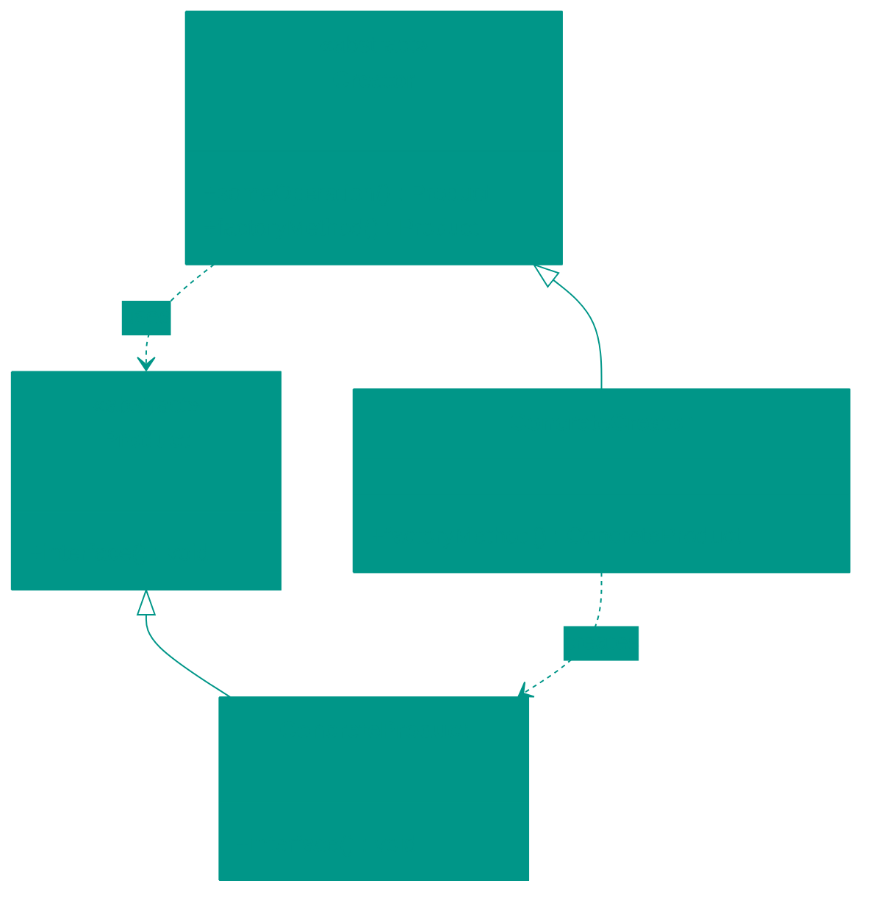
```mermaid
%%{init: { 'theme': 'base', 'themeVariables': { 'lineColor': '#009688', 'primaryColor': '#009688', 'primaryTextColor': '#009688', 'attributeBkg': '#009688', 'attributeTextColor': '#009688', 'signalColor': '#009688', 'actorLineColor': '#009688', 'nodeBorder': '#009688', 'clusterBorder': '#009688', 'textColor': '#009688', 'fontSize': '16px' } } }%%
classDiagram
    class Creator {
        <<abstract>>
        +someOperation() Product
        +factoryMethod() Product
    }
    class ConcreteCreator {
        +factoryMethod() ConcreteProduct
    }
    class Product {
        <<abstract>>
        +interface() void
    }
    class ConcreteProduct {
        +interface() void
    }

    Creator <|-- ConcreteCreator
    Product <|-- ConcreteProduct
    Creator ..> Product : uses
    ConcreteCreator ..> ConcreteProduct : creates
```

**Complexity**:

| Metric | Complexity |
|:---|:---:|
| Time (when creating object) | O(1) |
| Space | Depends on created object |

---

## 💻 Implementation

```go
package factorymethod

import "fmt"

// Product interface representing a product
type Product interface {
    Use() string
}

// ConcreteProductA concrete implementation of product A
type ConcreteProductA struct{}

func (p *ConcreteProductA) Use() string {
    return "Using product A"
}

// ConcreteProductB concrete implementation of product B
type ConcreteProductB struct{}

func (p *ConcreteProductB) Use() string {
    return "Using product B"
}

// Creator abstract creator class
type Creator interface {
    FactoryMethod() Product
    SomeOperation() string
}

// ConcreteCreatorA concrete creator A
type ConcreteCreatorA struct{}

func (c *ConcreteCreatorA) FactoryMethod() Product {
    return &ConcreteProductA{}
}

func (c *ConcreteCreatorA) SomeOperation() string {
    product := c.FactoryMethod()
    return fmt.Sprintf("Creator A: %s", product.Use())
}

// ConcreteCreatorB concrete creator B
type ConcreteCreatorB struct{}

func (c *ConcreteCreatorB) FactoryMethod() Product {
    return &ConcreteProductB{}
}

func (c *ConcreteCreatorB) SomeOperation() string {
    product := c.FactoryMethod()
    return fmt.Sprintf("Creator B: %s", product.Use())
}
```

```javascript
/**
 * Product interface
 */
class Product {
    use() {
        throw new Error("Method use() must be implemented");
    }
}

/**
 * Concrete implementations of Product
 */
class ConcreteProductA extends Product {
    use() {
        return "Using product A";
    }
}

class ConcreteProductB extends Product {
    use() {
        return "Using product B";
    }
}

/**
 * Abstract Creator class
 */
class Creator {
    factoryMethod() {
        throw new Error("Method factoryMethod() must be implemented");
    }
    
    someOperation() {
        const product = this.factoryMethod();
        return `Creator: ${product.use()}`;
    }
}

/**
 * Concrete Creator implementations
 */
class ConcreteCreatorA extends Creator {
    factoryMethod() {
        return new ConcreteProductA();
    }
}

class ConcreteCreatorB extends Creator {
    factoryMethod() {
        return new ConcreteProductB();
    }
}

// Example usage
const creatorA = new ConcreteCreatorA();
console.log(creatorA.someOperation()); // Creator: Using product A

const creatorB = new ConcreteCreatorB();
console.log(creatorB.someOperation()); // Creator: Using product B
```

---

### 🏗️ Abstract Factory

**Description**:
The Abstract Factory pattern provides an interface for creating families of related or dependent objects without specifying their concrete classes.

- **Problem**: Need to create families of objects that should work together, without tight coupling to specific classes.
- **Solution**: Create an abstract factory interface that defines methods for creating each type of object in the family.
- **Analogy**: Think of a furniture store. You have collections of furniture in different styles (e.g., modern, classical). Each collection includes chair, table, sofa, etc. The abstract factory allows creating consistent sets of furniture in one style.

#### Advantages and Disadvantages

✅ **Pros**:
1. **Guaranteed compatibility of products**: Objects created by one factory will be compatible
2. **Isolates concrete classes**: Client code doesn't depend on specific classes
3. **Easy replacement of product families**: Can easily switch between different families

❌ **Cons**:
1. **Difficulty adding new product types**: When adding a new product type, you need to modify all factories
2. **Increases number of classes**: Requires creation of multiple classes

**When to use**: When a system should be independent of how its objects are created, composed, and represented, or when working with families of interrelated objects.

---

**Visualization**:

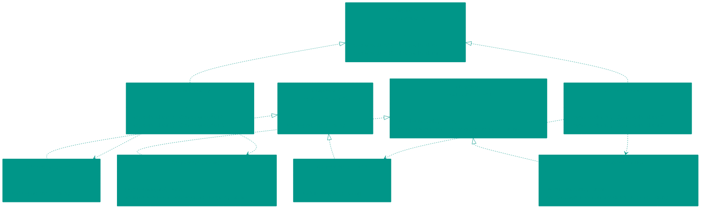
```mermaid
%%{init: { 'theme': 'base', 'themeVariables': { 'lineColor': '#009688', 'primaryColor': '#009688', 'primaryTextColor': '#009688', 'attributeBkg': '#009688', 'attributeTextColor': '#009688', 'signalColor': '#009688', 'actorLineColor': '#009688', 'nodeBorder': '#009688', 'clusterBorder': '#009688', 'textColor': '#009688', 'fontSize': '16px' } } }%%
classDiagram
    class AbstractFactory {
        <<interface>>
        +createProductA() AbstractProductA
        +createProductB() AbstractProductB
    }
    class ConcreteFactory1 {
        +createProductA() ConcreteProductA1
        +createProductB() ConcreteProductB1
    }
    class ConcreteFactory2 {
        +createProductA() ConcreteProductA2
        +createProductB() ConcreteProductB2
    }
    class AbstractProductA {
        <<interface>>
        +usefulFunctionA() string
    }
    class AbstractProductB {
        <<interface>>
        +usefulFunctionB() string
        +anotherUsefulFunctionB(AbstractProductA) string
    }
    class ConcreteProductA1 {
        +usefulFunctionA() string
    }
    class ConcreteProductA2 {
        +usefulFunctionA() string
    }
    class ConcreteProductB1 {
        +usefulFunctionB() string
        +anotherUsefulFunctionB(AbstractProductA) string
    }
    class ConcreteProductB2 {
        +usefulFunctionB() string
        +anotherUsefulFunctionB(AbstractProductA) string
    }

    AbstractFactory <|.. ConcreteFactory1
    AbstractFactory <|.. ConcreteFactory2
    AbstractProductA <|.. ConcreteProductA1
    AbstractProductA <|.. ConcreteProductA2
    AbstractProductB <|.. ConcreteProductB1
    AbstractProductB <|.. ConcreteProductB2
    ConcreteFactory1 ..> ConcreteProductA1
    ConcreteFactory1 ..> ConcreteProductB1
    ConcreteFactory2 ..> ConcreteProductA2
    ConcreteFactory2 ..> ConcreteProductB2
```

**Complexity**:

| Metric | Complexity |
|:---|:---:|
| Time (when creating objects) | O(1) for each object |
| Space | Depends on created objects |

---

## 💻 Implementation

```go
package abstractfactory

import "fmt"

// AbstractProductA interface for product A
type AbstractProductA interface {
    UsefulFunctionA() string
}

// AbstractProductB interface for product B
type AbstractProductB interface {
    UsefulFunctionB() string
    AnotherUsefulFunctionB(AbstractProductA) string
}

// ConcreteProductA1 concrete implementation of product A1
type ConcreteProductA1 struct{}

func (p *ConcreteProductA1) UsefulFunctionA() string {
    return "Result: ConcreteProductA1"
}

// ConcreteProductA2 concrete implementation of product A2
type ConcreteProductA2 struct{}

func (p *ConcreteProductA2) UsefulFunctionA() string {
    return "Result: ConcreteProductA2"
}

// ConcreteProductB1 concrete implementation of product B1
type ConcreteProductB1 struct{}

func (p *ConcreteProductB1) UsefulFunctionB() string {
    return "Result: ConcreteProductB1"
}

func (p *ConcreteProductB1) AnotherUsefulFunctionB(collaborator AbstractProductA) string {
    result := collaborator.UsefulFunctionA()
    return fmt.Sprintf("Result B1 collaborating with (%s)", result)
}

// ConcreteProductB2 concrete implementation of product B2
type ConcreteProductB2 struct{}

func (p *ConcreteProductB2) UsefulFunctionB() string {
    return "Result: ConcreteProductB2"
}

func (p *ConcreteProductB2) AnotherUsefulFunctionB(collaborator AbstractProductA) string {
    result := collaborator.UsefulFunctionA()
    return fmt.Sprintf("Result B2 collaborating with (%s)", result)
}

// AbstractFactory interface for abstract factory
type AbstractFactory interface {
    CreateProductA() AbstractProductA
    CreateProductB() AbstractProductB
}

// ConcreteFactory1 concrete factory 1
type ConcreteFactory1 struct{}

func (f *ConcreteFactory1) CreateProductA() AbstractProductA {
    return &ConcreteProductA1{}
}

func (f *ConcreteFactory1) CreateProductB() AbstractProductB {
    return &ConcreteProductB1{}
}

// ConcreteFactory2 concrete factory 2
type ConcreteFactory2 struct{}

func (f *ConcreteFactory2) CreateProductA() AbstractProductA {
    return &ConcreteProductA2{}
}

func (f *ConcreteFactory2) CreateProductB() AbstractProductB {
    return &ConcreteProductB2{}
}
```

```javascript
/**
 * Interfaces for products
 */
class AbstractProductA {
    usefulFunctionA() {
        throw new Error("Method usefulFunctionA() must be implemented");
    }
}

class AbstractProductB {
    usefulFunctionB() {
        throw new Error("Method usefulFunctionB() must be implemented");
    }
    
    anotherUsefulFunctionB(collaborator) {
        throw new Error("Method anotherUsefulFunctionB() must be implemented");
    }
}

/**
 * Concrete product implementations
 */
class ConcreteProductA1 extends AbstractProductA {
    usefulFunctionA() {
        return "Result: ConcreteProductA1";
    }
}

class ConcreteProductA2 extends AbstractProductA {
    usefulFunctionA() {
        return "Result: ConcreteProductA2";
    }
}

class ConcreteProductB1 extends AbstractProductB {
    usefulFunctionB() {
        return "Result: ConcreteProductB1";
    }
    
    anotherUsefulFunctionB(collaborator) {
        const result = collaborator.usefulFunctionA();
        return `Result B1 collaborating with (${result})`;
    }
}

class ConcreteProductB2 extends AbstractProductB {
    usefulFunctionB() {
        return "Result: ConcreteProductB2";
    }
    
    anotherUsefulFunctionB(collaborator) {
        const result = collaborator.usefulFunctionA();
        return `Result B2 collaborating with (${result})`;
    }
}

/**
 * Abstract factory interface
 */
class AbstractFactory {
    createProductA() {
        throw new Error("Method createProductA() must be implemented");
    }
    
    createProductB() {
        throw new Error("Method createProductB() must be implemented");
    }
}

/**
 * Concrete factories
 */
class ConcreteFactory1 extends AbstractFactory {
    createProductA() {
        return new ConcreteProductA1();
    }
    
    createProductB() {
        return new ConcreteProductB1();
    }
}

class ConcreteFactory2 extends AbstractFactory {
    createProductA() {
        return new ConcreteProductA2();
    }
    
    createProductB() {
        return new ConcreteProductB2();
    }
}

// Example usage
function clientCode(factory) {
    const productA = factory.createProductA();
    const productB = factory.createProductB();
    
    console.log(productB.usefulFunctionB());
    console.log(productB.anotherUsefulFunctionB(productA));
}

console.log("Client: Testing client code with first factory...");
clientCode(new ConcreteFactory1());

console.log("\nClient: Testing client code with second factory...");
clientCode(new ConcreteFactory2());
```

---

### 🛠️ Builder

**Description**:
The Builder pattern separates the construction of a complex object from its representation, so that the same construction process can create different representations.

- **Problem**: Creating complex objects with many parameters, especially when many of them are optional (the telescoping constructor problem).
- **Solution**: Move the object creation process to a separate builder class that assembles the object step by step.
- **Analogy**: Think of assembling a car. The process includes installing the engine, wheels, seats, etc. Instead of passing all components to one constructor, assembly happens step by step.

#### Advantages and Disadvantages

✅ **Pros**:
1. **Step-by-step object creation**: Ability to control the creation process
2. **Ability to create different representations**: The same creation process can create different objects
3. **Isolation of creation code from business logic**: Separation of responsibilities

❌ **Cons**:
1. **Code complexity**: Requires creating several additional classes
2. **Not always justified**: May be excessive for simple objects

**When to use**: When you need to create complex objects step by step, or when the same creation process should create various representations of an object.

---

**Visualization**:

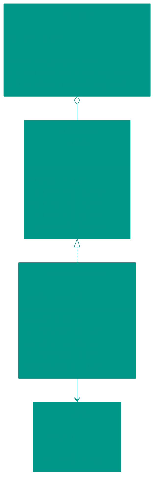
```mermaid
%%{init: { 'theme': 'base', 'themeVariables': { 'lineColor': '#009688', 'primaryColor': '#009688', 'primaryTextColor': '#009688', 'attributeBkg': '#009688', 'attributeTextColor': '#009688', 'signalColor': '#009688', 'actorLineColor': '#009688', 'nodeBorder': '#009688', 'clusterBorder': '#009688', 'textColor': '#009688', 'fontSize': '16px' } } }%%
classDiagram
    class Director {
        -builder: Builder
        +setBuilder(builder) void
        +buildMinimalViableProduct() void
        +buildFullFeaturedProduct() void
    }
    class Builder {
        <<interface>>
        +reset() Builder
        +buildPartA() Builder
        +buildPartB() Builder
        +buildPartC() Builder
        +getResult() Product
    }
    class ConcreteBuilder {
        -product: Product
        +reset() Builder
        +buildPartA() Builder
        +buildPartB() Builder
        +buildPartC() Builder
        +getResult() Product
    }
    class Product {
        +parts: list
        +listParts() string
    }

    Director o-- Builder
    Builder <|.. ConcreteBuilder
    ConcreteBuilder --> Product
```

**Complexity**:

| Metric | Complexity |
|:---|:---:|
| Time (when creating object) | O(n), where n is the number of steps |
| Space | O(m), where m is the size of the final object |

---

## 💻 Implementation

```go
package builder

import (
    "fmt"
    "strings"
)

// Product complex object we're building
type Product struct {
    parts []string
}

func (p *Product) ListParts() string {
    return fmt.Sprintf("Product parts: %s\n", strings.Join(p.parts, ", "))
}

func (p *Product) AddPart(part string) {
    p.parts = append(p.parts, part)
}

// Builder interface for builder
type Builder interface {
    Reset() Builder
    BuildPartA() Builder
    BuildPartB() Builder
    BuildPartC() Builder
    GetResult() *Product
}

// ConcreteBuilder concrete implementation of builder
type ConcreteBuilder struct {
    product *Product
}

func NewConcreteBuilder() *ConcreteBuilder {
    return &ConcreteBuilder{product: &Product{}}
}

func (b *ConcreteBuilder) Reset() Builder {
    b.product = &Product{}
    return b
}

func (b *ConcreteBuilder) BuildPartA() Builder {
    b.product.AddPart("PartA1")
    return b
}

func (b *ConcreteBuilder) BuildPartB() Builder {
    b.product.AddPart("PartB1")
    return b
}

func (b *ConcreteBuilder) BuildPartC() Builder {
    b.product.AddPart("PartC1")
    return b
}

func (b *ConcreteBuilder) GetResult() *Product {
    result := b.product
    b.Reset() // reset for next use
    return result
}

// Director class that manages the building process
type Director struct {
    builder Builder
}

func (d *Director) SetBuilder(b Builder) {
    d.builder = b
}

func (d *Director) BuildMinimalViableProduct() *Product {
    return d.builder.BuildPartA().GetResult()
}

func (d *Director) BuildFullFeaturedProduct() *Product {
    return d.builder.BuildPartA().BuildPartB().BuildPartC().GetResult()
}
```

```javascript
/**
 * Product we're building
 */
class Product {
    constructor() {
        this.parts = [];
    }
    
    addPart(part) {
        this.parts.push(part);
    }
    
    listParts() {
        return `Product parts: ${this.parts.join(', ')}\n`;
    }
}

/**
 * Builder interface
 */
class Builder {
    reset() {
        throw new Error("Method reset() must be implemented");
    }
    
    buildPartA() {
        throw new Error("Method buildPartA() must be implemented");
    }
    
    buildPartB() {
        throw new Error("Method buildPartB() must be implemented");
    }
    
    buildPartC() {
        throw new Error("Method buildPartC() must be implemented");
    }
    
    getResult() {
        throw new Error("Method getResult() must be implemented");
    }
}

/**
 * Concrete implementation of Builder
 */
class ConcreteBuilder extends Builder {
    constructor() {
        super();
        this.reset();
    }
    
    reset() {
        this.product = new Product();
        return this;
    }
    
    buildPartA() {
        this.product.addPart('PartA1');
        return this;
    }
    
    buildPartB() {
        this.product.addPart('PartB1');
        return this;
    }
    
    buildPartC() {
        this.product.addPart('PartC1');
        return this;
    }
    
    getResult() {
        const result = this.product;
        this.reset(); // reset for next use
        return result;
    }
}

/**
 * Director that manages the building process
 */
class Director {
    setBuilder(builder) {
        this.builder = builder;
    }
    
    buildMinimalViableProduct() {
        return this.builder.buildPartA().getResult();
    }
    
    buildFullFeaturedProduct() {
        return this.builder.buildPartA().buildPartB().buildPartC().getResult();
    }
}

// Example usage
const director = new Director();
const builder = new ConcreteBuilder();
director.setBuilder(builder);

console.log("Basic product:");
console.log(director.buildMinimalViableProduct().listParts());

console.log("Full-featured product:");
console.log(director.buildFullFeaturedProduct().listParts());

// Building product manually
console.log("Custom product:");
const customProduct = builder.buildPartA().buildPartC().getResult();
console.log(customProduct.listParts());
```

---

### 🧬 Prototype

**Description**:
The Prototype pattern allows copying objects without creating dependencies on their classes. It defines an interface for cloning objects.

- **Problem**: Creating objects can be an expensive operation, especially if they require complex initialization.
- **Solution**: Create a prototype object and clone it when needed, instead of creating a new instance from scratch.
- **Analogy**: Think of creating a document. Instead of creating it from scratch each time, you take a ready template (prototype) and make the necessary changes.

#### Advantages and Disadvantages

✅ **Pros**:
1. **Resource saving**: Avoids repeated initialization
2. **Dynamic addition of products**: Can add new product types at runtime
3. **Cloning complex objects**: Simplifies creation of complex objects

❌ **Cons**:
1. **Cloning complexity**: Cloning can be complex, especially for objects with circular references
2. **Not always obvious**: Not always clear when to use prototype instead of constructor

**When to use**: When the cost of creating an object instance is high, or when the system should be independent of how objects are created, composed, and represented.

---

**Visualization**:

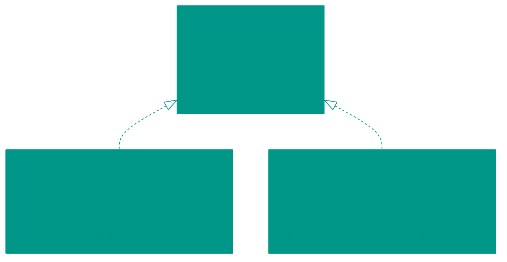
```mermaid
%%{init: { 'theme': 'base', 'themeVariables': { 'lineColor': '#009688', 'primaryColor': '#009688', 'primaryTextColor': '#009688', 'attributeBkg': '#009688', 'attributeTextColor': '#009688', 'signalColor': '#009688', 'actorLineColor': '#009688', 'nodeBorder': '#009688', 'clusterBorder': '#009688', 'textColor': '#009688', 'fontSize': '16px' } } }%%
classDiagram
    class Prototype {
        <<interface>>
        +clone() Prototype
    }
    class ConcretePrototype1 {
        +field1: string
        +clone() ConcretePrototype1
    }
    class ConcretePrototype2 {
        +field2: number
        +clone() ConcretePrototype2
    }

    Prototype <|.. ConcretePrototype1
    Prototype <|.. ConcretePrototype2
```

**Complexity**:

| Metric | Complexity |
|:---|:---:|
| Time (when cloning) | O(n), where n is the number of fields |
| Space | O(n), where n is the object size |

---

## 💻 Implementation

```go
package prototype

import "fmt"

// Prototype interface for cloning
type Prototype interface {
    Clone() Prototype
    GetType() string
    PrintDetails()
}

// ConcretePrototype1 concrete implementation of prototype 1
type ConcretePrototype1 struct {
    field1 string
}

func (p *ConcretePrototype1) Clone() Prototype {
    // Create a copy of the object
    clone := *p
    return &clone
}

func (p *ConcretePrototype1) GetType() string {
    return "ConcretePrototype1"
}

func (p *ConcretePrototype1) PrintDetails() {
    fmt.Printf("ConcretePrototype1: field1 = %s\n", p.field1)
}

// ConcretePrototype2 concrete implementation of prototype 2
type ConcretePrototype2 struct {
    field2 int
}

func (p *ConcretePrototype2) Clone() Prototype {
    // Create a copy of the object
    clone := *p
    return &clone
}

func (p *ConcretePrototype2) GetType() string {
    return "ConcretePrototype2"
}

func (p *ConcretePrototype2) PrintDetails() {
    fmt.Printf("ConcretePrototype2: field2 = %d\n", p.field2)
}

// Factory function for creating prototypes
func CreatePrototype(prototypeType string) Prototype {
    switch prototypeType {
    case "type1":
        return &ConcretePrototype1{field1: "initial value"}
    case "type2":
        return &ConcretePrototype2{field2: 42}
    default:
        return nil
    }
}
```

```javascript
/**
 * Prototype interface
 */
class Prototype {
    clone() {
        throw new Error("Method clone() must be implemented");
    }
    
    getType() {
        throw new Error("Method getType() must be implemented");
    }
    
    printDetails() {
        throw new Error("Method printDetails() must be implemented");
    }
}

/**
 * Concrete prototype implementations
 */
class ConcretePrototype1 extends Prototype {
    constructor(field1 = "initial value") {
        super();
        this.field1 = field1;
    }
    
    clone() {
        // Deep cloning of the object
        return new ConcretePrototype1(this.field1);
    }
    
    getType() {
        return "ConcretePrototype1";
    }
    
    printDetails() {
        console.log(`ConcretePrototype1: field1 = ${this.field1}`);
    }
}

class ConcretePrototype2 extends Prototype {
    constructor(field2 = 42) {
        super();
        this.field2 = field2;
    }
    
    clone() {
        // Deep cloning of the object
        return new ConcretePrototype2(this.field2);
    }
    
    getType() {
        return "ConcretePrototype2";
    }
    
    printDetails() {
        console.log(`ConcretePrototype2: field2 = ${this.field2}`);
    }
}

/**
 * Function for creating prototypes
 */
function createPrototype(prototypeType) {
    switch(prototypeType) {
        case "type1":
            return new ConcretePrototype1();
        case "type2":
            return new ConcretePrototype2();
        default:
            return null;
    }
}

// Example usage
const prototype1 = new ConcretePrototype1("original value");
const clonedPrototype1 = prototype1.clone();

console.log("Original:");
prototype1.printDetails();

console.log("Clone:");
clonedPrototype1.printDetails();

// Check that these are different objects
console.log(`Original and clone are the same object? ${prototype1 === clonedPrototype1}`); // false
```

---

## Structural Patterns

These patterns are related to composing classes and objects into larger structures while maintaining flexibility and efficiency of these structures.

### 🔌 Adapter

**Description**:
The Adapter pattern allows objects with incompatible interfaces to work together. It converts the interface of one class to an interface that clients expect.

- **Problem**: Need to work with classes that have incompatible interfaces.
- **Solution**: Create an adapter that wraps one of the objects and provides it with an interface expected by the client.
- **Analogy**: A plug adapter - allows using devices designed for one country in another country with different outlets.

#### Advantages and Disadvantages

✅ **Pros**:
1. **Class reuse**: Allows using existing classes with incompatible interfaces
2. **Isolates clients from implementation**: Clients work with a unified interface
3. **Flexibility**: Easy to add new adapters

❌ **Cons**:
1. **Code complexity**: Adds additional classes
2. **Performance degradation**: Additional abstraction layer may slow down execution

**When to use**: When you need to use an existing class but its interface is incompatible with the rest of the system, or when you need to create reusable classes that work with other incompatible classes.

---

**Visualization**:

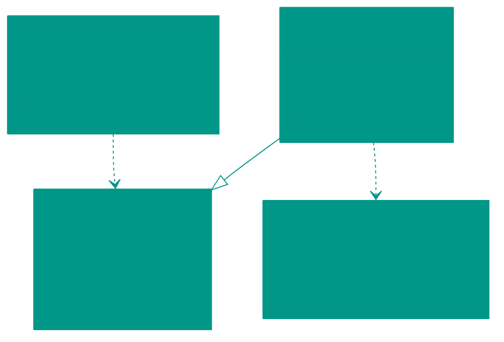
```mermaid
%%{init: { 'theme': 'base', 'themeVariables': { 'lineColor': '#009688', 'primaryColor': '#009688', 'primaryTextColor': '#009688', 'attributeBkg': '#009688', 'attributeTextColor': '#009688', 'signalColor': '#009688', 'actorLineColor': '#009688', 'nodeBorder': '#009688', 'clusterBorder': '#009688', 'textColor': '#009688', 'fontSize': '16px' } } }%%
classDiagram
    class Target {
        <<interface>>
        +request() string
    }
    class Adaptee {
        +specificRequest() string
    }
    class Adapter {
        -adaptee: Adaptee
        +request() string
    }
    class Client {
        +clientCode(target) void
    }

    Client ..> Target
    Adapter --|> Target
    Adapter ..> Adaptee
```

**Complexity**:

| Metric | Complexity |
|:---|:---:|
| Time (when calling method) | O(1) |
| Space | O(1) |

---

## 💻 Implementation

```go
package adapter

import "fmt"

// Target interface that the client expects
type Target interface {
    Request() string
}

// Adaptee class that has an incompatible interface
type Adaptee struct{}

func (a *Adaptee) SpecificRequest() string {
    return "Specific request from Adaptee"
}

// Adapter adapts the Adaptee interface to the Target interface
type Adapter struct {
    adaptee *Adaptee
}

func NewAdapter(adaptee *Adaptee) *Adapter {
    return &Adapter{adaptee: adaptee}
}

func (a *Adapter) Request() string {
    return fmt.Sprintf("Adapter: Converting '%s' to expected format", a.adaptee.SpecificRequest())
}

// ClientCode client code that works with Target
func ClientCode(target Target) string {
    return target.Request()
}
```

```javascript
/**
 * Target interface that the client expects
 */
class Target {
    request() {
        return "Target: Base target behavior";
    }
}

/**
 * Adaptable class
 */
class Adaptee {
    specificRequest() {
        return "Specific request from Adaptee";
    }
}

/**
 * Adapter
 */
class Adapter extends Target {
    constructor(adaptee) {
        super();
        this.adaptee = adaptee;
    }
    
    request() {
        const result = this.adaptee.specificRequest();
        return `Adapter: Converting '${result}' to expected format`;
    }
}

/**
 * Client code
 */
function clientCode(target) {
    return target.request();
}

// Example usage
const adaptee = new Adaptee();
const adapter = new Adapter(adaptee);

console.log(clientCode(adapter));
```

---

### 🌉 Bridge

**Description**:
The Bridge pattern separates abstraction from implementation so that they can vary independently. It uses composition instead of inheritance.

- **Problem**: Tight coupling between abstraction and implementation that doesn't allow changing them independently.
- **Solution**: Create a bridge between abstraction and implementation, allowing them to change independently.
- **Analogy**: Think of a TV remote control. The remote (abstraction) can work with different TV models (implementation) thanks to a universal interface.

#### Advantages and Disadvantages

✅ **Pros**:
1. **Independent evolution of abstraction and implementation**: Each part can be changed separately
2. **Elimination of rigid dependency**: Reduces coupling between components
3. **Platform independence support**: Implementation can be replaced without changing the abstraction

❌ **Cons**:
1. **Code complexity**: Can complicate the application architecture
2. **Overhead for simple cases**: May be excessive for simple tasks

**When to use**: When you want to avoid permanent coupling between abstraction and its implementation, or when changes in implementation shouldn't affect client code.

---

**Visualization**:

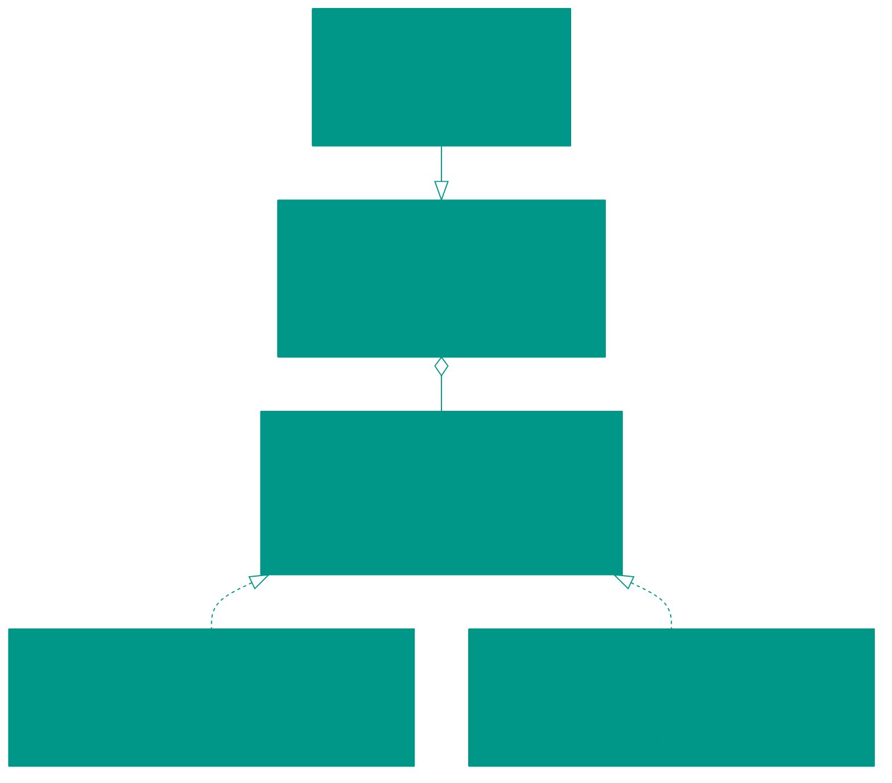
```mermaid
%%{init: { 'theme': 'base', 'themeVariables': { 'lineColor': '#009688', 'primaryColor': '#009688', 'primaryTextColor': '#009688', 'attributeBkg': '#009688', 'attributeTextColor': '#009688', 'signalColor': '#009688', 'actorLineColor': '#009688', 'nodeBorder': '#009688', 'clusterBorder': '#009688', 'textColor': '#009688', 'fontSize': '16px' } } }%%
classDiagram
    class Abstraction {
        -implementation: Implementation
        +operation() string
    }
    class RefinedAbstraction {
        +operation() string
    }
    class Implementation {
        <<interface>>
        +operationImplementation() string
    }
    class ConcreteImplementationA {
        +operationImplementation() string
    }
    class ConcreteImplementationB {
        +operationImplementation() string
    }

    Abstraction o-- Implementation
    RefinedAbstraction --|> Abstraction
    Implementation <|.. ConcreteImplementationA
    Implementation <|.. ConcreteImplementationB
```

**Complexity**:

| Metric | Complexity |
|:---|:---:|
| Time (when calling method) | O(1) |
| Space | O(1) |

---

## 💻 Implementation

```go
package bridge

import "fmt"

// Implementation interface for implementation
type Implementation interface {
    OperationImplementation() string
}

// ConcreteImplementationA concrete implementation A
type ConcreteImplementationA struct{}

func (c *ConcreteImplementationA) OperationImplementation() string {
    return "ConcreteImplementationA: Here's the result on the platform A.\n"
}

// ConcreteImplementationB concrete implementation B
type ConcreteImplementationB struct{}

func (c *ConcreteImplementationB) OperationImplementation() string {
    return "ConcreteImplementationB: Here's the result on the platform B.\n"
}

// Abstraction abstraction
type Abstraction struct {
    implementation Implementation
}

func NewAbstraction(implementation Implementation) *Abstraction {
    return &Abstraction{implementation: implementation}
}

func (a *Abstraction) Operation() string {
    return fmt.Sprintf("Abstraction: Base operation with:\n%s", a.implementation.OperationImplementation())
}

// RefinedAbstraction refined abstraction
type RefinedAbstraction struct {
    *Abstraction
}

func NewRefinedAbstraction(implementation Implementation) *RefinedAbstraction {
    return &RefinedAbstraction{Abstraction: NewAbstraction(implementation)}
}

func (ra *RefinedAbstraction) Operation() string {
    return fmt.Sprintf("RefinedAbstraction: Extended operation with:\n%s", ra.implementation.OperationImplementation())
}
```

```javascript
/**
 * Implementation interface
 */
class Implementation {
    operationImplementation() {
        throw new Error("Method operationImplementation() must be implemented");
    }
}

/**
 * Concrete implementations
 */
class ConcreteImplementationA extends Implementation {
    operationImplementation() {
        return "ConcreteImplementationA: Here's the result on the platform A.\n";
    }
}

class ConcreteImplementationB extends Implementation {
    operationImplementation() {
        return "ConcreteImplementationB: Here's the result on the platform B.\n";
    }
}

/**
 * Abstraction
 */
class Abstraction {
    constructor(implementation) {
        this.implementation = implementation;
    }
    
    operation() {
        return `Abstraction: Base operation with:\n${this.implementation.operationImplementation()}`;
    }
}

/**
 * Refined abstraction
 */
class RefinedAbstraction extends Abstraction {
    operation() {
        return `RefinedAbstraction: Extended operation with:\n${this.implementation.operationImplementation()}`;
    }
}

// Example usage
const implementationA = new ConcreteImplementationA();
const abstractionA = new Abstraction(implementationA);
console.log(abstractionA.operation());

const implementationB = new ConcreteImplementationB();
const refinedAbstractionB = new RefinedAbstraction(implementationB);
console.log(refinedAbstractionB.operation());
```

---

### 🧩 Composite

**Description**:
The Composite pattern allows clients to treat individual objects and compositions of objects uniformly. It creates a tree structure where nodes can be both individual objects and groups of objects.

- **Problem**: Need to handle hierarchical structures where individual elements and groups of elements should be processed the same way.
- **Solution**: Create a common interface for individual objects and composites, allowing client code to work with them uniformly.
- **Analogy**: File system - files and folders are handled the same way, a folder can contain both files and other folders.

#### Advantages and Disadvantages

✅ **Pros**:
1. **Unified interface**: Unified interface for working with individual objects and composites
2. **Ease of adding new components**: Easy to add new component types
3. **Flexibility**: Can easily build complex hierarchical structures

❌ **Cons**:
1. **Type restriction limitations**: May be difficult to restrict the types of components that can be added to a composite
2. **Difficulty determining type**: Sometimes hard to determine if an object is a leaf or a composite

**When to use**: When you need to create a hierarchical structure where individual objects and groups of objects are processed the same way.

---

**Visualization**:

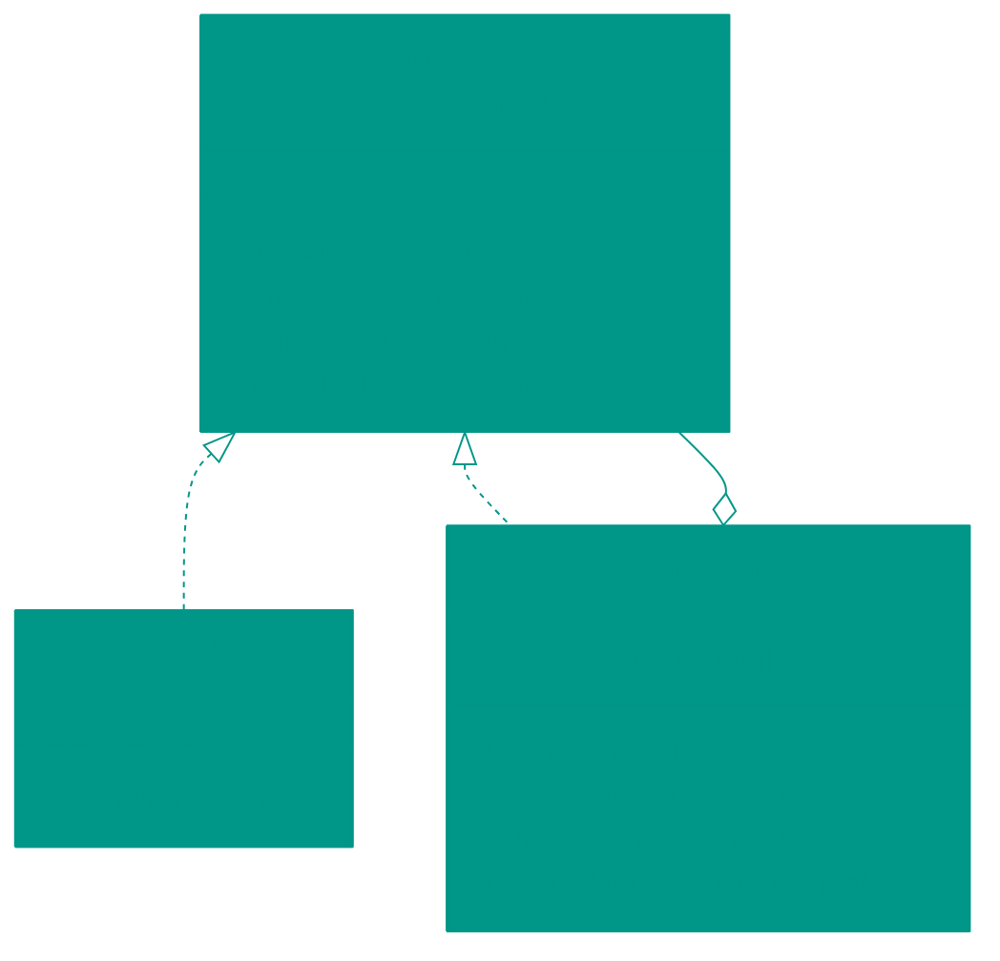
```mermaid
%%{init: { 'theme': 'base', 'themeVariables': { 'lineColor': '#009688', 'primaryColor': '#009688', 'primaryTextColor': '#009688', 'attributeBkg': '#009688', 'attributeTextColor': '#009688', 'signalColor': '#009688', 'actorLineColor': '#009688', 'nodeBorder': '#009688', 'clusterBorder': '#009688', 'textColor': '#009688', 'fontSize': '16px' } } }%%
classDiagram
    class Component {
        <<interface>>
        +operation() string
        +add(component) void
        +remove(component) void
        +getChild(index) Component
    }
    class Leaf {
        +operation() string
    }
    class Composite {
        -children: Component[]
        +operation() string
        +add(component) void
        +remove(component) void
        +getChild(index) Component
    }

    Component <|.. Leaf
    Component <|.. Composite
    Composite o-- Component
```

**Complexity**:

| Metric | Complexity |
|:---|:---:|
| Time (when adding/removing) | O(1) for adding, O(n) for removing |
| Space | O(n), where n is the number of elements |

---

## 💻 Implementation

```go
package composite

import (
    "fmt"
    "strings"
)

// Component interface for components
type Component interface {
    Operation() string
    Add(Component)
    Remove(Component)
    GetChild(int) Component
}

// Leaf leaf element
type Leaf struct {
    name string
}

func NewLeaf(name string) *Leaf {
    return &Leaf{name: name}
}

func (l *Leaf) Operation() string {
    return fmt.Sprintf("Leaf: %s", l.name)
}

func (l *Leaf) Add(c Component) {
    panic("Cannot add to a leaf")
}

func (l *Leaf) Remove(c Component) {
    panic("Cannot remove from a leaf")
}

func (l *Leaf) GetChild(index int) Component {
    panic("Cannot get child from a leaf")
}

// Composite composite element
type Composite struct {
    name     string
    children []Component
}

func NewComposite(name string) *Composite {
    return &Composite{name: name, children: make([]Component, 0)}
}

func (c *Composite) Operation() string {
    result := []string{fmt.Sprintf("Composite: %s", c.name)}
    
    for _, child := range c.children {
        result = append(result, child.Operation())
    }
    
    return strings.Join(result, "\n")
}

func (c *Composite) Add(component Component) {
    c.children = append(c.children, component)
}

func (c *Composite) Remove(component Component) {
    for i, child := range c.children {
        if child == component {
            c.children = append(c.children[:i], c.children[i+1:]...)
            break
        }
    }
}

func (c *Composite) GetChild(index int) Component {
    if index >= 0 && index < len(c.children) {
        return c.children[index]
    }
    return nil
}
```

```javascript
/**
 * Component interface
 */
class Component {
    operation() {
        throw new Error("Method operation() must be implemented");
    }
    
    add(component) {
        throw new Error("Method add() must be implemented");
    }
    
    remove(component) {
        throw new Error("Method remove() must be implemented");
    }
    
    getChild(index) {
        throw new Error("Method getChild() must be implemented");
    }
}

/**
 * Leaf element
 */
class Leaf extends Component {
    constructor(name) {
        super();
        this.name = name;
    }
    
    operation() {
        return `Leaf: ${this.name}`;
    }
    
    add() {
        throw new Error("Cannot add to a leaf");
    }
    
    remove() {
        throw new Error("Cannot remove from a leaf");
    }
    
    getChild() {
        throw new Error("Cannot get child from a leaf");
    }
}

/**
 * Composite element
 */
class Composite extends Component {
    constructor(name) {
        super();
        this.name = name;
        this.children = [];
    }
    
    operation() {
        const result = [`Composite: ${this.name}`];
        
        for (const child of this.children) {
            result.push(child.operation());
        }
        
        return result.join('\n');
    }
    
    add(component) {
        this.children.push(component);
    }
    
    remove(component) {
        const index = this.children.indexOf(component);
        if (index !== -1) {
            this.children.splice(index, 1);
        }
    }
    
    getChild(index) {
        if (index >= 0 && index < this.children.length) {
            return this.children[index];
        }
        return null;
    }
}

// Example usage
const tree = new Composite("root");

const branch1 = new Composite("branch1");
const branch2 = new Composite("branch2");

const leaf1 = new Leaf("leaf1");
const leaf2 = new Leaf("leaf2");
const leaf3 = new Leaf("leaf3");

branch1.add(leaf1);
branch1.add(leaf2);
branch2.add(leaf3);

tree.add(branch1);
tree.add(branch2);

console.log(tree.operation());
```

---

### ✨ Decorator

**Description**:
The Decorator pattern allows dynamically adding new functionality to objects by wrapping them in useful "wrappers". It provides a flexible alternative to inheritance for extending functionality.

- **Problem**: Need to add functionality to objects without changing their structure or using inheritance.
- **Solution**: Create a decorator that wraps the original object and adds new functionality to it.
- **Analogy**: Think of a cake - you can add cream, fruits, chocolate, etc., each time getting a new version of the cake with additional properties.

#### Advantages and Disadvantages

✅ **Pros**:
1. **Flexibility**: Ability to dynamically add and remove functionality
2. **Open/closed principle compliance**: Open for extension, closed for modification
3. **Alternative to inheritance**: Allows avoiding complex class hierarchies

❌ **Cons**:
1. **Debugging complexity**: More difficult to debug code with multiple nested decorators
2. **Increase in number of small classes**: May lead to an increase in the number of classes

**When to use**: When you need to add responsibilities to objects dynamically and transparently, or when inheritance doesn't suit for extending functionality.

---

**Visualization**:

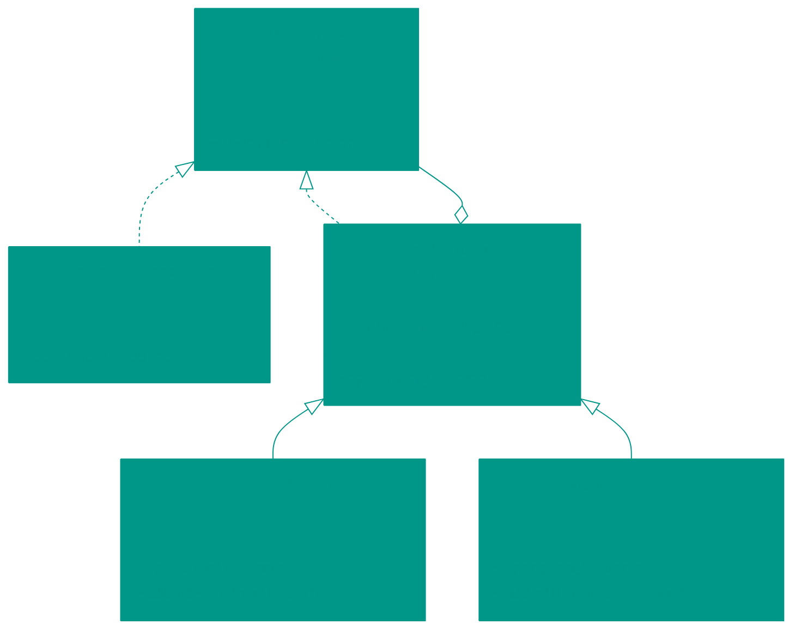
```mermaid
%%{init: { 'theme': 'base', 'themeVariables': { 'lineColor': '#009688', 'primaryColor': '#009688', 'primaryTextColor': '#009688', 'attributeBkg': '#009688', 'attributeTextColor': '#009688', 'signalColor': '#009688', 'actorLineColor': '#009688', 'nodeBorder': '#009688', 'clusterBorder': '#009688', 'textColor': '#009688', 'fontSize': '16px' } } }%%
classDiagram
    class Component {
        <<interface>>
        +operation() string
    }
    class ConcreteComponent {
        +operation() string
    }
    class Decorator {
        <<abstract>>
        -component: Component
        +operation() string
    }
    class ConcreteDecoratorA {
        +operation() string
        +addedBehavior() string
    }
    class ConcreteDecoratorB {
        +operation() string
        +addedBehavior() string
    }

    Component <|.. ConcreteComponent
    Component <|.. Decorator
    Decorator <|-- ConcreteDecoratorA
    Decorator <|-- ConcreteDecoratorB
    Decorator o-- Component
```

**Complexity**:

| Metric | Complexity |
|:---|:---:|
| Time (when calling method) | O(1) for each decorator |
| Space | O(n), where n is the number of decorators |

---

## 💻 Implementation

```go
package decorator

import "fmt"

// Component interface for component
type Component interface {
    Operation() string
}

// ConcreteComponent concrete implementation of component
type ConcreteComponent struct{}

func (c *ConcreteComponent) Operation() string {
    return "ConcreteComponent"
}

// Decorator base decorator
type Decorator struct {
    component Component
}

func NewDecorator(component Component) *Decorator {
    return &Decorator{component: component}
}

func (d *Decorator) Operation() string {
    return d.component.Operation()
}

// ConcreteDecoratorA concrete decorator A
type ConcreteDecoratorA struct {
    *Decorator
}

func NewConcreteDecoratorA(component Component) *ConcreteDecoratorA {
    return &ConcreteDecoratorA{Decorator: NewDecorator(component)}
}

func (d *ConcreteDecoratorA) Operation() string {
    return fmt.Sprintf("ConcreteDecoratorA(%s)", d.Decorator.Operation())
}

// ConcreteDecoratorB concrete decorator B
type ConcreteDecoratorB struct {
    *Decorator
}

func NewConcreteDecoratorB(component Component) *ConcreteDecoratorB {
    return &ConcreteDecoratorB{Decorator: NewDecorator(component)}
}

func (d *ConcreteDecoratorB) Operation() string {
    return fmt.Sprintf("ConcreteDecoratorB(%s)", d.Decorator.Operation())
}

// AddedBehavior additional behavior for decorator B
func (d *ConcreteDecoratorB) AddedBehavior() string {
    return "ConcreteDecoratorB: Added behavior"
}
```

```javascript
/**
 * Component interface
 */
class Component {
    operation() {
        throw new Error("Method operation() must be implemented");
    }
}

/**
 * Concrete implementation of component
 */
class ConcreteComponent extends Component {
    operation() {
        return "ConcreteComponent";
    }
}

/**
 * Base decorator
 */
class Decorator extends Component {
    constructor(component) {
        super();
        this.component = component;
    }
    
    operation() {
        return this.component.operation();
    }
}

/**
 * Concrete decorators
 */
class ConcreteDecoratorA extends Decorator {
    operation() {
        return `ConcreteDecoratorA(${super.operation()})`;
    }
}

class ConcreteDecoratorB extends Decorator {
    operation() {
        return `ConcreteDecoratorB(${super.operation()})`;
    }
    
    addedBehavior() {
        return "ConcreteDecoratorB: Added behavior";
    }
}

// Example usage
const simple = new ConcreteComponent();
console.log("Simple component:", simple.operation());

const decorator1 = new ConcreteDecoratorA(simple);
const decorator2 = new ConcreteDecoratorB(decorator1);
console.log("Decorated component:", decorator2.operation());
console.log("Additional behavior:", decorator2.addedBehavior());
```

---

### 🏢 Facade

**Description**:
The Facade pattern provides a unified interface to a group of interfaces in a subsystem. The facade defines a higher-level interface that makes the subsystem easier to use.

- **Problem**: Complex subsystem with multiple interfaces that is difficult to use due to the need to interact with multiple objects.
- **Solution**: Create a facade that provides a simplified interface to the complex subsystem.
- **Analogy**: Think of a restaurant - you don't cook food yourself, you just place an order with the waiter, who coordinates all the work in the kitchen.

#### Advantages and Disadvantages

✅ **Pros**:
1. **Interface simplification**: Hides complexity of subsystem
2. **Reduced coupling**: Decreases dependency of client code on internal components
3. **Ease of use**: Provides convenient interface for complex subsystems

❌ **Cons**:
1. **Limited flexibility**: May limit capabilities available through direct access to subsystem
2. **Central point of failure**: Facade can become an architectural "bottleneck"

**When to use**: When you need to provide a simple interface to a complex subsystem, or when you want to isolate subsystem complexity from client code.

---

**Visualization**:

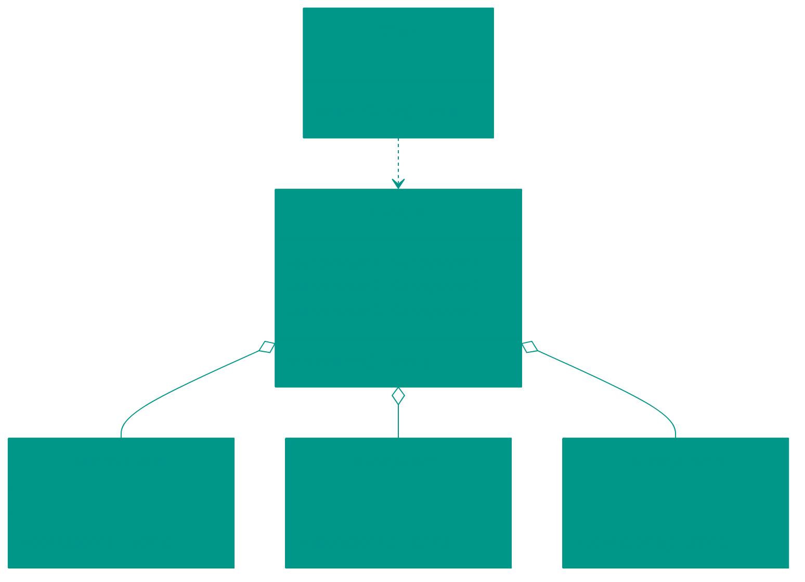
```mermaid
%%{init: { 'theme': 'base', 'themeVariables': { 'lineColor': '#009688', 'primaryColor': '#009688', 'primaryTextColor': '#009688', 'attributeBkg': '#009688', 'attributeTextColor': '#009688', 'signalColor': '#009688', 'actorLineColor': '#009688', 'nodeBorder': '#009688', 'clusterBorder': '#009688', 'textColor': '#009688', 'fontSize': '16px' } } }%%
classDiagram
    class Facade {
        -subsystem1: Subsystem1
        -subsystem2: Subsystem2
        -subsystem3: Subsystem3
        +operation() string
    }
    class Subsystem1 {
        +operation1() string
    }
    class Subsystem2 {
        +operation2() string
    }
    class Subsystem3 {
        +operation3() string
    }
    class Client {
        +clientCode() void
    }

    Client ..> Facade
    Facade o-- Subsystem1
    Facade o-- Subsystem2
    Facade o-- Subsystem3
```

**Complexity**:

| Metric | Complexity |
|:---|:---:|
| Time (when calling method) | O(n), where n is the number of subsystem calls |
| Space | O(1) |

---

## 💻 Implementation

```go
package facade

import "fmt"

// Subsystem1 subsystem 1
type Subsystem1 struct{}

func (s *Subsystem1) Operation1() string {
    return "Subsystem1: Ready!\n"
}

// Subsystem2 subsystem 2
type Subsystem2 struct{}

func (s *Subsystem2) Operation2() string {
    return "Subsystem2: Ready!\n"
}

// Subsystem3 subsystem 3
type Subsystem3 struct{}

func (s *Subsystem3) Operation3() string {
    return "Subsystem3: Ready!\n"
}

// Facade facade for subsystems
type Facade struct {
    subsystem1 *Subsystem1
    subsystem2 *Subsystem2
    subsystem3 *Subsystem3
}

func NewFacade() *Facade {
    return &Facade{
        subsystem1: &Subsystem1{},
        subsystem2: &Subsystem2{},
        subsystem3: &Subsystem3{},
    }
}

func (f *Facade) Operation() string {
    result := "Facade initializes subsystems:\n"
    result += f.subsystem1.Operation1()
    result += f.subsystem2.Operation2()
    result += f.subsystem3.Operation3()
    result += "Facade orders subsystems to perform the action:\n"
    result += f.subsystem1.Operation1()
    result += f.subsystem2.Operation2()
    return result
}

// AlternativeOperations alternative operations through facade
func (f *Facade) AlternativeOperation() string {
    result := "Facade orders subsystems to perform alternative action:\n"
    result += f.subsystem2.Operation2()
    result += f.subsystem3.Operation3()
    return result
}
```

```javascript
/**
 * Subsystems
 */
class Subsystem1 {
    operation1() {
        return "Subsystem1: Ready!\n";
    }
}

class Subsystem2 {
    operation2() {
        return "Subsystem2: Ready!\n";
    }
}

class Subsystem3 {
    operation3() {
        return "Subsystem3: Ready!\n";
    }
}

/**
 * Facade
 */
class Facade {
    constructor() {
        this.subsystem1 = new Subsystem1();
        this.subsystem2 = new Subsystem2();
        this.subsystem3 = new Subsystem3();
    }
    
    operation() {
        let result = "Facade initializes subsystems:\n";
        result += this.subsystem1.operation1();
        result += this.subsystem2.operation2();
        result += this.subsystem3.operation3();
        result += "Facade orders subsystems to perform the action:\n";
        result += this.subsystem1.operation1();
        result += this.subsystem2.operation2();
        return result;
    }
    
    alternativeOperation() {
        let result = "Facade orders subsystems to perform alternative action:\n";
        result += this.subsystem2.operation2();
        result += this.subsystem3.operation3();
        return result;
    }
}

// Example usage
const facade = new Facade();
console.log(facade.operation());
console.log(facade.alternativeOperation());
```

---

### ⚖️ Flyweight

**Description**:
The Flyweight pattern allows efficient use of a large number of small objects by sharing their common state among themselves. It's used to minimize memory consumption or computational cost when working with a large number of similar objects.

- **Problem**: Creating a large number of similar objects that leads to excessive memory consumption.
- **Solution**: Separate internal (internal state) and external (external state) state of objects, storing internal state in a common place.
- **Analogy**: Think of a text editor - characters of the same font, size, and color can use the same formatting object, while differences (e.g., position) are passed as external parameters.

#### Advantages and Disadvantages

✅ **Pros**:
1. **Memory saving**: Significantly reduces memory usage when working with a large number of similar objects
2. **Performance improvement**: Reduces the number of created objects
3. **Centralized management**: Common state is stored in one place

❌ **Cons**:
1. **Code complexity**: Can complicate logic, especially when separating internal and external state
2. **Reduced efficiency**: Passing external state may slow down execution

**When to use**: When the application uses a large number of similar objects, or when memory consumption is too high due to the number of objects.

---

**Visualization**:

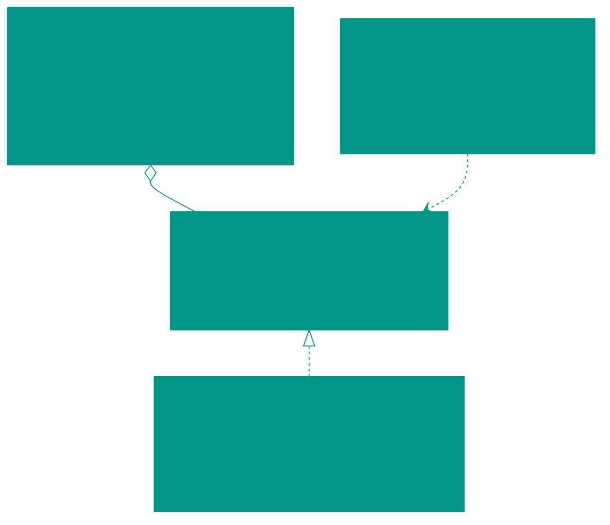
```mermaid
%%{init: { 'theme': 'base', 'themeVariables': { 'lineColor': '#009688', 'primaryColor': '#009688', 'primaryTextColor': '#009688', 'attributeBkg': '#009688', 'attributeTextColor': '#009688', 'signalColor': '#009688', 'actorLineColor': '#009688', 'nodeBorder': '#009688', 'clusterBorder': '#009688', 'textColor': '#009688', 'fontSize': '16px' } } }%%
classDiagram
    class FlyweightFactory {
        -flyweights: map
        +getFlyweight(key) Flyweight
        +listFlyweights() void
    }
    class Flyweight {
        +operation(extrinsicState) string
    }
    class ConcreteFlyweight {
        -intrinsicState: string
        +operation(extrinsicState) string
    }
    class Client {
        -flyweight: Flyweight
        +operation(extrinsicState) void
    }

    FlyweightFactory o-- Flyweight
    Flyweight <|.. ConcreteFlyweight
    Client ..> Flyweight
```

**Complexity**:

| Metric | Complexity |
|:---|:---:|
| Time (when getting flyweight) | O(1) |
| Space | O(n), where n is the number of unique flyweight objects |

---

## 💻 Implementation

```go
package flyweight

import (
    "fmt"
    "sync"
)

// Flyweight interface
type Flyweight interface {
    Operation(extrinsicState string) string
}

// ConcreteFlyweight concrete implementation of flyweight
type ConcreteFlyweight struct {
    intrinsicState string
}

func (f *ConcreteFlyweight) Operation(extrinsicState string) string {
    return fmt.Sprintf("ConcreteFlyweight: Intrinsic state = %s, Extrinsic state = %s\n", f.intrinsicState, extrinsicState)
}

// FlyweightFactory factory for flyweight objects
type FlyweightFactory struct {
    flyweights map[string]Flyweight
    mu         sync.Mutex
}

func NewFlyweightFactory() *FlyweightFactory {
    return &FlyweightFactory{
        flyweights: make(map[string]Flyweight),
    }
}

func (f *FlyweightFactory) GetFlyweight(key string) Flyweight {
    f.mu.Lock()
    defer f.mu.Unlock()
    
    if flyweight, exists := f.flyweights[key]; exists {
        return flyweight
    }
    
    flyweight := &ConcreteFlyweight{intrinsicState: key}
    f.flyweights[key] = flyweight
    return flyweight
}

func (f *FlyweightFactory) ListFlyweights() {
    fmt.Printf("FlyweightFactory: I have %d flyweights:\n", len(f.flyweights))
    for key := range f.flyweights {
        fmt.Printf("\t%s\n", key)
    }
}

// Client code
type Client struct {
    flyweight Flyweight
}

func NewClient(factory *FlyweightFactory, key string) *Client {
    return &Client{flyweight: factory.GetFlyweight(key)}
}

func (c *Client) Operation(extrinsicState string) string {
    return c.flyweight.Operation(extrinsicState)
}
```

```javascript
/**
 * Flyweight interface
 */
class Flyweight {
    operation(extrinsicState) {
        throw new Error("Method operation() must be implemented");
    }
}

/**
 * Concrete implementation of Flyweight
 */
class ConcreteFlyweight extends Flyweight {
    constructor(intrinsicState) {
        super();
        this.intrinsicState = intrinsicState;
    }
    
    operation(extrinsicState) {
        return `ConcreteFlyweight: Intrinsic state = ${this.intrinsicState}, Extrinsic state = ${extrinsicState}\n`;
    }
}

/**
 * Factory for Flyweight objects
 */
class FlyweightFactory {
    constructor() {
        this.flyweights = new Map();
    }
    
    getFlyweight(key) {
        if (!this.flyweights.has(key)) {
            this.flyweights.set(key, new ConcreteFlyweight(key));
        }
        return this.flyweights.get(key);
    }
    
    listFlyweights() {
        console.log(`FlyweightFactory: I have ${this.flyweights.size} flyweights:`);
        for (const key of this.flyweights.keys()) {
            console.log(`\t${key}`);
        }
    }
}

/**
 * Client code
 */
class Client {
    constructor(factory, key) {
        this.flyweight = factory.getFlyweight(key);
    }
    
    operation(extrinsicState) {
        return this.flyweight.operation(extrinsicState);
    }
}

// Example usage
const factory = new FlyweightFactory();

const client1 = new Client(factory, "shared-state-A");
const client2 = new Client(factory, "shared-state-B");
const client3 = new Client(factory, "shared-state-A"); // same key as client1

console.log(client1.operation("unique-state-1"));
console.log(client2.operation("unique-state-2"));
console.log(client3.operation("unique-state-3"));

factory.listFlyweights();
```

---

### 🕵️ Proxy

**Description**:
The Proxy pattern provides an object that controls access to another object, intercepting all calls to it. It allows performing something before or after the original object is called.

- **Problem**: Need to control access to an object, add additional logic when accessing, or lazy initialization of a heavy object.
- **Solution**: Create a proxy object that acts as an intermediary between the client and the original object.
- **Analogy**: Think of a guard at an office - he controls who can enter the building and under what conditions.

#### Advantages and Disadvantages

✅ **Pros**:
1. **Access control**: Can control who and when can access the object
2. **Lazy initialization**: Allows delaying the creation of a heavy object until it's actually used
3. **Logging and caching**: Can add logging of calls or caching of results

❌ **Cons**:
1. **Increased response time**: Adding an abstraction layer may slow down execution
2. **Code complexity**: Increases architectural complexity

**When to use**: When you need to control access to an object, add caching, lazy initialization, or logging.

---

**Visualization**:

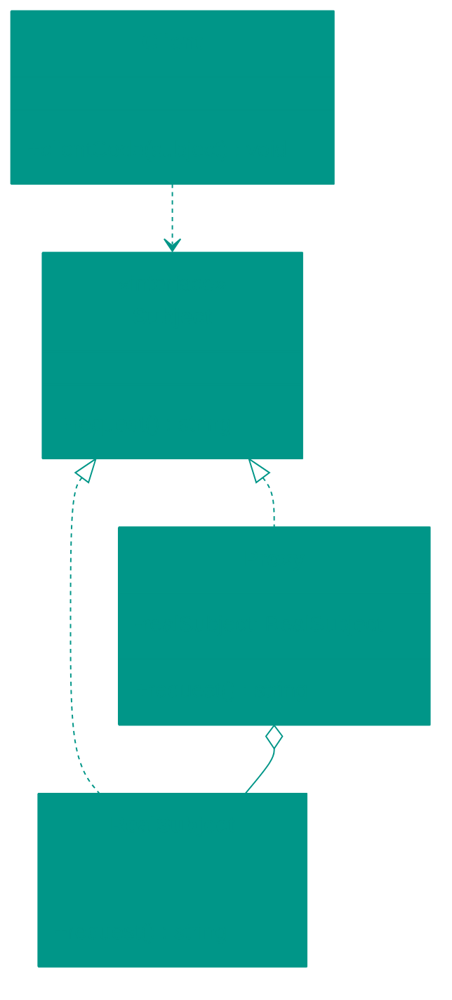
```mermaid
%%{init: { 'theme': 'base', 'themeVariables': { 'lineColor': '#009688', 'primaryColor': '#009688', 'primaryTextColor': '#009688', 'attributeBkg': '#009688', 'attributeTextColor': '#009688', 'signalColor': '#009688', 'actorLineColor': '#009688', 'nodeBorder': '#009688', 'clusterBorder': '#009688', 'textColor': '#009688', 'fontSize': '16px' } } }%%
classDiagram
    class Subject {
        <<interface>>
        +request() string
    }
    class RealSubject {
        +request() string
    }
    class Proxy {
        -realSubject: RealSubject
        +request() string
    }
    class Client {
        +clientCode(subject) void
    }

    Client ..> Subject
    Subject <|.. RealSubject
    Subject <|.. Proxy
    Proxy o-- RealSubject
```

**Complexity**:

| Metric | Complexity |
|:---|:---:|
| Time (when calling method) | O(1) for proxy, O(n) for original object |
| Space | O(1) |

---

## 💻 Implementation

```go
package proxy

import "fmt"

// Subject interface for subject
type Subject interface {
    Request() string
}

// RealSubject real subject
type RealSubject struct{}

func (r *RealSubject) Request() string {
    return "RealSubject: Handling request.\n"
}

// Proxy proxy
type Proxy struct {
    realSubject Subject
}

func NewProxy() *Proxy {
    return &Proxy{}
}

func (p *Proxy) Request() string {
    if p.realSubject == nil {
        p.realSubject = &RealSubject{}
    }
    
    fmt.Println("Proxy: Logging the request.")
    result := p.realSubject.Request()
    fmt.Println("Proxy: Logging the completion of the request.")
    return result
}

// ProtectedProxy protected proxy with access control
type ProtectedProxy struct {
    realSubject Subject
    accessLevel int
}

func NewProtectedProxy(accessLevel int) *ProtectedProxy {
    return &ProtectedProxy{
        realSubject: &RealSubject{},
        accessLevel: accessLevel,
    }
}

func (p *ProtectedProxy) Request() string {
    if p.accessLevel < 5 {
        return "ProtectedProxy: Access denied.\n"
    }
    
    fmt.Println("ProtectedProxy: Access granted. Logging the request.")
    result := p.realSubject.Request()
    fmt.Println("ProtectedProxy: Logging the completion of the request.")
    return result
}
```

```javascript
/**
 * Subject interface
 */
class Subject {
    request() {
        throw new Error("Method request() must be implemented");
    }
}

/**
 * Real subject
 */
class RealSubject extends Subject {
    request() {
        return "RealSubject: Handling request.\n";
    }
}

/**
 * Proxy
 */
class Proxy extends Subject {
    constructor() {
        super();
        this.realSubject = null;
    }
    
    request() {
        if (!this.realSubject) {
            this.realSubject = new RealSubject();
        }
        
        console.log("Proxy: Logging the request.");
        const result = this.realSubject.request();
        console.log("Proxy: Logging the completion of the request.");
        return result;
    }
}

/**
 * Protected proxy with access control
 */
class ProtectedProxy extends Subject {
    constructor(accessLevel) {
        super();
        this.realSubject = new RealSubject();
        this.accessLevel = accessLevel;
    }
    
    request() {
        if (this.accessLevel < 5) {
            return "ProtectedProxy: Access denied.\n";
        }
        
        console.log("ProtectedProxy: Access granted. Logging the request.");
        const result = this.realSubject.request();
        console.log("ProtectedProxy: Logging the completion of the request.");
        return result;
    }
}

// Example usage
const proxy = new Proxy();
console.log(proxy.request());

const protectedProxy = new ProtectedProxy(3);
console.log(protectedProxy.request());

const protectedProxy2 = new ProtectedProxy(7);
console.log(protectedProxy2.request());
```

---

## Behavioral Patterns

These patterns are related to algorithms and distribution of responsibilities between objects. They define how objects interact with each other and help implement complex behavior by distributing it among several objects.

### 🔄 Chain of Responsibility

**Description**:
The Chain of Responsibility pattern allows passing requests sequentially through a chain of handlers. Upon receiving a request, each handler decides whether to process the request or pass it to the next handler in the chain.

- **Problem**: Need to process a request in multiple ways, but don't know in advance which handler should process it.
- **Solution**: Create a chain of handlers where each can process the request or pass it to the next.
- **Analogy**: Support service - first a robot responds, then a specialist, then a manager, and each can solve the problem or pass it on.

#### Advantages and Disadvantages

✅ **Pros**:
1. **Reduced coupling**: Objects don't depend on each other
2. **Flexibility**: Can change the chain at runtime
3. **Distribution of responsibilities**: Each handler is responsible for its part

❌ **Cons**:
1. **Possibility of unprocessed request**: Request may not be processed if the chain is incomplete
2. **Debugging difficulty**: Difficult to trace where the request was processed

**When to use**: When there are multiple potential handlers for a request, or when handlers should be loosely coupled.

---

**Visualization**:

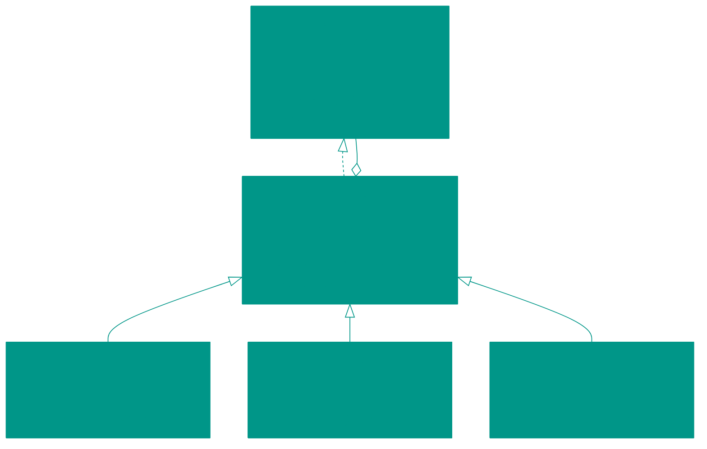
```mermaid
%%{init: { 'theme': 'base', 'themeVariables': { 'lineColor': '#009688', 'primaryColor': '#009688', 'primaryTextColor': '#009688', 'attributeBkg': '#009688', 'attributeTextColor': '#009688', 'signalColor': '#009688', 'actorLineColor': '#009688', 'nodeBorder': '#009688', 'clusterBorder': '#009688', 'textColor': '#009688', 'fontSize': '16px' } } }%%
classDiagram
    class Handler {
        <<interface>>
        +setNext(handler) Handler
        +handle(request) string
    }
    class AbstractHandler {
        -nextHandler: Handler
        +setNext(handler) Handler
        +handle(request) string
    }
    class ConcreteHandlerA {
        +handle(request) string
    }
    class ConcreteHandlerB {
        +handle(request) string
    }
    class ConcreteHandlerC {
        +handle(request) string
    }

    Handler <|.. AbstractHandler
    AbstractHandler <|-- ConcreteHandlerA
    AbstractHandler <|-- ConcreteHandlerB
    AbstractHandler <|-- ConcreteHandlerC
    AbstractHandler o-- Handler
```

**Complexity**:

| Metric | Complexity |
|:---|:---:|
| Time (when processing request) | O(n), where n is the number of handlers |
| Space | O(n), where n is the number of handlers |

---

## 💻 Implementation

```go
package chainofresponsibility

import "fmt"

// Handler interface for handler
type Handler interface {
    SetNext(handler Handler) Handler
    Handle(request string) string
}

// AbstractHandler base handler
type AbstractHandler struct {
    nextHandler Handler
}

func (h *AbstractHandler) SetNext(handler Handler) Handler {
    h.nextHandler = handler
    return handler
}

func (h *AbstractHandler) Handle(request string) string {
    if h.nextHandler != nil {
        return h.nextHandler.Handle(request)
    }
    return ""
}

// ConcreteHandlerA concrete handler A
type ConcreteHandlerA struct {
    *AbstractHandler
}

func NewConcreteHandlerA() *ConcreteHandlerA {
    return &ConcreteHandlerA{AbstractHandler: &AbstractHandler{}}
}

func (h *ConcreteHandlerA) Handle(request string) string {
    if request == "A" {
        return fmt.Sprintf("ConcreteHandlerA: I'll handle '%s'.\n", request)
    }
    return h.AbstractHandler.Handle(request)
}

// ConcreteHandlerB concrete handler B
type ConcreteHandlerB struct {
    *AbstractHandler
}

func NewConcreteHandlerB() *ConcreteHandlerB {
    return &ConcreteHandlerB{AbstractHandler: &AbstractHandler{}}
}

func (h *ConcreteHandlerB) Handle(request string) string {
    if request == "B" {
        return fmt.Sprintf("ConcreteHandlerB: I'll handle '%s'.\n", request)
    }
    return h.AbstractHandler.Handle(request)
}

// ConcreteHandlerC concrete handler C
type ConcreteHandlerC struct {
    *AbstractHandler
}

func NewConcreteHandlerC() *ConcreteHandlerC {
    return &ConcreteHandlerC{AbstractHandler: &AbstractHandler{}}
}

func (h *ConcreteHandlerC) Handle(request string) string {
    if request == "C" {
        return fmt.Sprintf("ConcreteHandlerC: I'll handle '%s'.\n", request)
    }
    return h.AbstractHandler.Handle(request)
}
```

```javascript
/**
 * Handler interface
 */
class Handler {
    setNext(handler) {
        throw new Error("Method setNext() must be implemented");
    }
    
    handle(request) {
        throw new Error("Method handle() must be implemented");
    }
}

/**
 * Base handler
 */
class AbstractHandler extends Handler {
    constructor() {
        super();
        this.nextHandler = null;
    }
    
    setNext(handler) {
        this.nextHandler = handler;
        return handler;
    }
    
    handle(request) {
        if (this.nextHandler) {
            return this.nextHandler.handle(request);
        }
        return null;
    }
}

/**
 * Concrete handlers
 */
class ConcreteHandlerA extends AbstractHandler {
    handle(request) {
        if (request === 'A') {
            return `ConcreteHandlerA: I'll handle '${request}'.\n`;
        }
        return super.handle(request);
    }
}

class ConcreteHandlerB extends AbstractHandler {
    handle(request) {
        if (request === 'B') {
            return `ConcreteHandlerB: I'll handle '${request}'.\n`;
        }
        return super.handle(request);
    }
}

class ConcreteHandlerC extends AbstractHandler {
    handle(request) {
        if (request === 'C') {
            return `ConcreteHandlerC: I'll handle '${request}'.\n`;
        }
        return super.handle(request);
    }
}

// Example usage
const handlerA = new ConcreteHandlerA();
const handlerB = new ConcreteHandlerB();
const handlerC = new ConcreteHandlerC();

handlerA.setNext(handlerB).setNext(handlerC);

console.log(handlerA.handle('A'));
console.log(handlerA.handle('B'));
console.log(handlerA.handle('C'));
console.log(handlerA.handle('D')); // nobody will handle
```

---

### 📝 Command

**Description**:
The Command pattern turns a request into a standalone object containing all information about the request. This allows passing requests as method arguments, queuing them, logging them, and undoing operations.

- **Problem**: Need to parameterize objects with executed action, queue of commands, or support for undoing operations.
- **Solution**: Create a command object that encapsulates all information about executing an operation.
- **Analogy**: A waiter in a restaurant takes an order (command) and passes it to the kitchen where it will be executed.

#### Advantages and Disadvantages

✅ **Pros**:
1. **Object parameterization**: Can easily pass commands as arguments
2. **Command queue**: Can queue commands and execute them later
3. **Undo operation support**: Easy to implement undo/redo functionality

❌ **Cons**:
1. **Increase in number of classes**: Each command requires a separate class
2. **Overhead for simple operations**: May be excessive for simple cases

**When to use**: When you need to parameterize objects with executed actions, queue commands, or support undo operations.

---

**Visualization**:

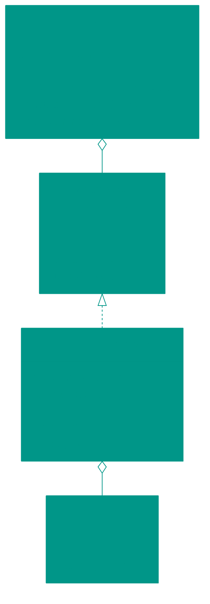
```mermaid
%%{init: { 'theme': 'base', 'themeVariables': { 'lineColor': '#009688', 'primaryColor': '#009688', 'primaryTextColor': '#009688', 'attributeBkg': '#009688', 'attributeTextColor': '#009688', 'signalColor': '#009688', 'actorLineColor': '#009688', 'nodeBorder': '#009688', 'clusterBorder': '#009688', 'textColor': '#009688', 'fontSize': '16px' } } }%%
classDiagram
    class Command {
        <<interface>>
        +execute() void
        +undo() void
    }
    class ConcreteCommand {
        -receiver: Receiver
        -aParameter: string
        +execute() void
        +undo() void
    }
    class Receiver {
        +action() void
    }
    class Invoker {
        -command: Command
        +setCommand(command) void
        +executeCommand() void
        +undoCommand() void
    }

    Command <|.. ConcreteCommand
    ConcreteCommand o-- Receiver
    Invoker o-- Command
```

**Complexity**:

| Metric | Complexity |
|:---|:---:|
| Time (when executing command) | O(1) for call, O(n) for execution |
| Space | O(1) for command, O(n) for command history |

---

## 💻 Implementation

```go
package command

import "fmt"

// Command interface for command
type Command interface {
    Execute()
    Undo()
}

// Receiver command receiver
type Receiver struct {
    state string
}

func (r *Receiver) On() {
    r.state = "on"
    fmt.Println("Receiver: Switch turned ON")
}

func (r *Receiver) Off() {
    r.state = "off"
    fmt.Println("Receiver: Switch turned OFF")
}

func (r *Receiver) GetState() string {
    return r.state
}

// ConcreteCommand concrete turn-on command
type TurnOnCommand struct {
    receiver *Receiver
}

func NewTurnOnCommand(receiver *Receiver) *TurnOnCommand {
    return &TurnOnCommand{receiver: receiver}
}

func (c *TurnOnCommand) Execute() {
    c.receiver.On()
}

func (c *TurnOnCommand) Undo() {
    c.receiver.Off()
}

// ConcreteCommand concrete turn-off command
type TurnOffCommand struct {
    receiver *Receiver
}

func NewTurnOffCommand(receiver *Receiver) *TurnOffCommand {
    return &TurnOffCommand{receiver: receiver}
}

func (c *TurnOffCommand) Execute() {
    c.receiver.Off()
}

func (c *TurnOffCommand) Undo() {
    c.receiver.On()
}

// Invoker command executor
type Invoker struct {
    history []Command
}

func NewInvoker() *Invoker {
    return &Invoker{history: make([]Command, 0)}
}

func (i *Invoker) SetCommand(command Command) {
    i.history = append(i.history, command)
}

func (i *Invoker) ExecuteCommand() {
    if len(i.history) > 0 {
        command := i.history[len(i.history)-1]
        command.Execute()
    }
}

func (i *Invoker) UndoCommand() {
    if len(i.history) > 0 {
        command := i.history[len(i.history)-1]
        command.Undo()
        i.history = i.history[:len(i.history)-1] // remove last command from history
    }
}
```

```javascript
/**
 * Command interface
 */
class Command {
    execute() {
        throw new Error("Method execute() must be implemented");
    }
    
    undo() {
        throw new Error("Method undo() must be implemented");
    }
}

/**
 * Command receiver
 */
class Receiver {
    constructor() {
        this.state = "";
    }
    
    on() {
        this.state = "on";
        console.log("Receiver: Switch turned ON");
    }
    
    off() {
        this.state = "off";
        console.log("Receiver: Switch turned OFF");
    }
    
    getState() {
        return this.state;
    }
}

/**
 * Concrete commands
 */
class TurnOnCommand extends Command {
    constructor(receiver) {
        super();
        this.receiver = receiver;
    }
    
    execute() {
        this.receiver.on();
    }
    
    undo() {
        this.receiver.off();
    }
}

class TurnOffCommand extends Command {
    constructor(receiver) {
        super();
        this.receiver = receiver;
    }
    
    execute() {
        this.receiver.off();
    }
    
    undo() {
        this.receiver.on();
    }
}

/**
 * Command executor
 */
class Invoker {
    constructor() {
        this.history = [];
    }
    
    setCommand(command) {
        this.history.push(command);
    }
    
    executeCommand() {
        if (this.history.length > 0) {
            const command = this.history[this.history.length - 1];
            command.execute();
        }
    }
    
    undoCommand() {
        if (this.history.length > 0) {
            const command = this.history[this.history.length - 1];
            command.undo();
            this.history.pop(); // remove last command from history
        }
    }
}

// Example usage
const receiver = new Receiver();
const turnOnCommand = new TurnOnCommand(receiver);
const turnOffCommand = new TurnOffCommand(receiver);

const invoker = new Invoker();
invoker.setCommand(turnOnCommand);
invoker.executeCommand(); // Receiver: Switch turned ON
invoker.undoCommand();    // Receiver: Switch turned OFF

invoker.setCommand(turnOffCommand);
invoker.executeCommand(); // Receiver: Switch turned OFF
invoker.undoCommand();    // Receiver: Switch turned ON
```

---

### 🧮 Interpreter

**Description**:
The Interpreter pattern defines representation of a language and provides interpretation of sentences in that language. It's used to define grammar of a language and create an interpreter for sentences of that language.

- **Problem**: Need to interpret expressions in some language or perform operations according to a defined grammar.
- **Solution**: Create classes for each grammar symbol and use them to build an abstract syntax tree.
- **Analogy**: Think of a calculator - it interprets mathematical expressions like "2 + 3 * 4".

#### Advantages and Disadvantages

✅ **Pros**:
1. **Flexibility**: Easy to change and extend grammar
2. **Implementation simplicity**: Direct correspondence between grammar and classes
3. **Clarity**: Code reflects grammar structure

❌ **Cons**:
1. **Complexity for complex grammars**: May be inefficient for complex languages
2. **Increase in number of classes**: Each grammar rule requires a separate class

**When to use**: When the language is sufficiently simple, or when efficiency is not a critical factor, or when the grammar is not complex.

---

**Visualization**:

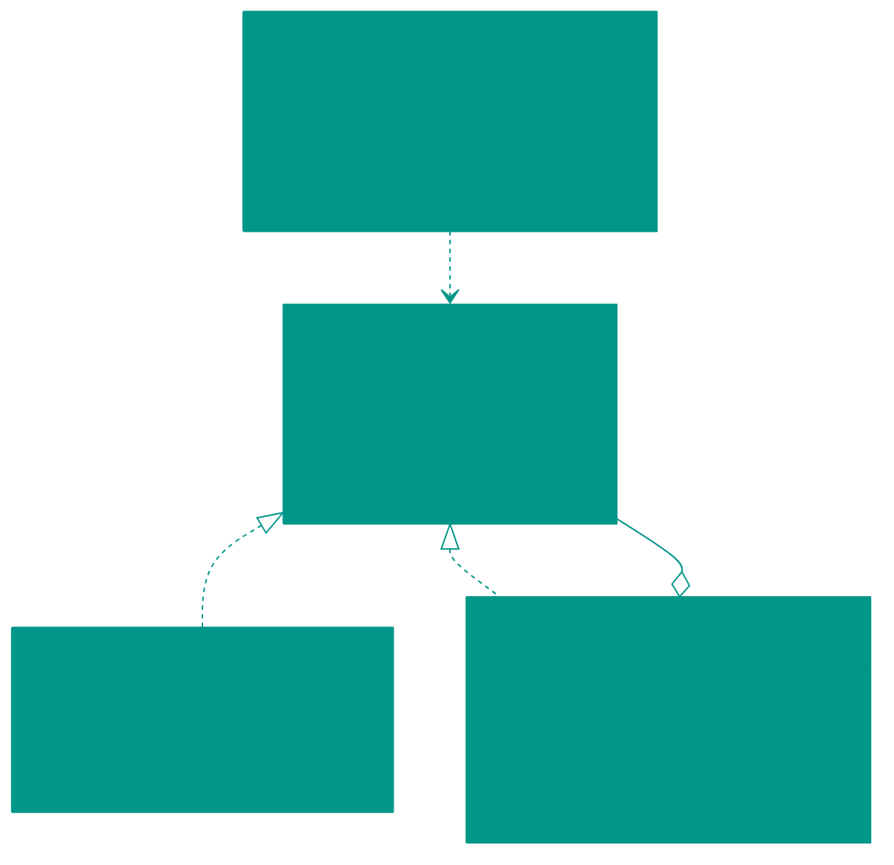
```mermaid
%%{init: { 'theme': 'base', 'themeVariables': { 'lineColor': '#009688', 'primaryColor': '#009688', 'primaryTextColor': '#009688', 'attributeBkg': '#009688', 'attributeTextColor': '#009688', 'signalColor': '#009688', 'actorLineColor': '#009688', 'nodeBorder': '#009688', 'clusterBorder': '#009688', 'textColor': '#009688', 'fontSize': '16px' } } }%%
classDiagram
    class Expression {
        <<interface>>
        +interpret(context) int
    }
    class TerminalExpression {
        +interpret(context) int
    }
    class NonTerminalExpression {
        -left: Expression
        -right: Expression
        +interpret(context) int
    }
    class Context {
        +getVariable(name) int
        +setVariable(name, value) void
    }

    Expression <|.. TerminalExpression
    Expression <|.. NonTerminalExpression
    NonTerminalExpression o-- Expression
    Context ..> Expression
```

**Complexity**:

| Metric | Complexity |
|:---|:---:|
| Time (when interpreting) | O(n), where n is tree depth |
| Space | O(n), where n is number of nodes in tree |

---

## 💻 Implementation

```go
package interpreter

import (
    "strconv"
    "strings"
)

// Context context for variables
type Context struct {
    variables map[string]int
}

func NewContext() *Context {
    return &Context{variables: make(map[string]int)}
}

func (c *Context) GetVariable(name string) int {
    return c.variables[name]
}

func (c *Context) SetVariable(name string, value int) {
    c.variables[name] = value
}

// Expression interface for expression
type Expression interface {
    Interpret(context *Context) int
}

// NumberExpression terminal expression for numbers
type NumberExpression struct {
    value int
}

func NewNumberExpression(value int) *NumberExpression {
    return &NumberExpression{value: value}
}

func (e *NumberExpression) Interpret(context *Context) int {
    return e.value
}

// VariableExpression terminal expression for variables
type VariableExpression struct {
    name string
}

func NewVariableExpression(name string) *VariableExpression {
    return &VariableExpression{name: name}
}

func (e *VariableExpression) Interpret(context *Context) int {
    return context.GetVariable(e.name)
}

// AddExpression non-terminal expression for addition
type AddExpression struct {
    left, right Expression
}

func NewAddExpression(left, right Expression) *AddExpression {
    return &AddExpression{left: left, right: right}
}

func (e *AddExpression) Interpret(context *Context) int {
    return e.left.Interpret(context) + e.right.Interpret(context)
}

// SubtractExpression non-terminal expression for subtraction
type SubtractExpression struct {
    left, right Expression
}

func NewSubtractExpression(left, right Expression) *SubtractExpression {
    return &SubtractExpression{left: left, right: right}
}

func (e *SubtractExpression) Interpret(context *Context) int {
    return e.left.Interpret(context) - e.right.Interpret(context)
}

// Parser simple parser for arithmetic expressions
func ParseExpression(expression string, context *Context) Expression {
    tokens := strings.Split(expression, " ")
    
    // Simple parser for expressions like "a + b" or "5 + 3"
    if len(tokens) == 3 {
        var left, right Expression
        
        // Parse left part
        if val, err := strconv.Atoi(tokens[0]); err == nil {
            left = NewNumberExpression(val)
        } else {
            left = NewVariableExpression(tokens[0])
        }
        
        // Parse right part
        if val, err := strconv.Atoi(tokens[2]); err == nil {
            right = NewNumberExpression(val)
        } else {
            right = NewVariableExpression(tokens[2])
        }
        
        // Determine operation
        switch tokens[1] {
        case "+":
            return NewAddExpression(left, right)
        case "-":
            return NewSubtractExpression(left, right)
        }
    }
    
    return nil
}
```

```javascript
/**
 * Context for variables
 */
class Context {
    constructor() {
        this.variables = new Map();
    }
    
    getVariable(name) {
        return this.variables.get(name) || 0;
    }
    
    setVariable(name, value) {
        this.variables.set(name, value);
    }
}

/**
 * Expression interface
 */
class Expression {
    interpret(context) {
        throw new Error("Method interpret() must be implemented");
    }
}

/**
 * Terminal expressions
 */
class NumberExpression extends Expression {
    constructor(value) {
        super();
        this.value = value;
    }
    
    interpret(context) {
        return this.value;
    }
}

class VariableExpression extends Expression {
    constructor(name) {
        super();
        this.name = name;
    }
    
    interpret(context) {
        return context.getVariable(this.name);
    }
}

/**
 * Non-terminal expressions
 */
class AddExpression extends Expression {
    constructor(left, right) {
        super();
        this.left = left;
        this.right = right;
    }
    
    interpret(context) {
        return this.left.interpret(context) + this.right.interpret(context);
    }
}

class SubtractExpression extends Expression {
    constructor(left, right) {
        super();
        this.left = left;
        this.right = right;
    }
    
    interpret(context) {
        return this.left.interpret(context) - this.right.interpret(context);
    }
}

/**
 * Simple parser for arithmetic expressions
 */
function parseExpression(expression, context) {
    const tokens = expression.split(' ');
    
    // Simple parser for expressions like "a + b" or "5 + 3"
    if (tokens.length === 3) {
        let left, right;
        
        // Parse left part
        const leftVal = parseInt(tokens[0]);
        if (isNaN(leftVal)) {
            left = new VariableExpression(tokens[0]);
        } else {
            left = new NumberExpression(leftVal);
        }
        
        // Parse right part
        const rightVal = parseInt(tokens[2]);
        if (isNaN(rightVal)) {
            right = new VariableExpression(tokens[2]);
        } else {
            right = new NumberExpression(rightVal);
        }
        
        // Determine operation
        switch (tokens[1]) {
            case '+':
                return new AddExpression(left, right);
            case '-':
                return new SubtractExpression(left, right);
        }
    }
    
    return null;
}

// Example usage
const context = new Context();
context.setVariable('x', 10);
context.setVariable('y', 5);

// Create expression: x + y
const expr1 = new AddExpression(
    new VariableExpression('x'),
    new VariableExpression('y')
);
console.log(expr1.interpret(context)); // 15

// Create expression: 10 - 5
const expr2 = new SubtractExpression(
    new NumberExpression(10),
    new NumberExpression(5)
);
console.log(expr2.interpret(context)); // 5

// Use parser
const expr3 = parseExpression('x + 7', context);
console.log(expr3.interpret(context)); // 17
```

---

### ↪️ Iterator

**Description**:
The Iterator pattern provides a way to access the elements of an aggregate object sequentially without exposing its underlying representation. It allows traversing elements of a collection without knowing the internal structure of the collection.

- **Problem**: Need sequential access to elements of a composite object without exposing its internal structure.
- **Solution**: Create an iterator interface that provides methods for traversing collection elements.
- **Analogy**: Think of reading a book - you can read page by page without knowing how the data is stored in the book (paper, electronic format, etc.).

#### Advantages and Disadvantages

✅ **Pros**:
1. **Unified interface**: Same way to traverse different collections
2. **Structure hiding**: Internal structure of collection is hidden from client
3. **Flexibility**: Can implement different traversal strategies

❌ **Cons**:
1. **Overhead**: May be less efficient than direct access to elements
2. **Complexity for simple collections**: May be excessive for simple data structures

**When to use**: When you need to provide a standard way to traverse collection elements or when you need to hide the internal structure of a collection.

---

**Visualization**:

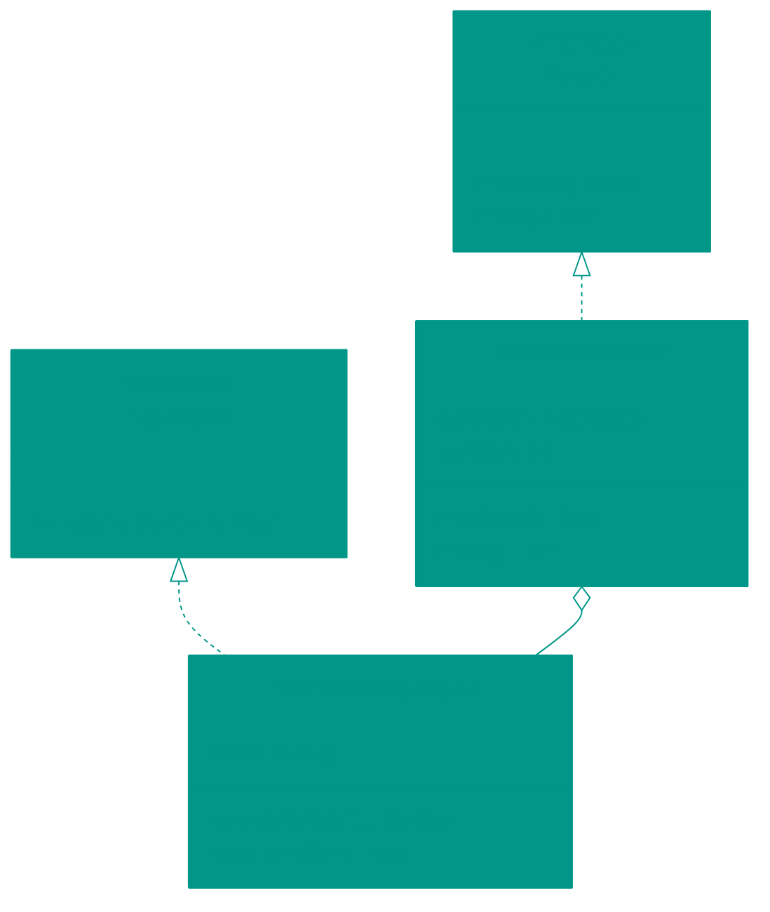
```mermaid
%%{init: { 'theme': 'base', 'themeVariables': { 'lineColor': '#009688', 'primaryColor': '#009688', 'primaryTextColor': '#009688', 'attributeBkg': '#009688', 'attributeTextColor': '#009688', 'signalColor': '#009688', 'actorLineColor': '#009688', 'nodeBorder': '#009688', 'clusterBorder': '#009688', 'textColor': '#009688', 'fontSize': '16px' } } }%%
classDiagram
    class Iterator {
        <<interface>>
        +hasNext() bool
        +next() Item
    }
    class ConcreteIterator {
        -collection: Aggregate
        -position: int
        +hasNext() bool
        +next() Item
    }
    class Aggregate {
        <<interface>>
        +createIterator() Iterator
    }
    class ConcreteAggregate {
        -items: Item[]
        +createIterator() Iterator
        +addItem(item) void
    }

    Iterator <|.. ConcreteIterator
    Aggregate <|.. ConcreteAggregate
    ConcreteIterator o-- ConcreteAggregate
```

**Complexity**:

| Metric | Complexity |
|:---|:---:|
| Time (when accessing element) | O(1) |
| Space | O(1) for iterator |

---

## 💻 Implementation

```go
package iterator

// Iterator interface for iterator
type Iterator interface {
    HasNext() bool
    Next() interface{}
}

// Aggregate interface for aggregate
type Aggregate interface {
    CreateIterator() Iterator
}

// ConcreteAggregate concrete implementation of aggregate
type ConcreteAggregate struct {
    items []interface{}
}

func NewConcreteAggregate() *ConcreteAggregate {
    return &ConcreteAggregate{items: make([]interface{}, 0)}
}

func (a *ConcreteAggregate) AddItem(item interface{}) {
    a.items = append(a.items, item)
}

func (a *ConcreteAggregate) CreateIterator() Iterator {
    return NewConcreteIterator(a)
}

// ConcreteIterator concrete implementation of iterator
type ConcreteIterator struct {
    aggregate  *ConcreteAggregate
    position   int
}

func NewConcreteIterator(aggregate *ConcreteAggregate) *ConcreteIterator {
    return &ConcreteIterator{aggregate: aggregate, position: 0}
}

func (i *ConcreteIterator) HasNext() bool {
    return i.position < len(i.aggregate.items)
}

func (i *ConcreteIterator) Next() interface{} {
    if i.HasNext() {
        item := i.aggregate.items[i.position]
        i.position++
        return item
    }
    return nil
}

// ReverseIterator reverse order iterator
type ReverseIterator struct {
    aggregate *ConcreteAggregate
    position  int
}

func NewReverseIterator(aggregate *ConcreteAggregate) *ReverseIterator {
    return &ReverseIterator{
        aggregate: aggregate,
        position:  len(aggregate.items) - 1,
    }
}

func (i *ReverseIterator) HasNext() bool {
    return i.position >= 0
}

func (i *ReverseIterator) Next() interface{} {
    if i.HasNext() {
        item := i.aggregate.items[i.position]
        i.position--
        return item
    }
    return nil
}
```

```javascript
/**
 * Iterator interface
 */
class Iterator {
    hasNext() {
        throw new Error("Method hasNext() must be implemented");
    }
    
    next() {
        throw new Error("Method next() must be implemented");
    }
}

/**
 * Aggregate interface
 */
class Aggregate {
    createIterator() {
        throw new Error("Method createIterator() must be implemented");
    }
}

/**
 * Concrete implementation of aggregate
 */
class ConcreteAggregate extends Aggregate {
    constructor() {
        super();
        this.items = [];
    }
    
    addItem(item) {
        this.items.push(item);
    }
    
    createIterator() {
        return new ConcreteIterator(this);
    }
    
    createReverseIterator() {
        return new ReverseIterator(this);
    }
}

/**
 * Concrete implementation of iterator
 */
class ConcreteIterator extends Iterator {
    constructor(aggregate) {
        super();
        this.aggregate = aggregate;
        this.position = 0;
    }
    
    hasNext() {
        return this.position < this.aggregate.items.length;
    }
    
    next() {
        if (this.hasNext()) {
            const item = this.aggregate.items[this.position];
            this.position++;
            return item;
        }
        return null;
    }
}

/**
 * Reverse order iterator
 */
class ReverseIterator extends Iterator {
    constructor(aggregate) {
        super();
        this.aggregate = aggregate;
        this.position = aggregate.items.length - 1;
    }
    
    hasNext() {
        return this.position >= 0;
    }
    
    next() {
        if (this.hasNext()) {
            const item = this.aggregate.items[this.position];
            this.position--;
            return item;
        }
        return null;
    }
}

// Example usage
const aggregate = new ConcreteAggregate();
aggregate.addItem("First");
aggregate.addItem("Second");
aggregate.addItem("Third");

const iterator = aggregate.createIterator();
while (iterator.hasNext()) {
    console.log(iterator.next());
}

console.log("Reverse iteration:");
const reverseIterator = aggregate.createReverseIterator();
while (reverseIterator.hasNext()) {
    console.log(reverseIterator.next());
}
```

---

### 🤝 Mediator

**Description**:
The Mediator pattern defines an object that encapsulates how a set of objects interact. The mediator promotes loose coupling by keeping objects from referring to each other explicitly, and it lets you vary their interaction independently.

- **Problem**: Strong coupling between objects when each object knows about others and interacts with them directly.
- **Solution**: Create a mediator that manages interaction between objects.
- **Analogy**: An airport dispatcher coordinates takeoffs and landings instead of planes communicating directly with each other.

#### Advantages and Disadvantages

✅ **Pros**:
1. **Loose coupling**: Objects don't depend on each other directly
2. **Centralized management**: Interaction is concentrated in one place
3. **Easy to change interaction**: Can easily change interaction logic

❌ **Cons**:
1. **Centralization**: Mediator can become a system "bottleneck"
2. **Complexity**: Mediator can become too complex

**When to use**: When it's difficult to change interaction between multiple classes without changing those classes, or when interaction between objects becomes too complex.

---

**Visualization**:

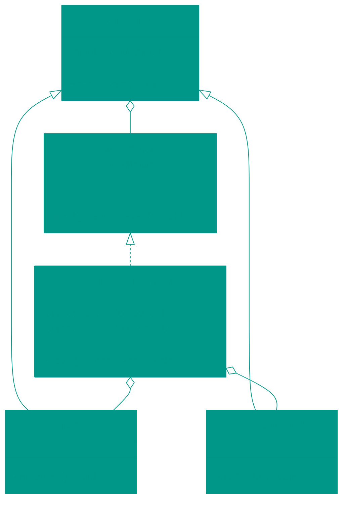
```mermaid
%%{init: { 'theme': 'base', 'themeVariables': { 'lineColor': '#009688', 'primaryColor': '#009688', 'primaryTextColor': '#009688', 'attributeBkg': '#009688', 'attributeTextColor': '#009688', 'signalColor': '#009688', 'actorLineColor': '#009688', 'nodeBorder': '#009688', 'clusterBorder': '#009688', 'textColor': '#009688', 'fontSize': '16px' } } }%%
classDiagram
    class Mediator {
        <<interface>>
        +notify(sender, event) void
    }
    class ConcreteMediator {
        -component1: Component1
        -component2: Component2
        +notify(sender, event) void
    }
    class Component {
        -mediator: Mediator
        +send(event) void
    }
    class Component1 {
        +method1() void
    }
    class Component2 {
        +method2() void
    }

    Mediator <|.. ConcreteMediator
    Component o-- Mediator
    Component <|-- Component1
    Component <|-- Component2
    ConcreteMediator o-- Component1
    ConcreteMediator o-- Component2
```

**Complexity**:

| Metric | Complexity |
|:---|:---:|
| Time (when notifying) | O(1) |
| Space | O(n), where n is the number of components |

---

## 💻 Implementation

```go
package mediator

import "fmt"

// Mediator interface for mediator
type Mediator interface {
    Notify(sender Component, event string)
}

// Component base component
type Component interface {
    SetMediator(mediator Mediator)
    Send(event string)
}

// BaseComponent base implementation of component
type BaseComponent struct {
    mediator Mediator
}

func (c *BaseComponent) SetMediator(mediator Mediator) {
    c.mediator = mediator
}

func (c *BaseComponent) Send(event string) {
    if c.mediator != nil {
        c.mediator.Notify(c, event)
    }
}

// Component1 concrete component 1
type Component1 struct {
    *BaseComponent
    state string
}

func NewComponent1() *Component1 {
    return &Component1{
        BaseComponent: &BaseComponent{},
        state:         "Component1 initial state",
    }
}

func (c *Component1) Method1() {
    c.state = "Component1 changed state"
    fmt.Printf("Component1: Changed state to '%s'\n", c.state)
    c.Send("event1")
}

// Component2 concrete component 2
type Component2 struct {
    *BaseComponent
    state string
}

func NewComponent2() *Component2 {
    return &Component2{
        BaseComponent: &BaseComponent{},
        state:         "Component2 initial state",
    }
}

func (c *Component2) Method2() {
    c.state = "Component2 changed state"
    fmt.Printf("Component2: Changed state to '%s'\n", c.state)
    c.Send("event2")
}

// ConcreteMediator concrete mediator
type ConcreteMediator struct {
    component1 *Component1
    component2 *Component2
}

func NewConcreteMediator(c1 *Component1, c2 *Component2) *ConcreteMediator {
    mediator := &ConcreteMediator{component1: c1, component2: c2}
    
    c1.SetMediator(mediator)
    c2.SetMediator(mediator)
    
    return mediator
}

func (m *ConcreteMediator) Notify(sender Component, event string) {
    switch event {
    case "event1":
        fmt.Println("Mediator reacts on event1 and triggers following operations:")
        m.component2.Method2()
    case "event2":
        fmt.Println("Mediator reacts on event2 and triggers following operations:")
        m.component1.Method1()
        m.component2.Method2()
    }
}
```

```javascript
/**
 * Mediator interface
 */
class Mediator {
    notify(sender, event) {
        throw new Error("Method notify() must be implemented");
    }
}

/**
 * Base component
 */
class Component {
    constructor() {
        this.mediator = null;
    }
    
    setMediator(mediator) {
        this.mediator = mediator;
    }
    
    send(event) {
        if (this.mediator) {
            this.mediator.notify(this, event);
        }
    }
}

/**
 * Concrete components
 */
class Component1 extends Component {
    constructor() {
        super();
        this.state = "Component1 initial state";
    }
    
    method1() {
        this.state = "Component1 changed state";
        console.log(`Component1: Changed state to '${this.state}'`);
        this.send("event1");
    }
}

class Component2 extends Component {
    constructor() {
        super();
        this.state = "Component2 initial state";
    }
    
    method2() {
        this.state = "Component2 changed state";
        console.log(`Component2: Changed state to '${this.state}'`);
        this.send("event2");
    }
}

/**
 * Concrete mediator
 */
class ConcreteMediator extends Mediator {
    constructor(c1, c2) {
        super();
        this.component1 = c1;
        this.component2 = c2;
        
        c1.setMediator(this);
        c2.setMediator(this);
    }
    
    notify(sender, event) {
        switch (event) {
            case "event1":
                console.log("Mediator reacts on event1 and triggers following operations:");
                this.component2.method2();
                break;
            case "event2":
                console.log("Mediator reacts on event2 and triggers following operations:");
                this.component1.method1();
                this.component2.method2();
                break;
        }
    }
}

// Example usage
const component1 = new Component1();
const component2 = new Component2();
const mediator = new ConcreteMediator(component1, component2);

component1.method1();
console.log("---");
component2.method2();
```

---

### 🧠 Memento

**Description**:
The Memento pattern allows saving and restoring past states of an object without revealing details of its implementation. It allows creating snapshots of an object's state and restoring it if necessary.

- **Problem**: Need to save and restore object state, especially for implementing undo functionality.
- **Solution**: Create a memento object that stores the state of the original object.
- **Analogy**: Game save - you can save the current state and return to it later without knowing the game's internal structure.

#### Advantages and Disadvantages

✅ **Pros**:
1. **State saving**: Ability to save and restore object state
2. **Implementation hiding**: Internal state of object is hidden from other objects
3. **Undo/redo implementation**: Easy to implement undo and redo functionality

❌ **Cons**:
1. **Memory consumption**: Saving many snapshots can consume a lot of memory
2. **Management complexity**: Managing snapshots can be complex

**When to use**: When you need to save snapshots of an object's state for potential restoration, or when direct access to state violates encapsulation.

---

**Visualization**:

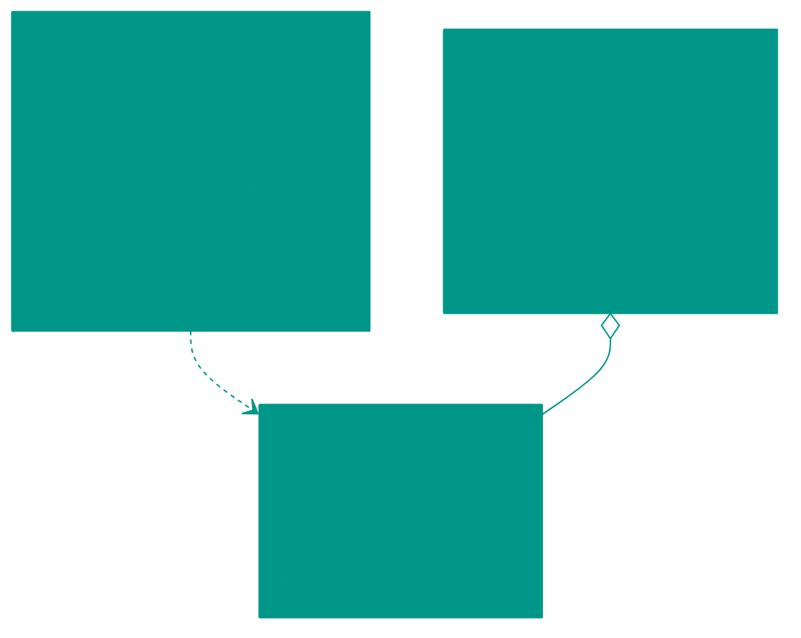
```mermaid
%%{init: { 'theme': 'base', 'themeVariables': { 'lineColor': '#009688', 'primaryColor': '#009688', 'primaryTextColor': '#009688', 'attributeBkg': '#009688', 'attributeTextColor': '#009688', 'signalColor': '#009688', 'actorLineColor': '#009688', 'nodeBorder': '#009688', 'clusterBorder': '#009688', 'textColor': '#009688', 'fontSize': '16px' } } }%%
classDiagram
    class Originator {
        -state: string
        +setState(state) void
        +getState() string
        +save() Memento
        +restore(memento) void
    }
    class Memento {
        -state: string
        +getState() string
    }
    class Caretaker {
        -mementos: Memento[]
        +backup() void
        +undo() void
        +showHistory() void
    }

    Originator ..> Memento
    Caretaker o-- Memento
```

**Complexity**:

| Metric | Complexity |
|:---|:---:|
| Time (when saving/restoring) | O(1) |
| Space | O(n), where n is the number of saved states |

---

## 💻 Implementation

```go
package memento

import (
    "fmt"
    "time"
)

// Memento memento object
type Memento struct {
    state     string
    timestamp time.Time
}

func NewMemento(state string) *Memento {
    return &Memento{
        state:     state,
        timestamp: time.Now(),
    }
}

func (m *Memento) GetState() string {
    return m.state
}

func (m *Memento) GetTimestamp() time.Time {
    return m.timestamp
}

// Originator object whose state needs to be saved
type Originator struct {
    state string
}

func NewOriginator(state string) *Originator {
    return &Originator{state: state}
}

func (o *Originator) SetState(state string) {
    fmt.Printf("Originator: Setting state to %s\n", state)
    o.state = state
}

func (o *Originator) GetState() string {
    return o.state
}

func (o *Originator) Save() *Memento {
    fmt.Printf("Originator: Saving to Memento: %s\n", o.state)
    return NewMemento(o.state)
}

func (o *Originator) Restore(memento *Memento) {
    o.state = memento.GetState()
    fmt.Printf("Originator: Restored state to: %s\n", o.state)
}

// Caretaker caretaker that manages snapshots
type Caretaker struct {
    mementos []*Memento
    originator *Originator
}

func NewCaretaker(originator *Originator) *Caretaker {
    return &Caretaker{
        mementos: make([]*Memento, 0),
        originator: originator,
    }
}

func (c *Caretaker) Backup() {
    fmt.Println("\nCaretaker: Saving Originator's state...")
    c.mementos = append(c.mementos, c.originator.Save())
}

func (c *Caretaker) Undo() {
    if len(c.mementos) == 0 {
        return
    }
    
    memento := c.mementos[len(c.mementos)-1]
    c.mementos = c.mementos[:len(c.mementos)-1]
    
    fmt.Println("Caretaker: Restoring state to:", memento.GetState())
    c.originator.Restore(memento)
}

func (c *Caretaker) ShowHistory() {
    fmt.Println("Caretaker: Here's the list of mementos:")
    for _, memento := range c.mementos {
        fmt.Printf("State: %s | Time: %s\n", memento.GetState(), memento.GetTimestamp().Format("15:04:05"))
    }
}
```

```javascript
/**
 * Memento object
 */
class Memento {
    constructor(state) {
        this.state = state;
        this.timestamp = new Date();
    }
    
    getState() {
        return this.state;
    }
    
    getTimestamp() {
        return this.timestamp;
    }
}

/**
 * Object whose state needs to be saved
 */
class Originator {
    constructor(state) {
        this.state = state;
    }
    
    setState(state) {
        console.log(`Originator: Setting state to ${state}`);
        this.state = state;
    }
    
    getState() {
        return this.state;
    }
    
    save() {
        console.log(`Originator: Saving to Memento: ${this.state}`);
        return new Memento(this.state);
    }
    
    restore(memento) {
        this.state = memento.getState();
        console.log(`Originator: Restored state to: ${this.state}`);
    }
}

/**
 * Caretaker that manages snapshots
 */
class Caretaker {
    constructor(originator) {
        this.mementos = [];
        this.originator = originator;
    }
    
    backup() {
        console.log("\nCaretaker: Saving Originator's state...");
        this.mementos.push(this.originator.save());
    }
    
    undo() {
        if (this.mementos.length === 0) {
            return;
        }
        
        const memento = this.mementos.pop();
        console.log(`Caretaker: Restoring state to: ${memento.getState()}`);
        this.originator.restore(memento);
    }
    
    showHistory() {
        console.log("Caretaker: Here's the list of mementos:");
        for (const memento of this.mementos) {
            console.log(`State: ${memento.getState()} | Time: ${memento.getTimestamp().toLocaleTimeString()}`);
        }
    }
}

// Example usage
const originator = new Originator("Initial state");
const caretaker = new Caretaker(originator);

caretaker.backup();
originator.setState("First state");

caretaker.backup();
originator.setState("Second state");

caretaker.backup();
originator.setState("Third state");

caretaker.showHistory();

console.log("\nRolling back to previous state...");
caretaker.undo();

console.log("\nRolling back to previous state...");
caretaker.undo();

console.log("\nRolling back to previous state...");
caretaker.undo();
```

---

### 👁️ Observer

**Description**:
The Observer pattern defines a one-to-many dependency between objects so that when one object changes state, all dependents are notified and updated automatically. This allows objects to remain loosely coupled.

- **Problem**: Need to notify multiple objects about changes in another object without tight coupling between them.
- **Solution**: Create a subscription mechanism where objects can subscribe to events from another object.
- **Analogy**: YouTube subscription - when a channel publishes a new video, all subscribers receive a notification.

#### Advantages and Disadvantages

✅ **Pros**:
1. **Loose coupling**: Subscribers don't depend on publisher and vice versa
2. **Dynamic subscription**: Can subscribe and unsubscribe at runtime
3. **Broadcast implementation**: One object can notify many others

❌ **Cons**:
1. **Tracking difficulty**: Difficult to track cause-and-effect relationships
2. **Inefficiency**: Notifying all subscribers can be inefficient
3. **Potential memory leaks**: If not unsubscribed, memory leaks can occur

**When to use**: When changing one object requires changing others, and it's important that objects remain loosely coupled.

---

**Visualization**:

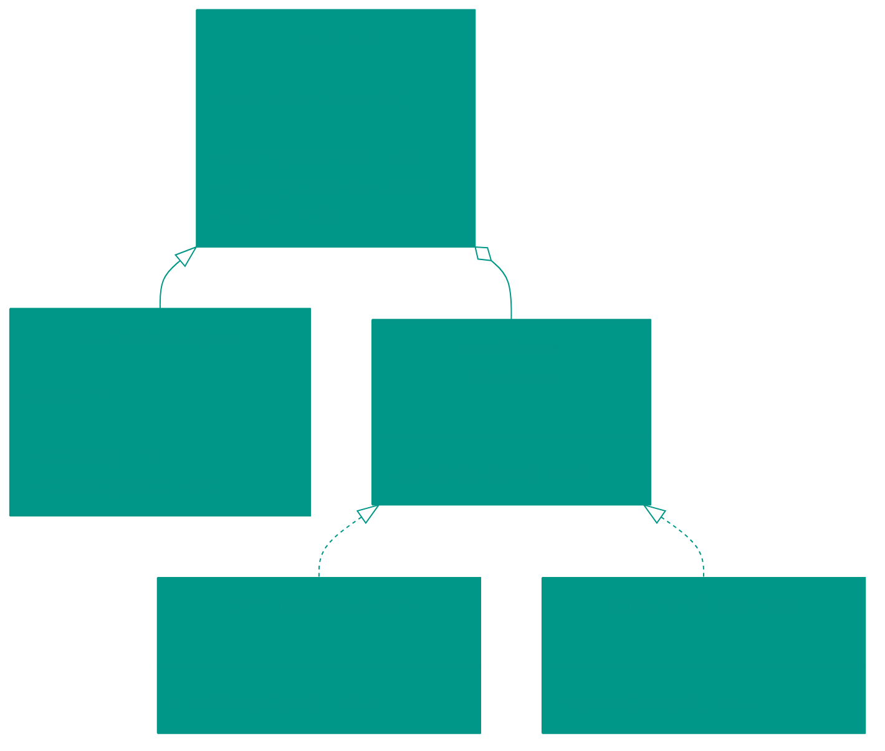
```mermaid
%%{init: { 'theme': 'base', 'themeVariables': { 'lineColor': '#009688', 'primaryColor': '#009688', 'primaryTextColor': '#009688', 'attributeBkg': '#009688', 'attributeTextColor': '#009688', 'signalColor': '#009688', 'actorLineColor': '#009688', 'nodeBorder': '#009688', 'clusterBorder': '#009688', 'textColor': '#009688', 'fontSize': '16px' } } }%%
classDiagram
    class Subject {
        -observers: Observer[]
        +attach(observer) void
        +detach(observer) void
        +notify() void
    }
    class ConcreteSubject {
        -state: int
        +getState() int
        +setState(state) void
    }
    class Observer {
        <<interface>>
        +update(subject) void
    }
    class ConcreteObserverA {
        +update(subject) void
    }
    class ConcreteObserverB {
        +update(subject) void
    }

    Subject <|-- ConcreteSubject
    Observer <|.. ConcreteObserverA
    Observer <|.. ConcreteObserverB
    Subject o-- Observer
```

**Complexity**:

| Metric | Complexity |
|:---|:---:|
| Time (when notifying) | O(n), where n is the number of observers |
| Space | O(n), where n is the number of observers |

---

## 💻 Implementation

```go
package observer

import "fmt"

// Observer interface for observer
type Observer interface {
    Update(subject Subject)
}

// Subject interface for subject
type Subject interface {
    Attach(observer Observer)
    Detach(observer Observer)
    Notify()
}

// NewsAgency news publisher
type NewsAgency struct {
    observers []Observer
    news      string
}

func NewNewsAgency() *NewsAgency {
    return &NewsAgency{
        observers: make([]Observer, 0),
    }
}

func (na *NewsAgency) Attach(observer Observer) {
    na.observers = append(na.observers, observer)
}

func (na *NewsAgency) Detach(observer Observer) {
    for i, obs := range na.observers {
        if obs == observer {
            na.observers = append(na.observers[:i], na.observers[i+1:]...)
            break
        }
    }
}

func (na *NewsAgency) Notify() {
    for _, observer := range na.observers {
        observer.Update(na)
    }
}

func (na *NewsAgency) SetNews(news string) {
    na.news = news
    fmt.Printf("NewsAgency: Breaking news: %s\n", news)
    na.Notify()
}

func (na *NewsAgency) GetNews() string {
    return na.news
}

// NewsChannel news channel (observer)
type NewsChannel struct {
    name string
}

func NewNewsChannel(name string) *NewsChannel {
    return &NewsChannel{name: name}
}

func (nc *NewsChannel) Update(subject Subject) {
    if agency, ok := subject.(*NewsAgency); ok {
        fmt.Printf("NewsChannel %s: Received news - %s\n", nc.name, agency.GetNews())
    }
}

// SocialMedia social media (observer)
type SocialMedia struct {
    name string
}

func NewSocialMedia(name string) *SocialMedia {
    return &SocialMedia{name: name}
}

func (sm *SocialMedia) Update(subject Subject) {
    if agency, ok := subject.(*NewsAgency); ok {
        fmt.Printf("SocialMedia %s: Sharing news - %s\n", sm.name, agency.GetNews())
    }
}
```

```javascript
/**
 * Observer interface
 */
class Observer {
    update(subject) {
        throw new Error("Method update() must be implemented");
    }
}

/**
 * Subject interface
 */
class Subject {
    constructor() {
        this.observers = [];
    }
    
    attach(observer) {
        this.observers.push(observer);
    }
    
    detach(observer) {
        const index = this.observers.indexOf(observer);
        if (index !== -1) {
            this.observers.splice(index, 1);
        }
    }
    
    notify() {
        for (const observer of this.observers) {
            observer.update(this);
        }
    }
}

/**
 * News publisher
 */
class NewsAgency extends Subject {
    constructor() {
        super();
        this.news = "";
    }
    
    setNews(news) {
        this.news = news;
        console.log(`NewsAgency: Breaking news: ${news}`);
        this.notify();
    }
    
    getNews() {
        return this.news;
    }
}

/**
 * News channel (observer)
 */
class NewsChannel extends Observer {
    constructor(name) {
        super();
        this.name = name;
    }
    
    update(subject) {
        if (subject instanceof NewsAgency) {
            console.log(`NewsChannel ${this.name}: Received news - ${subject.getNews()}`);
        }
    }
}

/**
 * Social media (observer)
 */
class SocialMedia extends Observer {
    constructor(name) {
        super();
        this.name = name;
    }
    
    update(subject) {
        if (subject instanceof NewsAgency) {
            console.log(`SocialMedia ${this.name}: Sharing news - ${subject.getNews()}`);
        }
    }
}

// Example usage
const newsAgency = new NewsAgency();

const cnn = new NewsChannel("CNN");
const bbc = new NewsChannel("BBC");
const twitter = new SocialMedia("Twitter");

newsAgency.attach(cnn);
newsAgency.attach(bbc);
newsAgency.attach(twitter);

newsAgency.setNews("Global warming reached critical level!");

newsAgency.detach(bbc);
newsAgency.setNews("New technology breakthrough announced!");
```

---

### 🧭 State

**Description**:
The State pattern allows an object to alter its behavior when its internal state changes. The object will appear to change its class. It allows an object to change its behavior at runtime when its internal state changes.

- **Problem**: Large number of conditional statements depending on the object's current state, making the code complex and difficult to maintain.
- **Solution**: Create a class for each state and allow the object to delegate execution of methods to the current state.
- **Analogy**: A vending machine - its behavior depends on its current state: waiting for coins, selecting item, dispensing item, etc.

#### Advantages and Disadvantages

✅ **Pros**:
1. **Isolated behavior**: Each state encapsulates its behavior
2. **Code simplification**: Removes large conditional constructs
3. **Easy state addition**: Simple addition of new states

❌ **Cons**:
1. **Increase in number of classes**: Each state requires a separate class
2. **Transition complexity**: Managing transitions between states can be complex

**When to use**: When an object's behavior should dramatically change depending on its state, or when there are many conditional statements in code depending on state.

---

**Visualization**:

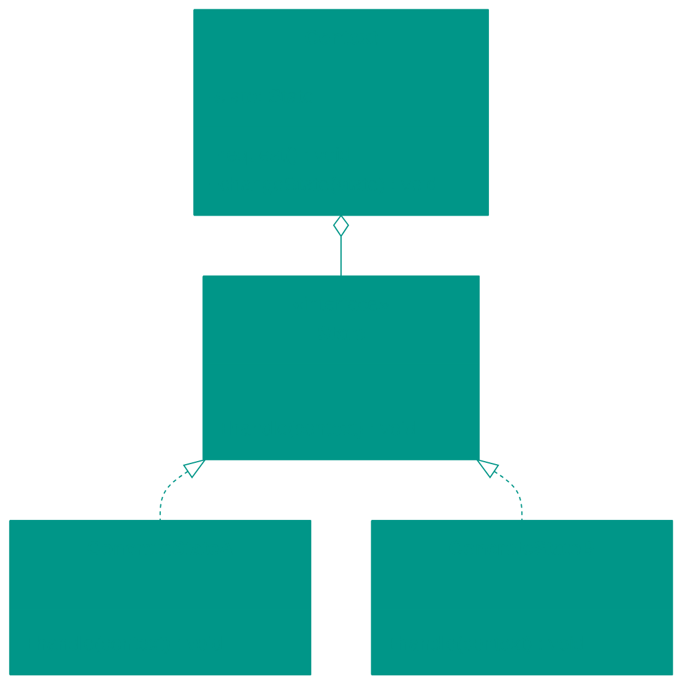
```mermaid
%%{init: { 'theme': 'base', 'themeVariables': { 'lineColor': '#009688', 'primaryColor': '#009688', 'primaryTextColor': '#009688', 'attributeBkg': '#009688', 'attributeTextColor': '#009688', 'signalColor': '#009688', 'actorLineColor': '#009688', 'nodeBorder': '#009688', 'clusterBorder': '#009688', 'textColor': '#009688', 'fontSize': '16px' } } }%%
classDiagram
    class State {
        <<interface>>
        +handle(context) void
    }
    class ConcreteStateA {
        +handle(context) void
    }
    class ConcreteStateB {
        +handle(context) void
    }
    class Context {
        -state: State
        +request() void
        +changeState(state) void
    }

    State <|.. ConcreteStateA
    State <|.. ConcreteStateB
    Context o-- State
```

**Complexity**:

| Metric | Complexity |
|:---|:---:|
| Time (when changing state) | O(1) |
| Space | O(n), where n is the number of states |

---

## 💻 Implementation

```go
package state

import "fmt"

// State interface for state
type State interface {
    Handle(context *Context)
    GetName() string
}

// Context context that contains current state
type Context struct {
    state State
    data  string
}

func NewContext() *Context {
    return &Context{}
}

func (c *Context) Request() {
    if c.state != nil {
        c.state.Handle(c)
    } else {
        fmt.Println("Context: No state set.")
    }
}

func (c *Context) ChangeState(state State) {
    c.state = state
    fmt.Printf("Context: Transition to %s.\n", state.GetName())
}

func (c *Context) GetData() string {
    return c.data
}

func (c *Context) SetData(data string) {
    c.data = data
}

// ConcreteStateA concrete state A
type ConcreteStateA struct{}

func (s *ConcreteStateA) Handle(context *Context) {
    fmt.Println("ConcreteStateA: Handling request.")
    fmt.Printf("Current data: %s\n", context.GetData())
    // Transition to next state
    context.ChangeState(&ConcreteStateB{})
}

func (s *ConcreteStateA) GetName() string {
    return "ConcreteStateA"
}

// ConcreteStateB concrete state B
type ConcreteStateB struct{}

func (s *ConcreteStateB) Handle(context *Context) {
    fmt.Println("ConcreteStateB: Handling request.")
    fmt.Printf("Current data: %s\n", context.GetData())
    // Transition to next state
    context.ChangeState(&ConcreteStateA{})
}

func (s *ConcreteStateB) GetName() string {
    return "ConcreteStateB"
}

// DocumentState document state
type DocumentState interface {
    Read(context *DocumentContext)
    Write(context *DocumentContext, content string)
    Delete(context *DocumentContext)
    GetName() string
}

// DocumentContext document context
type DocumentContext struct {
    state   DocumentState
    content string
    owner   string
}

func NewDocumentContext(owner string) *DocumentContext {
    return &DocumentContext{
        state: &DraftState{},
        owner: owner,
    }
}

func (dc *DocumentContext) SetState(state DocumentState) {
    dc.state = state
    fmt.Printf("DocumentContext: State changed to %s\n", state.GetName())
}

func (dc *DocumentContext) Read() {
    dc.state.Read(dc)
}

func (dc *DocumentContext) Write(content string) {
    dc.state.Write(dc, content)
}

func (dc *DocumentContext) Delete() {
    dc.state.Delete(dc)
}

func (dc *DocumentContext) GetContent() string {
    return dc.content
}

func (dc *DocumentContext) SetContent(content string) {
    dc.content = content
}

// DraftState draft state
type DraftState struct{}

func (ds *DraftState) Read(context *DocumentContext) {
    fmt.Printf("Reading document owned by %s: %s\n", context.owner, context.content)
}

func (ds *DraftState) Write(context *DocumentContext, content string) {
    context.content = content
    fmt.Printf("Writing to document owned by %s: %s\n", context.owner, content)
    // After writing, document transitions to moderation state
    context.SetState(&ModerationState{})
}

func (ds *DraftState) Delete(context *DocumentContext) {
    context.content = ""
    fmt.Printf("Document owned by %s deleted\n", context.owner)
}

func (ds *DraftState) GetName() string {
    return "DraftState"
}

// ModerationState moderation state
type ModerationState struct{}

func (ms *ModerationState) Read(context *DocumentContext) {
    fmt.Printf("Reading document in moderation owned by %s: %s\n", context.owner, context.content)
}

func (ms *ModerationState) Write(context *DocumentContext, content string) {
    context.content = content
    fmt.Printf("Updating document in moderation owned by %s: %s\n", context.owner, content)
}

func (ms *ModerationState) Delete(context *DocumentContext) {
    context.SetState(&DraftState{}) // revert to draft
    context.content = ""
    fmt.Printf("Document in moderation owned by %s reverted to draft\n", context.owner)
}

func (ms *ModerationState) GetName() string {
    return "ModerationState"
}
```

```javascript
/**
 * State interface
 */
class State {
    handle(context) {
        throw new Error("Method handle() must be implemented");
    }
    
    getName() {
        throw new Error("Method getName() must be implemented");
    }
}

/**
 * Context that contains current state
 */
class Context {
    constructor() {
        this.state = null;
        this.data = "";
    }
    
    request() {
        if (this.state) {
            this.state.handle(this);
        } else {
            console.log("Context: No state set.");
        }
    }
    
    changeState(state) {
        this.state = state;
        console.log(`Context: Transition to ${state.getName()}.`);
    }
    
    getData() {
        return this.data;
    }
    
    setData(data) {
        this.data = data;
    }
}

/**
 * Concrete states
 */
class ConcreteStateA extends State {
    handle(context) {
        console.log("ConcreteStateA: Handling request.");
        console.log(`Current data: ${context.getData()}`);
        // Transition to next state
        context.changeState(new ConcreteStateB());
    }
    
    getName() {
        return "ConcreteStateA";
    }
}

class ConcreteStateB extends State {
    handle(context) {
        console.log("ConcreteStateB: Handling request.");
        console.log(`Current data: ${context.getData()}`);
        // Transition to next state
        context.changeState(new ConcreteStateA());
    }
    
    getName() {
        return "ConcreteStateB";
    }
}

/**
 * Document states
 */
class DocumentState {
    read(context) {
        throw new Error("Method read() must be implemented");
    }
    
    write(context, content) {
        throw new Error("Method write() must be implemented");
    }
    
    delete(context) {
        throw new Error("Method delete() must be implemented");
    }
    
    getName() {
        throw new Error("Method getName() must be implemented");
    }
}

/**
 * Document context
 */
class DocumentContext {
    constructor(owner) {
        this.state = new DraftState();
        this.content = "";
        this.owner = owner;
    }
    
    setState(state) {
        this.state = state;
        console.log(`DocumentContext: State changed to ${state.getName()}`);
    }
    
    read() {
        this.state.read(this);
    }
    
    write(content) {
        this.state.write(this, content);
    }
    
    delete() {
        this.state.delete(this);
    }
    
    getContent() {
        return this.content;
    }
    
    setContent(content) {
        this.content = content;
    }
}

/**
 * Draft state
 */
class DraftState extends DocumentState {
    read(context) {
        console.log(`Reading document owned by ${context.owner}: ${context.content}`);
    }
    
    write(context, content) {
        context.content = content;
        console.log(`Writing to document owned by ${context.owner}: ${content}`);
        // After writing, document transitions to moderation state
        context.setState(new ModerationState());
    }
    
    delete(context) {
        context.content = "";
        console.log(`Document owned by ${context.owner} deleted`);
    }
    
    getName() {
        return "DraftState";
    }
}

/**
 * Moderation state
 */
class ModerationState extends DocumentState {
    read(context) {
        console.log(`Reading document in moderation owned by ${context.owner}: ${context.content}`);
    }
    
    write(context, content) {
        context.content = content;
        console.log(`Updating document in moderation owned by ${context.owner}: ${content}`);
    }
    
    delete(context) {
        context.setState(new DraftState()); // revert to draft
        context.content = "";
        console.log(`Document in moderation owned by ${context.owner} reverted to draft`);
    }
    
    getName() {
        return "ModerationState";
    }
}

// Example usage
const context = new Context();
context.changeState(new ConcreteStateA());
context.request();
context.request();

console.log("\nDocument example:");
const doc = new DocumentContext("John Doe");
doc.write("This is a draft document");
doc.read();
doc.write("Updated content after moderation");
doc.read();
```

---

### 🎯 Strategy

**Description**:
The Strategy pattern defines a family of algorithms, encapsulates each one, and makes them interchangeable. It allows algorithms to be changed independently of clients that use them.

- **Problem**: Need to use different algorithms depending on the situation, while avoiding hardcoding algorithm selection.
- **Solution**: Create a hierarchy of strategies, each implementing a specific algorithm, and allow the context to use any of them.
- **Analogy**: Route selection in a navigator - you can choose the fastest, shortest, or safest route.

#### Advantages and Disadvantages

✅ **Pros**:
1. **Isolated algorithms**: Each algorithm is encapsulated in a separate class
2. **Flexibility**: Can easily switch between algorithms at runtime
3. **Open/closed principle compliance**: Open for extension, closed for modification

❌ **Cons**:
1. **Increase in number of classes**: Each strategy requires a separate class
2. **Strategy selection**: Client must know which strategy to choose

**When to use**: When you need to use different algorithm variants within an object, or when you want to avoid conditional statements that select the appropriate algorithm.

---

**Visualization**:

```mermaid
%%{init: { 'theme': 'base', 'themeVariables': { 'lineColor': '#009688', 'primaryColor': '#009688', 'primaryTextColor': '#009688', 'attributeBkg': '#009688', 'attributeTextColor': '#009688', 'signalColor': '#009688', 'actorLineColor': '#009688', 'nodeBorder': '#009688', 'clusterBorder': '#009688', 'textColor': '#009688', 'fontSize': '16px' } } }%%
classDiagram
    class Strategy {
        <<interface>>
        +execute(data) string
    }
    class ConcreteStrategyA {
        +execute(data) string
    }
    class ConcreteStrategyB {
        +execute(data) string
    }
    class Context {
        -strategy: Strategy
        +setStrategy(strategy) void
        +executeStrategy(data) string
    }

    Strategy <|.. ConcreteStrategyA
    Strategy <|.. ConcreteStrategyB
    Context o-- Strategy
```

**Complexity**:

| Metric | Complexity |
|:---|:---:|
| Time (when executing strategy) | Depends on specific strategy |
| Space | O(1) for context |

---

## 💻 Implementation

```go
package strategy

import (
    "fmt"
    "sort"
    "strings"
)

// Strategy interface for strategy
type Strategy interface {
    Execute(data []string) []string
}

// ConcreteStrategySort sorting strategy
type ConcreteStrategySort struct{}

func (s *ConcreteStrategySort) Execute(data []string) []string {
    sorted := make([]string, len(data))
    copy(sorted, data)
    sort.Strings(sorted)
    return sorted
}

// ConcreteStrategyReverse reverse strategy
type ConcreteStrategyReverse struct{}

func (s *ConcreteStrategyReverse) Execute(data []string) []string {
    reversed := make([]string, len(data))
    for i, j := 0, len(data)-1; i < len(data); i, j = i+1, j-1 {
        reversed[i] = data[j]
    }
    return reversed
}

// ConcreteStrategyLowerCase lowercase strategy
type ConcreteStrategyLowerCase struct{}

func (s *ConcreteStrategyLowerCase) Execute(data []string) []string {
    lowercased := make([]string, len(data))
    for i, v := range data {
        lowercased[i] = strings.ToLower(v)
    }
    return lowercased
}

// Context context that uses strategy
type Context struct {
    strategy Strategy
}

func NewContext(strategy Strategy) *Context {
    return &Context{strategy: strategy}
}

func (c *Context) SetStrategy(strategy Strategy) {
    c.strategy = strategy
}

func (c *Context) ExecuteStrategy(data []string) []string {
    if c.strategy != nil {
        return c.strategy.Execute(data)
    }
    return data
}

// PaymentStrategy payment strategy
type PaymentStrategy interface {
    Pay(amount float64) string
}

// CreditCardPayment credit card strategy
type CreditCardPayment struct {
    name    string
    cardNumber string
    cvv     string
}

func (cc *CreditCardPayment) Pay(amount float64) string {
    return fmt.Sprintf("Paid %.2f using Credit Card ending in %s", amount, cc.cardNumber[len(cc.cardNumber)-4:])
}

// PayPalPayment PayPal strategy
type PayPalPayment struct {
    email string
}

func (pp *PayPalPayment) Pay(amount float64) string {
    return fmt.Sprintf("Paid %.2f using PayPal account %s", amount, pp.email)
}

// BitcoinPayment Bitcoin strategy
type BitcoinPayment struct {
    walletId string
}

func (btc *BitcoinPayment) Pay(amount float64) string {
    return fmt.Sprintf("Paid %.2f using Bitcoin wallet %s", amount, btc.walletId)
}

// PaymentProcessor payment processor
type PaymentProcessor struct {
    strategy PaymentStrategy
}

func NewPaymentProcessor(strategy PaymentStrategy) *PaymentProcessor {
    return &PaymentProcessor{strategy: strategy}
}

func (pp *PaymentProcessor) SetStrategy(strategy PaymentStrategy) {
    pp.strategy = strategy
}

func (pp *PaymentProcessor) ProcessPayment(amount float64) string {
    if pp.strategy != nil {
        return pp.strategy.Pay(amount)
    }
    return "No payment method selected"
}
```

```javascript
/**
 * Strategy interface
 */
class Strategy {
    execute(data) {
        throw new Error("Method execute() must be implemented");
    }
}

/**
 * Concrete strategies
 */
class ConcreteStrategySort extends Strategy {
    execute(data) {
        return [...data].sort();
    }
}

class ConcreteStrategyReverse extends Strategy {
    execute(data) {
        return [...data].reverse();
    }
}

class ConcreteStrategyLowerCase extends Strategy {
    execute(data) {
        return data.map(item => item.toLowerCase());
    }
}

/**
 * Context that uses strategy
 */
class Context {
    constructor(strategy) {
        this.strategy = strategy;
    }
    
    setStrategy(strategy) {
        this.strategy = strategy;
    }
    
    executeStrategy(data) {
        if (this.strategy) {
            return this.strategy.execute(data);
        }
        return data;
    }
}

/**
 * Payment strategies
 */
class PaymentStrategy {
    pay(amount) {
        throw new Error("Method pay() must be implemented");
    }
}

class CreditCardPayment extends PaymentStrategy {
    constructor(name, cardNumber, cvv) {
        super();
        this.name = name;
        this.cardNumber = cardNumber;
        this.cvv = cvv;
    }
    
    pay(amount) {
        const lastFourDigits = this.cardNumber.slice(-4);
        return `Paid ${amount.toFixed(2)} using Credit Card ending in ${lastFourDigits}`;
    }
}

class PayPalPayment extends PaymentStrategy {
    constructor(email) {
        super();
        this.email = email;
    }
    
    pay(amount) {
        return `Paid ${amount.toFixed(2)} using PayPal account ${this.email}`;
    }
}

class BitcoinPayment extends PaymentStrategy {
    constructor(walletId) {
        super();
        this.walletId = walletId;
    }
    
    pay(amount) {
        return `Paid ${amount.toFixed(2)} using Bitcoin wallet ${this.walletId}`;
    }
}

/**
 * Payment processor
 */
class PaymentProcessor {
    constructor(strategy) {
        this.strategy = strategy;
    }
    
    setStrategy(strategy) {
        this.strategy = strategy;
    }
    
    processPayment(amount) {
        if (this.strategy) {
            return this.strategy.pay(amount);
        }
        return "No payment method selected";
    }
}

// Example usage
const data = ["banana", "apple", "cherry", "date"];

const context = new Context(new ConcreteStrategySort());
console.log("Sorted:", context.executeStrategy(data));

context.setStrategy(new ConcreteStrategyReverse());
console.log("Reversed:", context.executeStrategy(data));

context.setStrategy(new ConcreteStrategyLowerCase());
console.log("Lowercase:", context.executeStrategy(["HELLO", "WORLD"]));

// Payment example
const creditCard = new CreditCardPayment("John Doe", "1234567890123456", "123");
const processor = new PaymentProcessor(creditCard);
console.log(processor.processPayment(100.50));

processor.setStrategy(new PayPalPayment("john@example.com"));
console.log(processor.processPayment(75.25));
```

---

### 📋 Template Method

**Description**:
The Template Method pattern defines the skeleton of an algorithm in a method while preserving the ability to redefine certain steps of the algorithm in subclasses without changing the algorithm's structure. It allows subclasses to override parts of an algorithm without changing its structure.

- **Problem**: Need to define common algorithm steps with the possibility of changing some steps in subclasses.
- **Solution**: Define main algorithm steps in a base class, leaving specific steps for overriding in subclasses.
- **Analogy**: Recipe for preparing a dish - main steps remain unchanged, but specific ingredients may differ.

#### Advantages and Disadvantages

✅ **Pros**:
1. **Code reuse**: Common code is placed in base class
2. **Structure control**: Algorithm structure remains unchanged
3. **Flexibility**: Subclasses can override only needed parts of algorithm

❌ **Cons**:
1. **Liskov substitution principle violation**: Subclasses may not be suitable for use everywhere the base class is used
2. **Complexity for new developers**: May be difficult to understand which methods need to be overridden

**When to use**: When you need to define common algorithm steps, leaving the possibility of changing some of them in subclasses, or when you want to avoid code duplication in multiple related classes.

---

**Visualization**:

```mermaid
%%{init: { 'theme': 'base', 'themeVariables': { 'lineColor': '#009688', 'primaryColor': '#009688', 'primaryTextColor': '#009688', 'attributeBkg': '#009688', 'attributeTextColor': '#009688', 'signalColor': '#009688', 'actorLineColor': '#009688', 'nodeBorder': '#009688', 'clusterBorder': '#009688', 'textColor': '#009688', 'fontSize': '16px' } } }%%
classDiagram
    class AbstractClass {
        +templateMethod() string
        +step1() string
        +step2() string
        +step3() string
        +concreteStep() string
    }
    class ConcreteClassA {
        +step2() string
        +step3() string
    }
    class ConcreteClassB {
        +step1() string
        +step3() string
    }

    AbstractClass <|-- ConcreteClassA
    AbstractClass <|-- ConcreteClassB
```

**Complexity**:

| Metric | Complexity |
|:---|:---:|
| Time (when executing method) | Depends on implementation |
| Space | O(1) |

---

## 💻 Implementation

```go
package template

import "fmt"

// AbstractClass abstract class with template method
type AbstractClass interface {
    Step1() string
    Step2() string
    Step3() string
    TemplateMethod() string
}

// BaseClass base implementation
type BaseClass struct{}

func (bc *BaseClass) ConcreteStep() string {
    return "BaseClass: Common operation\n"
}

func (bc *BaseClass) Hook1() bool {
    return true
}

func (bc *BaseClass) Hook2() string {
    return ""
}

// TemplateMethod template method
func (bc *BaseClass) TemplateMethod() string {
    result := "BaseClass: I am made up of multiple steps:\n"
    result += bc.ConcreteStep()
    result += bc.Step1()
    result += bc.Step2()
    
    if bc.Hook1() {
        result += bc.Step3()
    }
    
    hookResult := bc.Hook2()
    if hookResult != "" {
        result += fmt.Sprintf("BaseClass: Hook operation result: %s\n", hookResult)
    }
    
    return result
}

// ConcreteClassA concrete implementation A
type ConcreteClassA struct {
    BaseClass
}

func (cca *ConcreteClassA) Step1() string {
    return "ConcreteClassA: Implemented Step1\n"
}

func (cca *ConcreteClassA) Step2() string {
    return "ConcreteClassA: Implemented Step2\n"
}

func (cca *ConcreteClassA) Step3() string {
    return "ConcreteClassA: Implemented Step3\n"
}

// ConcreteClassB concrete implementation B
type ConcreteClassB struct {
    BaseClass
}

func (ccb *ConcreteClassB) Step1() string {
    return "ConcreteClassB: Overridden Step1\n"
}

func (ccb *ConcreteClassB) Step2() string {
    return "ConcreteClassB: Overridden Step2\n"
}

func (ccb *ConcreteClassB) Step3() string {
    return "ConcreteClassB: Overridden Step3\n"
}

func (ccb *ConcreteClassB) Hook1() bool {
    return false // override hook
}

func (ccb *ConcreteClassB) Hook2() string {
    return "Result from ConcreteClassB Hook2"
}

// BeverageTemplate template for preparing beverages
type BeverageTemplate struct{}

func (bt *BeverageTemplate) BoilWater() string {
    return "Boiling water\n"
}

func (bt *BeverageTemplate) PourInCup() string {
    return "Pouring into cup\n"
}

func (bt *BeverageTemplate) Brew() string {
    return "Brewing beverage\n"
}

func (bt *BeverageTemplate) AddCondiments() string {
    return "Adding condiments\n"
}

func (bt *BeverageTemplate) CustomerWantsCondiments() bool {
    return true // by default add condiments
}

// PrepareRecipe template method for preparing beverage
func (bt *BeverageTemplate) PrepareRecipe() string {
    result := bt.BoilWater()
    result += bt.Brew()
    result += bt.PourInCup()
    
    if bt.CustomerWantsCondiments() {
        result += bt.AddCondiments()
    }
    
    return result
}

// TeaTemplate concrete implementation for tea
type TeaTemplate struct {
    BeverageTemplate
}

func (tt *TeaTemplate) Brew() string {
    return "Steeping the tea\n"
}

func (tt *TeaTemplate) AddCondiments() string {
    return "Adding lemon\n"
}

// CoffeeTemplate concrete implementation for coffee
type CoffeeTemplate struct {
    BeverageTemplate
}

func (ct *CoffeeTemplate) Brew() string {
    return "Dripping coffee through filter\n"
}

func (ct *CoffeeTemplate) AddCondiments() string {
    return "Adding sugar and milk\n"
}

func (ct *CoffeeTemplate) CustomerWantsCondiments() bool {
    // Assume user can decline condiments
    return false
}
```

```javascript
/**
 * Abstract class with template method
 */
class AbstractClass {
    /**
     * Template method defining algorithm skeleton
     */
    templateMethod() {
        let result = "AbstractClass: I am made up of multiple steps:\n";
        result += this.concreteStep();
        result += this.step1();
        result += this.step2();
        
        if (this.hook1()) {
            result += this.step3();
        }
        
        const hookResult = this.hook2();
        if (hookResult) {
            result += `AbstractClass: Hook operation result: ${hookResult}\n`;
        }
        
        return result;
    }
    
    concreteStep() {
        return "AbstractClass: Common operation\n";
    }
    
    hook1() {
        return true;
    }
    
    hook2() {
        return "";
    }
    
    step1() {
        throw new Error("Method step1() must be implemented");
    }
    
    step2() {
        throw new Error("Method step2() must be implemented");
    }
    
    step3() {
        throw new Error("Method step3() must be implemented");
    }
}

/**
 * Concrete implementations
 */
class ConcreteClassA extends AbstractClass {
    step1() {
        return "ConcreteClassA: Implemented Step1\n";
    }
    
    step2() {
        return "ConcreteClassA: Implemented Step2\n";
    }
    
    step3() {
        return "ConcreteClassA: Implemented Step3\n";
    }
}

class ConcreteClassB extends AbstractClass {
    step1() {
        return "ConcreteClassB: Overridden Step1\n";
    }
    
    step2() {
        return "ConcreteClassB: Overridden Step2\n";
    }
    
    step3() {
        return "ConcreteClassB: Overridden Step3\n";
    }
    
    hook1() {
        return false; // override hook
    }
    
    hook2() {
        return "Result from ConcreteClassB Hook2";
    }
}

/**
 * Template for preparing beverages
 */
class BeverageTemplate {
    boilWater() {
        return "Boiling water\n";
    }
    
    pourInCup() {
        return "Pouring into cup\n";
    }
    
    brew() {
        return "Brewing beverage\n";
    }
    
    addCondiments() {
        return "Adding condiments\n";
    }
    
    customerWantsCondiments() {
        return true; // by default add condiments
    }
    
    /**
     * Template method for preparing beverage
     */
    prepareRecipe() {
        let result = this.boilWater();
        result += this.brew();
        result += this.pourInCup();
        
        if (this.customerWantsCondiments()) {
            result += this.addCondiments();
        }
        
        return result;
    }
}

/**
 * Concrete implementations for tea and coffee
 */
class TeaTemplate extends BeverageTemplate {
    brew() {
        return "Steeping the tea\n";
    }
    
    addCondiments() {
        return "Adding lemon\n";
    }
}

class CoffeeTemplate extends BeverageTemplate {
    brew() {
        return "Dripping coffee through filter\n";
    }
    
    addCondiments() {
        return "Adding sugar and milk\n";
    }
    
    customerWantsCondiments() {
        // Assume user can decline condiments
        return false;
    }
}

// Example usage
const templateA = new ConcreteClassA();
console.log(templateA.templateMethod());

const templateB = new ConcreteClassB();
console.log(templateB.templateMethod());

console.log("\nPreparing tea:");
const tea = new TeaTemplate();
console.log(tea.prepareRecipe());

console.log("\nPreparing coffee:");
const coffee = new CoffeeTemplate();
console.log(coffee.prepareRecipe());
```

---

### 🚶 Visitor

**Description**:
The Visitor pattern allows defining a new operation without changing the classes of objects on which it operates. It allows separating the algorithm from the structure of objects it works on.

- **Problem**: Need to perform operations on objects of various types without changing the classes of these objects.
- **Solution**: Create a visitor interface that defines methods for each object type, and allow objects to accept the visitor.
- **Analogy**: An auditor who visits various departments of a company and performs checks without changing department structure.

#### Advantages and Disadvantages

✅ **Pros**:
1. **Adding operations without changing classes**: Can add new operations without changing object classes
2. **Grouping related operations**: Related operations can be grouped in one class
3. **Simplifying operations on complex structures**: Simplifies performing operations on complex object structures

❌ **Cons**:
1. **Encapsulation violation**: Visitor can violate encapsulation by accessing internal data of object
2. **Complexity when adding classes**: When adding new classes, need to change visitor interface
3. **Code complication**: Can complicate code, especially for simple operations

**When to use**: When you need to perform an operation on all elements of a complex object structure, or when you need to add operations to classes that can't be changed.

---

**Visualization**:

```mermaid
%%{init: { 'theme': 'base', 'themeVariables': { 'lineColor': '#009688', 'primaryColor': '#009688', 'primaryTextColor': '#009688', 'attributeBkg': '#009688', 'attributeTextColor': '#009688', 'signalColor': '#009688', 'actorLineColor': '#009688', 'nodeBorder': '#009688', 'clusterBorder': '#009688', 'textColor': '#009688', 'fontSize': '16px' } } }%%
classDiagram
    class Visitor {
        <<interface>>
        +visitConcreteComponentA(element) void
        +visitConcreteComponentB(element) void
    }
    class ConcreteVisitor1 {
        +visitConcreteComponentA(element) void
        +visitConcreteComponentB(element) void
    }
    class ConcreteVisitor2 {
        +visitConcreteComponentA(element) void
        +visitConcreteComponentB(element) void
    }
    class Component {
        <<interface>>
        +accept(visitor) void
    }
    class ConcreteComponentA {
        +accept(visitor) void
        +exclusiveMethodOfConcreteComponentA() string
    }
    class ConcreteComponentB {
        +accept(visitor) void
        +specialMethodOfConcreteComponentB() string
    }
    class ObjectStructure {
        -components: Component[]
        +attach(component) void
        +detach(component) void
        +accept(visitor) void
    }

    Visitor <|.. ConcreteVisitor1
    Visitor <|.. ConcreteVisitor2
    Component <|.. ConcreteComponentA
    Component <|.. ConcreteComponentB
    ObjectStructure o-- Component
    Component ..> Visitor
```

**Complexity**:

| Metric | Complexity |
|:---|:---:|
| Time (when visiting) | O(n), where n is the number of elements |
| Space | O(1) for visitor |

---

## 💻 Implementation

```go
package visitor

import "fmt"

// Visitor interface for visitor
type Visitor interface {
    VisitConcreteComponentA(*ConcreteComponentA)
    VisitConcreteComponentB(*ConcreteComponentB)
}

// Component interface for component
type Component interface {
    Accept(Visitor)
}

// ConcreteComponentA concrete component A
type ConcreteComponentA struct{}

func (c *ConcreteComponentA) Accept(visitor Visitor) {
    visitor.VisitConcreteComponentA(c)
}

func (c *ConcreteComponentA) ExclusiveMethodOfConcreteComponentA() string {
    return "ConcreteComponentA: Here's the result of the operation A.\n"
}

// ConcreteComponentB concrete component B
type ConcreteComponentB struct{}

func (c *ConcreteComponentB) Accept(visitor Visitor) {
    visitor.VisitConcreteComponentB(c)
}

func (c *ConcreteComponentB) SpecialMethodOfConcreteComponentB() string {
    return "ConcreteComponentB: Here's the result of the operation B.\n"
}

// ConcreteVisitor1 concrete visitor 1
type ConcreteVisitor1 struct{}

func (v *ConcreteVisitor1) VisitConcreteComponentA(c *ConcreteComponentA) {
    fmt.Print(c.ExclusiveMethodOfConcreteComponentA())
}

func (v *ConcreteVisitor1) VisitConcreteComponentB(c *ConcreteComponentB) {
    fmt.Print(c.SpecialMethodOfConcreteComponentB())
}

// ConcreteVisitor2 concrete visitor 2
type ConcreteVisitor2 struct{}

func (v *ConcreteVisitor2) VisitConcreteComponentA(c *ConcreteComponentA) {
    fmt.Printf("ConcreteVisitor2: %s", c.ExclusiveMethodOfConcreteComponentA())
}

func (v *ConcreteVisitor2) VisitConcreteComponentB(c *ConcreteComponentB) {
    fmt.Printf("ConcreteVisitor2: %s", c.SpecialMethodOfConcreteComponentB())
}

// ObjectStructure structure of objects that can be visited
type ObjectStructure struct {
    elements []Component
}

func NewObjectStructure() *ObjectStructure {
    return &ObjectStructure{elements: make([]Component, 0)}
}

func (os *ObjectStructure) Attach(element Component) {
    os.elements = append(os.elements, element)
}

func (os *ObjectStructure) Detach(element Component) {
    for i, el := range os.elements {
        if el == element {
            os.elements = append(os.elements[:i], os.elements[i+1:]...)
            break
        }
    }
}

func (os *ObjectStructure) Accept(visitor Visitor) {
    for _, element := range os.elements {
        element.Accept(visitor)
    }
}

// DiscountVisitor visitor for calculating discounts
type DiscountVisitor struct {
    totalDiscount float64
}

func NewDiscountVisitor() *DiscountVisitor {
    return &DiscountVisitor{}
}

func (dv *DiscountVisitor) VisitConcreteComponentA(c *ConcreteComponentA) {
    // Assume component A has fixed 5% discount
    dv.totalDiscount += 0.05
    fmt.Printf("DiscountVisitor: Applied 5%% discount to ComponentA. Total discount: %.2f%%\n", dv.totalDiscount*100)
}

func (dv *DiscountVisitor) VisitConcreteComponentB(c *ConcreteComponentB) {
    // Assume component B has fixed 10% discount
    dv.totalDiscount += 0.10
    fmt.Printf("DiscountVisitor: Applied 10%% discount to ComponentB. Total discount: %.2f%%\n", dv.totalDiscount*100)
}

func (dv *DiscountVisitor) GetTotalDiscount() float64 {
    return dv.totalDiscount
}
```

```javascript
/**
 * Visitor interface
 */
class Visitor {
    visitConcreteComponentA(element) {
        throw new Error("Method visitConcreteComponentA() must be implemented");
    }
    
    visitConcreteComponentB(element) {
        throw new Error("Method visitConcreteComponentB() must be implemented");
    }
}

/**
 * Component interface
 */
class Component {
    accept(visitor) {
        throw new Error("Method accept() must be implemented");
    }
}

/**
 * Concrete components
 */
class ConcreteComponentA extends Component {
    accept(visitor) {
        visitor.visitConcreteComponentA(this);
    }
    
    exclusiveMethodOfConcreteComponentA() {
        return "ConcreteComponentA: Here's the result of the operation A.\n";
    }
}

class ConcreteComponentB extends Component {
    accept(visitor) {
        visitor.visitConcreteComponentB(this);
    }
    
    specialMethodOfConcreteComponentB() {
        return "ConcreteComponentB: Here's the result of the operation B.\n";
    }
}

/**
 * Concrete visitors
 */
class ConcreteVisitor1 extends Visitor {
    visitConcreteComponentA(c) {
        process.stdout.write(c.exclusiveMethodOfConcreteComponentA());
    }
    
    visitConcreteComponentB(c) {
        process.stdout.write(c.specialMethodOfConcreteComponentB());
    }
}

class ConcreteVisitor2 extends Visitor {
    visitConcreteComponentA(c) {
        process.stdout.write(`ConcreteVisitor2: ${c.exclusiveMethodOfConcreteComponentA()}`);
    }
    
    visitConcreteComponentB(c) {
        process.stdout.write(`ConcreteVisitor2: ${c.specialMethodOfConcreteComponentB()}`);
    }
}

/**
 * Structure of objects that can be visited
 */
class ObjectStructure {
    constructor() {
        this.elements = [];
    }
    
    attach(element) {
        this.elements.push(element);
    }
    
    detach(element) {
        const index = this.elements.indexOf(element);
        if (index !== -1) {
            this.elements.splice(index, 1);
        }
    }
    
    accept(visitor) {
        for (const element of this.elements) {
            element.accept(visitor);
        }
    }
}

/**
 * Visitor for calculating discounts
 */
class DiscountVisitor extends Visitor {
    constructor() {
        super();
        this.totalDiscount = 0;
    }
    
    visitConcreteComponentA(c) {
        // Assume component A has fixed 5% discount
        this.totalDiscount += 0.05;
        console.log(`DiscountVisitor: Applied 5% discount to ComponentA. Total discount: ${(this.totalDiscount * 100).toFixed(2)}%`);
    }
    
    visitConcreteComponentB(c) {
        // Assume component B has fixed 10% discount
        this.totalDiscount += 0.10;
        console.log(`DiscountVisitor: Applied 10% discount to ComponentB. Total discount: ${(this.totalDiscount * 100).toFixed(2)}%`);
    }
    
    getTotalDiscount() {
        return this.totalDiscount;
    }
}

// Example usage
const objectStructure = new ObjectStructure();
objectStructure.attach(new ConcreteComponentA());
objectStructure.attach(new ConcreteComponentB());

console.log("Client: Executing visitor ConcreteVisitor1:");
objectStructure.accept(new ConcreteVisitor1());

console.log("\nClient: Executing visitor ConcreteVisitor2:");
objectStructure.accept(new ConcreteVisitor2());

console.log("\nClient: Executing visitor DiscountVisitor:");
const discountVisitor = new DiscountVisitor();
objectStructure.accept(discountVisitor);
console.log(`Total discount applied: ${(discountVisitor.getTotalDiscount() * 100).toFixed(2)}%`);
```

---

## Conclusion

GoF design patterns are fundamental concepts in object-oriented programming. They represent proven solutions to recurring design problems that developers encounter again and again.

### Key Points:

1. **Creational Patterns** (5): Simplify object creation by abstracting the instantiation process.
2. **Structural Patterns** (7): Ease design by defining how entities form relationships.
3. **Behavioral Patterns** (11): Define ways objects interact with each other, improving flexibility in performing these interactions.

### When to Use Patterns:

- **Don't apply patterns for the sake of applying them** - use them when you actually encounter the problem they solve
- **Patterns are not dogma** - adapt them to your needs
- **Patterns help in communication** - use pattern names for discussing architectural decisions
- **Patterns don't solve all problems** - they merely provide proven solutions for typical situations

Remember that patterns are tools in an experienced developer's hands. Their proper application can significantly improve code quality, readability, and maintainability, but excessive or inappropriate use can lead to the opposite effect.

<!-- QUIZ_START
[
    {
        "question": "Which pattern allows objects with incompatible interfaces to work together?",
        "options": [
            "Singleton",
            "Factory Method",
            "Adapter",
            "Observer"
        ],
        "correctIndex": 2
    },
    {
        "question": "Which pattern allows an object to change its behavior when its internal state changes?",
        "options": [
            "Strategy",
            "State",
            "Command",
            "Memento"
        ],
        "correctIndex": 1
    },
    {
        "question": "Which pattern defines the skeleton of an algorithm in a method with the possibility of overriding steps in subclasses?",
        "options": [
            "Template Method",
            "Strategy",
            "Visitor",
            "Iterator"
        ],
        "correctIndex": 0
    }
]
QUIZ_END -->