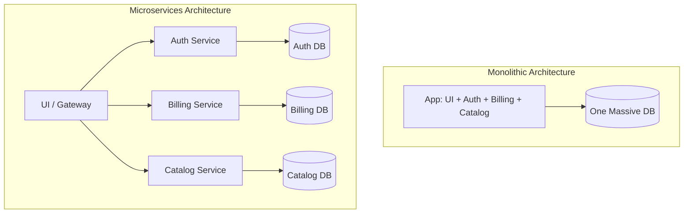

# 🐝 Microservices Architecture

## 📑 Table of Contents
1. [Monolith vs Microservices](#monolith-vs-microservices)
2. [Pros and Cons](#pros-and-cons)
3. [Main Challenges](#main-challenges)

---

## 1. 🆚 Monolith vs Microservices

### 🏰 Monolith
A single large application where everything—user management, billing, notifications—lives inside one project.
*   **All in one basket**: If the billing module fails, the entire website goes down.
*   **Difficult to update**: To change a single button’s color, you have to rebuild and redeploy the entire massive application.

### 🐝 Microservices
A collection of small, independent applications that communicate with each other over a network (using HTTP, gRPC, or Message Queues).
*   **Isolation**: If the "Billing" service goes down, users can still browse the product catalog.
*   **Independence**: The "Search" team can update their service 10 times a day without affecting the "Billing" team.

---

## 2. ⚖️ Pros and Cons

| Feature | 🏰 Monolith | 🐝 Microservices |
| :--- | :--- | :--- |
| **Ease of Starting** | ✅ Low (just write code) | ❌ High (requires infrastructure) |
| **Deployment** | ❌ Slow and risky | ✅ Fast and frequent |
| **Reliability** | ❌ A single error can crash everything | ✅ Partial failure (Graceful Degradation) |
| **Scaling** | ❌ Everything must be scaled together | ✅ Targeted (scale only high-load services) |
| **Technology** | ❌ Single language (Java, Go, etc.) | ✅ Multiple languages (Polyglot) |

---

## 3. 💣 Main Challenges

> [!CAUTION]
> **Distributed Monolith** is the worst of both worlds.
> This occurs when you break your code into services, but they are so tightly coupled that one failure still crashes the rest, yet you still suffer from network latency.

### 🌐 Network Unreliability
In a monolith, calling `getUser()` takes nanoseconds and is almost 100% successful.
In microservices, `http.Get("/user")` takes milliseconds, and the network can glitch or the server can be overloaded.

**You must consider:**
*   **Retries**: Automatically attempt the request again.
*   **Timeouts**: Don't wait forever for a response.
*   **Circuit Breaker**: Stop overwhelming a service if it's already down.

### 📉 Data Consistency
How do you handle a transaction when data is split across different databases (e.g., User in Postgres, Order in Mongo)?
*   You cannot perform a `ROLLBACK` across all databases simultaneously.
*   You need patterns like **Saga** or **Two-Phase Commit (2PC)**.

### 🕵️ Debugging Complexity (Tracing)
A request passes through 5 services and fails somewhere. Where?
*   You need **Distributed Tracing** (e.g., Jaeger, Zipkin) to see the entire path of a request.

---

## 💡 Summary
Microservices are a powerful tool for **large** teams and projects. For a 3-person startup, a monolith is almost always the better choice.