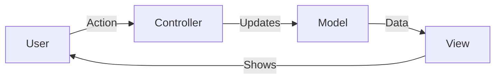
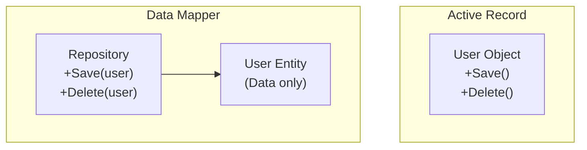

# 🎭 Other Architectural Patterns

## 📑 Table of Contents
1. [UI Patterns (MVC, MVP, MVVM)](#ui-patterns-mvc-mvp-mvvm)
2. [Database Patterns (Active Record, Data Mapper)](#database-patterns-active-record-data-mapper)
3. [Miscellaneous (Lazy Load, Delegation)](#miscellaneous)

---

## 1. 🖼️ UI Patterns (MVC, MVP, MVVM)

How do we separate the "visuals" (UI) from the logic?

### 🚦 MVC (Model - View - Controller)
A classic in web development (especially server-side frameworks like Spring MVC, Django, and Ruby on Rails).

*   **Model**: Data and business logic.
*   **View**: The presentation (e.g., an HTML page).
*   **Controller**: Handles user input and updates the Model.

### 🎤 MVP (Model - View - Presenter)
Often found in desktop applications or older Android apps.
*   **Presenter**: The intermediary. The View knows nothing about the Model. The Presenter retrieves data from the Model and "pushes" it into the View.

### 🧬 MVVM (Model - View - ViewModel)
The modern standard for frontend development (React, Vue, Angular) and mobile apps (WPF, Jetpack Compose).
*   **ViewModel**: A special model specifically for the View.
*   **Data Binding**: Magic! When a variable in the code changes, the button on the screen automatically updates.

| Pattern | Who is in charge? | View and Model Connection | Where is it popular? |
| :--- | :--- | :--- | :--- |
| **MVC** | Controller | Often direct | Web Backend (SSR) |
| **MVP** | Presenter | Indirect (via Presenter) | Android (older), Desktop |
| **MVVM** | ViewModel | Data Binding (Automatic) | React, Vue, Mobile |

---

## 2. 🗄️ Database Patterns

How do objects in code (OOP) work with tables in a database (RDBMS)?

### 🏃 Active Record
The object itself knows how to save its state.
*   **Example**: `user.save()`, `user.delete()`.
*   **Frameworks**: Ruby on Rails, Eloquent (Laravel).
*   **Pros**: Very fast for writing simple code.
*   **Cons**: Violates the Single Responsibility Principle (SRP); the object handles both data and database persistence.

### 🗺️ Data Mapper
The object and the database are completely separated. An intermediary (Mapper/Repository) manages the interaction between them.
*   **Example**: `repository.save(user)`.
*   **Frameworks**: Hibernate (Java), TypeORM (Node), GORM (Go - partially).
*   **Pros**: Clean code; the business logic doesn't depend on the database.
*   **Cons**: Requires more boilerplate code.

---

## 3. 🧩 Miscellaneous

### 💤 Lazy Load
"Don't load what isn't needed."
*   **Example**: You load a User, but you don't load their list of Orders (which might be huge) until you actually access `user.getOrders()`.

### 🤝 Delegation
"Let a professional do it."
The object doesn't perform the work itself but instead calls a method on another object. This is the foundation of the Composition pattern.

### 📚 Registry
A global object (or Singleton) that stores settings or services accessible to the entire application.
*   **Note**: Nowadays often considered an anti-pattern; it's generally better to use **Dependency Injection**.