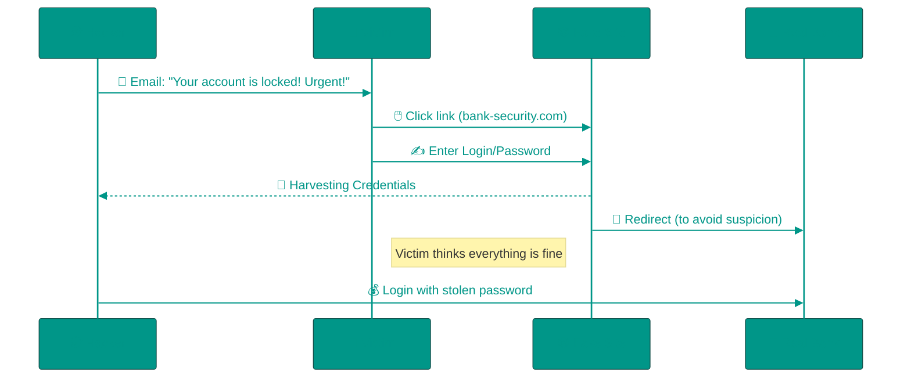

# 💀 Cyber Threats: The Anatomy of Digital Deception

In movies, hackers are geniuses breaking into the Pentagon in 5 seconds by typing furiously. In reality, 95% of breaches happen not because the system is weak, but because a **human** is trusting. Hackers hack people, not computers.

---

## 🏗️ Phishing Attack Workflow

---

## 1. 🎣 Phishing
This is the art of manipulating you into handing over your password voluntarily.

### The Psychology of Attack
Hackers use a formula: **Fear/Greed + Urgency = Critical Thinking Shutdown**.
*   *"A loan has been taken out in your name! Cancel immediately!"* (Fear)
*   *"You won an iPhone! Claim your prize now!"* (Greed)
When a person panics, they don't check the sender's address.

### 👓 Technical Details: Punycode and Homograph Attack
How do you spoof `google.com`?
Browsers understand only Latin characters (ASCII). If you register the domain `gоogle.com` (using a Cyrillic 'о'), the browser sees it as `xn--gogle-6xd.com` (Punycode).
However, in the address bar, it might display as `google.com`. This is called a **Homograph Attack**.
*Protection*: Carefully check the certificate (padlock icon)—it is issued to a specific organization.

---

## 2. 🎭 Social Engineering
Hacking without code.

### "Hi, is this you in the photo?"
You receive a message from a friend (who was hacked) with a file `photo_2024.apk` or a link. You think, "Wow, where was I photographed?", and open it.
*   **Reality**: It is not a photo, but a virus. Your friend is not to blame; their account is being used as a bot for spamming.

### CEO Fraud (Fake Boss)
An accountant receives an email from the "CEO" (from a similar address): *"I'm in a meeting, urgently pay this invoice, it's critical for a deal"*.
The accountant is afraid to question the boss and transfers $100,000 to the hacker's account.

---

## 3. 🦠 Malware

### 🤖 Trojans and Droppers (Android/APK)
You download "Cracked Spotify" or "Free Game."
The application works as expected. But inside sits a **Dropper**—a tiny piece of code that waits for night. At night, when the phone is charging, it downloads the main combat payload of the virus.
*   **Permissions**: The virus requests "Accessibility Services." If you grant them, it can click buttons on the screen itself, log into banking apps, and transfer money while you sleep.

### ⛏️ Miners (Cryptojacking)
Your computer starts lagging and fans spin loudly while you're just reading news.
The site (e.g., pirated movies) is running a JS script that uses your processor to mine Monero cryptocurrency. You pay for electricity, the hacker gets the coins.

### 🔒 Ransomware
A corporation's worst nightmare. The virus encrypts all documents on the disk with a crypto-strong algorithm (AES + RSA).
A timer appears on screen: *"Pay 5 Bitcoins within 24 hours, or the key will be deleted forever"*.
*   **Deep Dive**: The virus often generates a unique key for each victim and sends it to the hacker's C2 (Command & Control) server. Without this key, decryption is mathematically impossible (it would take millions of years to brute-force).

---

## 4. 🎯 Types of Phishing: From Mass to Targeted

### 🐟 Mass Phishing
Millions of identical emails. The calculation is that out of 1,000,000 recipients, at least 100 will bite.

### 🎯 Spear Phishing
Attack on a specific person. The hacker studies the victim on social media: learns the boss's name, projects, colleagues. The email looks like: *"Hi, Boris! Could you review the contract for project X? The director asked urgently"*.

### 🐋 Whaling
Spear Phishing, but the victim is a CEO, CFO, or other top executive. The goal is access to finances or confidential company strategy.

### 📞 Vishing (Voice Phishing)
A call from a "bank employee." Professional voice, call center noise in the background (recording). *"We blocked a suspicious transaction of $500. Please provide the SMS code to cancel"*. The SMS code is the confirmation code for transferring YOUR money to the hacker.

### 📱 Smishing (SMS Phishing)
SMS: *"Your package is waiting at the pickup point. Track: bit.ly/xyz123"*. The link leads to a fake postal service site that asks you to enter card details "to pay for storage."

### 📋 Clone Phishing
The hacker intercepts a real email (e.g., an Amazon invoice), changes the payment link to a fake one, and resends it from Amazon's name. The text is identical to the original.

---

## 5. 🚨 Real Cases (Case Studies)

### Target (2013): 40 Million Cards Stolen Through HVAC Contractor
Hackers compromised a small HVAC maintenance firm that had VPN access to Target's network. Through this access, they installed malware on POS terminals (cash registers) and recorded card data in real time. Damage: $292 million.

### SolarWinds (2020): Supply Chain Attack
Hackers embedded a backdoor in a SolarWinds Orion software update (used by 18,000 companies, including Microsoft and U.S. government agencies). The update was signed with the company's digital signature, so antivirus software didn't react. The APT group had access to infrastructure for months.

---

## 6. 🕵️ Advanced Persistent Threat (APT)
This is not a virus, it's a campaign. APT groups (often state-sponsored) sit in the victim's network for years, collecting data.

### APT Lifecycle
1. **Initial Compromise**: Phishing or Zero-Day exploit
2. **Establish Foothold**: Install backdoor and create backup entry points
3. **Escalate Privileges**: Steal administrator passwords (Mimikatz)
4. **Lateral Movement**: Move through the network, infecting other machines
5. **Data Exfiltration**: Slow data leak in small portions (to avoid suspicion from traffic monitoring)
6. **Maintain Presence**: Survive after updates and security audits

---

## 7. 💸 Modern Scam Schemes

### Crypto Scams
*   **Rug Pull**: Project creators collect investors' money, then remove all liquidity from the pool and disappear. Example: Squid Game Token (2021) — $3.38 million stolen in seconds.
*   **Fake Airdrop**: "Get free tokens! Connect your MetaMask wallet". You sign a transaction that allows the contract to drain ALL your tokens.

### Pig Butchering ()
Long-term scam. The scammer pretends to be a romantic partner (meeting on Tinder/LinkedIn). Builds trust for months. Then suggests "investing together" in a crypto platform. You see your balance growing (fake interface). When you try to withdraw money — the site disappears.

---

## 8. 💥 DDoS Attacks (Distributed Denial of Service)
The goal is to crash the service by overwhelming it with traffic.

### Types of DDoS
*   **Volumetric (Bandwidth)**: Flood the channel with a huge volume of junk traffic. Use DNS Amplification: send a request to a DNS server with a spoofed IP of the victim. The server responds to the victim with a packet 50 times larger.
*   **Protocol Attack (SYN Flood)**: Exploit TCP handshake. The attacker sends thousands of SYN packets but doesn't complete the connection. The server keeps all these "half-open" connections in memory until it runs out.
*   **Application Layer (HTTP Flood)**: Imitate legitimate users. Botnet makes thousands of requests to heavy pages (search, filters). The server spends CPU on processing, the database dies.

### Mirai Botnet (2016)
IoT devices (security cameras, routers) with password `admin/admin` were infected and formed a botnet of 600,000 devices. Attack on DNS provider Dyn crashed Twitter, Netflix, Reddit for several hours.

---

## 9. 🛡️ Practical Protection Tools

### Email Verification
*   **Email Headers**: Check the `Return-Path` and `Received` fields. Even if `From` says `support@paypal.com`, the real sender might be `scam@xyz.ru`.
*   **DKIM/SPF Check**: In Gmail, click "Show original" → look for `SPF: PASS` and `DKIM: PASS`. If `FAIL` — the email is forged.

### Website Verification
*   **VirusTotal** (virustotal.com): Paste the URL — the service will check it with 70+ antiviruses and show if the domain is known for phishing.
*   **WHOIS Lookup**: Find out when the domain was registered. If `paypal-security.com` was created 3 days ago — it's 100% phishing.
*   **PhishTank** (phishtank.org): Database of known phishing links.

### Files
*   **Sandbox**: Run a suspicious file in a virtual machine or on [any.run](https://any.run) — see what it does (which servers it contacts, whether it encrypts files).

### 0-day Protection
*   **Zero Trust Architecture**: Don't trust even internal traffic. Every request is verified.
*   **Patches**: Subscribe to security bulletins (Microsoft Security Response Center, CVE). Install critical updates on release day.

### 2FA Wisely
*   **SMS is the Weak Link**: SIM-swap attack (hacker re-registers your SIM to themselves at a carrier store with a fake passport).
*   **Better**: Hardware keys (YubiKey) or TOTP apps (Google Authenticator, Authy).

---

## 10. 🎓 The Golden Rule
**Never make decisions in a state of fear or euphoria.** If an email/call causes panic ("Your account is arrested!") or greed ("You won!") — stop. Hackers play on emotions. Verify information through the official channel (find the bank's number yourself, don't call back the number in the SMS).

<!-- QUIZ_START 

[
    {
        "question": "Which 'formula' do hackers most commonly use in phishing attacks?",
        "options": [
            "Logic + Patience = Success",
            "Fear/Greed + Urgency = Critical Thinking Shutdown",
            "Complex Code + Fast Internet = Breach",
            "Politeness + Official Style = Trust"
        ],
        "correctIndex": 1
    },
    {
        "question": "What is a Homograph Attack?",
        "options": [
            "Hacking via a webcam",
            "Using similar-looking characters from different alphabets (e.g., Cyrillic 'о') to spoof a website address",
            "Stealing a password from the clipboard",
            "An attack on a physical database"
        ],
        "correctIndex": 1
    },
    {
        "question": "What is the main danger of mobile 'Dropper' trojans?",
        "options": [
            "They immediately delete all photos",
            "They drain the battery in 5 minutes",
            "They act as a shell that downloads the main virus payload later",
            "They turn off the screen"
        ],
        "correctIndex": 2
    }
]

QUIZ_END -->

