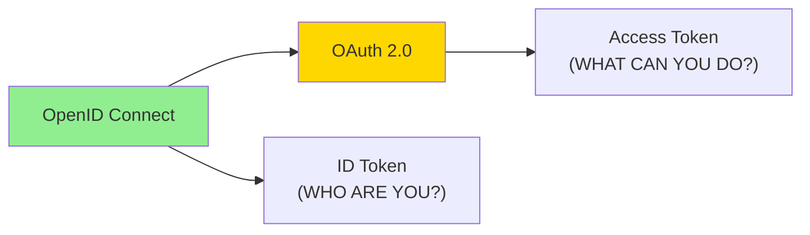
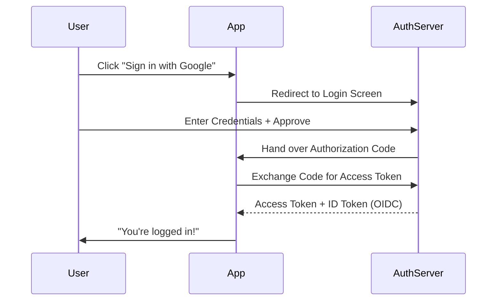
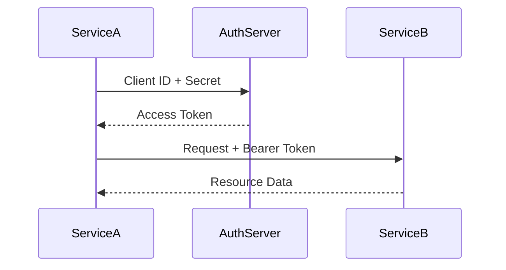
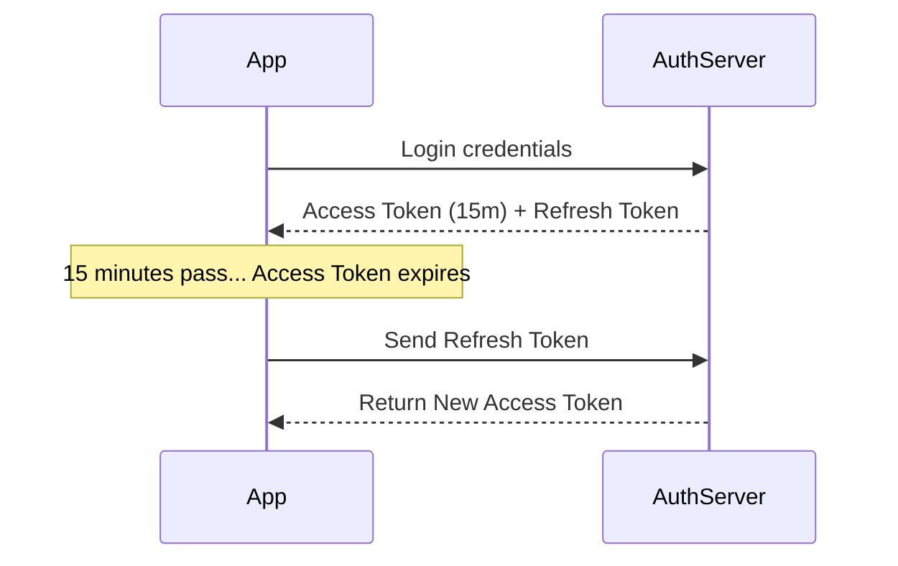

# 🔐 OAuth 2.0 and OpenID Connect: Modern Authorization

## 📑 Table of Contents
1. [Authentication vs. Authorization](#authentication-vs-authorization)
2. [What is OAuth 2.0?](#what-is-oauth-20)
3. [What is OpenID Connect (OIDC)?](#what-is-openid-connect)
4. [Roles and Flows](#roles-and-flows)
5. [Implementation in Go](#go-implementation)
6. [Refresh Tokens and Security](#refresh-tokens-and-security)

---

## 🧐 Authentication vs. Authorization

These two terms are frequently confused, but the distinction is critical:

- **Authentication (AuthN)**: Answers "Who are you?". It is the process of verifying an identity (via password, biometrics, or SMS code).
- **Authorization (AuthZ)**: Answers "What are you allowed to do?". It is the process of verifying permissions and access rights to resources.

> [!TIP]
> **Real-world analogy**: A passport is your **authentication** (it proves who you are). A visa inside that passport is your **authorization** (it gives you the right to enter a specific country).

---

## 🔑 What is OAuth 2.0?

**OAuth 2.0** is an **authorization** protocol. It allows one application (e.g., Spotify) to gain limited access to your data in another application (e.g., Facebook) without you ever having to share your password with the first app. 🤝

Instead of your password, the app uses an **Access Token**.

---

## 🆔 What is OpenID Connect (OIDC)?

**OpenID Connect** is an **authentication** layer built on top of OAuth 2.0. 
If OAuth gives you a "key to the door" (the Access Token), OIDC gives you an "employee badge" (**ID Token**) that explicitly states who the person holding the key is.

The **ID Token** is a JSON Web Token (JWT) containing user info: `sub` (unique ID), `email`, `name`, etc.

---

## 🔄 Roles and Core Flows

### Roles:
1. **Resource Owner**: The User (You).
2. **Client**: The application requesting access (e.g., LinkedIn).
3. **Authorization Server**: The server that issues tokens (e.g., Google, GitHub).
4. **Resource Server**: The server holding the protected data (e.g., Email API, Photos).

### 1. Authorization Code Flow (Most Common for Web Apps)

1. The client redirects the user to the Authorization Server.
2. The user authenticates and grants permission.
3. The server sends back a temporary **Authorization Code**.
4. The client exchanges this **Code** for an **Access Token** via a secure back-channel connection.

---

### 2. Client Credentials Flow (Machine-to-Machine)

Used when there is **no user involved** (one backend service talking to another).

---

### 3. PKCE (Proof Key for Code Exchange)

An extension for **Mobile and SPAs** (Single Page Applications) where a client secret cannot be stored securely. It uses a dynamic challenge/verifier mechanism to prevent authorization code interception attacks.

---

## 💻 Implementation in Go

Programming libraries like `golang.org/x/oauth2` handle the heavy lifting of constructing URLs and exchanging codes for tokens.

> [!NOTE]
> Always use a secure, random `state` string during the initial redirect to protect against CSRF (Cross-Site Request Forgery).

---

## 🔄 Refresh Tokens

**Access Tokens** are short-lived (e.g., 15 minutes) to minimize the window of damage if they are stolen. **Refresh Tokens** are long-lived (weeks/months) and are used to obtain a new Access Token once the old one expires, without forcing the user to log in again.

---

## 🛡️ Best Practices & Security

1. **Never build your own auth**: Use established providers (Keycloak, Auth0, Firebase Auth) or well-vetted libraries.
2. **PKCE**: Mandatory for mobile and public frontend applications.
3. **Short-lived tokens**: Keep Access Tokens brief; use Refresh Tokens for longevity.
4. **HttpOnly Cookies**: For web apps, store tokens in secure, HttpOnly cookies to prevent XSS-based theft. 🛡️
