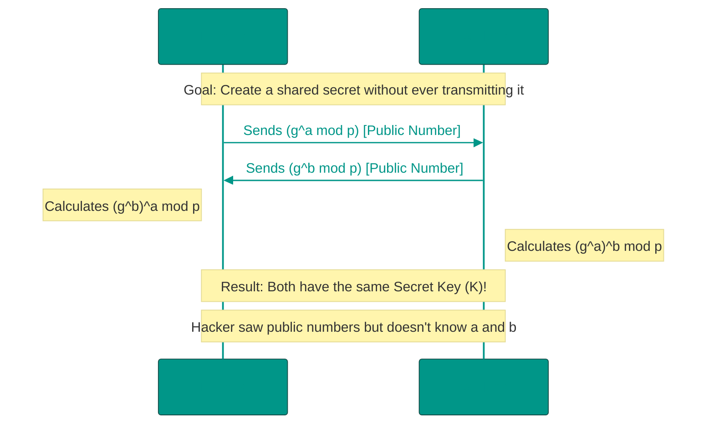
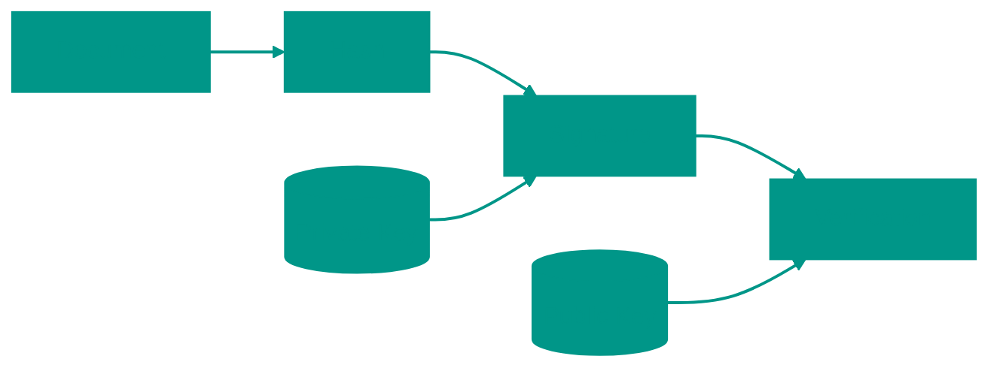

# 🔐 Cryptography: The Mathematical Foundation of Security

Cryptography is the science of secure communication techniques. It is not merely "encryption," but a comprehensive suite of protocols that guarantee the three pillars of information security (CIA): Confidentiality (no one else can read it), Integrity (no one can alter it), and Availability (information is accessible when needed).

---


## 📜 History: From Caesar to Quantum Computers

Cryptography is an eternal battle between those who protect secrets and those who try to crack them. This arms race has lasted for thousands of years.


### Antiquity: Caesar Cipher (1st Century BC)
Julius Caesar used a simple **substitution cipher**: each letter is shifted by a fixed number of positions. For example, a shift of 3:

```
A -> D,  B -> E,  C -> F
ATTACK -> DWWDFN
```

**Cryptanalysis**: The crack is trivial. In the English alphabet, there are only 26 possible shifts. A brute-force attack takes seconds.


### Middle Ages: Frequency Analysis (9th Century)
The Arab scholar **Al-Kindi** developed frequency analysis. Idea: In any language, some letters appear more frequently than others.

**Example**: In English, "E" appears in ~12% of text, while "Z" appears in ~0.07%. If the character "X" appears frequently in a cipher, it's likely a masked "E".

**Result**: Simple substitution ciphers became useless.


### Renaissance: Vigenère Cipher (16th Century)
A **polyalphabetic cipher**: It uses a keyword. Each letter of the key determines its own shift.

```
Text:  ATTACKATDAWN
Key:   LEMONLEMONLE
Cipher: LXFOPVEFRNHR
```

**Cryptanalysis**: Considered "indecipherable" for 300 years. In 1863, Friedrich Kasiski showed that by finding the key length (analyzing repeating sequences), the cipher could be broken into several Caesar ciphers and solved via frequency analysis.


### 20th Century: Enigma and WWII
The German **Enigma** machine used rotors to create billions of key combinations.

**Combinations**: ~159 quintillion (159 × 10¹⁸).

**The Break**: Alan Turing and the team at Bletchley Park created the **Bombe**, an electromechanical computer that exploited protocol weaknesses (Germans never encrypted a letter into itself: A ≠ A). Breaking Enigma is estimated to have shortened the war by ~2 years.

**Lesson**: Even a mathematically strong cipher can be broken through implementation errors or human factors (operators using predictable keys like "QWE").


### The 1970s Revolution: Modern Cryptography
Before this, all ciphers were symmetric (same key for encryption and decryption).

**The Distribution Problem**: How can Boris and Ilyas agree on a secret key if they've never met? Sending it via mail or internet allows a spy to intercept it.

**1976: Diffie-Hellman Protocol**: A revolution. Two parties could create a shared secret over an open channel that everyone sees, but no one can calculate.

**1977: RSA**: Asymmetric encryption. High-security "Public Keys" could be published in a newspaper, but only the holder of the "Private Key" could decrypt the messages.


### Today: The Quantum Threat (2020s)
**The Problem**: Quantum computers (when sufficiently powerful) will be able to crack RSA and ECC in minutes using Shor's Algorithm.

**The Solution**: Post-Quantum Cryptography (PQC). In 2022, NIST selected new algorithms resistant to quantum attacks:
*   **Kyber** (Encryption) — based on the difficulty of solving systems of linear equations.
*   **Dilithium** (Signatures) — based on lattice mathematics.

---


## ⚔️ Cryptography vs. Cryptanalysis

Cryptography is the sword, cryptanalysis is the shield (or vice versa).


### Common Attacks

**1. Brute Force**
Trying every possible key.
*   AES-128: 2¹²⁸ combinations (~3.4 × 10³⁸). Even using all current supercomputers, it would take billions of years.
*   Weak Password (6 chars, letters only): 26⁶ = 308 million. Cracked in seconds.

**Defense**: Long keys + rate limiting.

**2. Man-in-the-Middle (MITM)**
A hacker sits between Boris and Ilyas, swapping public keys.

```
Boris thinks he's talking to Ilyas,
but he's talking to the Hacker.
Hacker decrypts, reads, and re-encrypts for Ilyas.
```

**Defense**: Digital Certificates (Certificate Authorities). Browsers verify that a site's public key is signed by a trusted authority (e.g., Let's Encrypt).

**What is Let's Encrypt?**: Let's Encrypt is a free, automated, and open Certificate Authority (CA) launched in 2015. It provides SSL/TLS certificates at no cost to enable HTTPS on websites, making encryption accessible to everyone. Using automated tools, it simplifies the process of obtaining and renewing certificates, dramatically increasing the adoption of HTTPS across the web. In the context of cryptography, Let's Encrypt plays a vital role in the Public Key Infrastructure (PKI) by issuing X.509 certificates that bind domain names to public keys, allowing browsers to verify the identity of websites and establish secure connections.

**3. Side-Channel Attacks**
Breaking the physical implementation rather than the math.

*   **Timing Attack**: Measuring how long an operation takes. If a password check stops at the first wrong character, a hacker can deduce the correct characters by response time.
*   **Power Analysis**: Measuring processor power consumption.
*   **Acoustic Cryptanalysis**: Recovering keys by "listening" to the computer's operation (Tel Aviv University study, 2013).

**Defense**: Constant-time algorithms, noise masking.

**4. Quantum Computers (Future)**
Shor's algorithm can factor large numbers in polynomial time.

*   **RSA-2048**: Classic computers take ~300 trillion years. Quantum computers (with ~4096 qubits) could take hours.

**Defense**: Migration to PQC algorithms (Kyber, Dilithium).

---


## 🏗️ Diffie-Hellman Protocol (Key Exchange)



---


## 1. 🗝️ Symmetric Encryption

Principle: **"One key for everything."** Boris locks a chest with a key, and Ilyas opens it with a copy of the same key. This is the fastest form of encryption, used for transmitting large volumes of data.


### AES (Advanced Encryption Standard)
The global standard. AES is a **block cipher**: it breaks data into 128-bit (16-byte) blocks and applies complex mathematical transformations (rounds).

*   **AES-128**: 10 rounds. Sufficient for most civil applications.
*   **AES-256**: 14 rounds. Required for top-secret government data and protection against future quantum attacks (Grover's algorithm).


### Modes of Operation
Simply encrypting blocks independently is dangerous (ECB mode). If you encrypt identical blocks (e.g., empty space in a file), patterns will emerge in the ciphertext.

| Mode | Description | Pros/Cons |
| :--- | :--- | :--- |
| **ECB** | Each block encrypted separately | ❌ Insecure (patterns remain visible) |
| **CBC** | Each block depends on the previous one | ✅ Secure, but slow (cannot be parallelized) |
| **GCM** | Encryption + Authentication (AEAD) | 🏆 **Gold Standard**. Fast and guarantees integrity. |

---


## 2. 🔑 Asymmetric Encryption (Public-Key Cryptography)

Solves the key distribution problem. Each participant has a pair: a **Public Key** (can be given to anyone) and a **Private Key** (must be kept strictly secret).


### How it Works (The Lock Analogy)
1.  Ilyas sends Boris an **open padlock** (for which only he has the key).
2.  Boris puts his message in a box, snaps Ilyas's padlock shut, and sends the box back.
3.  Ilyas opens the box with his private key. A hacker saw the box and the lock but never saw the key.


### RSA vs. ECC Comparison
Today, RSA is considered "heavy," while ECC (Elliptic Curve Cryptography) is modern and lightweight.

| Parameter | RSA | ECC |
| :--- | :--- | :--- |
| **Foundation** | Prime Number Factorization | Elliptic Curve Logarithms |
| **Key Size (256-bit security)** | 3072 bits 🐘 | 256 bits 🏎️ |
| **Speed** | Slow | Very Fast |
| **Usage** | Legacy systems, SSH | Apple, WhatsApp, TLS 1.3 |

---


## 3. #️⃣ Hashing and Password Protection

A hash function is a data "fingerprint." It is a **one-way** function: it's easy to create a hash from a string, but mathematically impossible to reverse the process.


### The Ideal Hash (SHA-256)
A good algorithm must be:
1.  **Deterministic**: Same input always yields the same output.
2.  **Fast**: Calculation happens in milliseconds.
3.  **Collision-Resistant**: Impossible to find two different inputs with the same hash.
4.  **Avalanche Effect**: Changing 1 bit in the input changes the hash beyond recognition.


### Salt and Pepper
To prevent hackers from using **Rainbow Tables** (databases of pre-computed hashes):
*   **Salt**: A random string added to each user's password. Stored in the database alongside the hash. Protects against bulk cracking of common passwords.
*   **Pepper**: A secret string added to the password, stored **outside** the database (e.g., in server environment variables or an HSM). If the database is stolen, cracking remains impossible without the pepper.


### Example Code (Go: Hashing with Salt)
```go
import (
	"crypto/sha256"
	"encoding/hex"
)

func HashPassword(password, salt string) string {
	h := sha256.New()
	h.Write([]byte(password + salt))
	return hex.EncodeToString(h.Sum(nil))
}
```

---


## 4. 🛡️ Digital Signatures

A signature guarantees that a message came from a specific author and has not been tampered with.



**The Process**:
1.  The author creates a hash of the document.
2.  The author encrypts the hash with their **Private Key**. This is the signature.
3.  The recipient decrypts the signature with the author's **Public Key** to get the hash.
4.  The recipient calculates the document's hash independently and compares it. If they match, the document is authentic.

---


## 5. 🚀 Modern Web: TLS 1.3

When you see the padlock icon in your browser, **TLS (Transport Layer Security)** is at work. The modern version 1.3 removed legacy, insecure ciphers and optimized the connection speed.


### Perfect Forward Secrecy (PFS)
A concept where compromising the server's long-term private key (e.g., `google.com`'s key) does not allow an attacker to decrypt traffic recorded in the past.
**How**: Temporary (ephemeral) Diffie-Hellman keys are generated for every single session and destroyed immediately after the tab is closed.

---


## 🔄 Integration Summary: How Hashing, Keys, and Cryptography Work Together

After studying various aspects of cryptography, it's important to understand how all these elements work **together** to ensure security:

### 🔗 Component Relationships

**1. Hashing and Keys:**
- **Hashes** are used to protect **keys** when storing them (e.g., hashing passwords with salt)
- **Hashes** also help verify the **integrity** of keys and data (any change will result in a different hash)

**2. Symmetric and Asymmetric Keys:**
- **Asymmetric encryption** (RSA/ECC) is used for **secure transmission of symmetric keys** (as in TLS)
- **Symmetric encryption** (AES) is used for **fast transmission of large amounts of data** after establishing a secure channel

**3. Digital Signatures as a Connecting Element:**
- Use **asymmetric keys** to encrypt a document's **hash**
- Provide **authenticity** (who is the sender?) and **integrity** (has it been modified?)

### 🔄 Complex Example: TLS Connection (HTTPS)

When you visit a website via HTTPS, the following occurs:

1. **Server** sends its **public key** (in the certificate)
2. **Client** verifies the certificate **signature** (using hashes and asymmetric encryption)
3. **Client** generates a **session key** for AES
4. **Client** encrypts this key with the server's **public key**
5. **Server** decrypts it, and both parties now use **symmetric encryption** (AES) for fast data transfer
6. **Hashes** are used to verify the **integrity** of transmitted data

### 🎯 Key Interaction Principles

- Each technology's **"strong side"** is used appropriately:
  - **Hashes** for integrity verification and password storage
  - **Asymmetric keys** for secure information transmission
  - **Symmetric keys** for fast data encryption

- **Combining** methods provides **multi-layered protection**:
  - Even if one layer is compromised, others remain intact

- **Perfect Forward Secrecy**: each session uses unique temporary keys (often via Diffie-Hellman) so that compromising one key doesn't affect other sessions

Thus, cryptography is not just separate techniques, but a **connected system** where hashes, symmetric and asymmetric keys work **together**, ensuring confidentiality, integrity, and authenticity of information.

## 🏁 Summary: How to Choose Protection?

1.  **Need to hide data?** -> AES (Symmetric).
2.  **Need to share a key over the net?** -> RSA/ECC (Asymmetric) or Diffie-Hellman.
3.  **Need to verify file integrity?** -> SHA-256 (Hashing).
4.  **Need to store passwords?** -> Argon2 or BCrypt (special "slow" hashes) + Salt.
---


## 🚀 Next Steps

Now that you understand the mathematical foundations of security, see how these technologies are applied in the real world:
*   [**TLS/SSL**](file:///Users/ilasgibadullin/Documents/develop/projects/brave_monkey_education/materials/eng/computer_science/07_security/2.TLS_SSL.md) — Learn how browsers protect your data in transit.

<!-- QUIZ_START

[
    {
        "question": "What is the key difference between asymmetric and symmetric encryption?",
        "options": [
            "Asymmetric is faster",
            "Symmetric uses two keys",
            "Asymmetric uses a key pair: a public key for encryption and a private key for decryption",
            "Symmetric is only used for government secrets"
        ],
        "correctIndex": 2
    },
    {
        "question": "Why is 'salt' used when hashing passwords?",
        "options": [
            "To speed up the hashing process",
            "To protect against Rainbow Tables (pre-computed hash databases)",
            "To allow reversible encryption of the password",
            "To compress the password"
        ],
        "correctIndex": 1
    },
    {
        "question": "How does a digital signature work?",
        "options": [
            "The author encrypts the document with a public key",
            "The author encrypts a hash of the document with their PRIVATE key, and the recipient verifies it with the author's PUBLIC key",
            "The author adds a scrambled image to the file",
            "The author simply types their name at the end"
        ],
        "correctIndex": 1
    }
]

QUIZ_END -->


