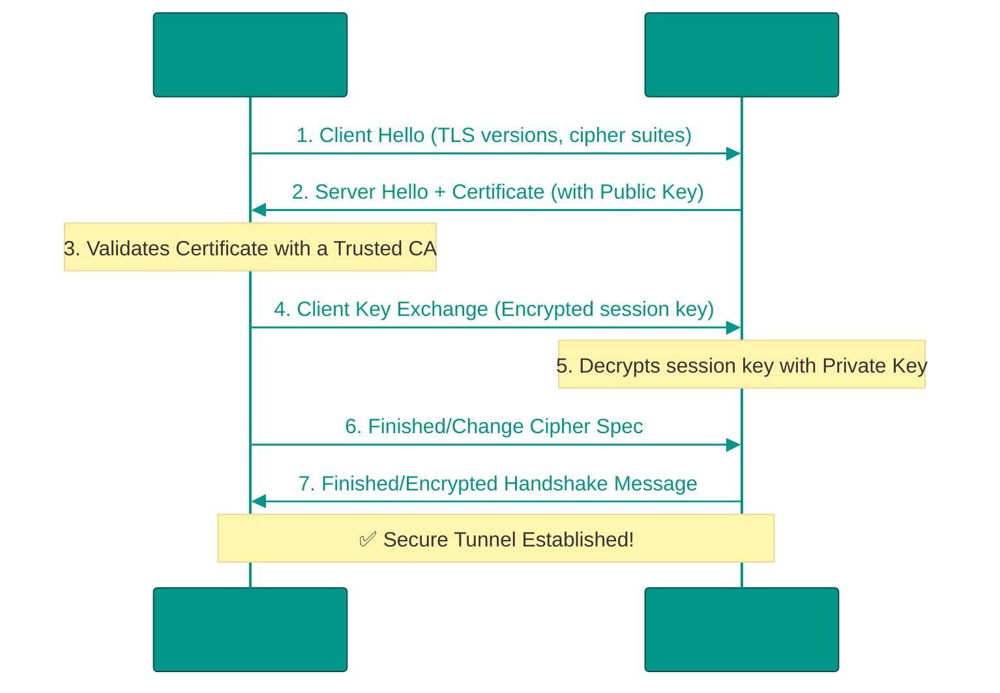

# 🌐 TLS/SSL: Securing Data in Transit

## 📑 Table of Contents
1. [What is TLS and Why is it Necessary?](#what-is-tls)
2. [How Encryption Works (Symmetric vs. Asymmetric)](#encryption-concepts)
3. [The TLS Handshake](#tls-handshake)
4. [Digital Certificates (CAs)](#certificates-and-cas)
5. [Implementation in Go](#go-implementation)

---

## ❓ What is TLS and Why is it Necessary?

**TLS (Transport Layer Security)** is a cryptographic protocol designed to provide communication security over a computer network. While its predecessor was **SSL**, the term SSL is still widely used in common parlance to refer to TLS. 🛡️

It serves three primary purposes:
1. **Encryption**: Hides the data from eavesdroppers.
2. **Authentication**: Verifies that the server you are talking to is who they claim to be.
3. **Integrity**: Ensures that data remains unaltered during transmission.

### Why It Matters:

**Without TLS (Standard HTTP):**
- Passwords and personal data are sent in plain text.
- Anyone on the same Wi-Fi network can "sniff" and read your traffic.
- Malicious actors can modify your data mid-flight (Man-in-the-Middle attack).

**With TLS (HTTPS):**
- Every byte is encrypted.
- Only you and the server can "unlock" the message.
- Modern browsers display a secure padlock icon ✅.

---

## 🔑 Core Security Concepts

TLS relies on fundamental cryptographic mechanisms: **Symmetric** and **Asymmetric** encryption.

> [!TIP]
> We covered the mathematics and principles of these algorithms in detail in the [**Cryptography Basics**](file:///Users/ilasgibadullin/Documents/develop/projects/brave_monkey_education/materials/eng/computer_science/07_security/1.Cryptography_Basics.md) section. We highly recommend reading it first to understand how keys work "under the hood."

In the context of TLS, keep in mind:
- **Asymmetric Encryption** is used only at the beginning to securely exchange keys (Handshake). It is secure but slow.
- **Symmetric Encryption** is used for data transfer after the connection is established. It is extremely fast. ⚡

---

## 🤝 The TLS Handshake

This is the multi-step "introduction" process between the client and server before high-speed data transfer begins.

```mermaid
%%{init: { 'theme': 'base', 'themeVariables': { 'lineColor': '#009688', 'primaryColor': '#009688', 'primaryTextColor': '#009688', 'attributeBkg': '#009688', 'attributeTextColor': '#009688', 'signalColor': '#009688', 'actorLineColor': '#009688', 'nodeBorder': '#009688', 'clusterBorder': '#009688', 'textColor': '#009688', 'fontSize': '16px' } } }%%
sequenceDiagram
    participant Client as Client<br/>(Browser)
    participant Server as Server
    
    Client->>Server: 1. Client Hello (TLS versions, cipher suites)
    Server->>Client: 2. Server Hello + Certificate (with Public Key)
    Note over Client: 3. Validates Certificate with a Trusted CA
    Client->>Server: 4. Client Key Exchange (Encrypted session key)
    Note over Server: 5. Decrypts session key with Private Key
    Client->>Server: 6. Finished/Change Cipher Spec
    Server->>Client: 7. Finished/Encrypted Handshake Message
    Note over Client, Server: ✅ Secure Tunnel Established!


```

- **Client Hello**: "I support TLS 1.3 and these encryption methods."
- **Server Hello**: "Let's use TLS 1.3 and this cipher. Here is my ID (Certificate)."
- **Validation**: The browser checks the certificate against a list of trusted Certificate Authorities (like Let's Encrypt).

---

## 📜 Digital Certificates and CAs

To ensure that `google.com` is actually Google and not an impostor, we use **Certificate Authorities (CAs)**. 

1. A server generates its keys and creates a Certificate Signing Request (CSR).
2. A Trusted CA (e.g., Let's Encrypt, DigiCert) verifies the server's ownership of the domain.
3. The CA signs the server's certificate with its own private key.
4. Your browser recognizes that signature because the CA's public key is built directly into your operating system or browser.

---

## 💻 Implementation in Go

### A Secure HTTPS Server
In Go, serving HTTPS is straightforward using `http.ListenAndServeTLS`. You simply provide the path to your certificate and private key.

> [!WARNING]
> For production, use **[Let's Encrypt](file:///Users/ilasgibadullin/Documents/develop/projects/brave_monkey_education/materials/eng/computer_science/07_security/1.Cryptography_Basics.md#what-is-lets-encrypt)**. For local development, you can generate "Self-Signed" certificates, but browsers will show a security warning.

---

## 🛡️ Security Best Practices

- **Security Headers**: Use **HSTS** (`Strict-Transport-Security`) to force browsers to always use HTTPS.
- **Modern Protocols**: Disable outdated protocols like SSLv3 and TLS 1.0/1.1. Always prefer **TLS 1.3**.
- **Automated Renewals**: Use tools like `certbot` or the `autocert` Go package to automatically renew certificates before they expire.
- **Don't Skip Verification**: Never set `InsecureSkipVerify: true` in production code; it completely disables the security benefits of TLS. ⚠️

<!-- QUIZ_START 

[
    {
        "question": "At which stage of the TLS Handshake is asymmetric encryption primarily used?",
        "options": [
            "To encrypt all data during the entire session",
            "Only at the beginning to securely exchange a symmetric session key",
            "It is not used in TLS at all",
            "Only when terminating the connection"
        ],
        "correctIndex": 1
    },
    {
        "question": "What is the primary role of a Certificate Authority (CA)?",
        "options": [
            "To speed up the internet",
            "To verify that a server really is who it claims to be (Identity Verification)",
            "To store user passwords on behalf of the site",
            "To block malicious ads"
        ],
        "correctIndex": 1
    },
    {
        "question": "Why is setting InsecureSkipVerify: true dangerous in production code?",
        "options": [
            "It slows down the server",
            "It disables certificate validation, making the connection vulnerable to Man-in-the-Middle (MITM) attacks",
            "It increases memory usage",
            "It is a legacy setting that causes crashes"
        ],
        "correctIndex": 1
    }
]

QUIZ_END -->

