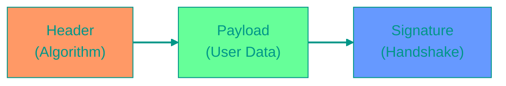
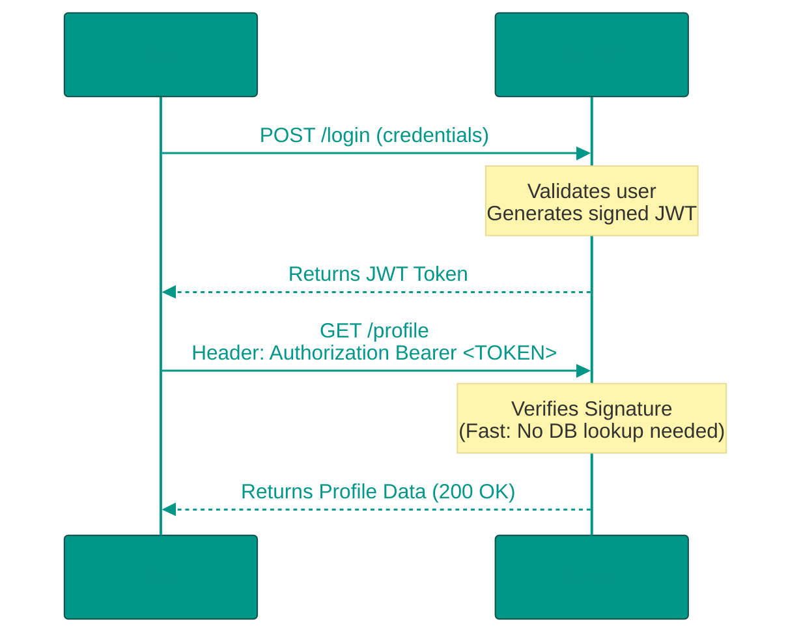

# 📄 JWT (JSON Web Tokens): The Passport for Your API


## 📑 Table of Contents
1. [What is a JWT?](#what-is-jwt)
2. [Token Anatomy (Header, Payload, Signature)](#token-anatomy)
3. [How It Works Under the Hood](#how-it-works)
4. [Implementation in Go](#go-implementation)
5. [Security and Storage Best Practices](#security-and-storage)

---


## ❓ What is a JWT?

**JWT (JSON Web Token)** is an open standard that defines a compact and self-contained way for securely transmitting information between parties as a JSON object. This information can be verified and trusted because it is digitally signed. 🛡️

JWTs are most commonly used for **Authorization**: once a user logs in, the server issues a JWT which the user then includes in every subsequent request to access protected resources.


### Why Use JWT?

**The Traditional Approach (Stateful Sessions):**
- The server stores session data in its own memory or a database.
- The client receives a "Session ID" stored in a cookie.
- Every single request requires the server to perform a database lookup to find the corresponding session.

**The JWT Approach (Stateless Auth):**
- The server stores nothing.
- All required user information is embedded directly within the token itself.
- This is faster, more efficient, and significantly easier to scale across multiple servers.

---


## 🦴 Token Anatomy

A JWT consists of three distinct parts separated by dots: `header.payload.signature`


### The Three Components:

1. **Header**: Specifies the type of token (JWT) and the signing algorithm being used (e.g., HS256 or RS256).
2. **Payload**: Contains the "Claims"—the actual pieces of data such as the User ID (`sub`), their roles, and the expiration timestamp (`exp`).
3. **Signature**: A cryptographic hash created by combining the encoded header, the encoded payload, and a secret key known only to the server. This ensures the data hasn't been tampered with.



---


## ⚙️ How It Works

Unlike sessions, JWT is a **Stateless** mechanism. The server verifies the token purely by checking its signature, without needing to verify it against a central database.



---


## 💻 Implementation in Go


### 1. Creating a JWT Token
Using the `github.com/golang-jwt/jwt/v5` library, you define a struct for your claims and sign them with a secret key.

> [!IMPORTANT]
> Always set an expiration time (`ExpiresAt`). A token without an expiration is a major security risk.

---


### 2. Validating a Token
To protect your endpoints, the server must parse the incoming token, verify the signing algorithm matches its expectations, and check the signature against its secret key.

---


### 3. Middleware for Protected Endpoints
In a real production app, you would use middleware to intercept requests, extract the "Bearer" token from the `Authorization` header, and halt the request if the token is invalid or expired.


### 4. Access Token vs Refresh Token Pattern

**Access Token** and **Refresh Token** solve the fundamental problem of balancing security with user convenience in authentication systems.

**The Problem with Long-Lived Tokens:**
If we use a JWT with a long expiration time (e.g., 30 days), it poses a security risk. If stolen, an attacker can impersonate the user for the entire duration.

**The Problem with Short-Lived Tokens:**
If we use a JWT with a very short expiration time (e.g., 5 minutes), users would need to log in constantly, creating a poor user experience.

**The Solution: Two-Tier System**

- **Access Token**: Short-lived (typically 15 minutes), used for authenticating API requests.
- **Refresh Token**: Long-lived (typically days or weeks), used solely to obtain new access tokens without requiring the user to log in again.

**Real-World Example:**
1. User logs in at 9:00 AM and receives:
   - Access Token (valid until 9:15 AM)
   - Refresh Token (valid for 7 days)
2. Until 9:15 AM: User accesses various APIs with the Access Token
3. At 9:15 AM: Access Token expires, client automatically sends Refresh Token to `/api/refresh`
4. Server validates Refresh Token and returns a new Access Token (valid until 9:30 AM)
5. User continues using the new Access Token
6. If Refresh Token expires after 7 days, user must log in again

This approach balances security (short-lived access tokens minimize damage if stolen) with usability (users don't need to constantly re-authenticate).

```go
// Example of creating both tokens
func createTokenPair(userID uint, email, role string) (accessToken, refreshToken string, err error) {
    // Create short-lived access token (15 minutes)
    accessClaims := Claims{
        UserID: userID,
        Email:  email,
        Role:   role,
        RegisteredClaims: jwt.RegisteredClaims{
            ExpiresAt: jwt.NewNumericDate(time.Now().Add(15 * time.Minute)),
            IssuedAt:  jwt.NewNumericDate(time.Now()),
            Issuer:    "my-app",
        },
    }

    accessTokenObj := jwt.NewWithClaims(jwt.SigningMethodHS256, accessClaims)
    accessToken, err = accessTokenObj.SignedString(secretKey)
    if err != nil {
        return "", "", err
    }

    // Create long-lived refresh token (7 days)
    refreshClaims := Claims{
        UserID: userID,
        RegisteredClaims: jwt.RegisteredClaims{
            ExpiresAt: jwt.NewNumericDate(time.Now().Add(7 * 24 * time.Hour)), // 7 days
            IssuedAt:  jwt.NewNumericDate(time.Now()),
        },
    }

    refreshTokenObj := jwt.NewWithClaims(jwt.SigningMethodHS256, refreshClaims)
    refreshToken, err = refreshTokenObj.SignedString(secretKey)
    if err != nil {
        return "", "", err
    }

    return accessToken, refreshToken, nil
}

// Example of refreshing an access token
func refreshAccessToken(refreshTokenString string) (newAccessToken string, err error) {
    // Parse and validate the refresh token
    claims, err := validateToken(refreshTokenString)
    if err != nil {
        return "", err
    }

    // Create a new access token using the user info from refresh token
    newAccessToken, err = createAccessToken(claims.UserID, claims.Email, claims.Role)
    return newAccessToken, err
}
```

---


## 🛡️ Security and Storage


### 🚨 Critical Threats:


#### 1. XSS (Cross-Site Scripting)
If you store a token in `localStorage`, it can be stolen by malicious JavaScript running on your page.
**Solution**: For web browsers, store tokens in an **HttpOnly Cookie**. This makes the token unreachable by JavaScript, providing a strong layer of defense.


#### 2. Secret Key Theft
If your server's secret key is leaked, an attacker can forge any token they want.
**Solution**: 
- Never check secrets into source control.
- Use environment variables.
- Consider using **RS256** (asymmetric signing) so that your internal services can verify tokens without needing to know the private key.


#### 3. Token Revocation
JWTs are valid until they expire. If a token is stolen, you cannot easily "log out" the attacker.
**Solution**:
- Keep Access Tokens very short (e.g., 15 minutes).
- Use a **Refresh Token** stored securely to request new access tokens.
- For high-security apps, maintain a "Blacklist" (in Redis) of revoked tokens.

---


## 💡 Summary Comparison

| Part | Description | Content Example |
|:---|:---|:---|
| **Header** | Protocol metadata | `{"alg": "HS256", "typ": "JWT"}` |
| **Payload** | Application data | `{"sub": "123", "role": "admin"}` |
| **Signature** | Integrity check | `HMACSHA256(header + payload, secret)` |

> [!CAUTION]
> Remember: The Payload is not encrypted, it is only Base64-encoded. Anyone can read the contents of your JWT. **Never store passwords, secrets, or sensitive private data inside a JWT payload.** 🗝️

<!-- QUIZ_START 

[
    {
        "question": "What is the primary advantage of JWT over traditional stateful sessions?",
        "options": [
            "JWT allows storing passwords securely in the token",
            "JWT is Stateless, meaning the server doesn't need to store and look up session data in a database",
            "JWT only works over HTTPS",
            "JWT reduces server load by compressing images"
        ],
        "correctIndex": 1
    },
    {
        "question": "What is the role of the Signature part in a JWT?",
        "options": [
            "To encrypt the user's data",
            "To verify that the token has not been altered since it was issued by the server",
            "To store the user's password",
            "To define the token's expiration time"
        ],
        "correctIndex": 1
    },
    {
        "question": "Is the information in a JWT Payload private?",
        "options": [
            "Yes, it is encrypted and unreadable",
            "No, it is only Base64-encoded and can be easily decoded by anyone",
            "Only if the signature is valid",
            "Only if stored in a secure cookie"
        ],
        "correctIndex": 1
    }
]

QUIZ_END -->

