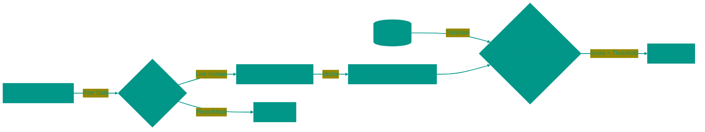

# 👁️ Biometrics: Authentication Technologies

Biometric authentication has replaced passwords because you can't forget or lose your face or fingerprint. But behind the apparent simplicity of "looking into the camera" lie complex probabilistic algorithms and anti-spoofing defenses.

---

## 🏗️ Recognition Process

---

## 1. 👆 Fingerprint
The pattern on your fingers forms in the womb and remains unchanged throughout your life (barring deep scarring).

### Scanner Types
1.  **Optical**: Essentially a 2D camera taking a photo of the fingerprint. Obsolete as they are easily fooled by high-quality photos or molds.
2.  **Capacitive**: Use an array of micro-capacitors. Human skin conducts electricity. Finger ridges touch the sensor, changing the capacitance at the contact point, while valleys do not. This creates a precise electrical map. Do not work well with wet hands.
3.  **Ultrasonic**: Send a sound pulse that reflects off the skin. They build a 3D map, "seeing" the depth of pores. Work through dirt, water, and screen glass.

---

## 2. 🤳 Facial Recognition (FaceID)
Modern systems do not just photograph you. They build a three-dimensional model of your head.

### Structured Light Technology
A Dot Projector fires 30,000 invisible infrared dots onto your face. An IR camera reads the distortion of this grid. If the dots shift left, the surface is convex (nose); if right, concave. This builds a depth map.
This allows distinguishing a live face from a flat photograph.

### Neural Networks and Vectors
The system does not compare images pixel-by-pixel (you might wear glasses or change your hairstyle). A neural network converts your face into a set of numbers—a **Feature Vector**. It measures the distance between eyes, cheekbone shape, eye socket depth.
Comparing faces is calculating the mathematical distance between two vectors in multidimensional space.

---

## 3. 🎯 Error Probabilities (FAR/FRR)
Biometrics never gives a "Yes" or "No" with 100% certainty. It outputs a **Score** (confidence percentage).

*   **FAR (False Acceptance Rate)**: The probability of falsely accepting an impostor. This is a critical security vulnerability. In FaceID, the chance is ~1 in 1,000,000.
*   **FRR (False Rejection Rate)**: The probability of falsely rejecting the owner. This is a usability issue (forcing PIN entry).
*   **Threshold Tuning**: Engineers balance these parameters. For a banking app, low FAR (security) is priority; for unlocking a phone, low FRR (convenience) matters more.

---

## 4. 🩸 Liveness Detection
The main goal of hackers is to fool the system with a "fake" (Deepfake, mask, photo).
Modern systems look for signs of life:
*   Micro-movements of eyes.
*   Skin color changes due to pulse (pulse wave).
*   Light reflection from the cornea (glint).
*   Context (depth of scene, absence of phone screen bezels in the image).

---

## 5. 🔐 Security (Secure Enclave)
Biometric data is considered **sensitive**. It does not leave the device.
1.  Scanner reads finger/face.
2.  Data goes directly to the **Secure Enclave** (isolated coprocessor).
3.  There it is converted into a hash and compared with the template.
4.  The main CPU receives only the result: `True` or `False`.
Even if the phone has a root-level virus, it physically cannot read the Secure Enclave memory.

<!-- QUIZ_START 

[
    {
        "question": "Which type of fingerprint scanner is considered the most modern and reliable, working through dirt and glass?",
        "options": [
            "Optical",
            "Capacitive",
            "Ultrasonic",
            "Mechanical"
        ],
        "correctIndex": 2
    },
    {
        "question": "What does FAR (False Acceptance Rate) represent in biometric security?",
        "options": [
            "The probability that the system fails to recognize the owner",
            "The probability of falsely admitting an impostor",
            "The speed of facial recognition",
            "The number of scanning attempts allowed"
        ],
        "correctIndex": 1
    },
    {
        "question": "How do modern FaceID systems distinguish a real face from a flat photograph?",
        "options": [
            "By checking eye color",
            "By using a dot projector to build a 3D depth map of the head",
            "By requiring the user to blink",
            "By using high-resolution 2D photos"
        ],
        "correctIndex": 1
    }
]

QUIZ_END -->

