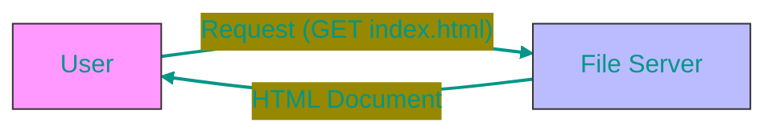
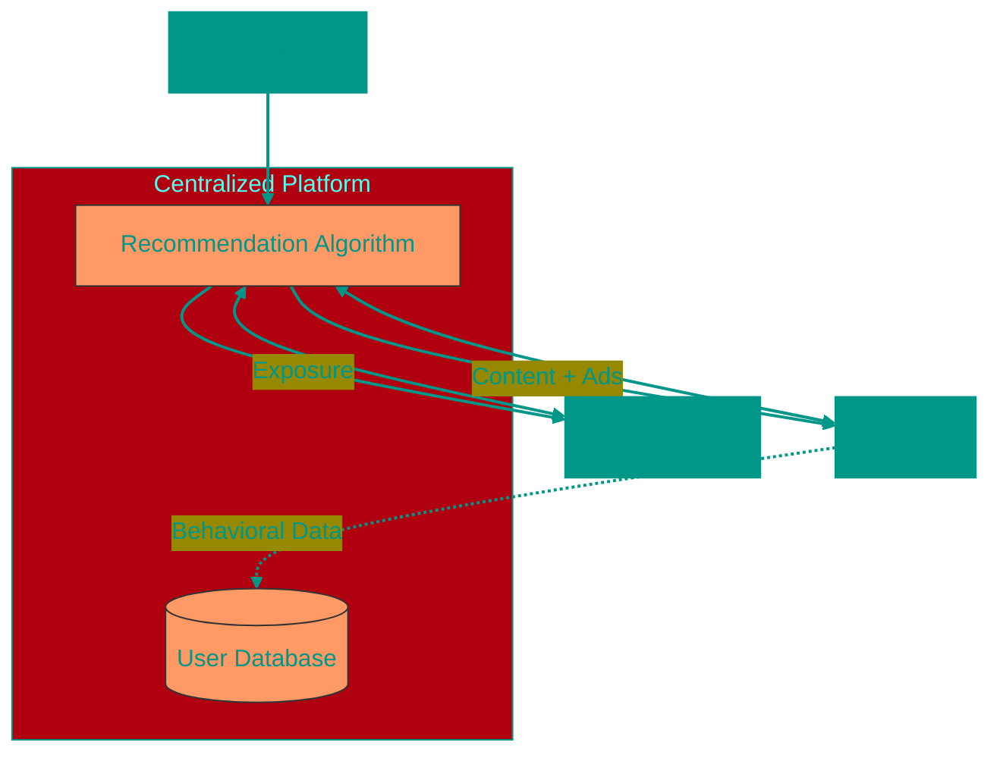
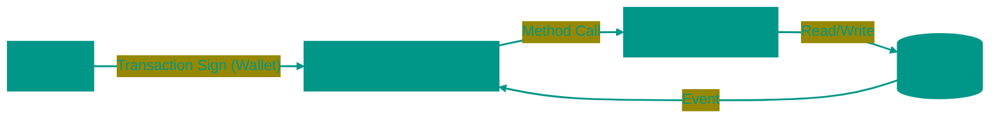

# 🌐 Web Evolution: From 1.0 to 3.0

> "The Web is not just a technology; it reflects human society."

The Internet has journeyed from simple static documents to a global decentralized economy. To understand the future (Web 3.0), we must deeply explore the past.

## 📑 Contents
1. [Web 1.0: The Read-Only Era (1990–2004)](#1-web-10-the-read-only-era-1990-2004)
2. [Web 2.0: The Read-Write Era (2004–Present)](#2-web-20-the-read-write-era-2004-present)
3. [Web 2.5: The Bridge](#3-web-25-the-bridge-to-the-future)
4. [Web 3.0: The Read-Write-Own Era (The Future)](#4-web-30-the-read-write-own-era-the-future)
5. [Evolution Summary Table](#-evolution-summary-table)

---

## 1. 📜 Web 1.0: The Read-Only Era (1990–2004)

**"The Digital Library and the Wild West"**

In the beginning, the internet resembled a giant bulletin board. It was one-way communication: content creators published information, and users consumed it.

### 🏛️ Historical Context
- **1989**: Tim Berners-Lee invents the WWW at CERN.
> [!TIP]
> **WWW** stands for **World Wide Web** — a system of interconnected documents and resources accessed through the internet using the HTTP protocol.
- **1993**: Release of **Mosaic** — the first popular graphical browser.
- **1995-2001**: **The Browser Wars** (Netscape Navigator vs Internet Explorer). Microsoft won by bundling IE with Windows.
- **2000**: **The Dot-com Bubble**. Investors poured millions into any startup with ".com" in its name. The bubble burst, wiping out trillions of dollars, but the infrastructure remained.

> [!TIP]
> **Domain Extensions (.com, .ru, .org, etc.)** — these are suffixes in website addresses that originally indicated affiliation with a particular type of organization or country:
> - **.com** — commercial (commercial organizations), generic top-level domain, most popular worldwide
> - **.org** — organizations, typically used by non-profit organizations
> - **.net** — network (network organizations), often used by internet service providers
> - **.ru** — Russia, national country code top-level domain
> - **.gov** — government (US government institutions)
> - **.edu** — educational institutions (US educational establishments)
> 
> During the dot-com era, the .com domain became a symbol of internet business, which is why investors were particularly interested in projects with this domain.

### 🛠️ Tech Stack
- **HTML**: Layouts based on tables (`<table>`) and frames (`<frameset>`). CSS barely worked.
- **Protocols**: HTTP/1.0. No encryption (HTTPS was rare).
- **Design**: Bright backgrounds, "Under Construction" GIF animations, visitor counters.

> [!NOTE]
> **A 90s Site Example**: A company's static homepage. Address, phone number, service description. To change a single letter, the webmaster had to update the HTML file and re-upload it to the server via FTP.

---

## 2. 📱 Web 2.0: The Read-Write Era (2004–Present)

**"Platforms, Social Networks, and APIs"**

The term "Web 2.0" was popularized by Tim O'Reilly in 2004. The core idea: the internet as a platform. Users became the primary content creators (UGC — User Generated Content).

### 🚀 The Technological Revolution
1.  **AJAX (Asynchronous JavaScript and XML)**: Allowed parts of a page to update without reloading. Google Maps (2005) showed web apps could be as smooth as desktop software.
2.  **API Economy**: Services began to "talk" to each other. Uber uses Google Maps API for navigation and Twilio API for SMS.
3.  **Mobile (2007)**: The iPhone launch made the internet an "Always On" companion.
4.  **Cloud (AWS, 2006)**: Startups no longer needed to buy servers. Computing power could be rented from Amazon for pennies.

### 🏢 The Platform Economy
Giants emerged (FAANG: Facebook, Apple, Amazon, Netflix, Google) offering convenient free services in exchange for **data**.

- **Network Effect**: The more people on Facebook, the harder it is for a competitor to pull you away.
- **Algorithmic Feeds**: You see what keeps your attention the longest (to serve ads), not just what you subscribed to.

> [!WARNING]
> **Centralization Problem**: "Walled Gardens." You don't own your account. Twitter can ban you forever. YouTube can delete your video. Your data lives on someone else's servers.

---

## 3. 🌉 Web 2.5: The Bridge to the Future

We are currently here. This is a state where Web 3.0 technologies already work, but entry is through familiar Web 2.0 interfaces.

**Examples:**
- **Coinbase / Binance**: You buy crypto, but the keys are held by the exchange (like a bank).
- **OpenSea**: NFT trading, but the website itself is a standard Web 2.0 service that can hide your collection if served a legal notice.

---

## 4. 🌐 Web 3.0: The Read-Write-Own Era (The Future)

**"The Semantic and Decentralized Web"**

Web 3.0 is an attempt to fix Web 2.0's problems (privacy, monopolies) using cryptography and distributed ledgers.

### 💎 Pillars of Web 3.0
1.  **Blockchain & Smart Contracts**: Code is law. An Ethereum smart contract executes guaranteed, no one (not even the creator) can stop it.
2.  **DAO (Decentralized Autonomous Organization)**: Companies without CEOs. Decisions are made by token holder votes. Example: **Uniswap** is governed by its community.
3.  **DeFi (Decentralized Finance)**: Banking services (loans, exchange) without banks.
4.  **Self-Sovereign Identity (SSI)**: You own your identity. Login via wallet (MetaMask, Phantom), not "Login with Google."

### 🛠️ Tech Stack
- **L1 (Layer 1)**: Bitcoin, Ethereum, Solana — base blockchains.
- **Storage**: IPFS, Arweave — decentralized file storage (so NFT images aren't on AWS servers).
- **Oracles**: Chainlink — delivers real-world data (currency rates, weather) to the blockchain.

> [!TIP]
> **Paradigm Shift**:
> In Web 2.0: The App (Instagram) owns the Database.
> In Web 3.0: The Database (Blockchain) is shared, and Apps (Interfaces) are just "windows" into this database. If an interface shuts down, you can access your data through another one. The data stays put.

### 🚧 Web 3.0 Challenges (Why we aren't there yet)
- **Scalability**: Blockchains are slow and expensive compared to VISA.
- **UX (User Experience)**: Setting up a wallet, remembering 12 words, paying gas fees — it's too complex for the mass user.
- **Scams**: Lack of regulation attracts fraudsters.

---

## 📊 Evolution Summary Table

| Feature | Web 1.0 | Web 2.0 | Web 3.0 |
| :--- | :--- | :--- | :--- |
| **Main Function** | Read Information | Interact & Create | Own & Transfer Value |
| **Content Unit** | Homepage | Post / Tweet / Video | Token / NFT |
| **Monetization** | Minimal (Banners) | Targeted Ads (Data) | Tokenomics, DeFi, Direct Sales |
| **Organization** | Companies (.com) | Platforms (Aggregators) | DAOs (Communities) |
| **Infrastructure** | Owned Servers | Clouds (AWS, Google Cloud) | Blockchain Nodes, IPFS |
| **Your Role** | Consumer | Product (your data = commodity) | Owner (network shareholder) |

---

> **Conclusion**: We are moving towards an internet where users regain control over their data, money, and content, but with the convenience of modern applications.

<!-- QUIZ_START 

[
    {
        "question": "Which Web 2.0 technology enabled updating parts of a web page without a full reload?",
        "options": [
            "HTML5",
            "AJAX (Asynchronous JavaScript and XML)",
            "WebSockets",
            "REST API"
        ],
        "correctIndex": 1
    },
    {
        "question": "What is the main problem with Web 2.0 from a data ownership perspective?",
        "options": [
            "Lack of encryption",
            "Platforms (Facebook, Twitter) own your data and can ban your account without warning",
            "Slow internet speeds",
            "No mobile apps available"
        ],
        "correctIndex": 1
    },
    {
        "question": "What is a DAO (Decentralized Autonomous Organization) in the context of Web 3.0?",
        "options": [
            "A new programming language",
            "A company without CEOs where decisions are made by token holder votes",
            "An encryption algorithm",
            "A file transfer protocol"
        ],
        "correctIndex": 1
    }
]

QUIZ_END -->

