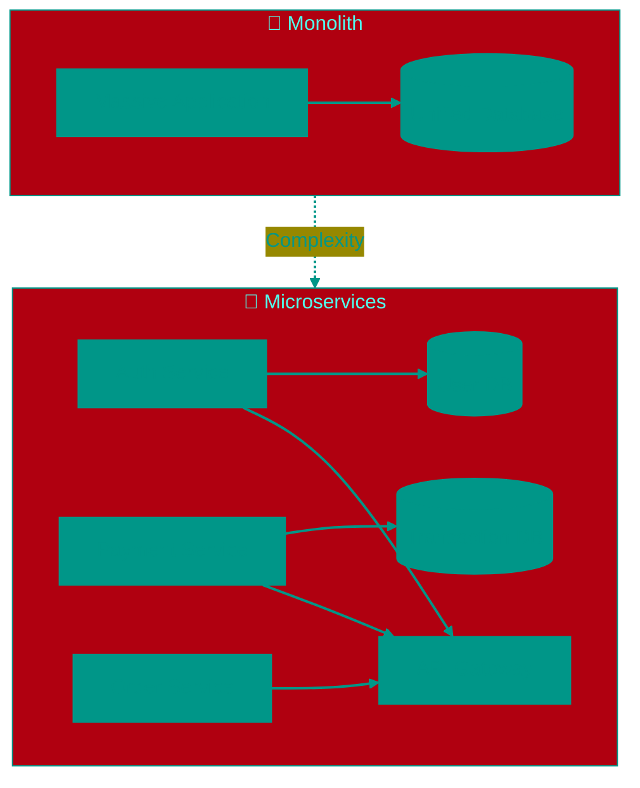

# ☁️ Cloud-native and Serverless: The Evolution of Architecture

The term "Cloud-native" doesn't just mean "hosting in the cloud." It is a philosophy of development where applications are designed from the ground up to thrive in the dynamic, distributed environment of public, private, or hybrid clouds. The primary goal is speed of delivery and scalability.

> [!NOTE]
> "It's not cloudy today, so it won't work" — just kidding! 😄 
> In reality, when people talk about "the cloud," it's just a bunch of computers (servers) managed centrally, not something floating in the sky. From a developer's perspective, the cloud is the ability to rent computing power on demand without buying your own hardware.

---


## 🏗️ Evolution: From Monolith to Chaos



---


## 1. 🏰 The Monolith and Its Limitations
The classic approach (Monolithic Architecture) is when the entire application (web server, business logic, database interaction, report generation) lives in a single process and is deployed as a single artifact (e.g., a `.jar` or `.exe`).

**The Problem**: Any change requires rebuilding and restarting the entire "monster." If the "Reports" module consumes all memory, even the "Authentication" module crashes. Scaling is only possible vertically (buying more powerful servers), which is extremely expensive.

---


## 2. 🧩 Microservices
This approach breaks the application down into dozens or hundreds of small, independent services. Each is responsible for a single business function (e.g., "Calculate Discount") and can be written in its own programming language.


### Principles of The Twelve-Factor App
To operate successfully in the cloud, services often follow the **Twelve-Factor App** methodology:
1.  **Codebase**: One codebase tracked in revision control, many deploys.
2.  **Dependencies**: Explicitly declare and isolate dependencies (no "it works on my machine").
3.  **Config**: Store configuration in the environment (`ENV`), not in the code.
4.  **Backing Services**: Treat backing services (databases, queues) as attached resources.
5.  **Disposability**: Maximize robustness with fast startup and graceful shutdown.


### Challenges of Distributed Systems
Microservices solve scalability but introduce complexity in communication. Services need to reliably talk over the network (gRPC/REST), find each other (Service Discovery), and handle failures gracefully (Circuit Breaker).
To solve these challenges, **Service Mesh** (e.g., Istio) is often used—an infrastructure layer that transparently manages traffic between services, adding encryption (mTLS) and telemetry.

---


## 3. 🐳 Containerization (Docker)
To ensure microservices run identically on a developer's laptop and a production server, they are packaged into **containers**.

A container is distinct from a Virtual Machine (VM). Unlike a VM, which includes a full OS, a container shares the host system's kernel but isolates processes and the file system.
A **Docker Image** is a blueprint containing code, libraries (`libs`), runtime (`python/go`), and system tools. This guarantees immutability: what is tested is exactly what goes into production.

---


## 4. ☸️ Orchestration (Kubernetes)
When you have 5 containers, you can run them manually. When you have 5,000, you need **Kubernetes (K8s)**.

Kubernetes is the operating system for a cluster. You don't say "run container X on server Y." You say: "I need 3 replicas of service X." Kubernetes finds available resources, launches the containers, and if one crashes, it spins up a new one. It handles self-healing and load balancing automatically.

---


## 5. 👻 Serverless (Function-as-a-Service)
This is the next step in abstraction. Developers don't need to think about servers, containers, or clusters at all.

You write a single function (e.g., `resizeImage(event)`) and deploy the code to a cloud provider (AWS Lambda, Google Cloud Functions).
*   **Event-driven**: The function sleeps until an event occurs (HTTP request, file upload, timer).
*   **Pay-per-execution**: You pay only for the time the CPU processes your function (measured in milliseconds). If there are no calls, you pay **$0**.
*   **Cold Starts**: The main drawback. If a function hasn't been called recently, the cloud needs time (0.5 - 1 sec) to spin up a micro-container for it. For high-performance systems, this latency can be critical.

---


## 6. 🐳 Docker in Practice


### Dockerfile Example (Multi-stage Build)
Propery images should be compact. Multi-stage builds allow you to build the app in one container and run it in another (smaller) one.

```dockerfile
# Stage 1: Build
FROM golang:1.21-alpine AS builder
WORKDIR /app
COPY go.mod go.sum ./
RUN go mod download
COPY . .
RUN CGO_ENABLED=0 GOOS=linux go build -o server .

# Stage 2: Production
FROM alpine:latest
RUN apk --no-cache add ca-certificates
WORKDIR /root/
COPY --from=builder /app/server .
EXPOSE 8080
CMD ["./server"]
```

**Result**: Instead of 1 GB (with Go compiler), we get a 15 MB image.


### Layer Optimization
A Docker image consists of layers. Each `RUN`, `COPY` command creates a new layer. Frequently changing files (code) should be copied last. Rarely changing files (dependencies) should be copied first.

---


## 7. ☸️ Kubernetes: Deeper Dive


### Deployment (Declarative Management)
Instead of running pods manually, you describe the **desired state** of the system.

```yaml
apiVersion: apps/v1
kind: Deployment
metadata:
  name: my-app
spec:
  replicas: 3  # I want 3 copies
  selector:
    matchLabels:
      app: my-app
  template:
    metadata:
      labels:
        app: my-app
    spec:
      containers:
      - name: server
        image: myapp:1.2.3
        resources:
          limits:
            memory: "128Mi"
            cpu: "500m"
```

Kubernetes sees `replicas: 3`, checks that 0 pods are running, and creates 3. If one crashes, it spins up a new one.


### Horizontal Pod Autoscaler (HPA)
Automatically increases or decreases the number of pods based on load (CPU, memory, custom metrics).

```yaml
apiVersion: autoscaling/v2
kind: HorizontalPodAutoscaler
metadata:
  name: my-app-hpa
spec:
  scaleTargetRef:
    apiVersion: apps/v1
    kind: Deployment
    name: my-app
  minReplicas: 2
  maxReplicas: 10
  metrics:
  - type: Resource
    resource:
      name: cpu
      target:
        type: Utilization
        averageUtilization: 70  # Scale at 70% CPU
```

---


## 8. 🕸️ Service Mesh (Istio)

Service Mesh is an infrastructure layer that manages communication between microservices without changing their code.


### What Istio Provides
1.  **Traffic Management**: Canary deployments (5% traffic to new version, 95% to old), A/B testing, retry/timeout policies.
2.  **Security**: Automatic encryption between services (mutual TLS) without code changes. Each pod gets a certificate.
3.  **Observability**: Automatic collection of metrics, logs, and distributed traces.


### How It Works
Istio injects a sidecar container (Envoy Proxy) into each pod. All network traffic goes through it. The application thinks it communicates directly, but Envoy intercepts traffic, applies policies, and sends metrics.

---


## 9. 👁️ Observability

In distributed systems, logs alone aren't enough. You need three pillars: Logs, Metrics, Traces.


### Logging (ELK Stack)
*   **Elasticsearch**: Stores logs (like a search database)
*   **Logstash/Fluentd**: Collect logs from all containers
*   **Kibana**: Visualization and search

Each microservice writes logs to stdout/stderr. Kubernetes automatically collects them. Fluentd sends them to Elasticsearch. In Kibana you can search: "Show all errors in the Payment service in the last hour".


### Metrics (Prometheus + Grafana)
Prometheus is a time-series database for metrics (CPU, memory, requests per second, latency).
Services expose metrics on `/metrics` endpoint. Prometheus scrapes them every 15 seconds.

**Metric Example**:
```
http_requests_total{service="payment", status="200"} 15234
http_requests_total{service="payment", status="500"} 12
```

Grafana builds beautiful dashboards with graphs.


### Distributed Tracing (Jaeger)
When an HTTP request passes through 10 microservices, how do you find where the delay is? Distributed Tracing adds a unique **trace ID** to each request. All services log it and send spans (work segments) to Jaeger.

**Result**: You see the request went through API Gateway (5 ms) → Auth (20 ms) → Payment (500 ms ← problem here!) → Notification (2 ms).

---


## 10. 🔄 CI/CD for Cloud-Native


### GitOps (ArgoCD)
Traditional CI/CD: code → build → deploy (push model: Jenkins deploys to K8s).
**GitOps**: Desired state (K8s YAML manifests) is stored in Git. ArgoCD continuously compares cluster state with Git. If there's a discrepancy, it automatically applies changes (pull model).

**Benefits**: Git becomes the single source of truth. Rollback = `git revert`. Audit trail out of the box (who, when, what changed).


### Deployment Strategies
*   **Rolling Update**: Gradual replacement of old pods with new (K8s default)
*   **Blue-Green**: Two full environments. Green (new) is deployed alongside Blue (old). After verification, traffic switches to Green. Rollback = switch back.
*   **Canary**: 5% of users go to new version, 95% to old. If metrics are good, gradually increase to 100%.

---


## 11. 📊 Real-World Cases


### Netflix: Chaos Engineering
Netflix runs **Chaos Monkey**—a program that randomly shuts down servers in production. Goal: ensure the system is resilient to failures.
Result: if a server crashes, K8s spins up a new one, users don't notice. This is how Netflix achieves 99.99% uptime even when an AWS zone fails.


### Uber: Kubernetes Migration
In 2017, Uber migrated thousands of microservices to Kubernetes. Results:
*   Server utilization increased from 20% to 60% (fewer idle servers)
*   Deployment time reduced from hours to minutes
*   Unified platform for all teams (previously each used their own tools)


### Provider Comparison

| Provider              | Serverless          | K8s         | Features                              |
|-----------------------|---------------------|-------------|---------------------------------------|
| **AWS**               | Lambda              | EKS         | Largest ecosystem (200+ services)      |
| **Google Cloud (GCP)**| Cloud Functions     | GKE         | Best K8s integration (Google created K8s) |
| **Azure**             | Azure Functions     | AKS         | Integration with Microsoft enterprise products |

---


## 12. 💰 Cost Optimization


### Serverless: Pricing Calculation
AWS Lambda charges $0.20 per 1M invocations + $0.0000166667 per GB-second.
**Example**: 10M invocations/month, each runs 200 ms with 512 MB memory.
*   Invocations: 10M × $0.20/1M = **$2**
*   Compute: 10M × 0.2 sec × 0.5 GB × $0.0000166667 = **$16.67**
*   **Total**: $18.67/month

If load is constant 24/7, renting a server is cheaper. If spiky (peaks at certain times), serverless is more economical.


### Kubernetes: Spot Instances
Spot instances (AWS) / Preemptible VMs (GCP) are unused cloud provider capacity. They're 70-90% cheaper than regular instances but can be reclaimed with 2-minute notice.

**Solution**: Run stateless services (which can be killed without consequences) on Spot, and stateful services (databases) on regular nodes.

<!-- QUIZ_START 

[
    {
        "question": "What is the main advantage of Kubernetes over manually running containers?",
        "options": [
            "It's free",
            "It automatically manages scaling, self-healing, and load balancing",
            "It only works on Windows",
            "It replaces Docker entirely"
        ],
        "correctIndex": 1
    },
    {
        "question": "What is a 'Cold Start' in Serverless architecture?",
        "options": [
            "A server reboot",
            "A delay (0.5-1 sec) on the first function invocation while the cloud spins up a container",
            "The server's winter operating period",
            "A code error"
        ],
        "correctIndex": 1
    },
    {
        "question": "What is the purpose of Multi-stage Build in Docker?",
        "options": [
            "To run multiple containers simultaneously",
            "To create a compact production image (build in a large container, run in a small one)",
            "To encrypt data",
            "To test code"
        ],
        "correctIndex": 1
    }
]

QUIZ_END -->

