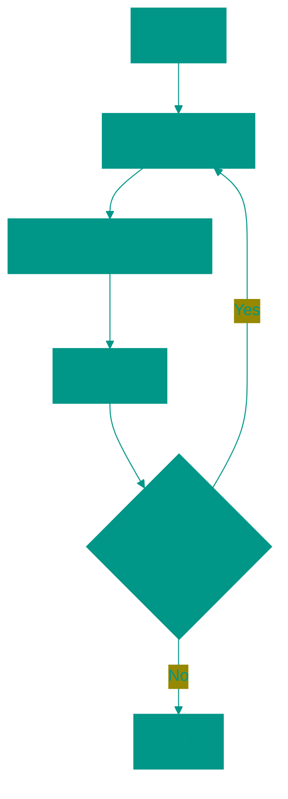
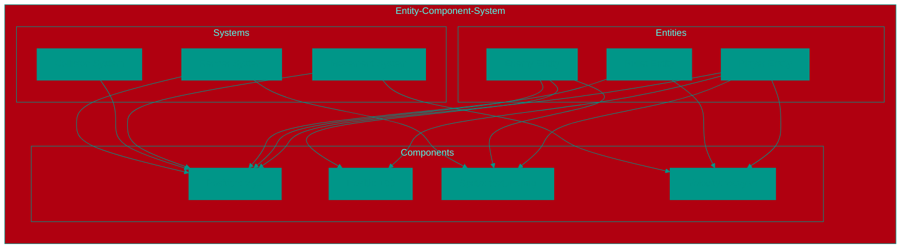
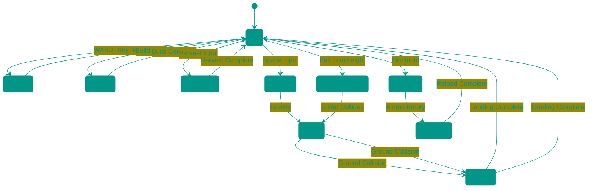

# 💻 Game Programming

## 📑 Contents
1. [Fundamentals of Game Programming](#fundamentals-of-game-programming)
2. [Game Code Architecture](#game-code-architecture)
3. [Programming Patterns in Games](#programming-patterns-in-games)
4. [Programming Languages for Games](#programming-languages-for-games)
5. [Frameworks and Libraries](#frameworks-and-libraries)
6. [Game Code Optimization](#game-code-optimization)

---

## 1. 🧠 Fundamentals of Game Programming

### 🔄 Main Game Loop
The heart of every game is an infinite loop that repeats again and again:



### 🧩 Core Components:
1. **Input Handling** — keyboard, mouse, gamepad
2. **State Update** — movement, physics, logic
3. **Rendering** — drawing to screen
4. **Timing** — synchronization (FPS)

### 📏 Example Pseudocode:
```
while (game_is_running) {
    handle_input()
    update_game_state()
    render_graphics()
    sleep_or_wait_for_next_frame()
}
```

---

## 2. 🏗️ Game Code Architecture

### 🧱 Entity-Component-System (ECS)
Modern approach to organizing game code, where:
*   **Entity** — object in the game (player, enemy, bullet)
*   **Component** — data (position, health, sprite)
*   **System** — logic (movement, collisions, rendering)



### 🔄 Traditional Approach vs ECS:
*   **Traditional:** Player, Enemy, Bullet — as separate classes
*   **ECS:** Everything — entities with different components

---

## 3. 🧩 Programming Patterns in Games

### 🎮 State Machine
Used for managing character state:

**Example from Fortnite:**

In Fortnite, the state machine is actively used to manage various character states during combat and movement:



**Examples of character states in Fortnite:**
1. **Idle** — player stands in place
2. **Walking/Running** — movement across the map
3. **Building** — constructing walls, floors, stairs
4. **Harvesting** — chopping down trees, stone, metal
5. **Jumping/Falling/Landing** — vertical movement
6. **Attacking** — shooting weapons
7. **Reloading** — replenishing ammunition
8. **GliderDeployed** — gliding after jumping from height
9. **Eliminated** — state after defeat

Each state has its own behavior rules and transitions between states, allowing precise control of character actions depending on the current situation in the game.

### 🎯 Observer Pattern
Allows objects to observe changes in other objects:
*   When health drops to 0 → trigger "death" event
*   When score increases → update UI

### 🧱 Object Pool
Prevents frequent object creation/destruction (e.g., bullets):
*   Create pool of objects in advance
*   Take from pool when needed
*   Return to pool when not needed

---

## 4. 💬 Programming Languages for Games

### 🎯 Most Popular:

#### C++
*   **Advantages:**
    *   High performance
    *   Full memory control
    *   Used in AAA games
*   **Disadvantages:**
    *   Complex syntax
    *   Manual memory management
*   **Examples:** Unreal Engine, CryEngine, Call of Duty

#### C#
*   **Advantages:**
    *   Simplicity and readability
    *   Managed memory (GC)
    *   Great Unity integration
*   **Disadvantages:**
    *   Less performance control
    *   .NET dependency
*   **Examples:** Unity, Godot (partially)

#### C
*   **Advantages:**
    *   Maximum performance
    *   Minimal overhead
    *   Used in low-level code
*   **Disadvantages:**
    *   No OOP
    *   Manual memory management
*   **Examples:** Some engines, embedded systems

#### Python
*   **Advantages:**
    *   Simplicity and rapid development
    *   Great tools for prototyping
    *   Rich ecosystem
*   **Disadvantages:**
    *   Low performance
    *   Not suitable for main game code
*   **Examples:** Developer tools, scripts, prototypes

#### JavaScript
*   **Advantages:**
    *   Web games
    *   Rapid development
    *   Large community
*   **Disadvantages:**
    *   Limited capabilities for complex games
    *   Browser dependency
*   **Examples:** HTML5 games, Phaser, Three.js

#### Rust
*   **Advantages:**
    *   High performance
    *   Memory safety
    *   Modern syntax
*   **Disadvantages:**
    *   Steep learning curve
    *   Fewer ready solutions
*   **Examples:** New indie projects, experimental engines

---

## 5. 📚 Frameworks and Libraries

### 🎮 Popular Frameworks:

#### Unity
*   **Language:** C#
*   **Platforms:** All major
*   **Features:** Visual editor, ECS, great documentation

#### Unreal Engine
*   **Language:** C++, Blueprint
*   **Platforms:** PC, consoles, mobile
*   **Features:** Visual programming, photorealism

#### Godot
*   **Language:** GDScript, C#, C++, Visual Script
*   **Platforms:** All major
*   **Features:** Open source, lightweight

#### SDL (Simple DirectMedia Layer)
*   **Language:** C/C++
*   **Platforms:** All major
*   **Features:** Low-level access to graphics and input

#### Allegro
*   **Language:** C/C++
*   **Platforms:** All major
*   **Features:** Simplicity, good for learning

#### MonoGame
*   **Language:** C#
*   **Platforms:** All major
*   **Features:** Open source, based on XNA

#### Phaser
*   **Language:** JavaScript/TypeScript
*   **Platforms:** Web
*   **Features:** HTML5 games, 2D and 3D

---

## 6. ⚡ Game Code Optimization

### 📊 Profiling:
*   **CPU Profiler** — identifies "hot spots" in code
*   **Memory Profiler** — tracks memory leaks
*   **GPU Profiler** — analyzes graphics performance

### 🚀 Optimization Techniques:

#### Spatial Partitioning
*   **Quadtree/Octree** — efficient collision detection
*   **Grid-based** — dividing world into cells

#### Object Pooling
*   Prevents frequent memory allocation/deallocation
*   Especially important for frequently created objects (bullets, effects)

#### Multithreading
*   **Game Logic** in one thread
*   **Rendering** in another thread
*   **Resource Loading** in background threads

#### Caching
*   Cache computed values
*   Avoid repeated expensive calculations

### 🧠 Best Practices:
1. **Avoid premature optimization** — make it right first, then fast
2. **Measure, don't guess** — use profilers
3. **Cache expensive operations** — save computation results
4. **Minimize allocations** — avoid frequent memory allocation
5. **Batch similar operations** — group similar tasks

---

## 7. 🚀 Conclusion

Game programming requires understanding of specific patterns and approaches that differ from traditional software development. A successful game must be not only functional but also efficient, responsive, and scalable.

The next materials will cover graphics in games, sound, physics, and other important development aspects.

<!-- QUIZ_START
[
    {
        "question": "Which programming pattern is used for managing character state in a game?",
        "options": [
            "Observer Pattern",
            "State Machine",
            "Singleton Pattern",
            "Factory Pattern"
        ],
        "correctIndex": 1
    },
    {
        "question": "Which programming language is most commonly used in the Unity engine?",
        "options": [
            "C++",
            "Java",
            "C#",
            "Python"
        ],
        "correctIndex": 2
    },
    {
        "question": "What does the abbreviation ECS mean in the context of game architecture?",
        "options": [
            "Entity-Component-System",
            "Event-Controller-Service",
            "Engine-Core-Subsystem",
            "Element-Code-Structure"
        ],
        "correctIndex": 0
    }
]
QUIZ_END -->