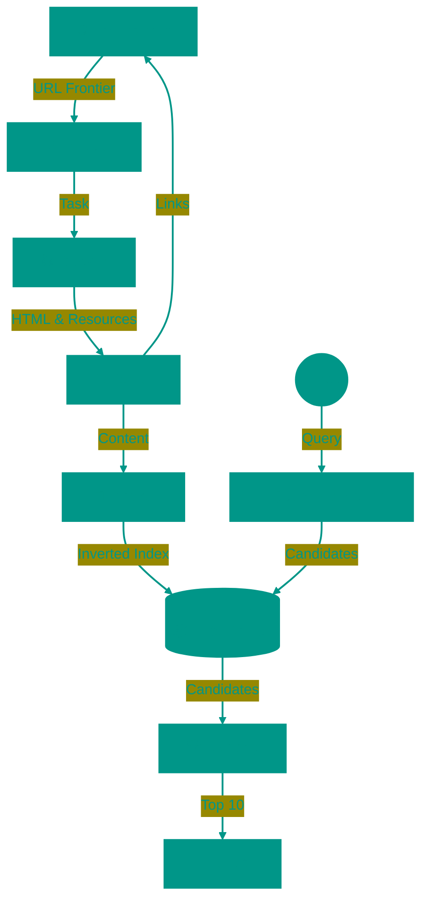

# 🔍 Search Engines: Architecture and Algorithms

A search engine is not merely a website with a search bar; it is one of the most complex engineering systems ever built, designed to organize the chaos of the World Wide Web. When you enter a query, the system doesn't start searching for an answer at that very moment. Instead, it retrieves a result from a meticulously prepared index, built over weeks. This process relies on three fundamental stages: Crawling, Indexing, and Ranking.

---


## 🏗️ How it Works



---


## 1. 🕷️ Crawling
The entire process begins with content discovery. This is the job of automated programs known as **Web Crawlers** or Spiders (e.g., Googlebot).


### The Discovery Process
Imagine the internet as an infinite library with no catalog, where books (pages) are scattered on the floor. A crawler acts as a librarian who picks up one book, reads it, and notes down every reference (link) to other books. Then, it rushes to find those new books and repeats the process.


### Technical Nuances
1.  **Seed URLs**: Crawlers cannot start from "nowhere." They rely on a curated list of high-quality, high-traffic websites (like Wikipedia or news aggregators) as starting points to dive deeper into the web.
2.  **Crawl Budget**: A search engine cannot crawl your site indefinitely—it's expensive in terms of computing power and bandwidth. The "budget" allocated to a site depends on its popularity (PageRank) and server response speed. If your server is slow, the crawler will leave sooner to save resources.
3.  **URL Frontier & Duplicates**: The crawler must intelligently distinguish between URLs like `example.com/page?id=1` and `example.com/page?id=1&sort=asc`. If the content is identical, the system uses canonicalization to avoid wasting resources on duplicates.
4.  **Politeness Policies**: Responsible bots adhere to the directives in `robots.txt`, a file where administrators can block access to technical sections, admin panels, or sensitive data.

---


## 2. 🗂️ Indexing
Downloading a page is only half the battle. The information must be stored in a way that allows retrieval in milliseconds.


### Forward vs. Inverted Index
A standard database stores data as a **Forward Index**: `Document 1 -> [List of Words]`. This is great for reading a book but terrible for searching. If you ask, "Which books mention an elephant?", you'd have to re-read every single book.

Search engines use an **Inverted Index**—analogous to the subject index at the back of a textbook:
*   Word "Elephant" -> [Page 5, Page 12, Page 89]
*   Word "Giraffe" -> [Page 12, Page 44]


### Processing Steps
1.  **Tokenization**: The raw text is broken down into individual words or phrases.
2.  **Normalization & Lemmatization**: Words are reduced to their base forms. "Running," "ran," and "runs" are all mapped to the single token `RUN`.
3.  **Stop Words**: Common words like "the," "and," or "in" are often removed or given lower weight because they appear in almost every document and dilute relevance.
4.  **Sharding**: The index of the entire web is too large for any single supercomputer. It is split into pieces (shards) distributed across thousands of servers. When a query comes in, it is processed in parallel across these shards.

---


## 3. 🥇 Ranking
In response to a query like "buy laptop," the search engine finds millions of matching pages. The goal of ranking is to sort them so the most useful one appears first.


### Ranking Signals
This is the most strictly guarded secret of search engines, but the core principles are well understood:

1.  **Textual Relevance (BM25)**: A classic formula that calculates how often a keyword appears on a page but penalizes excessive repetition (keyword stuffing). The presence of keywords in the `<title>` tag and `H1` headers carries significant weight.
2.  **Link Authority (PageRank)**: The algorithm that made Google famous. A site is considered authoritative if other authoritative sites link to it. It works like scientific citations or a democratic vote: a link is a vote of confidence.
3.  **User Signals**:
    *   **CTR (Click-Through Rate)**: Do users actually click your link in the search results?
    *   **Dwell Time**: How long do they stay? If a user returns to the search results in 3 seconds (known as "Pogo-sticking"), it signals that the page didn't answer their question.
4.  **Technical Quality**: Load speed (Core Web Vitals), mobile-friendliness, and secure HTTPS connections are prerequisites for high rankings.


### Modern AI (Neural Networks)
Simple keyword matching is outdated. Modern algorithms (BERT, MUM) attempt to understand the **intent** behind a query.
*   *Query*: "bank not working what do"
*   *Old Search*: Would look for pages containing "bank" and "working."
*   *New Search*: Understands you likely have a problem with a banking app or need customer support, and can surface status pages or phone numbers directly.

---


## 🏁 The Query Journey
When you hit Enter:
1.  **Spell Check**: Corrects typos ("lplatop" -> "laptop").
2.  **Parallel Search**: The query is sent to thousands of index shards.
3.  **Candidate Retrieval**: Each shard returns its best matches.
4.  **Re-Ranking**: Hundreds of candidates pass through computationally expensive neural networks for final sorting.
5.  **Result**: You see the page. The entire process takes less than **0.5 seconds**.

---


## 4. 🔤 Query Processing

Before the search begins, the query needs to be processed and enhanced.


### Spell Correction
Uses **Levenshtein Distance** (minimum number of operations to transform one word into another).
*   "banan" -> "banana" (1 deletion)
*   "gogle" -> "google" (1 replacement)

The search engine maintains a dictionary of billions of words with their frequencies (from crawling). If your word isn't in the dictionary, it finds the closest match with high frequency.


### Query Expansion
User types "buy laptop", but sites may have "laptops", "notebook", "portable computer".

**Solutions**:
*   **Stemming**: Reducing to root form ("laptop" <- "laptops", "laptop's")
*   **Synonyms**: "laptop" = "notebook" = "portable computer"
*   **Word embeddings**: ML model understands that "laptop" is close to "computer", "MacBook"


### Autocomplete
You type "how to bo", search suggests "how to boil eggs", "how to book flight".

**Algorithm**: Prefix Tree (Trie). Each prefix stores top-10 popular queries.
**Updates**: Trie  is rebuilt every few minutes based on actual user queries.

---


## 5. 💻 Indexing in Practice


### Inverted Index in Python
Simple example of how inverted index works:

```python
from collections import defaultdict

documents = {
    1: "cat sits on window",
    2: "dog barks at cat",
    3: "cat and dog friends"
}

# Building inverted index
inverted_index = defaultdict(list)
for doc_id, text in documents.items():
    for word in text.split():
        inverted_index[word].append(doc_id)

# Search
query = "cat"
result = inverted_index[query]  # [1, 2, 3]
print(f"Word '{query}' found in documents: {result}")
```


### TF-IDF (Term Frequency–Inverse Document Frequency)
Formula for weighing word importance:
*   **TF**: How often the word appears in document
*   **IDF**: How rare the word is across all documents

**Example**: Word "the" appears everywhere -> low IDF -> not important. Word "neuroscience" appears rarely -> high IDF -> important.

```
TF-IDF = (word count in document / total words in document) × log(total documents / documents with word)
```


### Elasticsearch Example
```json
PUT /products
{
  "mappings": {
    "properties": {
      "title": { "type": "text" },
      "price": { "type": "float" }
    }
  }
}

GET /products/_search
{
  "query": {
    "match": {
      "title": "laptop"
    }
  }
}
```

---


## 6. 🤖 Advanced Ranking


### Learning to Rank (LTR)
Instead of manually tuning weights (PageRank × 0.3 + BM25 × 0.5), use **machine learning**. 

**Process**:
1.  Collect thousands of signals (features): title length, link count, CTR, Dwell Time
2. Train model (Gradient Boosting, neural net) on historical data: which pages users clicked for which queries
3. Model predicts "relevance" for new queries


### Neural Ranking (BERT Embeddings)
Traditional search matches keywords. BERT understands meaning.

**Example**:
*   Query: "why is sky blue"
*   Old search: looks for pages with "sky" + "blue"
*   BERT: Understands this is a physics question (Rayleigh scattering), outputs scientific explanations even without word "blue"

**Embeddings**: Words/phrases converted to vectors (arrays of numbers). Semantically similar words have similar vectors.


### Personalization
Two people search "jaguar". One is interested in cars, another in animals. Search engine looks at:
*   Search History (past queries)
*   Location (in Brazil more likely animal, in USA likely car)
*   Device (on mobile more likely looking for nearby stores)

---


## 7. 🚫 Fighting Spam


### Black Hat SEO
Unethical methods to "trick" search engines:

**Link Farms**:
Hundreds of dummy sites linking to each other to artificially boost PageRank.

**Keyword Stuffing**:
Page with text: "buy cheap buy online buy discount buy now buy fast buy". Used to work, now penalized.

**Cloaking**:
Showing one content to crawlers (SEO-optimized text), different content to users (ads, spam).


### Google Penalties
Google periodically updates algorithms to "punish" spammers:

*   **Panda (2011)**: Demoted sites with low-quality content (content farms)
*   **Penguin (2012)**: Penalized for buying links and link spam
*   **Fred (2017)**: Removed sites with more ads than content

**Result**: Sites lose 90% of traffic overnight.

---


## 8. 🌐 Distributed Systems


### MapReduce for Indexing
The internet has billions of pages. How to index them?

**Map**: Each server processes its portion of pages, extracts words and creates pairs (word, page ID).
**Reduce**: All pairs with the same word are collected together and sorted.

**Example**: Server 1 found "cat" on page 123. Server 2 found "cat" on page 456. Reduce combines: `cat -> [123, 456]`.


### Consistent Hashing for Sharding
The index is split into shards (partitions). How to distribute words across servers?

**Problem**: If adding a new server, you'd need to redistribute half the data.
**Solution**: Consistent Hashing. Adding a server affects only ~1/N of the data.


### Replication and Consistency
Each shard is replicated to 3 servers (master + 2 replicas). If master fails, replica becomes master.

**Trade-off**: Consistency vs Availability (CAP theorem). Search engines choose Availability: better to show slightly stale result than nothing.

---


## 9. 🎯 Vector Search


### Semantic Search
Traditional search: "buy iPhone" ≠ "purchase Apple smartphone".
Vector search: converts query and documents into vectors (embeddings). Finds nearest vectors.


### Word Embeddings
*   **Word2Vec** (2013): Words appearing in similar contexts get similar vectors. "king" - "man" + "woman" ≈ "queen"
*   **BERT** (2018): Considers context. Word "bank" in "money bank" vs "river bank" gets different vectors


### ANN (Approximate Nearest Neighbors)
Exact search for nearest vectors among billions takes minutes. Need approximate algorithms:

*   **FAISS** (Facebook AI): Speeds up search 100-1000x with 95% accuracy
*   **Annoy** (Spotify): Uses trees for fast search

**Applications**: Google Search, YouTube recommendations, Spotify playlists.

---


## 10. 🔧 Practical Example


### Building Mini Search Engine (Python)
```python
import math
from collections import Counter, defaultdict

docs = {
    1: "Python is a programming language",
    2: "Java is also a programming language",
    3: "Python is popular for data science"
}

# Inverted index
inverted_index = defaultdict(set)
for doc_id, text in docs.items():
    for word in text.lower().split():
        inverted_index[word].add(doc_id)

# IDF calculation
def idf(word):
    return math.log(len(docs) / len(inverted_index[word]))

# Search
query = "python programming"
query_words = query.lower().split()
scores = defaultdict(float)

for word in query_words:
    for doc_id in inverted_index.get(word, []):
        scores[doc_id] += idf(word)  # Simplified: TF=1

# Sort by relevance
ranked = sorted(scores.items(), key=lambda x: x[1], reverse=True)
print("Results:", ranked)  # [(1, ~1.4), (2, ~0.7)]
```

**Output**: Document 1 is more relevant (contains both "python" and "programming").

<!-- QUIZ_START 

[
    {
        "question": "What is an Inverted Index and why is it used in search engines?",
        "options": [
            "A database with reverse order records",
            "A data structure like 'Word -> [List of Documents]' that allows quickly finding where a word appears",
            "An encryption algorithm",
            "A URL sorting method"
        ],
        "correctIndex": 1
    },
    {
        "question": "What problem does Google's PageRank solve?",
        "options": [
            "Speeds up page loading",
            "Determines page authority based on links from other authoritative sites",
            "Compresses images on websites",
            "Checks code for errors"
        ],
        "correctIndex": 1
    },
    {
        "question": "What does TF-IDF measure in document ranking?",
        "options": [
            "Time to first download",
            "The importance of a word based on its frequency in a document vs. rarity across all documents",
            "Total file size in descriptors",
            "Transfer failures in data interchange"
        ],
        "correctIndex": 1
    }
]

QUIZ_END -->


