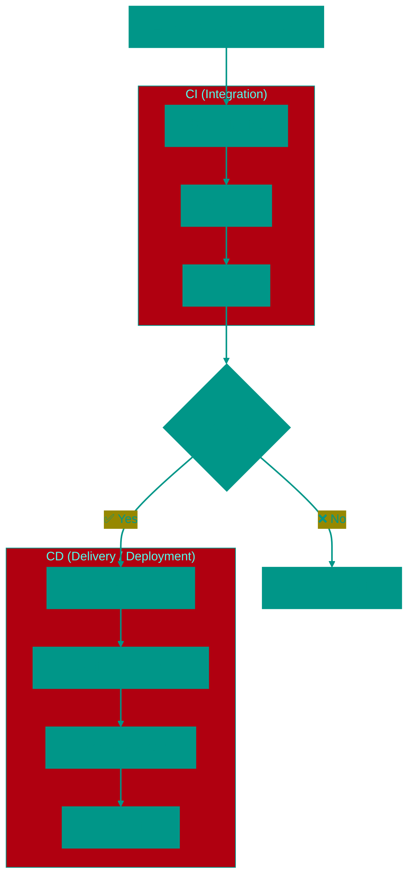

# 🚀 CI/CD: Continuous Integration and Delivery

## 📑 Table of Contents
1. [What is CI/CD?](#what-is-it)
2. [The Pipeline Stages](#primary-stages-the-pipeline)
3. [Process Visualization](#visualization)
4. [Why is it Necessary?](#why-it-is-important)
5. [Glossary of Terms](#popular-terms)

---

## ❓ What is it?

**CI/CD** is a combination of practices that allow development teams to release code more frequently, faster, and more reliably. It is the bedrock of modern DevOps culture. 🛠️

Think of it as a factory **Pipeline**: raw code enters at the beginning, passes through automated checks, builds, tests, and emerges as a finished product ready to be deployed to servers.

---

## ⚙️ Primary Stages (The Pipeline)

### 1. 🏗️ CI (Continuous Integration)
The practice of frequently merging working developer code into a shared branch (typically `main`).
- **Build**: Verifying that the code compiles successfully.
- **Test**: Running unit tests, linters (checking code style), and security scans.
- **🎯 Goal**: Detect errors as early as possible in the development cycle.

### 2. 🚛 CD (Continuous Delivery)
The automated preparation of code for a release.
- **Result**: Creating a deployable artifact (such as a Docker image or an executable).
- **Staging**: The code is automatically deployed to a testing/pre-production environment.
- **⚠️ Note**: Deployment to the live Production environment still requires manual approval.

### 3. 🚀 CD (Continuous Deployment)
The full automation of the release process: code that passes all tests is immediately delivered to end-users.
- **Hands-off**: Goes from commit to production in minutes.
- **⚡ Risks**: Requires extremely high-quality tests and near-instant monitoring/rollback capabilities.

---

## 📊 Process Visualization

---

## 🌟 Why is it Important?

> [!TIP]
> **Benefits for everyone:**
> - **Velocity**: Release updates every day instead of once a year. ⚡
> - **Reliability**: Automated systems verify code more thoroughly and frequently than humans. 🤖
> - **Peace of Mind**: Small, frequent changes are much easier to fix than massive, monolithic updates. 🧘
> - **Feedback Loop**: You receive instant notification the moment something breaks. 📢

---

## 📖 Popular Terms

- **Pipeline**: The path code takes from the repository to the live server.
- **Artifact**: The final "file" that is actually run (e.g., a Docker image).
- **Environment**: Where the code is currently running (Dev, Test, Staging, Prod).
- **Runner**: The server or process that physically executes your pipeline commands.

---

> [!IMPORTANT]
> CI/CD is essential for any project where stability is valued. Even for solo developers, it eliminates the "it worked on my machine but failed on the server" nightmare. 🛡️

<!-- QUIZ_START 
[
    {
        "question": "What is the difference between Continuous Delivery and Continuous Deployment?",
        "options": ["There is no difference", "Delivery requires manual approval for production release, Deployment is fully automated", "Delivery is faster", "Deployment is cheaper"],
        "correctIndex": 1
    },
    {
        "question": "What is the primary goal of CI (Continuous Integration)?",
        "options": ["Speed up website loading", "Detect errors as early as possible through frequent commits and automated tests", "Replace developers", "Reduce hosting costs"],
        "correctIndex": 1
    },
    {
        "question": "What is a Pipeline in the context of CI/CD?",
        "options": ["A water pipe", "An automated path that code takes from repository to deployment on servers", "A diagram drawing tool", "A type of database"],
        "correctIndex": 1
    }
]
QUIZ_END -->

