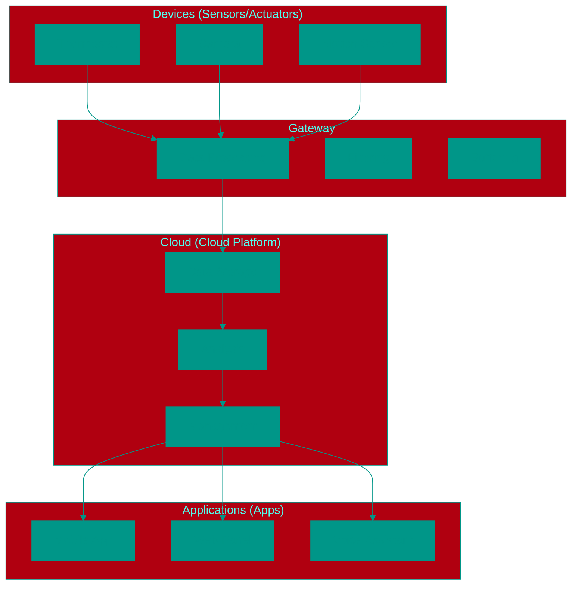
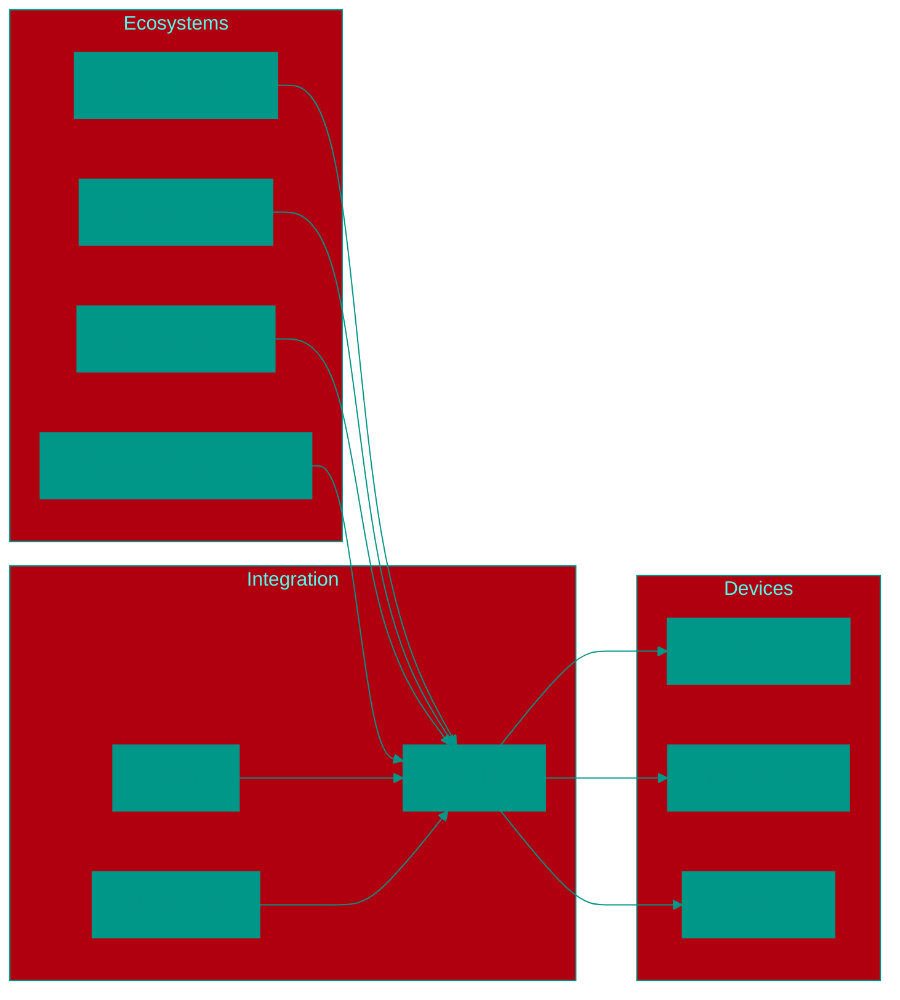

# 🏠 Smart Home and Internet of Things (IoT)

## 📑 Contents
1. [What is IoT?](#what-is-iot)
2. [IoT System Architecture](#iot-system-architecture)
3. [Communication Protocols in IoT](#communication-protocols-in-iot)
4. [Smart Home Devices](#smart-home-devices)
5. [Platforms and Ecosystems](#platforms-and-ecosystems)
6. [IoT Security](#iot-security)
7. [Advantages and Challenges](#advantages-and-challenges)

---

## 1. 🤖 What is IoT?

**IoT (Internet of Things)** is the concept where **physical objects** (things) are equipped with sensors, software, and other technologies to connect and exchange data with other devices and systems over the internet.

### 🔄 Analogy
Imagine a **house where every object can talk**:
*   Kettle says: "I've boiled the water!"
*   Refrigerator says: "Milk is out, ordering delivery"
*   Door says: "A guest has arrived"
*   Light bulb says: "Time to turn on, the owner is waking up"

### 🧩 Key IoT Components:
*   **Sensors** — collect data from the environment
*   **Connectors** — enable internet connectivity
*   **Processors** — process data
*   **Software** — controls the device

---

## 2. 🏗️ IoT System Architecture

### 📊 Typical Architecture:


### 🧱 Architecture Layers:
1.  **Device Layer** — physical sensors and actuators
2.  **Gateway/Edge** — preliminary data processing on-site
3.  **Cloud Layer** — storage, analysis, and management
4.  **Application Layer** — interfaces for users

---

## 3. 🌐 Communication Protocols in IoT

### 📶 Wired Protocols:
*   **Ethernet** — reliable wired connection
*   **Power Line Communication (PLC)** — data transmission over electrical grid

### 📡 Wireless Protocols:

#### 🏠 For Home:
*   **Wi-Fi** — high speed, high bandwidth capacity
*   **Bluetooth / BLE** — low power consumption, short range
*   **Zigbee** — low power consumption, mesh network, ideal for sensors
*   **Z-Wave** — specialized smart home protocol, secure

#### 🏭 For Industry:
*   **LoRaWAN** — long distance, low power consumption
*   **NB-IoT** — narrowband IoT via cellular networks
*   **Sigfox** — transmission of small data volumes over long distances

### 🔄 Protocol Comparison:
| Protocol | Range | Power | Speed | Application |
|----------|-------|-------|-------|-------------|
| Wi-Fi | 30-100m | High | High | Cameras, smart speakers |
| Zigbee | 10-100m | Low | Low | Sensors, switches |
| Z-Wave | 30-100m | Low | Low | Smart home (compatibility) |
| BLE | 10-50m | Very low | Medium | Wearables |

---

## 4. 🏡 Smart Home Devices

### 🌡️ Climate Control:
*   **Smart Thermostat** — regulates temperature by schedule and preferences
*   **Humidifier/Air Purifier** — controls air quality
*   **Wi-Fi Air Conditioners** — phone-controlled operation

### 📡 MQTT Protocol:
*   **MQTT (Message Queuing Telemetry Transport)** — lightweight data transmission protocol
*   **Advantages:** low bandwidth, reliability, publisher-subscriber model support
*   **Application:** sensor data transmission, smart home device control
*   **Operation principle:** clients publish and subscribe to messages in topics via a broker

### 💡 Lighting:
*   **Smart Bulbs** — color, brightness, scheduling
*   **Smart Switches** — remote control of regular lamps
*   **Smart Outlets** — turning devices on/off

### 🔐 Security:
*   **Smart Cameras** — surveillance, motion detection
*   **Door/Window Sensors** — intrusion alerts
*   **Smart Locks** — phone-controlled opening/closing
*   **Alarm Systems** — comprehensive protection

### 🍳 Kitchen and Appliances:
*   **Smart Refrigerator** — inventory list, recipes
*   **Smart Oven/Stove** — control and timers
*   **Smart Coffee Maker** — scheduled brewing

### 🏠 Infrastructure:
*   **Central Hub** — integrates devices from different manufacturers
*   **Voice Assistants** — Alexa, Google Assistant, Siri
*   **Gateways** — enable communication between protocols

---

## 5. 🧩 Platforms and Ecosystems

### 🏪 Closed Ecosystems:
*   **Apple HomeKit** — security, Apple integration
*   **Google Nest** — artificial intelligence, voice control
*   **Samsung SmartThings** — wide compatibility, automation

### 🌐 Open Platforms:
*   **Home Assistant** — self-hosted system, full control
*   **OpenHAB** — flexible configuration, multi-protocol support
*   **Node-RED** — visual programming for automation

### 🔄 Integration:


---

## 6. 🛡️ IoT Security

### 🚨 Main Threats:
1.  **Weak Passwords** — devices often use default credentials
2.  **Firmware Vulnerabilities** — non-updatable systems
3.  **Unencrypted Traffic** — data interception
4.  **Insufficient Authentication** — access without verification

### 🔒 Security Recommendations:
*   **Change Default Passwords** to unique ones
*   **Regular Firmware Updates** to the latest version
*   **Use VPN** for remote access
*   **Network Segmentation** — separate network for IoT devices
*   **Traffic Monitoring** — track suspicious activity

### 🏠 Secure Setup:
```yaml
Network:
  - Separate IoT network (IoT VLAN)
  - Disable WPS (vulnerability)
  - Router firmware updates

Devices:
  - Unique passwords
  - Disable unnecessary features
  - Regular updates

Platforms:
  - Two-factor authentication
  - Access restrictions
  - Connected device audit
```

---

## 7. ⚖️ Advantages and Challenges

### ✅ Advantages:
1.  **Convenience** — control everything from one device
2.  **Energy Efficiency** — automatic consumption management
3.  **Security** — surveillance and alarms
4.  **Automation** — scheduled and event-based scenarios
5.  **Monitoring** — real-time home status data

### ❌ Challenges:
1.  **Setup Complexity** — requires technical knowledge
2.  **Internet Dependency** — many functions unavailable without internet
3.  **Compatibility Conflicts** — devices from different brands may not work together
4.  **Privacy** — collection of user habit data
5.  **Security** — potential entry points for hackers

---

## 8. 🚀 Future of IoT and Smart Home

*   **AI and Machine Learning** — devices will learn from user behavior
*   **Edge Computing** — processing data on-device rather than in the cloud
*   **Unified Standards** — better compatibility between manufacturers
*   **Energy-Independent Sensors** — powered by harvesting energy from the environment
*   **Smart City Integration** — interaction with urban infrastructure

<!-- QUIZ_START
[
    {
        "question": "What does the acronym IoT stand for?",
        "options": [
            "Internet of Technology",
            "Intelligent Objects Technology",
            "Internet of Things",
            "Integrated Online Tools"
        ],
        "correctIndex": 2
    },
    {
        "question": "Which protocol is best suited for low-power sensors?",
        "options": [
            "Wi-Fi",
            "Bluetooth",
            "Zigbee",
            "Ethernet"
        ],
        "correctIndex": 2
    },
    {
        "question": "What is Home Assistant?",
        "options": [
            "Amazon's voice assistant",
            "A platform for managing smart homes",
            "A type of smart device",
            "A communication protocol"
        ],
        "correctIndex": 1
    }
]
QUIZ_END -->