# 🚀 CI/CD: Continuous Integration and Delivery

## 📑 Table of Contents
1. [What is CI/CD?](#what-is-it)
2. [The Pipeline Stages](#primary-stages-the-pipeline)
3. [Process Visualization](#visualization)
4. [Why is it Necessary?](#why-it-is-important)
5. [Glossary of Terms](#popular-terms)

---

## ❓ What is it?

**CI/CD** is a combination of practices that allow development teams to release code more frequently, faster, and more reliably. It is the bedrock of modern DevOps culture. 🛠️

Think of it as a factory **Pipeline**: raw code enters at the beginning, passes through automated checks, builds, tests, and emerges as a finished product ready to be deployed to servers.

---

## ⚙️ Primary Stages (The Pipeline)

### 1. 🏗️ CI (Continuous Integration)
The practice of frequently merging working developer code into a shared branch (typically `main`).
- **Build**: Verifying that the code compiles successfully.
- **Test**: Running unit tests, linters (checking code style), and security scans.
- **🎯 Goal**: Detect errors as early as possible in the development cycle.

### 2. 🚛 CD (Continuous Delivery)
The automated preparation of code for a release.
- **Result**: Creating a deployable artifact (such as a Docker image or an executable).
- **Staging**: The code is automatically deployed to a testing/pre-production environment.
- **⚠️ Note**: Deployment to the live Production environment still requires manual approval.

### 3. 🚀 CD (Continuous Deployment)
The full automation of the release process: code that passes all tests is immediately delivered to end-users.
- **Hands-off**: Goes from commit to production in minutes.
- **⚡ Risks**: Requires extremely high-quality tests and near-instant monitoring/rollback capabilities.

---

## 📊 Process Visualization

```mermaid
flowchart TD
    A["💻 Developer Pushes Code"] --> B["🏗️ CI Pipeline"]
    subgraph "CI (Integration)"
    B --> C["📦 Build"]
    C --> D["🧪 Tests"]
    end
    D --> E{Everything OK?}
    E -- "❌ No" --> F["⚠️ Failure (Fix it!)"]
    E -- "✅ Yes" --> G["📦 Artifact Created"]
    
    subgraph "CD (Delivery / Deployment)"
    G --> H["🛠️ Staging Environment"]
    H --> I["🔘 Manual Approval"]
    I --> J["🚀 Production"]
    end
```

---

## 🌟 Why is it Important?

> [!TIP]
> **Benefits for everyone:**
> - **Velocity**: Release updates every day instead of once a year. ⚡
> - **Reliability**: Automated systems verify code more thoroughly and frequently than humans. 🤖
> - **Peace of Mind**: Small, frequent changes are much easier to fix than massive, monolithic updates. 🧘
> - **Feedback Loop**: You receive instant notification the moment something breaks. 📢

---

## 📖 Popular Terms

- **Pipeline**: The path code takes from the repository to the live server.
- **Artifact**: The final "file" that is actually run (e.g., a Docker image).
- **Environment**: Where the code is currently running (Dev, Test, Staging, Prod).
- **Runner**: The server or process that physically executes your pipeline commands.

---

> [!IMPORTANT]
> CI/CD is essential for any project where stability is valued. Even for solo developers, it eliminates the "it worked on my machine but failed on the server" nightmare. 🛡️
