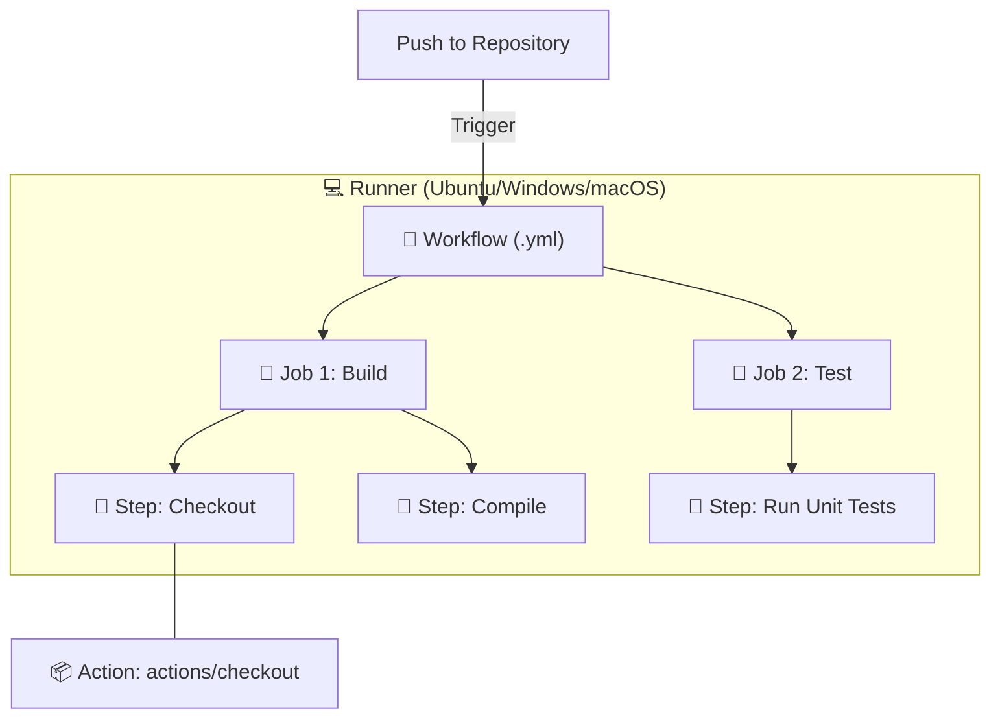

# 🤖 GitHub Actions: In-Repo Automation

## 📑 Table of Contents
1. [What is GitHub Actions?](#what-is-github-actions)
2. [Core Concepts](#key-concepts)
3. [How it Works (Diagram)](#process-flow)
4. [Example YAML Configuration](#sample-pipeline)
5. [Pro-Tips for Developers](#best-practices)

---

## ❓ What is GitHub Actions?

**GitHub Actions** is a native CI/CD platform built directly into GitHub. It allows you to automate your build, test, and deployment workflows directly within your repository. 🏗️

You don't need to manage external servers (like Jenkins); instead, everything runs in GitHub's managed cloud environment.

---

## 🧩 Core Concepts

To understand how it works, imagine a "Matryoshka" doll structure:

1. **🚀 Workflow**: The entire automated process, defined in a `.yml` file.
2. **🔔 Event**: A trigger that starts the process (e.g., a `push`, `pull_request`, or even a schedule).
3. **💼 Job**: A collection of steps that execute on the same virtual machine (Runner).
4. **👣 Step**: An individual task, such as running a command or an "Action."
5. **📦 Action**: A reusable "building block" (e.g., `actions/checkout` or `actions/setup-go`).
6. **🖥️ Runner**: The virtual environment (Linux, Windows, or macOS) where your code actually runs.

---

## 🗺️ Process Flow



---

## 📝 Example YAML File

This file must be placed in `.github/workflows/main.yml`:

```yaml
name: CI Pipeline 🚀

on:
  push:
    branches: [ main ]
  pull_request:
    branches: [ main ]

jobs:
  test-and-build:
    runs-on: ubuntu-latest

    steps:
      - name: 📥 Source Checkout
        uses: actions/checkout@v4

      - name: ⚙️ Setup Environment
        run: echo "Installing dependencies..."

      - name: 🧪 Unit Testing
        run: echo "Running tests..."

      - name: 📦 Application Build
        run: echo "Building application..."
```

---

## 💡 Practical Tips

> [!TIP]
> **For Beginners:**
> - **Start Small**: Automate your tests first, and worry about automatic deployment later. 🧪
> - **GitHub Marketplace**: Don't reinvent the wheel—search for pre-made actions for common tasks (Docker, AWS, etc.). 🛒
> - **Environment Secrets**: Never hardcode passwords. Use `Settings > Secrets and variables` in your repo. 🔑

---

> [!IMPORTANT]
> YAML is extremely sensitive to **indentation and whitespace**. A single misplaced space can cause the entire workflow to fail! 📏
