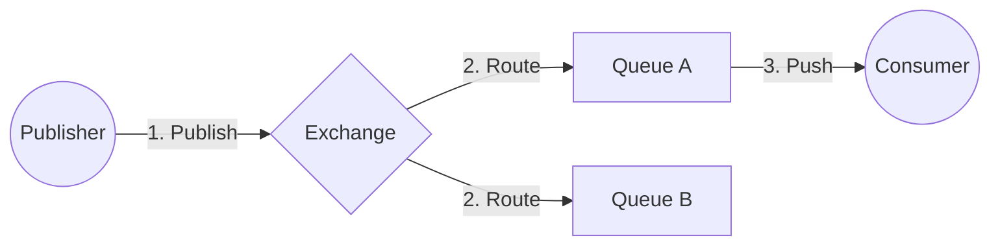
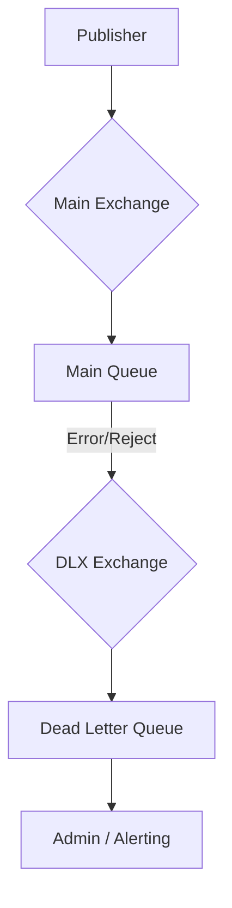

# 🐰 RabbitMQ

## 📑 Table of Contents
1. [What is it?](#what-is-it)
2. [How it Works](#workflow)
3. [Delivery Guarantees](#delivery-guarantees)
4. [Dead Letter Exchange (DLX)](#dlx)

---

## 1. 🤔 What is it?

**RabbitMQ** is a "smart" message broker. Unlike Kafka (which functions primarily as a distributed commit log), RabbitMQ excels at routing messages based on complex, developer-defined logical rules.

- **Primary Protocol**: AMQP 0.9.1.
- **Architectural Style**: Smart Broker / Dumb Consumer.

---

## 2. ⚙️ Workflow

1. **Publisher**: Does not place messages directly into a queue. Instead, it hands them to an **Exchange** (the "postal worker").
2. **Exchange**: Evaluates the message's "address" (**Routing Key**) and distributes the message to one or more bound **Queues**.
3. **Consumer**: Subscribes to a specific queue. The broker actively pushes messages to the consumer as they arrive (**Push Model**).

---

## 3. 🛡️ Delivery Guarantees

By default, RabbitMQ is optimized for speed over durability. To ensure messages are never lost in transit or due to server crashes, three core mechanisms must be enabled:

### 1. Persistence
- **Durable Exchange/Queue**: Ensures the exchange and queue definitions survive a RabbitMQ restart.
- **Persistent Messages**: Messages must be explicitly written to disk (`deliveryMode=2`). Otherwise, they reside only in RAM and are lost if the server stops.

### 2. Publisher Confirms
The sender needs to be notified that RabbitMQ has successfully received and safely handled the message.
- Enable `confirmSelect` on the channel.
- If the broker does not return an `ack` to the sender, the sender should attempt to re-publish.

### 3. Consumer Acknowledgement (Manual Ack)
This is the most critical setting for reliability.
- **Auto-Ack (Default)**: The broker considers a message "delivered" the second it is sent into the TCP socket. If the consumer crashes during processing, the message is permanently lost.
- **Manual-Ack**: The consumer sends an "I have finished processing" signal (`basic.ack`) only **after** it has successfully committed its changes (e.g., to a database). If the consumer disconnects without sending an Ack, the broker re-enqueues the message for another consumer.

---

## 4. 💀 Dead Letter Exchange (DLX)

What happens to messages that simply cannot be processed? If a consumer keeps failing on a specific message (`basic.nack`), it can create a "poison pill" effect and block other work.

**DLX** is a mechanism for routing "dead" messages to a specialized graveyard queue for later inspection.

**Common reasons for messages moving to the DLX:**
1. **Rejected**: A consumer explicitly calls `basic.reject(requeue=false)`.
2. **Expired**: The message's Time To Live (TTL) has passed.
3. **MaxLength**: The specific queue has reached its storage limit.

Administrators or automated monitoring tools can then analyze the DLQ to identify root causes, such as code bugs or malformed data, and manually "replay" fixed messages if necessary.