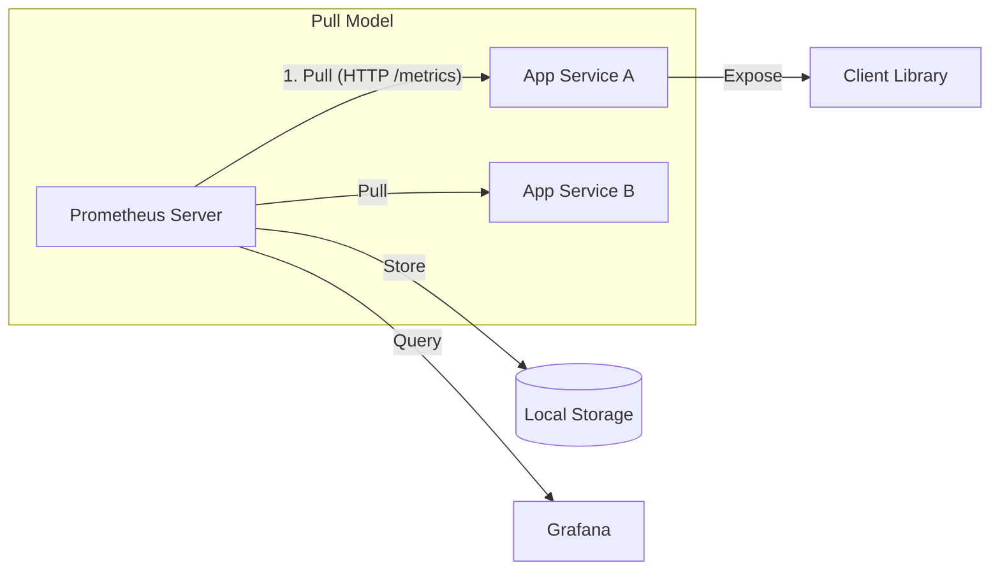

# 📉 Observability and Prometheus

## 📑 Table of Contents
1. [The Three Pillars of Observability](#three-pillars)
2. [What is Prometheus?](#prometheus-overview)
3. [Architecture: Pull vs. Push Model](#architecture)
4. [Primary Metric Types](#metric-types)
5. [PromQL Fundamentals](#promql-basics)

---

## 🏛️ The Three Pillars of Observability

**Observability** is a measure of how well you can understand the internal state of your system solely by observing its external outputs.

The "Golden Trinity" of data for achieving observability includes:
1. **Metrics**: Numerical data. How many requests per second? How much memory is in use? (e.g., Prometheus).
2. **Logs**: Textual data. What exactly happened at a specific point in time? (e.g., ELK Stack).
3. **Traces**: Relational data. What was the exact path of a single user request through multiple microservices? (e.g., Jaeger/Jaeger).

---

## 📊 What is Prometheus?

**Prometheus** is the de-facto standard for monitoring modern, cloud-native systems. 🛠️

- **Time Series Database (TSDB)**: It stores data as time series—sequences of values associated with a timestamp.
- **Multi-dimensional Data**: Metrics are identified by a metric name and a set of key-value pairs called **labels**. Example: `http_requests_total{method="post", status_code="200"}`.

---

## ⚙️ Architecture and Logic

The most defining characteristic of Prometheus is its use of the **Pull Model**.



- **Scraping**: The Prometheus server actively connects to your services every few seconds to "scrape" (pull) the latest metrics.
- **Pushgateway**: Used only for short-lived batch jobs or scripts that cannot wait to be polled.

---

## 🔢 Metric Types

Prometheus defines four core metric types:
1. **Counter**: A cumulative metric that only ever increases (or resets to zero on restart). Example: total requests, total errors. 📈
2. **Gauge**: A metric that can go up or down. Example: CPU usage, current memory consumption, number of active users. 🌡️
3. **Histogram**: Tracks the distribution of events in specific ranges (buckets). Ideal for measuring request latency.
4. **Summary**: Similar to histograms, but calculates quantiles (like p95 or p99) on the client side.

---

## 🔍 PromQL Fundamentals

**PromQL** is the powerful functional query language designed for Prometheus.
Example: *"Give me the average rate of request growth over the last 5 minutes."*
```promql
rate(http_requests_total[5m])
```

---

> [!TIP]
> **Key Recommendation**: Do not attempt to monitor every single variable. Focus on the **"Four Golden Signals"**:
> - **Latency**: The time it takes to service a request.
> - **Traffic**: The demand being placed on your system.
> - **Errors**: The rate of requests that fail.
> - **Saturation**: How "full" your service is (CPU, RAM, Disk I/O). 🛡️
