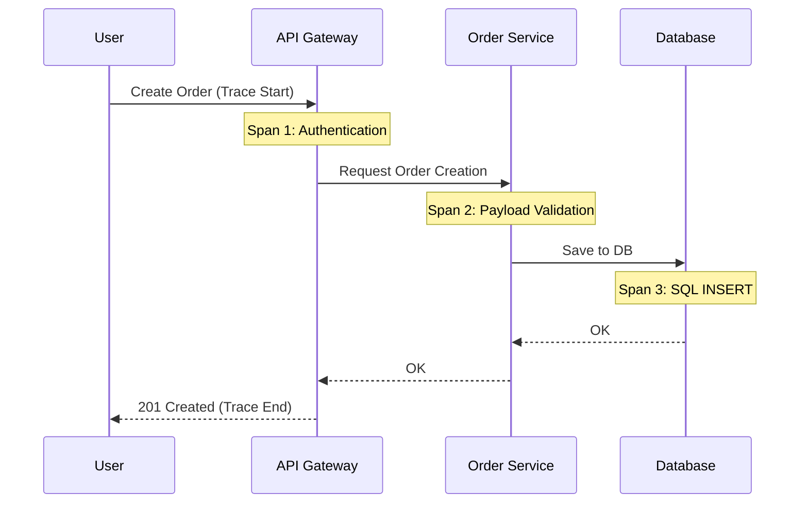

# 🧶 Distributed Tracing and OpenTelemetry

## 📑 Table of Contents
1. [What is Tracing?](#what-is-tracing)
2. [Spans and Traces: Core Concepts](#span-and-trace)
3. [Ecosystem Tools (Jaeger & Zipkin)](#tools)
4. [OpenTelemetry (OTel): The Unified Future](#opentelemetry)
5. [Visualizing the Request Path](#visualization)

---

## ❓ What is Tracing?

In a monolithic application, debugging a slow request is usually straightforward. However, in a microservices architecture, a single user request might traverse 10 different services before returning a response. 🏢

**Distributed Tracing** allows you to track the complete lifecycle of a request across service boundaries, helping you identify exactly where delays (latency) or failures (errors) are occurring.

---

## 🧩 Spans and Traces

- **Trace**: Represents the entire lifespan of a request as it moves through the system. A trace is essentially a collection of spans.
- **Span**: Represents a single unit of work within a service (e.g., a "Database Query," "Cache Lookup," or "External API Call"). 📏

Each span contains:
- Operation name.
- Start and end timestamps.
- **Trace ID**: A unique identifier shared by every span in the entire request chain.
- **Parent ID**: A reference to the preceding span in the chain.

---

## 🛠️ Ecosystem Tools

1. **Jaeger**: The industry favorite for performance debugging, providing a powerful interface to visualize which service call is the "bottleneck." 🏎️
2. **Zipkin**: A classic, highly established tracing system and one of the first to implement the Dapper paper principles.

---

## 🌐 OpenTelemetry (OTel)

This is currently the most significant movement in observability. Previously, integrating different tools (Prometheus for metrics, Jaeger for tracing, ELK for logs) required three different sets of vendor-specific code and libraries.

**OpenTelemetry** provides a single, vendor-agnostic standard and set of SDKs. You instrument your application once using OTel, and it can automatically collect and export metrics, logs, and traces to any backend of your choice (Grafana, Datadog, Jaeger, etc.). 🛠️✨

---

## 📊 Process Visualization

---

## 🌟 Why Does It Matter?

> [!IMPORTANT]
> **Distributed Tracing is the only way to effectively:**
> - pinpoint specific "bottlenecks" in a chain of dozens of services. 🔍
> - understand how errors propagate across your architecture (cascading failures).
> - visualize the actual, living architecture of your system as seen by the request.

---

## 💡 Practical Best Practices

> [!TIP]
> 1. **Context Propagation**: The most complex part of tracing is ensuring the Trace ID travels between services (usually via HTTP headers). In Go, the standard way to handle this is using the `context.Context` package.
> 2. **Efficient Sampling**: Storing a full trace for every single request can be extremely resource-intensive. Most production systems use **Sampling** to only save a fraction (e.g., 1% or 5%) of requests to balance visibility with performance/storage costs. 📉
