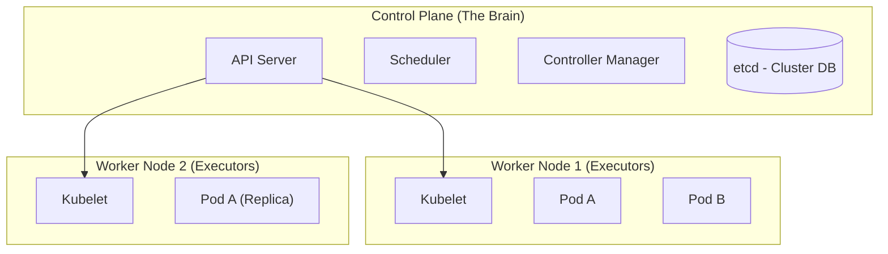

# ☸️ Kubernetes (K8s)

## 📑 Table of Contents
1. [Why do we need K8s?](#why-k8s)
2. [Architecture (Control Plane & Worker Nodes)](#architecture)
3. [Core Objects (Pod, Deployment, Service)](#core-objects)

---

## 1. 🤔 Why do we need K8s?

Imagine you are managing 100 Docker containers.
- How do you monitor all of them to ensure they stay healthy?
- What happens if a physical server catches fire?
- How do you scale up your capacity instantly during a "Black Friday" traffic spike?

Doing this manually is impossible. You need an orchestrator—a conductor for your container symphony.
**Kubernetes** is essentially the operating system for your cluster. You define the "Desired State" (e.g., "I want 5 copies of my frontend running"), and K8s makes it happen, automatically finding available servers and restarting containers if they crash.

---

## 2. 🏗️ Architecture (Master & Worker)

K8s is not a single computer, but a distributed network of machines.

### 🧠 Control Plane (Master Node)
The decision-making heart of the cluster.
- **API Server**: The primary entry point. Every command you send (via `kubectl`) goes here.
- **Scheduler**: Decides which Worker Node should host a new Pod based on available RAM and CPU resource requests.
- **etcd**: A distributed key-value store that keeps the definitive state of the entire cluster.

### 👷 Worker Node
The heavy lifters that actually run the containers.
- **Kubelet**: An agent running on each node that ensures containers are running in a Pod as instructed by the Control Plane.

---

## 3. 📦 Core Objects

### 🥜 Pod
The smallest deployable unit in Kubernetes.
- In Docker, the smallest unit is a Container.
- In K8s, it's a **Pod**.
- In 99% of cases, **1 Pod = 1 Container**.
- Occasionally, a Pod ("pea pod") can contain multiple containers ("peas") that share the same network (localhost) and storage.

### 🚀 Deployment
You almost never create individual Pods manually because they are ephemeral (mortal). Instead, you create a **Deployment**.
- A Deployment ensures that a specific number of Pod replicas are running at all times.
- If a server dies, the Deployment controller detects the loss and automatically reschedules the missing Pods onto surviving nodes.

### 🛎️ Service
Pods are assigned dynamic IP addresses that change every time they restart. How do services find each other?
- A **Service** provides a single, stable entry point (and internal load balancer) for a collection of Pods.
- While individual Pods come and go, the Service's address remains constant.

---

## 💡 Summary

**Docker** is for **packaging** your application into a portable unit.
**Kubernetes** is for **running and managing** thousands of those units across a cluster of servers.