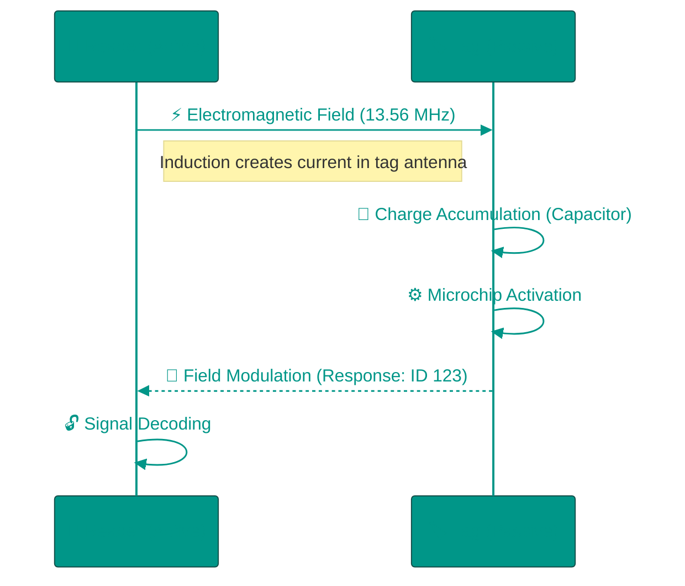

# 📡 RFID and NFC: Wireless Identification

Radio Frequency Identification (RFID) technologies allow objects to "communicate" with the digital world without line of sight or internal power sources. From warehouse logistics to contactless payments, it all runs on the same physical principles.

---

## 🏗️ The Physics of the Process

---

## 1. 📻 RFID (Radio Frequency Identification)
The system consists of two parts: a **Reader** (Interrogator), which generates the field, and a **Transponder** (Tag), which stores the data.

### Energy Transfer Principles
1.  **Inductive Coupling**: Operates at Low (LF) and High (HF) frequencies. The reader creates a magnetic field that permeates the tag's coil, inducing a current (think of a transformer). Effective range: up to 1 meter.
2.  **Backscatter**: Operates at Ultra-High Frequencies (UHF). The reader sends a radio wave, and the tag "reflects" part of this wave back, modulating it with its data. Effective range: 10-100 meters (toll roads, warehouses).

### Standards and Frequencies
*   **LF (125 kHz)**: Basic office access cards. Data is typically unencrypted and easily cloned. Works through water and metal.
*   **HF (13.56 MHz)**: The foundation of modern smart cards (MIFARE) and NFC. Supports strong cryptography.
*   **UHF (860-960 MHz)**: EPC Gen2. Used in retail (clothing stores) to inventory hundreds of items in seconds.

---

## 2. 📱 NFC (Near Field Communication)
NFC is not just a "type of RFID" but an extension of the **ISO 14443** standard. The key difference: an NFC device can act as both a reader and a tag simultaneously.

### Operating Modes
1.  **Reader/Writer**: The phone reads a passive tag (e.g., on a poster), receiving an NDEF message (URL, text).
2.  **Card Emulation**: The phone pretends to be a bank card or transit pass. To the terminal, there is no difference between plastic and a smartphone.
3.  **Peer-to-Peer**: Two active devices exchange data. Used for quick Bluetooth pairing or contact transfer (Android Beam).

### Security and Secure Element
Unlike simple card cloning, phone payments (Apple/Google Pay) are hardware-protected.
*   **Tokenization**: The phone never transmits the real card number. It transmits a one-time token.
*   **Secure Element (SE)**: A separate chip (or isolated processor area) that stores cryptographic keys. even if the OS is compromised by malware, it cannot read the SE memory; it can only request the SE to sign a transaction.

### Threats: Relay Attack
Since NFC works at "touch" distance, it's hard to eavesdrop. But it can be extended. Attacker 1 stands near you in the subway with an antenna. Attacker 2 stands at a payment terminal with an emulator. The signal is relayed over the internet. You pay for someone else's coffee.
*Protection*: **Distance Bounding**. The signal must return within nanoseconds. If the delay is larger, it means the signal traveled through the internet, and the transaction is blocked.

---

## 3. 🔓 RFID Attacks and Protection

### Cloning Access Cards (LF 125 kHz)
The simplest RFID cards (intercoms, old office badges) transmit IDs in plaintext without encryption.

**Attack Tools**:
*   **Proxmark3**: "Swiss Army knife" for RFID. Reads and emulates cards. Cost ~$300.
*   **Flipper Zero**: Portable device the size of a game console. Can clone LF/HF cards. Popularity on TikTok led to sales ban in Canada (2024).

**How Cloning Works**:
1. Bring Proxmark close to victim's card (in pocket, through bag)
2. Read UID (unique identifier)
3. Write UID to blank T5577 card
4. Use clone for access

**Protection**: Migrate to HF cards with cryptography (MIFARE DESFire, iClass SE).

### Skimming
NFC payment cards transmit data without PIN (for contactless up to a certain amount).

**Attack**: Attacker with portable NFC reader in backpack walks in crowded place (subway, queue). Reader captures card number and expiry through clothes/bag.

**Attack Limitations**:
*   Can read number but not CVV2 (not transmitted via NFC)
*   For online purchase, CVV is needed (on back of card)
*   Tokenization in modern cards makes skimming useless

**Protection**: RFID-blocking wallets (Faraday Cage), or aluminum foil.

---

## 4. 🎴 MIFARE Family: From Vulnerable Classic to Secure DESFire

### MIFARE Classic (1994)
The most widespread smart card globally (transit passes, student IDs, campus payments).

**Vulnerabilities**:
*   **Crypto-1 broken (2008)**: German researchers reverse-engineered the encryption. Darkside attack extracts keys in 20 seconds.
*   **Sector 0 unprotected**: UID can be changed on Chinese "magic cards" (UID Changeable).

**Real Case**: In 2008, Dutch students hacked OV-Chipkaart (national transit card). Could add balance arbitrarily. Transit company sued to block publication but lost in court.

### MIFARE DESFire EV3 (2020)
Modern standard for high-security systems.

**Cryptography**:
*   AES-128 (instead of proprietary Crypto-1)
*   Mutual Authentication (not only card proves to reader, but reader proves to card)
*   Transaction MAC (each operation is signed)

**Applications**: Transit payments (Berlin, Hong Kong Octopus Card), corporate access.

**Price of Security**: DESFire costs $3-5 per unit vs $0.30 for Classic.

---

## 5. 📡 NFC Protocols

### NDEF (NFC Data Exchange Format)
Universal format for storing data in NFC tags. Structure: **Record → Message**.

**Record Types (RTD)**:
*   **URI**: Link (https://example.com)
*   **Text**: Text with language code
*   **Smart Poster**: URL + title + description
*   **MIME**: Arbitrary data (vCard, JSON)

**Usage Example**: Ad poster with NFC tag. User taps phone → opens website + adds event to calendar (via MIME with iCal).

### LLCP (Logical Link Control Protocol)
Peer-to-peer exchange protocol. Used for:
*   **Android Beam** (deprecated, replaced by Nearby Share)
*   **Fast Bluetooth pairing**: NFC transmits MAC address and key, Bluetooth establishes main connection

---

## 6. 🏭 Industrial Applications

### Retail and Inventory
**Problem**: Inventory of clothing store with 10,000 SKUs used to take a week (scanning barcodes manually).

**Solution**: UHF RFID tags on each item. Employee walks with handheld reader → 1000 items/second scanned. Inventory in 1 hour.

**Decathlon Case**: Implemented RFID in 2010. Accelerated inventory by 95%, reduced "out of stock" errors from 13% to 2%. ROI paid off in one year.

**Privacy Issue**: In 2003, Benetton embedded RFID in clothing without notice. Activists organized boycott, worried about post-purchase tracking. Now tags are deactivated at checkout.

### Logistics and Warehouses
**Application**: Amazon uses RFID to track millions of packages. Warehouse robots (Kiva Systems) find shelves by RFID tags.

### Healthcare
**Task**: Track instruments in operating room (each scalpel costs $200, often lost).

**Solution**: UHF tags embedded in instrument handles. Portal at OR exit scans tray. If something missing — alarm.

**Case**: Singapore hospital reduced instrument losses by $100,000/year.

### Transit
*   **Oyster Card (London)**: MIFARE Classic (gradually migrating to DESFire)
*   **Suica/Pasmo (Tokyo)**: Sony FeliCa (proprietary standard, faster than NFC)
*   **Metro Cards (Various)**: MIFARE Ultralight C + MIFARE DESFire

**Transaction Speed**: On subway turnstile, transaction must complete in <300 ms even if passenger walks fast. MIFARE optimized for this (collision avoidance handles multiple cards simultaneously).

---

## 7. 🛡️ Practical Protection Measures

### For Users
*   **RFID-blocking wallets**: Metallized fabric (shielding)
*   **Disable NFC**: If not using — disable in phone settings
*   **Monitor transactions**: Set push notifications for any card operations

### For Organizations
*   **Migrate to DESFire/iClass SE**: Migration from Classic takes years but critical for security
*   **Whitelist systems**: Don't allow arbitrary UID registration (verify chip cryptographic signature)
*   **Physical reader protection**: Embed in wall/turnstile so Proxmark can't be attached for traffic analysis

<!-- QUIZ_START 

[
    {
        "question": "How does a passive RFID tag receive power for its microchip?",
        "options": [
            "From an internal battery",
            "Through solar energy",
            "Through electromagnetic induction from the reader's field",
            "Via Wi-Fi signals"
        ],
        "correctIndex": 2
    },
    {
        "question": "Which frequency range is used for warehouse inventory at distances up to 100 meters?",
        "options": [
            "LF (125 kHz)",
            "HF (13.56 MHz)",
            "UHF (860-960 MHz)",
            "Bluetooth"
        ],
        "correctIndex": 2
    },
    {
        "question": "What is the main advantage of NFC over standard RFID?",
        "options": [
            "NFC works through thick metal",
            "An NFC device can act as both a reader and a tag simultaneously (P2P mode)",
            "NFC doesn't require an antenna",
            "RFID is always more secure"
        ],
        "correctIndex": 1
    }
]

QUIZ_END -->

