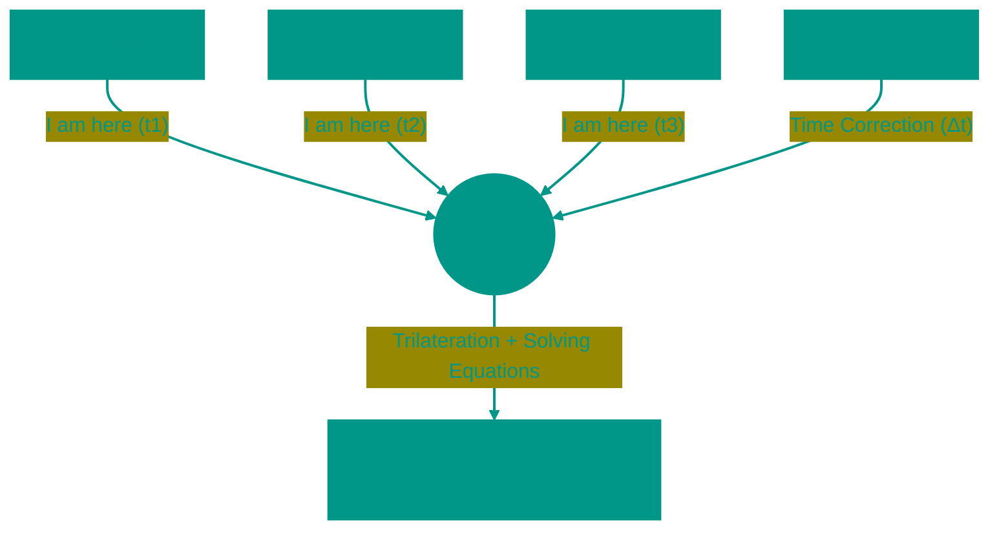

# 🛰️ GPS: Satellite Navigation and Relativity

The Global Positioning System (GPS) is an engineering marvel that proved Einstein right in practice. For your phone to pinpoint your location on a map with 5-meter accuracy, the system must account for effects that distort time and space itself.

---


## 🏗️ Positioning Geometry



---


## 1. 📐 Trilateration
Many believe satellites "see" us. In reality, it is your phone that "hears" the satellites. It is a passive system: you transmit nothing into space.


### How It Works
A satellite continuously broadcasts a radio signal encompassing: "I am Satellite #5, the time is exactly 12:00:00.000."
The phone receives the signal at 12:00:00.067. The time difference (0.067 sec) is multiplied by the speed of light to calculate distance (pseudorange).

*   **1 Satellite**: We are somewhere on the surface of a **sphere** with radius R1.
*   **2 Satellites**: The intersection of two spheres is a **circle**. We are somewhere on this ring.
*   **3 Satellites**: The intersection of the circle and a third sphere yields **two points**. One is deep in space (discarded), the other on Earth (our position).
*   **4 Satellites**: Required for time synchronization.

---


## 2. ⏳ Time and Relativity
For 1-meter accuracy, we need to measure time with a precision of 3 nanoseconds. Any error is multiplied by the speed of light (300,000 km/s). A 0.001-second error results in a 300 km miss!


### Why Do Clocks Run Differently?
Satellites experience two relativistic effects predicted by Einstein:
1.  **Special Relativity (SR)**: The satellite flies at 14,000 km/h. For a fast-moving object, time slows down. Result: clocks lag by **7 μs/day**.
2.  **General Relativity (GR)**: The satellite orbits at 20,000 km, where gravity is weaker than on Earth. In a weaker gravitational field, time flows faster. Result: clocks run fast by **45 μs/day**.

**Net Effect**: Satellite clocks run ahead by `45 - 7 = 38` microseconds per day. If uncorrected, navigation would drift by **11 km** daily. Engineers intentionally "slow down" the atomic clocks before launch so they tick synchronously with Earth time once in orbit.

---


## 3. 🎯 Accuracy and Errors (GDOP)
Even with atomic clocks (Cesium or Rubidium), errors exist.

*   **Ionosphere**: A layer of charged particles at 60-1000 km slows down radio signals. This introduces the largest error (up to 5-10 meters).
*   **Multipath**: In cities, signals bounce off buildings ("echoes"). The receiver confuses the direct signal with the reflected one, thinking the satellite is farther than it is.
*   **GDOP (Geometric Dilution of Precision)**: A geometric factor. If all visible satellites correspond to one small patch of sky, accuracy drops (high DOP). If they are spread across the horizon, accuracy is maximized (low DOP).


### How to Get Centimeter Accuracy?
Standard GPS gives 3-5 meters. This isn't enough for geodesy or precision agriculture.
**DGPS (Differential GPS)** and **RTK (Real Time Kinematic)** are used:
A fixed Base Station with known coordinates is placed on the ground. It sees the same satellites, calculates the error ("GPS says I'm here, but I know I'm there → error 1.5 meters North"), and transmits corrections to your receiver (Rover) via radio or internet. This yields accuracy up to **1-2 cm**.

---


## 4. ⚡ A-GPS (Assisted GPS)
A GPS "cold start" (searching for satellites and downloading the almanac) can take 12 minutes.
Phones cheat: they download current orbital data via 4G/Wi-Fi from Apple/Google servers. This allows finding satellites in 2-3 seconds (Time to First Fix).

---


## 5. 🌍 Alternative GNSS (Global Navigation Satellite Systems)


### System Comparison

| System | Country | Satellites | Launch | Accuracy (Civilian) |
|---------|---------|-----------|--------|---------------------|
| **GPS** | USA | 31 | 1978 | 3-5 m |
| **GLONASS** | Russia | 24 | 1982 | 3-7 m |
| **Galileo** | EU | 30 | 2016 | 1 m |
| **BeiDou** | China | 35 | 2000 | 3-5 m |


### System Features

**GLONASS**:
*   Uses FDMA (Frequency Division) instead of CDMA. Each satellite transmits on separate frequency
*   Better performance at high latitudes (polar orbits)
*   Dual-frequency signals in civilian band (L1, L2) — protection from ionospheric interference

**Galileo**:
*   Most accurate system for civilian use
*   Commercial signal (E6) with encryption for paid services (decimeter accuracy)
*   Search and Rescue: satellites receive signals from emergency beacons (406 MHz) and transmit coordinates to rescuers

**BeiDou**:
*   Supports SMS via satellite (120 characters)
*   Combines MEO (medium orbits) + GEO (geostationary, hovering over Asia for enhanced China coverage)


### Multi-GNSS
Modern chips (Qualcomm, MediaTek) receive signals from all 4 systems simultaneously. This provides:
*   More visible satellites (20-30 instead of 8-12)
*   Better GDOP (geometry)
*   Fault tolerance (if GPS is jammed or under maintenance — can use Galileo)

---


## 6. 🚫 GPS Spoofing and Jamming


### Jamming
**Principle**: Transmitter emits noise on GPS frequencies (1575.42 MHz for L1). Receiver "drowns" in interference.

**Applications**:
*   Military: protecting assets from GPS-guided missiles
*   Criminal: truck drivers jam GPS trackers to steal vehicles

**Case**: In 2013, truck driver at Newark Airport turned on jammer daily. It accidentally jammed aircraft landing system (which uses GPS for precision approach). FBI located him via radio direction finding.

**Protection**: Directional Antennas (narrow beam, point only upward, ignore ground interference).


### Spoofing
**Principle**: Transmitter mimics GPS satellite signals but with false data. Receiver thinks it's in different location/time.

**Case (2011)**: Iran captured American RQ-170 drone. One theory: used spoofing—drone thought it was flying over Afghanistan but was actually over Iran and calmly landed, believing it returned to base.

**Civilian Attacks**:
*   **Pokemon GO** (2016): Players used spoofing apps to show phone coordinates in other countries (caught rare Pokemon without leaving home)
*   **Maritime Vessels**: In 2019, port authorities noticed dozens of ships in Black Sea "teleporting" to airport on land. Presumably Russian EW systems testing spoofing.

**Protection**:
*   Cryptographic signal signatures (Military GPS M-Code, Galileo OS-NMA)
*   Consistency checks: if coordinates jump 100 km in one second — ignore

---


## 7. 📍 Indoor Positioning

GPS doesn't work indoors (signal attenuated 100+ times passing through concrete). Alternatives:


### Wi-Fi Triangulation
**Principle**: Phone sees several Wi-Fi routers, measures signal strength (RSSI), calculates distance to each and triangulates position.

**Database**: Google/Apple collected database of millions of router coordinates (Wi-Fi BSSID → GPS coordinates). When phone sees familiar BSSID, it instantly knows coordinates without GPS.

**Accuracy**: 10-50 meters (depends on router density).


### Bluetooth Beacons (BLE)
**Principle**: Beacons (iBeacon, Eddystone) placed throughout building. They transmit UUID and TX Power. Phone calculates distance by RSSI.

**Applications**:
*   Mall navigation (app shows which floor/store you're in)
*   Museums: audio guide auto-plays when you approach exhibit

**Accuracy**: 1-5 meters.


### UWB (Ultra-Wideband)
**Principle**: Like GPS but miniature. Time of Flight measurement between phone and anchors.

**Applications**:
*   Apple AirTag (finding lost items with centimeter accuracy)
*   BMW: phone in pocket as car key. UWB prevents "relay attack" (unlike Bluetooth)

**Accuracy**: 10-30 cm.

---


## 8. 🧮 Kalman Filter for Trajectory Smoothing


### Problem
GPS outputs coordinates with noise (due to multipath, ionosphere). If you plot "raw" points on map, trajectory jitters: you're walking on sidewalk but points jump to road and back.


### Solution: Kalman Filter
Algorithm that combines:
*   **Prediction** (physics model): "Person walked north at 5 km/h → in 1 sec should be 1.4 m north"
*   **Measurement** (GPS data): "GPS says they're 2 m east"
*   **Correction**: Filter "averages" prediction and measurement considering their reliability

**Result**: Smooth trajectory. Used in:
*   Navigation apps (Google Maps, Waze)
*   Autopilots (Tesla, Waymo)
*   Rockets and drones

**Simple Example (Pseudocode)**:
```
prediction = last_position + velocity * dt
measurement = GPS_reading
kalman_gain = uncertainty_prediction / (uncertainty_prediction + GPS_noise)
new_position = prediction + kalman_gain * (measurement - prediction)
```

---


## 9. 🎯 Practical Calculations


### Example: Calculating Distance to Satellite

Satellite transmits in signal: "Transmission time = 12:00:00.000"
Receiver gets signal at: "Reception time = 12:00:00.067"

**Delay**: 0.067 seconds
**Distance**: 0.067 s × 299,792,458 m/s = **20,086 km**


### Example: How 3 Satellites Give 2 Points

Imagine 2D:
*   Satellite A at 100 km distance → circle radius 100 km
*   Satellite B at 120 km distance → circle radius 120 km
*   Circle intersection = 2 points

One point in space (discard), second on Earth (our position).

In 3D (reality) these are spheres, and 4th satellite needed for time synchronization.

<!-- QUIZ_START 

[
    {
        "question": "What is the minimum number of satellites required to determine a precise 3D location and correct for time errors?",
        "options": [
            "1",
            "2",
            "3",
            "4"
        ],
        "correctIndex": 3
    },
    {
        "question": "Why do clocks on GPS satellites run approximately 38 microseconds faster per day than Earth-bound atomic clocks?",
        "options": [
            "Solar radiation effects",
            "Relativistic effects (weak gravity and high orbital speed)",
            "Absence of atmosphere",
            "A software calibration error"
        ],
        "correctIndex": 1
    },
    {
        "question": "What is the main benefit of A-GPS technology?",
        "options": [
            "It charges the phone via satellite",
            "It speeds up the process of finding satellites ('cold start') via the internet",
            "It improves 4G signal strength",
            "It allows GPS to work in underground tunnels"
        ],
        "correctIndex": 1
    }
]

QUIZ_END -->

