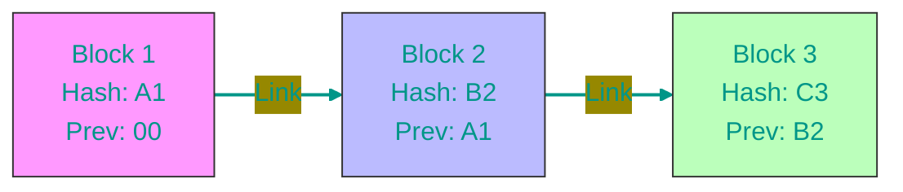

# ⛓️ Blockchain and Cryptocurrency: The Exhaustive Guide

> "Blockchain is a trust machine in a world where trust is gone."

Let's break down cryptocurrency from A to Z. From the philosophy of money to cryptography, DeFi, and scalability solutions.

## 📑 Contents
1. [Philosophy of Money](#1-philosophy-of-money-why-crypto)
2. [Cryptography: The Foundation of Security](#2-cryptography-the-foundation-of-security)
3. [How Blockchain Works (Architecture)](#3-how-blockchain-works-architecture)
4. [Transaction Lifecycle](#4-transaction-lifecycle)
5. [Consensus (PoW vs PoS)](#5-consensus-how-the-network-agrees)
6. [Scalability and Layer 2](#6-scalability-and-layer-2)
7. [Coins vs Tokens](#7-coins-vs-tokens-whats-the-difference)
8. [Smart Contracts and DeFi](#8-smart-contracts-and-defi)
9. [Security: Wallets and Keys](#9-security-wallets-and-keys)
10. [Stablecoins](#10-stablecoins)
11. [Crypto Glossary](#11-crypto-glossary)

---

## 1. 💸 Philosophy of Money: Why Crypto?

To understand Bitcoin, you need to understand money.

- **Barter**: Chicken for boots. Inconvenient (double coincidence of wants).
- **Gold**: Rare, durable, hard to fake. Heavy to carry and divide.
- **Fiat (Paper Money)**: Backed by government decree. Problem: governments can print infinite amounts (inflation), freeze accounts, or block transfers.
- **Cryptocurrency**: Digital gold.
    - **Limited Supply**: Only 21 million Bitcoins will ever exist. Period.
    - **Censorship Resistance**: No one can stop you from sending money.
    - **Decentralization**: No bank to flag your payment as "suspicious".

---

## 2. 🔐 Cryptography: The Foundation of Security

Blockchain relies on **asymmetric encryption**. Instead of one password, you have a key pair.

### Public and Private Key
Imagine a mailbox with a glass slot.

1.  **Public Key (Address)**: The slot. You give this address to everyone: "Drop money here!" Anyone can put money in.
2.  **Private Key (Password)**: The key to the door. **Only you** have it. Only you can open the box and take (spend) the money.

> [!CAUTION]
> **Never share your Private Key!** If someone has your key, it is THEIR money.

### Digital Signature
When sending Bitcoin, you "sign" the transaction with your private key. The network verifies the signature using your public key: "Yes, the owner authorized this," but the private key itself is never revealed.

---

## 3. ⚙️ How Blockchain Works (Architecture)

**Blockchain** is a Distributed Ledger Technology (DLT).

### Structure
1.  **Block**: Container for transactions. Like a page in a notebook.
2.  **Chain**: Each block is cryptographically linked to the previous one.
3.  **Hashing (SHA-256)**: Unique digital fingerprint.
    - `Hello` -> `185f8db...`
    - `hello` -> `2cf24db...` (change one letter -> completely different hash).

Each block contains the hash of the **previous** block. If a hacker alters Block #10, its hash changes. Block #11 sees the mismatch, and the chain breaks. The network rejects the fraud.

---

## 4. 🔄 Transaction Lifecycle

What happens when you click "Send"?

1.  **Creation**: You enter recipient address and amount. Your wallet signs it.
2.  **Mempool**: The transaction goes to the "waiting room" (Memory Pool).
3.  **Selection**: Miners (or validators) pick transactions with the **highest fees** (like taxi drivers picking high-value rides).
4.  **Block**: The miner bundles transactions into a block and adds it to the chain.
5.  **Confirmation**: The block is propagated. As subsequent blocks are added, the transaction becomes irreversible.

---

## 5. 🤝 Consensus: How the Network Agrees

How do millions of computers agree on one truth without a boss?

### ⛏️ Proof of Work (PoW) — "Mining" (Bitcoin)
To add a block, a computer must solve a complex math puzzle. This costs huge energy.
- **Logic**: "You burned so much electricity, you wouldn't lie and waste it."
- **Downside**: Slow and expensive.

### 🥩 Proof of Stake (PoS) — "Staking" (Ethereum, Solana)
Miners are replaced by validators. To validate, you must "lock" (stake) coins.
- **Logic**: "You staked $100,000 as collateral. If you lie, we burn your money (Slashing)."
- **Upside**: Fast, eco-friendly.

---

## 6. 🚀 Scalability and Layer 2

**Blockchain Trilemma**: You can only have 2 of 3: Decentralization, Security, Speed. Bitcoin/Ethereum chose the first two (7-15 TPS). Visa does 24,000.

How to speed up?
1.  **Layer 1 (L1)**: The blockchain itself (Bitcoin, Ethereum). The foundation. Secure but slow.
2.  **Layer 2 (L2)**: Solutions built on top.
    - **Rollups (Arbitrum, Optimism)**: "Zip" thousands of transactions into one "summary" and send only that to Ethereum. 100x cheaper/faster.
    - **Lightning Network (Bitcoin)**: Payment channels. You can swap money back and forth million times; only the final balance hits the blockchain.

> **Analogy**: L1 is the Central Bank (slow settlement). L2 is Visa (instant coffee payments).

---

## 7. 🪙 Coins vs Tokens: The Difference

- **Coin**: Native currency of a blockchain. Used for gas fees.
    - BTC (on Bitcoin), ETH (on Ethereum).
- **Token**: Asset built *on top* of a blockchain. No own network.
    - USDT (ERC-20 token on Ethereum), UNI (Uniswap token).

---

## 8. 📜 Smart Contracts and DeFi

**Smart Contract**: Self-executing code. "If X, then Y."

### DeFi (Decentralized Finance)
Banking without banks.
1.  **DEX (Decentralized Exchange)**: Uniswap. Uses **AMM (Automated Market Maker)** and **Liquidity Pools** instead of order books.
    - **Liquidity Pool**: A bucket of money. Users (Liquidity Providers) put pairs of tokens (e.g., ETH/USDT) in. Traders swap against this bucket, paying fees to providers.
2.  **Lending**: Aave, Compound. Deposit ETH as collateral, borrow stablecoins. If ETH drops, you get liquidated.

---

## 9. 🔐 Security: Wallets and Keys

- **Seed Phrase**: 12-24 words. The master key to everything. **Lose it = Game Over**. Cannot be recovered.
- **Hot Wallet**: App/Browser (MetaMask). Convenient, but vulnerable to malware.
- **Cold Wallet**: Hardware (Ledger, Trezor). Keys never leave the device. Requires physical button press to sign.

---

## 10. 💵 Stablecoins

Crypto pegged to fiat ($1).
- **Centralized (USDT, USDC)**: Company holds dollars in a bank. Can freeze your address.
- **Decentralized (DAI)**: Backed by crypto assets in smart contracts. Unstoppable.

---

## 11. 📖 Crypto Glossary

- **HODL**: Hold On for Dear Life. Never selling, even in a crash.
- **FOMO**: Fear Of Missing Out. Buying at the top because "everyone else is".
- **FUD**: Fear, Uncertainty, Doubt. Spreading negative news to crash price.
- **Whale**: Someone with massive holdings who moves markets.
- **Bull Market**: Prices go up 📈.
- **Bear Market**: Prices go down 📉.
- **Gas**: Transaction fee on Ethereum.
- **Rekt**: Wrecked. Losing all money on a bad trade.
- **ATH**: All Time High price.

> **Conclusion**: Crypto is not just speculation. It's a new financial system where you are responsible for your assets. DYOR (Do Your Own Research)!

<!-- QUIZ_START 

[
    {
        "question": "What is the main difference between a Public Key and a Private Key in blockchain?",
        "options": [
            "Public Key is a password, Private Key is an address",
            "Public Key is like an address slot, while Private Key is the key to access and spend the funds",
            "Both keys must be shared with the transaction recipient",
            "Private Key is used for mining, Public Key for staking"
        ],
        "correctIndex": 1
    },
    {
        "question": "Why does each block in a blockchain contain the hash of the previous block?",
        "options": [
            "To make the block look pretty",
            "To create a cryptographically linked chain where changing data in one block invalidates the entire chain",
            "To compress the transaction data",
            "To speed up the internet connection"
        ],
        "correctIndex": 1
    },
    {
        "question": "What is the 'Mempool' in the context of a cryptocurrency transaction?",
        "options": [
            "A database of all user passwords",
            "A storage for mining hardware",
            "A 'waiting room' where signed transactions stay before being included in a block",
            "A type of crypto wallet"
        ],
        "correctIndex": 2
    }
]

QUIZ_END -->

