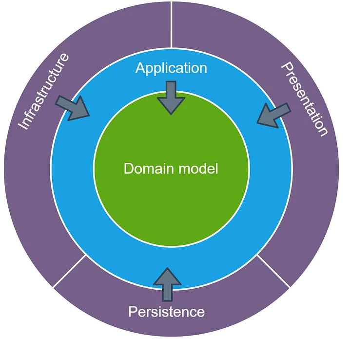
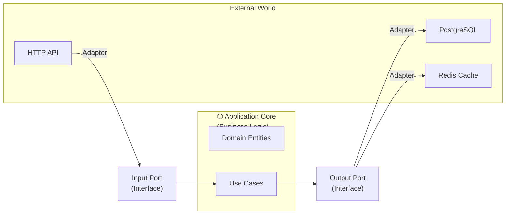

# 🏗️ Architectural Patterns

## 📑 Table of Contents
1. [Clean / Onion / Hexagonal Architecture](#clean-onion-hexagonal-architecture)
2. [CQRS (Command and Query Responsibility Segregation)](#cqrs)
3. [Event Driven Architecture](#event-driven-architecture)
4. [Saga Pattern](#saga-pattern)
5. [S.O.L.I.D. and Dependency Injection](#solid-and-dependency-injection)

---

## 1. 🏗️ Domain-Centric Architectures: Evolution and Implementation

First, we need to understand the main point: why were all these "onions" and "hexagons" invented in the first place?

### 🚀 Evolution: From N-Tier to Domain-Centric

Previously (and often still today), developers were taught the **3-Tier Architecture (N-Tier)**:
`UI (Presentation Layer) -> Business Logic (Logic Layer) -> Data Access (Data/DB Layer)`

**What was the problem?**
In this scheme, **business logic depended on the database**. If you changed the database schema or switched from SQL to NoSQL, you had to rewrite the entire application. Business rules were "hostages" to technical details.

**The Solution: Dependency Inversion**.
We place Business Logic at the center and make the Database and UI "pluggable details."

---

### 🧅 1.1 Onion Architecture
*Author: Jeffrey Palermo (2008)*



Onion Architecture emphasizes that an application is a set of concentric circles. The closer to the center, the "cleaner" and more important the code is.

#### 🏗️ Layers (from the inside out):
1.  **Domain Model (Core)**: Only entities (`Order`, `User`) and basic rules. This code depends on nothing.
2.  **Domain Services**: Logic that coordinates multiple entities but still remains within business rules.
3.  **Application Services (Use Cases)**: The coordinator. It knows: "First, go to the repository, get the user, then call a method from the Domain Model." However, it doesn't know how the repository works (it uses an interface).
4.  **Infrastructure / External World**: Everything else: DB, HTTP, Files, Console.

**💡 Main Idea:** Infrastructure depends on Application Services, which in turn depend on the Domain. The center is the "divine truth" that knows nothing of the outside world.

---

### ⬡ 1.2 Hexagonal Architecture (Ports and Adapters)
*Author: Alistair Cockburn (2005)*


While Onion is about layers, Hexagonal is about **pluggability**.

#### 🧩 Core Concepts:
*   **The Inside (Application Core)**: Our application. It knows nothing about HTTP, gRPC, or PostgreSQL.
*   **Ports**: Interfaces (sockets). The application says: "I need someone who can save a User" (`UserRepository`).
*   **Adapters**: Plugs. `PostgresAdapter` is a plug that fits into the `UserRepository` socket.

#### 🔄 Types of Ports:
1.  **Driving (Inputs)**: Those that drive our application to do something (REST API, CLI, Tests).
2.  **Driven (Outputs)**: Those that our application drives to do something (DB, Message Queue, External API).

**🎮 Analogy:** A game console (Core) has ports (HDMI, USB). You can connect an old TV or a new one (Adapter), but the console itself and the game inside it don't change.

---

### 🏛️ 1.3 Clean Architecture
*Author: Robert "Uncle Bob" Martin (2012)*


This is the "strictest" version of the principle. It combines the ideas of Onion and Hexagonal architectures, focusing on the Dependency Rule.

#### 🏗️ The Four Circles (The Dependency Rule):
1.  **Entities (Yellow Circle)**: High-level business rules. They change the least frequently.
2.  **Use Cases (Red Circle)**: Scenarios ("Create Account", "Pick up Item"). They describe the data flow between entities.
3.  **Interface Adapters (Green Circle)**: Controllers, Presenters, Repositories (convert JSON to objects and vice-versa).
4.  **Frameworks & Drivers (Blue Circle)**: The outermost layer. Your DB (Postgres), your framework (Gin/Echo).

**⚠️ Key Point — Crossing Boundaries:**
When a Use Case wants to save data, it doesn't call the DB directly. It calls an **Interface**. The DB object (Adapter) is provided to the Use Case via **Dependency Injection**.

---

### 📊 Comparison and Real-world Choice

| Feature | Onion | Hexagonal | Clean |
| :--- | :--- | :--- | :--- |
| **Focus** | Layers and Dependency Inversion | Interchangeability (Ports) | Boundaries and separation rules |
| **DB** | Infrastructure detail | Driven Adapter | Detail (outer circle) |
| **Business Logic** | At the very center | Inside the hexagon | In Entities and Use Cases |

#### 🛠️ What it looks like in folders (Go-style):
```text
/internal
  /domain       <-- Core: Entities and interfaces (Ports)
  /usecase      <-- Application logic (Services)
  /infra        <-- Adapters: SQL, HTTP clients, Redis
  /delivery     <-- Driving Adapters: Rest API, CLI
/cmd            <-- Assembly (Main): This is where DI happens
```

> [!TIP]
> **For the experienced**: Don't get hung up on names. What matters is one thing — **isolate business rules**. If you can test your logic without starting Docker with a database, you're on the right track.

---

#### 🟢 Interface Adapters

**What’s here:**
- **Controllers**: Receive HTTP requests, call Use Cases.
- **Presenters**: Format data for the response (JSON, HTML).
- **Gateways/Repositories**: Implement interfaces for working with the DB.

**Rule:** They convert data from the format of the external world to the format for Use Cases (and vice versa).

**Example in Go:**
```go
// infrastructure/http/user_controller.go
package http

import (
    "encoding/json"
    "net/http"
    "myapp/application"
)

type UserController struct {
    createUserUseCase *application.CreateUserUseCase
}

func (c *UserController) CreateUser(w http.ResponseWriter, r *http.Request) {
    // 1. Parse request (adaptation from HTTP to struct)
    var req struct {
        Email    string `json:"email"`
        Password string `json:"password"`
    }
    json.NewDecoder(r.Body).Decode(&req)
    
    // 2. Call Use Case
    err := c.createUserUseCase.Execute(req.Email, req.Password)
    
    // 3. Format response (adaptation from error to HTTP)
    if err != nil {
        w.WriteHeader(http.StatusBadRequest)
        json.NewEncoder(w).Encode(map[string]string{"error": err.Error()})
        return
    }
    
    w.WriteHeader(http.StatusCreated)
    json.NewEncoder(w).Encode(map[string]string{"status": "created"})
}
```

```go
// infrastructure/postgres/user_repository.go
package postgres

import (
    "database/sql"
    "myapp/domain"
)

type PostgresUserRepository struct {
    db *sql.DB
}

// Implement interface from Application Layer
func (r *PostgresUserRepository) Save(user *domain.User) error {
    query := "INSERT INTO users (id, email, password, balance) VALUES ($1, $2, $3, $4)"
    _, err := r.db.Exec(query, user.ID, user.Email, user.Password, user.Balance)
    return err
}

func (r *PostgresUserRepository) GetByEmail(email string) (*domain.User, error) {
    var user domain.User
    query := "SELECT id, email, password, balance FROM users WHERE email = $1"
    err := r.db.QueryRow(query, email).Scan(&user.ID, &user.Email, &user.Password, &user.Balance)
    if err != nil {
        return nil, err
    }
    return &user, nil
}
```

---

#### 🔵 Frameworks & Drivers

**What’s here:**
- Databases (Postgres, MongoDB, Redis)
- Web Frameworks (Gin, Echo, Chi)
- External APIs, file system

**Rule:** Only technical details. No business logic.

```go
// cmd/main.go
package main

import (
    "database/sql"
    "net/http"
    _ "github.com/lib/pq"
    
    "myapp/application"
    httpInfra "myapp/infrastructure/http"
    "myapp/infrastructure/postgres"
)

func main() {
    // 1. Database Initialization (Frameworks Layer)
    db, _ := sql.Open("postgres", "connection_string")
    
    // 2. Repository Creation (Interface Adapters)
    userRepo := &postgres.PostgresUserRepository{db: db}
    
    // 3. Use Case Creation (Application Layer)
    createUserUseCase := application.NewCreateUserUseCase(userRepo)
    
    // 4. Controller Creation (Interface Adapters)
    userController := &httpInfra.UserController{
        createUserUseCase: createUserUseCase,
    }
    
    // 5. Start web server (Frameworks Layer)
    http.HandleFunc("/users", userController.CreateUser)
    http.ListenAndServe(":8080", nil)
}
```

---

### 🔷 Alternatives and Terminology

The core idea remains the same, but with different terminology:

- **Port** — an interface (e.g., `UserRepository`)
- **Adapter** — a implementation of that interface (e.g., `PostgresUserRepository`)



**Pros:**
- Easy to swap Postgres for MongoDB (just another adapter)
- Easy to test (using mock adapters)

---

### ✅ Benefits of This Architecture

1. **Framework Independence**: You can swap Gin for Echo.
2. **Testability**: Business logic can be tested without a database or HTTP.
3. **UI Independence**: You can add CLI, gRPC, or WebSockets without changing Use Cases.
4. **Database Independence**: You can switch Postgres for Mongo.

> [!TIP]
> **When to use**: For medium to large projects with a long lifespan. For small projects, this may be overkill.

---

## 2. ⚡ CQRS

**Command and Query Responsibility Segregation** — splitting responsibility for Writing and Reading.

### 🤔 Why?
Typically, we read data much more often than we write it. In a classic architecture, we use the same model (and DB table) for both `SELECT` and `UPDATE`. This creates problems with scaling and performance.

*   **Command**: Changes state ("Create order", "Change address"). Contains business logic and validation.
*   **Query**: Reads data. As simple as possible, often without any logic, just returns a DTO (Data Transfer Object).

### 🏗️ How does it work in reality?
Most often, CQRS is used alongside database separation:
1.  **Write DB**: Optimized for writing (often relational, normalized).
2.  **Read DB**: Optimized for reading (NoSQL or denormalized tables, cache).

> [!WARNING]
> **Eventual Consistency**: Because data moves from the Write DB to the Read DB asynchronously, a user might see stale data for a fraction of a second after an update. This is the price for speed.

---

## 3. 📡 Event Driven Architecture (EDA)

An architecture where systems communicate through **events**.

*   **Event**: A fact that has already happened ("OrderCreated", "PaymentReceived"). It cannot be undone.
*   **Message Broker**: Kafka, RabbitMQ, NATS.

### 🎞️ Event Sourcing (ES)
We don't store the current state of an object (e.g., "Balance: 100"). Instead, we store a **chain of all events** that led to that state.

**Example (Bank Account):**
1. Account opened (+0)
2. Deposit (+100)
3. Purchase (-30)
*The current balance (70) is calculated by summing all events.*

*   **Why?**: Audit trails, the ability to "reel back" time, easy bug fixing (fix the logic and recalculate events).
*   **Complexity**: You need to create **Snapshots** so you don't have to recalculate a million events every time.

---

## 4. 📜 Saga Pattern

Used for managing distributed transactions in microservices. In the cloud, you can't perform a `BEGIN TRANSACTION ... COMMIT` across three databases simultaneously.

There are two ways to implement a Saga:

### 🩰 4.1 Choreography
Microservices communicate with each other directly through events. There is no central controller.
*   **How it works**: Service A does its work -> throws an event -> Service B hears it -> does its work -> throws an event.
*   **Pros**: No single point of failure, easy to add new services.
*   **Cons**: Hard to understand what's happening (tangled chain), risk of cyclic dependencies.

### 💂 4.2 Orchestration
There is a central "conductor" (Orchestrator) that tells everyone what to do.
*   **How it works**: The Orchestrator sends a command to Service A -> gets a response -> sends a command to Service B.
*   **Pros**: All process logic is in one place, easy to debug.
*   **Cons**: The Orchestrator becomes a complex and critical component (if it fails, the process stops).

---

## 🎯 Summary: What to choose?

| Situation | Recommended Pattern |
| :--- | :--- |
| Need to isolate business logic from DB and Web | **Clean Architecture / Hexagonal** |
| High volumes of reads and complex writes | **CQRS** |
| Need to store change history and audit trails | **Event Sourcing** |
| Complex transaction across microservices | **Saga (Orchestration/Choreography)** |
| High load and loose coupling of components | **Event Driven Architecture** |

---

## 5. 💉 IoC, DI, and DIP: Taming Dependencies

Many confuse these three concepts, though they exist at different levels: **IoC** is a general idea, **DI** is a method of implementation, and **DIP** is a design rule.

---

### 🔄 5.1 Inversion of Control (IoC)
The concept where control over the program execution flow is handed over from your code to something external (a framework).

> [!NOTE]
> **The Hollywood Principle**: "Don't call us, we'll call you."

#### 🧩 What's the difference?
*   **Library**: You call the library. You are the boss; you decide when and what to do.
*   **Framework**: The framework calls your code. You just provide it with details, and it decides when to run them.

**🍳 Analogy:**
- **Library**: You are in your own kitchen. You take the knife yourself, you cut the vegetables yourself. You control the process.
- **Framework**: You are in a restaurant. You give the chef (framework) a specification (order), and the chef decides how and when to cook. You don't control the knife.

---

### 🔌 5.2 Dependency Injection (DI)
A specific pattern that implements IoC. Its essence: an object does not create its dependencies itself, but **receives them from the outside**.

#### ❌ Bad: Hard Coupling
Imagine you bought a lamp, and the cord is soldered directly into the wall. To replace the lamp, you have to break the wall.
```go
type Service struct {
    logger FileLogger // We are tied specifically to FILE logging
}

func NewService() *Service {
    return &Service{
        logger: NewFileLogger(), // Direct creation is "glue"! ❌
    }
}
```

#### ✅ Good: Constructor Injection
The lamp now has a plug. You can plug it into any socket (file, console, database).
```go
type Service struct {
    logger Logger // Dependent on an INTERFACE
}

// Dependency is passed from outside. Service doesn't know WHO exactly writes the log.
func NewService(l Logger) *Service {
    return &Service{logger: l}
}
```

---

### 📐 5.3 Dependency Inversion Principle (DIP)
The "D" in SOLID. It dictates **HOW** dependency arrows should be oriented.

1.  High-level modules (Business Logic) should not depend on low-level modules (DB, Network).
2.  Both should depend on **abstractions** (interfaces).

#### 🏗️ Why is it an "Inversion"?
In normal code, the arrow goes from Logic to DB: `Logic -> DB`. 
In DIP, we place an Interface between them: `Logic -> [Interface] <- DB`. Now the arrow from the DB has flipped (inverted) towards the Interface.

---

### 💻 Code Evolution: From Junior to Pro

#### Stage 1: "I'll do it myself" (Junior)
Problem: If we want to switch from Email to SMS, we have to change the entire `OrderService` class.
```go
type OrderService struct {
    notifier EmailNotifier // Concrete implementation ❌
}

func (s *OrderService) Confirm() {
    s.notifier.Send("Order confirmed")
}
```

#### Stage 2: "Interfaces are power" (PRO)
Now `OrderService` says: "I don't care HOW you notify, just give me something that can `Notify`."
```go
// 1. Create an abstraction
type Notifier interface {
    Send(msg string)
}

// 2. Class no longer depends on Email
type OrderService struct {
    notifier Notifier // Abstraction ✅
}

func NewOrderService(n Notifier) *OrderService {
    return &OrderService{notifier: n}
}
```

#### Stage 3: Assembly in Main (Architect)
In `main.go`, we assemble our application like a LEGO set. This is where we decide what to "plug in" to the service.
```go
func main() {
    // Today we use Email
    emailDep := &infrastructure.EmailNotifier{}
    service := application.NewOrderService(emailDep)
    
    // Tomorrow we just change one line to SMS
    // smsDep := &infrastructure.SMSNotifier{}
    // service := application.NewOrderService(smsDep)
    
    service.Confirm()
}
```

### 🎯 Why do all this? (Summary)
1.  **Testability**: You can easily swap a real DB for a "fake" (Mock) one in tests.
2.  **Flexibility**: Changing technologies (e.g., MySQL to MongoDB) doesn't touch your business logic.
3.  **Cleanliness**: Code becomes modular. You can change one part without worrying about the whole building collapsing.