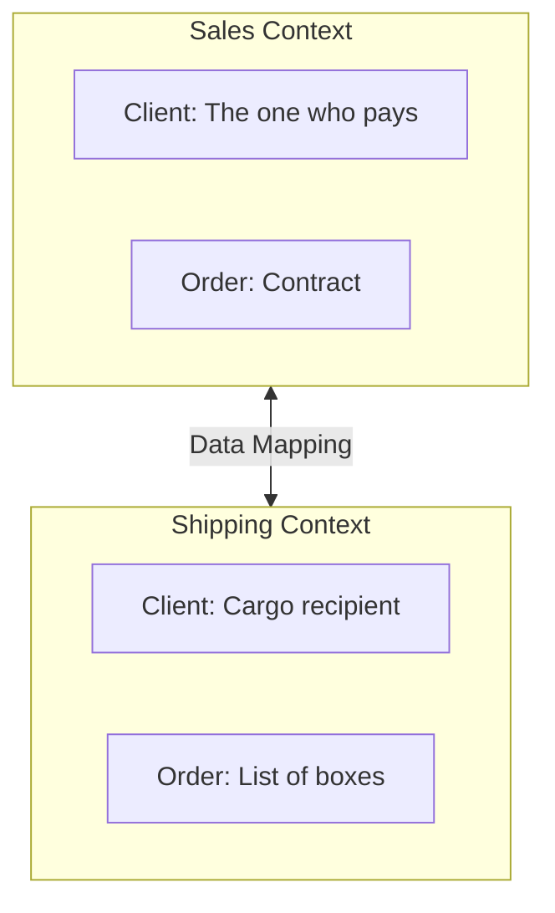
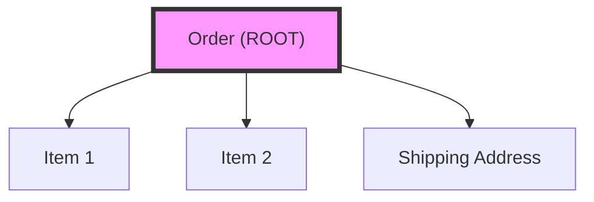

# 🌍 Domain-Driven Design (DDD)

## 📑 Table of Contents
1. [What and Why?](#what-and-why)
2. [Strategic Design](#strategic-design)
3. [Tactical Design](#tactical-design)

---

## 1. 🤔 What and Why?

**Domain-Driven Design (DDD)** is an approach to developing complex software that prioritizes the **business** and its needs (the problem domain) rather than technical details (databases, frameworks).

> [!NOTE]
> **Core Idea**: Developers and business experts should speak a single, common language and build the program’s model in such a way that it accurately reflects the real-world business.

---

## 2. 🗺️ Strategic Design

This is the "bird's-eye view"—how to break a massive system into manageable pieces.

### 🗣️ Ubiquitous Language
A common vocabulary used by **EVERYONE**: developers, managers, and experts.

*   If an expert says "Deduct bonuses," then the code should have a `DeductBonuses()` method, not `UpdateUserScore()`.
*   **Eliminates misunderstandings**: A "Client" for the sales department and a "Client" for logistics are different entities.

### 🎁 Bounded Context
An explicit boundary within which terms have a specific, controlled meaning.

*   In **Sales**, a "Product" might be defined by its price and description.
*   In the **Warehouse**, a "Product" is defined by its dimensions and weight.
*   Instead of creating one "mega-model" for "Product," it's better to create two separate models in their respective contexts.

---

## 3. 🛠️ Tactical Design

This is the "inner view"—how to write code within a single context.

### 🧬 Entity
An object defined by its **unique ID**. It matters *which specific* object it is.

*   **Example**: Person, Order, Bank Account.
*   If Ivan changes his name, he remains the same Ivan (his ID stays the same).

### 🏷️ Value Object
An object defined solely by its **attributes**. it has no ID.

*   **Example**: Money (100 USD), GPS coordinates, Address.
*   It doesn't matter *which specific* 100-dollar bill it is; what matters is the value.
*   **Immutability**: Value Objects must be immutable.

### 📦 Aggregate
A cluster of objects (Entities and Value Objects) that live and die together. External access is only allowed through the main object—the **Aggregate Root**.

> [!IMPORTANT]
> **Rule**: You cannot delete an "Order Item" independently. You save and load the entire "Order." This ensures data integrity.

### 🏭 Factory
Creates complex objects or aggregates, encapsulating the creation logic (e.g., `new Order(...)`).

### 🏛️ Repository
An abstraction for working with a collection of aggregates. It behaves as if all objects are held in memory.
*   `Save(order)`
*   `GetById(id)`

It should focus on the entire aggregate rather than containing granular SQL methods like `UpdateUserName`.

### 🔌 Domain Service
Used when an action doesn't naturally belong to an Entity or Value Object.
*   **Example**: `PaymentService.Transfer(from, to, amount)`. A money transfer involves two accounts, so the logic resides in a service rather than within an individual account.

---

## 💡 Summary
DDD helps manage complexity in large projects by dividing them into contexts and ensuring the code "speaks" the language of the business.