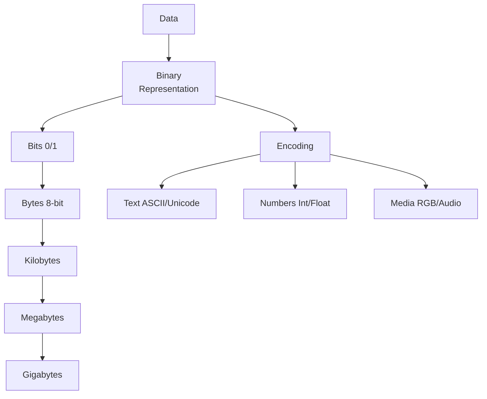
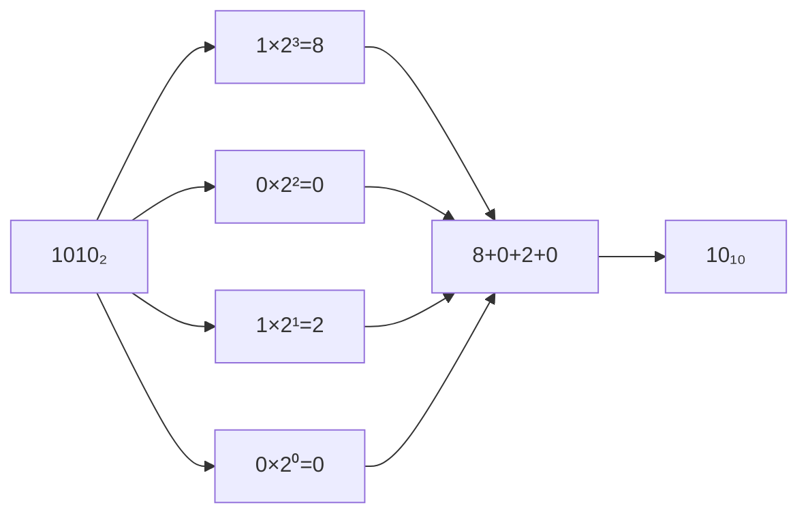
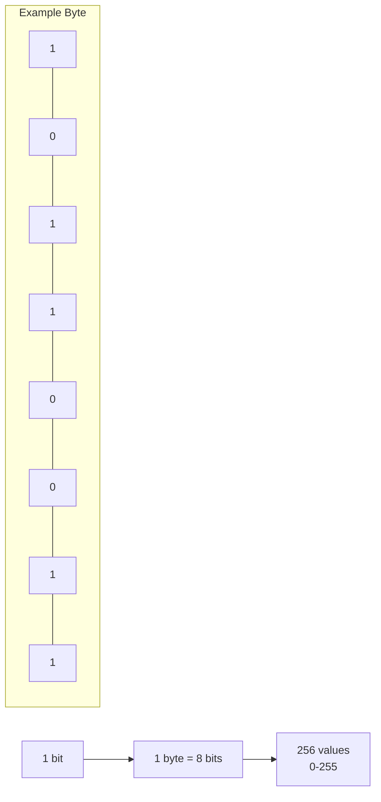
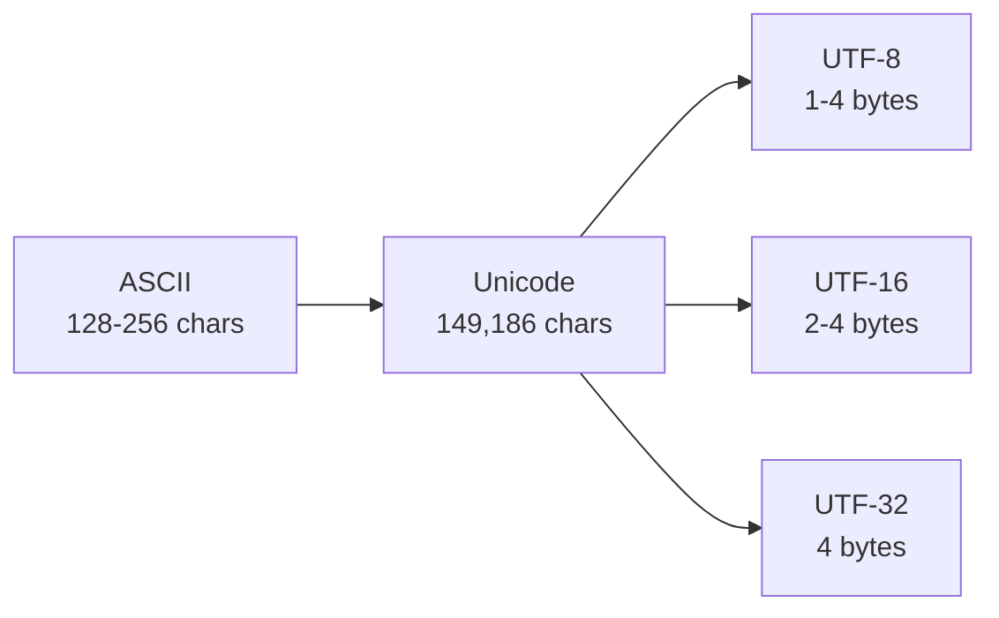
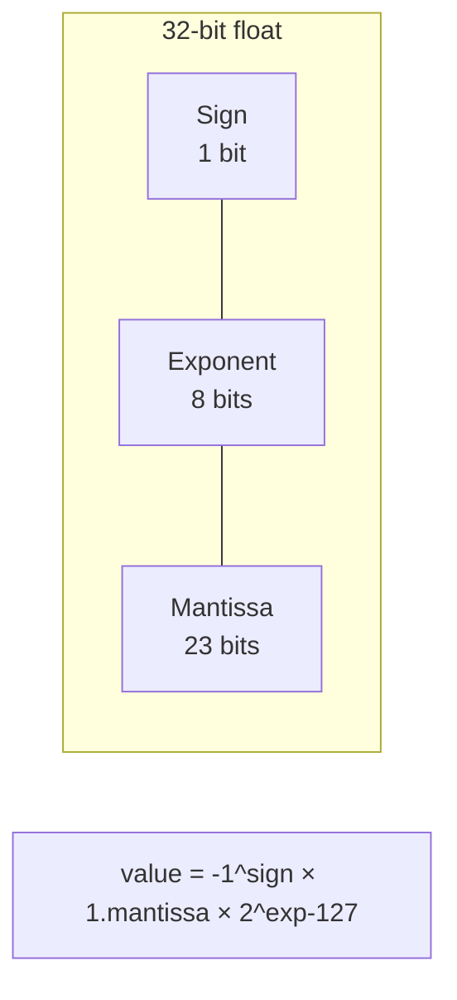
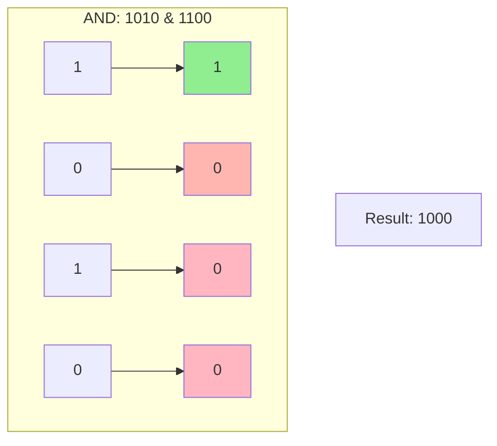
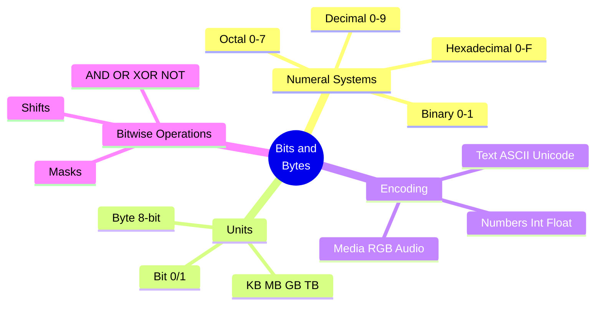

# 🔢 Bits, Bytes, and Numeral Systems

## 📑 Table of Contents
1. [Numeral Systems](#numeral-systems)
2. [Bits and Bytes](#bits-and-bytes)
3. [Data Encoding](#data-encoding)
4. [Bitwise Operations](#bitwise-operations)

---

Computers work with data represented as **bits** (binary digits) and **bytes**. This section explains how data is encoded, stored, and processed using various numeral systems.



---

## 1. 📂 Numeral Systems

A numeral system is a way of representing numbers using symbols (digits) and their positions.

### Common Systems 🏛️

| System | Base | Digits | Example | Decimal Equivalent |
|:---|:---:|:---|:---:|:---:|
| **Binary** | 2 | 0, 1 | 1010 | 10 |
| **Octal** | 8 | 0-7 | 12 | 10 |
| **Decimal** | 10 | 0-9 | 10 | 10 |
| **Hexadecimal** | 16 | 0-9, A-F | A | 10 |

### Conversion Between Systems 🔄

#### From Binary to Decimal

```
1010₂ = 1×2³ + 0×2² + 1×2¹ + 0×2⁰
     = 8 + 0 + 2 + 0
     = 10₁₀
```



#### From Decimal to Binary

Divide by 2 and record the remainders in reverse order:

```
10 ÷ 2 = 5 remainder 0
 5 ÷ 2 = 2 remainder 1
 2 ÷ 2 = 1 remainder 0
 1 ÷ 2 = 0 remainder 1

Read bottom-up: 1010₂
```

#### Binary ↔ Hexadecimal

Group by 4 bits (nibbles):

```
1010 1110₂ = AE₁₆
└─┬─┘ └─┬─┘
  A     E
```

> [!TIP]
> **Example**: The number 42 in different systems:
> - Decimal: `42`
> - Binary: `101010`
> - Hexadecimal: `2A`

---

## 2. 💾 Bits and Bytes

Bits and bytes are the fundamental units of information in a computer.

### Bit

- **The smallest unit of information**: either 0 or 1.
- Corresponds to an electrical signal (e.g., 0V = 0, 5V = 1).

### Byte

- **8 bits**. Example: `10110011`.
- Can represent **256 unique values** (2⁸, from `00000000` to `11111111`).



### Larger Units 📦

| Unit | Size | In Bytes | Example |
|:---|:---|:---:|:---|
| **Kilobyte (KB)** | 1024 bytes | 2¹⁰ | A plain text document |
| **Megabyte (MB)** | 1024 KB | 2²⁰ | An MP3 song (~3-5 MB) |
| **Gigabyte (GB)** | 1024 MB | 2³⁰ | An HD video (~1-4 GB) |
| **Terabyte (TB)** | 1024 GB | 2⁴⁰ | A hard drive |
| **Petabyte (PB)** | 1024 TB | 2⁵⁰ | A data center |

> [!NOTE]
> The character `A` in ASCII takes up **1 byte** (`01000001` = 65 in decimal).

---

## 3. 🔐 Data Encoding

Data in a computer is encoded in binary form to represent text, numbers, and other types of information.

### Text Encoding ✍️

#### ASCII
- **7 or 8 bits** per character.
- Supports 128 (7-bit) or 256 (8-bit) characters.

**Examples**:
| Character | Decimal | Binary | Hexadecimal |
|:---:|:---:|:---:|:---:|
| A | 65 | 01000001 | 41 |
| a | 97 | 01100001 | 61 |
| 0 | 48 | 00110000 | 30 |
| Space | 32 | 00100000 | 20 |

#### Unicode
- **An expanded standard** to support all the world's languages.
- UTF-8, UTF-16, UTF-32 (different encoding schemes).
- Example: `U+0410` for the Cyrillic letter `А`.



### Number Encoding 🔢

#### Integers

**Unsigned**:
```
1010₂ = 10₁₀
```

**Signed (Two's Complement)**:
- The first bit is the sign bit (0 = positive, 1 = negative).
- To get a negative number: invert the bits and add 1.

```
Example (4 bits):
 2₁₀ = 0010₂
-2₁₀ = 1110₂ (invert: 1101, add 1: 1110)
```

#### Floating-Point Numbers (IEEE 754)



> [!IMPORTANT]
> Floating-point numbers have limited precision! `0.1 + 0.2` might not be exactly `0.3` in binary representation.

### Other Data Types 🎨

**Images**:
- Pixels are encoded as RGB combinations.
- Example: 24 bits per pixel (8 bits red + 8 green + 8 blue).

**Sound**:
- Amplitude is digitized.
- Example: 16 bits per sample, 44,100 Hz (CD quality).

> [!TIP]
> The word `Hi` in ASCII:
> - `H` = `01001000` (72₁₀)
> - `i` = `01101001` (105₁₀)

---

## 4. ⚡ Bitwise Operations

Bitwise operations manipulate individual bits of numbers and are used in programming and hardware.

### Common Operations ⚡

| Operation | Description | Example | Result |
|:---|:---|:---:|:---:|
| **AND** (`&`) | 1 if both bits are 1 | `1010 & 1100` | `1000` |
| **OR** (`|`) | 1 if at least one bit is 1 | `1010 | 1100` | `1110` |
| **XOR** (`^`) | 1 if bits are different | `1010 ^ 1100` | `0110` |
| **NOT** (`~`) | Bit inversion | `~1010` | `0101` |
| **Left Shift** (`<<`) | Bits move to the left | `1010 << 1` | `0100` |
| **Right Shift** (`>>`) | Bits move to the right | `1010 >> 1` | `0101` |

### Visualization of Operations



### Applications 🚀

#### Masks
Isolating specific bits:
```
value & 00001111  // Keeps the lower 4 bits
```

#### Optimization
Shifting instead of multiplying/dividing by 2:
```
x << 1   // Multiply by 2
x >> 1   // Divide by 2
```

#### Encryption
Using XOR for simple encryption:
```
encrypted = data ^ key
decrypted = encrypted ^ key  // XOR is reversible!
```

#### Parity Check
```
n & 1  // If result is 0, the number is even
```

> [!TIP]
> **Practical Example**: To check if the 5th bit of a number `n` is set:
> ```
> if (n & (1 << 5)) {
>     // The 5th bit is set
> }
> ```

---

## 🎯 Key Takeaways



- **Numeral Systems** (binary, hexadecimal) are the basis of data representation in a computer.
- **Bits** (0/1) and **bytes** (8 bits) are the smallest units of information.
- Data is encoded in binary form: text (ASCII, Unicode), numbers (integers, floating-point), images, and sound.
- **Bitwise operations** (AND, OR, XOR, shifts) are used for low-level data manipulation.
- Understanding bits and bytes is essential for working with memory, processors, and optimizing software.
