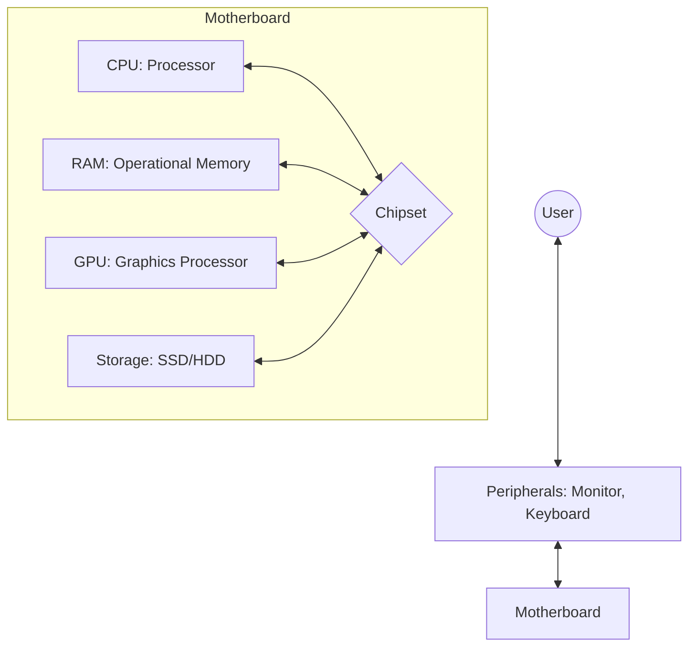
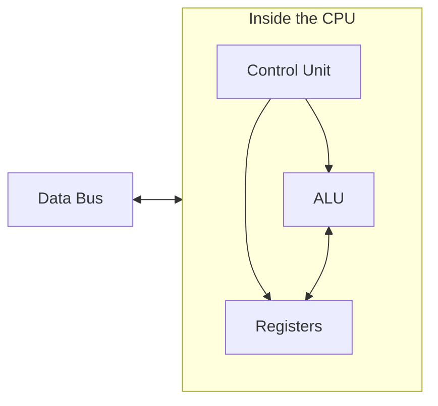
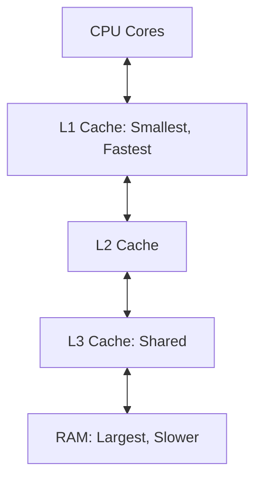
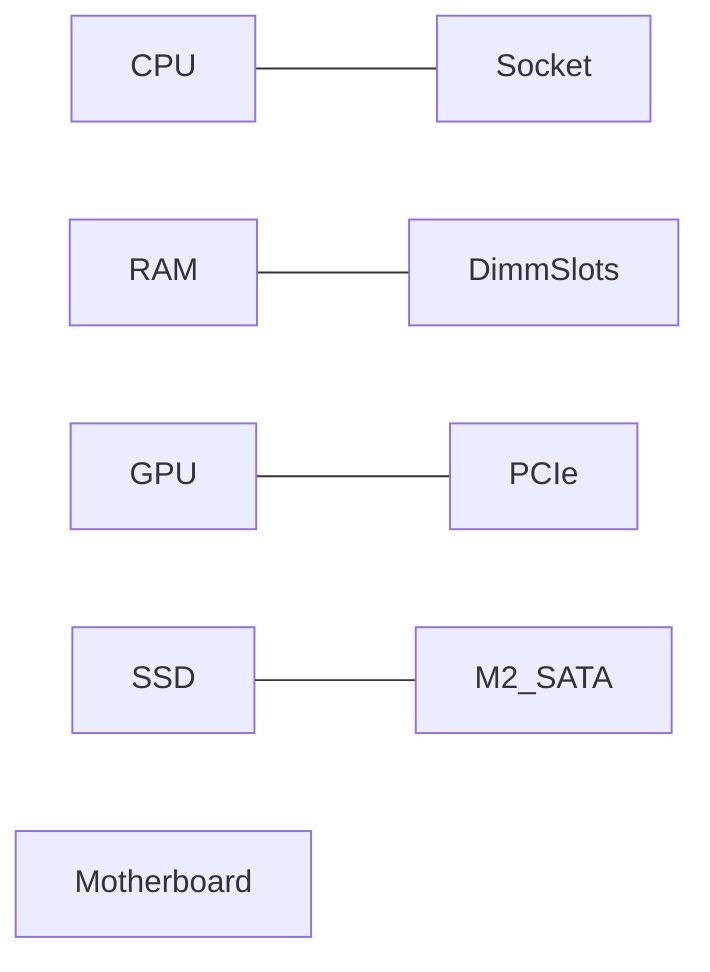
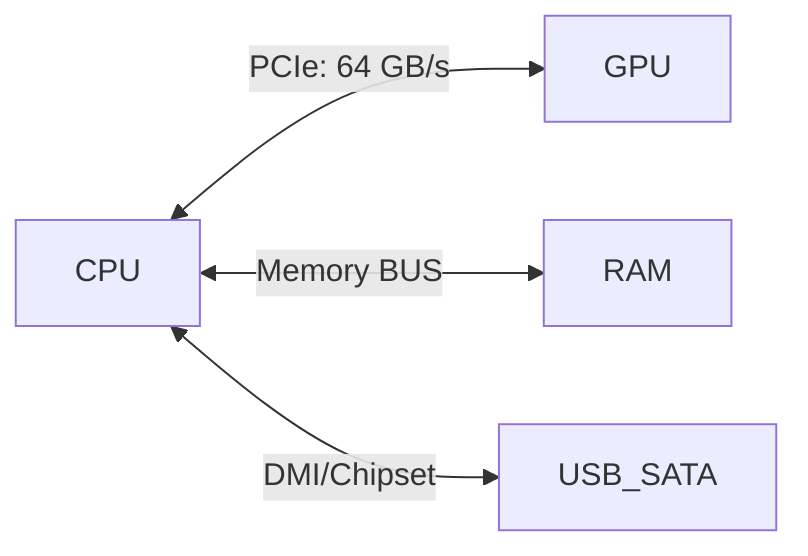

# 💻 Computer Hardware

## 📑 Table of Contents
1. [Computer Components](#computer-components)
   - [Central Processing Unit (CPU)](#central-processing-unit-cpu)
   - [Memory](#memory)
   - [Data Storage](#data-storage)
   - [Motherboard](#motherboard)
   - [Peripheral Devices](#peripheral-devices)
2. [Buses and Interfaces](#buses-and-interfaces)
3. [Power Consumption and Cooling](#power-consumption-and-cooling)

---

Hardware—the physical components of a computer—performs the calculations, storage, and data transmission required for the system to function.

---

## 1. 🏗️ Computer Components

### 1.1. 🧠 Central Processing Unit (CPU)

The **CPU** is the "brain" of the computer, executing program instructions.

#### Key Units:
- **ALU (Arithmetic Logic Unit)**: Performs mathematical and logical operations.
- **Registers**: Ultra-fast memory within the processor used for immediate data access.
- **Control Unit (CU)**: The conductor that coordinates when and which instruction is executed.

> [!IMPORTANT]
> **Cores vs. Threads**: Modern processors feature multiple cores. Each core is essentially a complete, independent processor. Hyper-threading allows a single core to handle two data threads simultaneously.

### 1.2. 💾 Memory

Memory stores data and instructions and is organized hierarchically based on speed and proximity to the CPU.

- **RAM (Random Access Memory)**:
  - Volatile (data is lost when power is turned off).
  - Stores currently running programs and their active data.
- **Cache Memory (L1, L2, L3)**:
  - Located directly within the processor.
  - Hundreds of times faster than RAM, but very limited in capacity.
- **ROM / BIOS**:
  - Stores the code required for initial system boot.

### 1.3. 📦 Data Storage

Used for long-term information storage.

| Type | Speed | Mechanism | Durability |
|:---|:---|:---:|:---|
| **HDD** | Slow | Magnetic platters | Medium (sensitive to physical shocks) |
| **SSD** | Fast | Flash memory | High |
| **NVMe** | Very Fast | Direct PCIe connection | High |

> [!TIP]
> Always install your operating system on an **SSD/NVMe**. It is the simplest way to multiply your computer's speed.

### 1.4. 🔌 Motherboard

The foundation that connects all components into a single system.

### 1.5. 🖱️ Peripheral Devices

- **Input**: Keyboard, mouse, microphone.
- **Output**: Monitor, printer, audio system.
- **GPU (Graphics Processing Unit)**: A specialized powerhouse designed for rendering graphics and AI-related calculations.

---

## 2. 🛣️ Buses and Interfaces

Buses are the electronic "highways" for data.

- **PCIe**: The fastest bus, typically used for graphics cards and NVMe SSDs.
- **SATA**: A gradually aging standard for traditional drives.
- **USB**: The universal standard for external peripherals.

---

## 3. 🌡️ Power Consumption and Cooling

The operation of billions of transistors generates significant heat.

> [!CAUTION]
> **Overheating = Throttling**: If the processor reaches its heat limit (usually 90-100°C), it forcibly reduces its frequency to prevent permanent damage, resulting in system lag.

### Types of Cooling:
1. **Air Cooling**: Radiator + fan (affordable and reliable).
2. **Liquid Cooling (AIO)**: Uses liquid to dissipate heat more efficiently; more expensive and complex.
3. **Passive Cooling**: Fanless design (used for low-power chips in thin laptops or tablets).

---

## 🎯 Key Takeaways

- **CPU** is the brain, **RAM** is the short-term memory, **SSD** is the warehouse.
- **Cache** within the processor is critical for overall performance.
- The **Motherboard** coordinates everything via the **chipset**.
- **Cooling** is essential to prevent "throttling" due to overheating.
