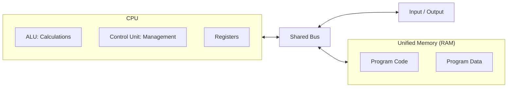
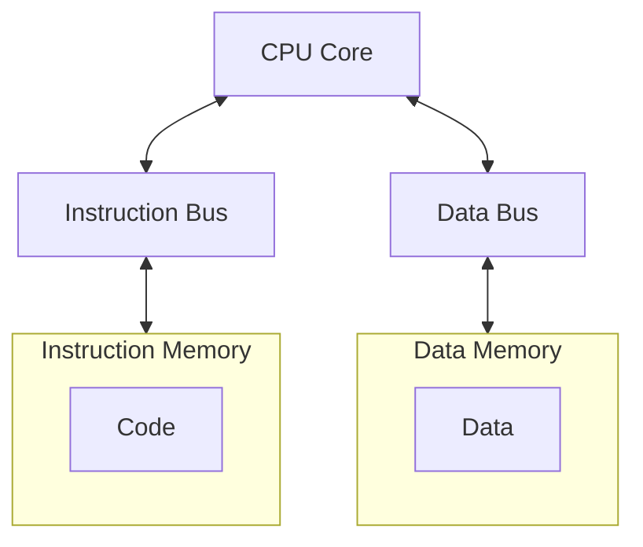
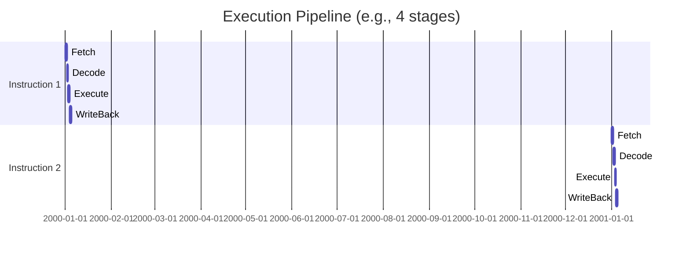
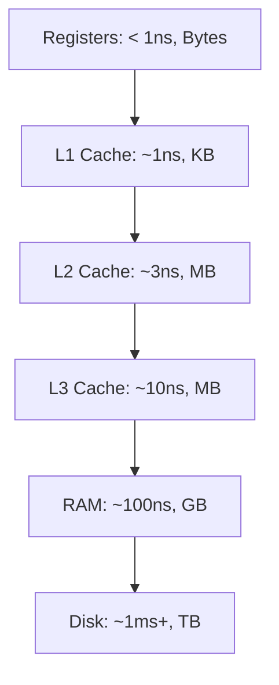

# 🏛️ Computer Architecture

## 📑 Table of Contents
1. [Von Neumann Architecture](#von-neumann-architecture)
2. [Harvard Architecture](#harvard-architecture)
3. [Instruction Sets (CISC vs RISC)](#instruction-sets-cisc-vs-risc)
4. [Microarchitecture and Pipelining](#microarchitecture-and-pipelining)
5. [Cache and Memory Hierarchy](#cache-and-memory-hierarchy)

---

Computer architecture defines the logical organization of a system—how the processor, memory, and input/output (I/O) devices are interconnected.

---

## 1. 📂 Von Neumann Architecture

This is the classic model used by the vast majority of modern computers.

> [!NOTE]
> **Core Principle**: Programs and data are stored together in the **same** memory.

### Working Schematic:

**The Von Neumann Bottleneck**: Because the system uses a shared bus, the processor cannot fetch both instructions and data at the same time. This physical limitation caps the overall processing speed.

---

## 2. 🏰 Harvard Architecture

Unlike the Von Neumann model, the Harvard architecture uses **separate** memory for code and data.

### Schematic:

**Where is it used?** Primarily in microcontrollers (e.g., Arduino/AVR) and digital signal processors (DSPs).

---

## 3. 📜 Instruction Sets (ISA)

**ISA (Instruction Set Architecture)** is the "vocabulary" of commands that a processor can understand and execute.

| Type | Full Name | Philosophy | Example |
|:---|:---|:---|:---|
| **CISC** | Complex Instruction Set Computer | "One instruction handles many tasks" | Intel x86 |
| **RISC** | Reduced Instruction Set Computer | "Many simple instructions per cycle" | ARM, Apple M1/M2 |

> [!TIP]
> Nowadays, the boundary is blurring: modern x86 processors translate complex CISC instructions into smaller, RISC-like "micro-operations" internally.

---

## 4. ⚙️ Microarchitecture

The microarchitecture is the specific physical implementation of an ISA on a silicon chip.

### Pipelining
Instead of waiting for a single command to finish, the processor starts processing the next command as soon as the current one moves to the next stage of execution.

> [!WARNING]
> **Branch Misprediction**: When the code includes a condition (`if`), the processor tries to predict which path will be taken. If it predicts incorrectly, the pipeline must be "flushed" (cleared), significantly reducing performance.

---

## 5. 🏔️ Memory Hierarchy

Memory design is a constant balancing act between **speed**, **capacity**, and **cost**.

> [!IMPORTANT]
> **Principle of Locality**: The processor assumes that if you access one memory cell, you will likely access neighboring cells soon. Therefore, it loads data from RAM into the Cache in entire blocks.

---

## 🎯 Key Takeaways

- **Architecture** is the blueprint; **Microarchitecture** is its physical manifestation.
- **Von Neumann** is the standard for general-purpose computing; **Harvard** is for specialized tasks.
- **RISC** (ARM) currently dominates mobile devices and servers due to its superior energy efficiency.
- **Memory Hierarchy** is a way to "cheat" slow RAM by using layers of ultra-fast Cache.
