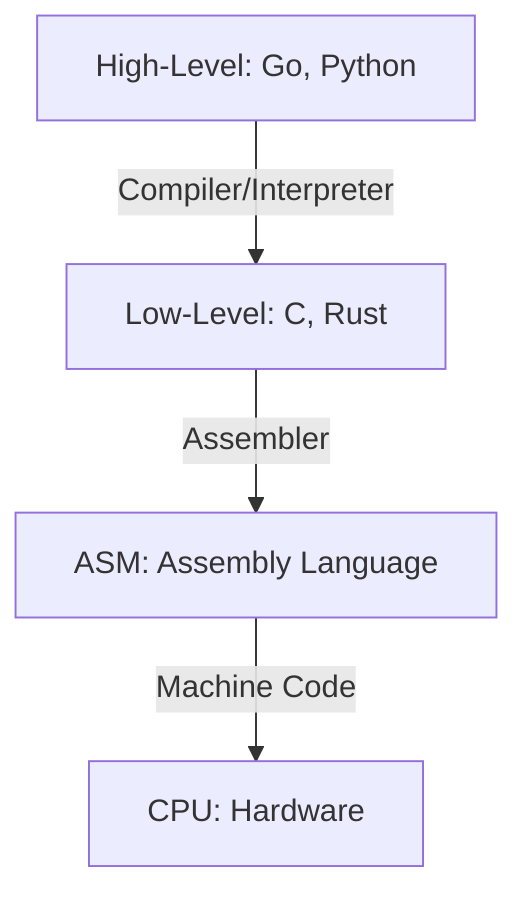
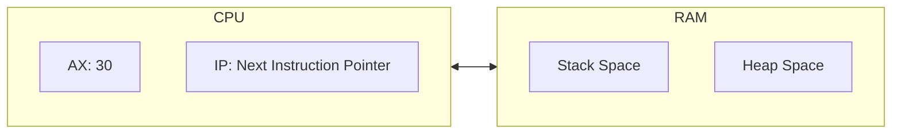
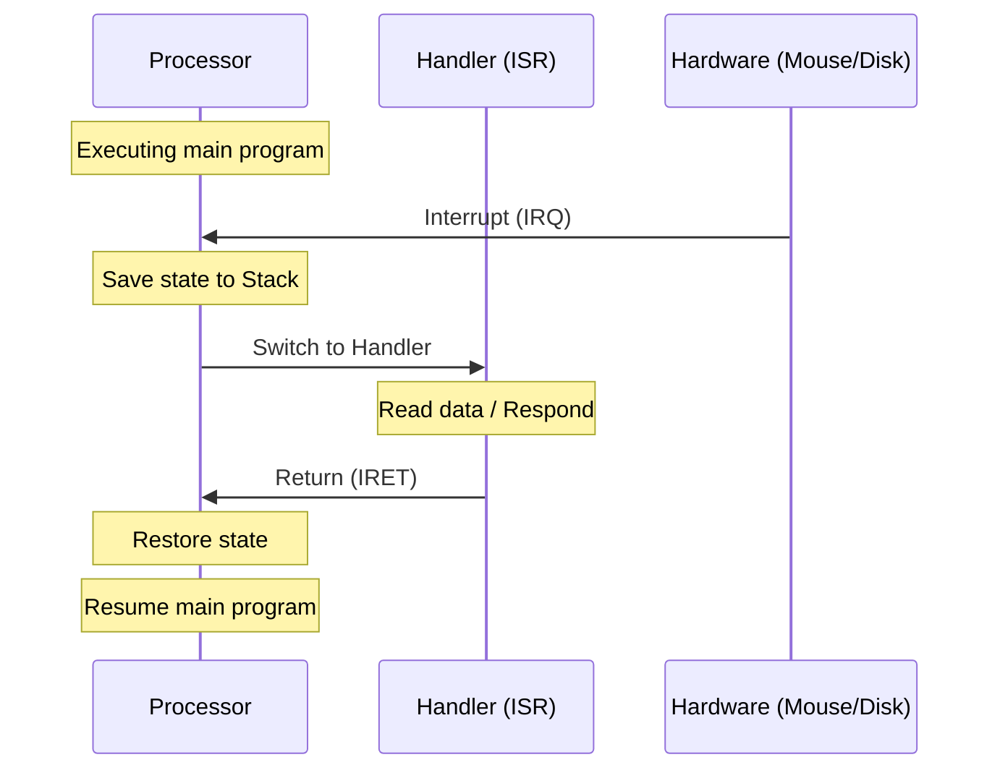

# 🐚 Low-Level Programming

## 📑 Table of Contents
1. [Machine Code](#machine-code)
2. [Assembly Language](#assembly-language)
3. [Compilers and Interpreters](#compilers-and-interpreters)
4. [Interrupts and Event Handling](#interrupts-and-event-handling)

---

Low-level programming involves working directly with hardware. There are no high-level abstractions—only registers, memory addresses, and processor instructions.



---

## 1. 🔢 Machine Code

Machine code is the only language a processor natively understands. It is essentially a stream of zeros and ones (often represented in HEX).

- **OpCode**: An operational code (e.g., 0x01 might stand for "add").
- **Operands**: The data or memory addresses upon which the operation is performed.

> [!IMPORTANT]
> Machine code is **platform-specific**. Code written for Intel (x86) cannot run on an iPhone (ARM) or an Apple M1/M2 chip without an emulator.

---

## 2. 📝 Assembly Language (ASM)

Assembly is a human-readable representation of machine code. Instead of writing `0xB8 0x05`, we write something like `MOV AX, 5`.

### Example (x86 Syntax):
```asm
; Adding two numbers
MOV AX, 10    ; Load 10 into register AX
ADD AX, 20    ; Add 20 to the value in AX
; AX now contains 30
```

### Core Concepts:
- **Registers**: Small, ultra-fast storage "slots" inside the processor.
- **Stack**: A region of memory used for temporary storage of return addresses and local variables.
- **Labels**: Names assigned to specific code addresses, used for directing program flow with jumps (`JMP`).



---

## 3. ⚙️ Compilers vs. Interpreters

| Property | Compiler (C, Rust, Go) | Interpreter (Python, JS) |
|:---|:---|:---|
| **Timeline** | Prior to execution | During execution |
| **Speed** | Maximum performance | Slower due to overhead |
| **Portability** | Must be recompiled for each OS | Runs anywhere with an interpreter |

> [!TIP]
> **JIT Compilation (Just-In-Time)**: Modern browsers (like V8 in Chrome) and Java use a hybrid approach—they compile frequently executed code into machine code on the fly to boost performance.

---

## 4. 🛑 Interrupts

An interrupt is a mechanism that allows hardware to "tap the processor on the shoulder" and signal that it has finished a task or has data ready for processing.



### Types of Interrupts:
1. **Hardware**: A key press or a network packet arrival.
2. **Software (System Calls)**: A program requesting the OS to "write this file to disk."
3. **Exceptions**: Errors such as division by zero or memory access violations (Segmentation Fault).

---

## 🎯 Key Takeaways

- **Assembly Language** is how we communicate with the CPU in its native tongue.
- **Registers** are the fastest memory cells available to a system.
- **Compilation** transforms source code into a standalone machine-code binary.
- **Interrupts** are the backbone of system interactivity and multitasking.
