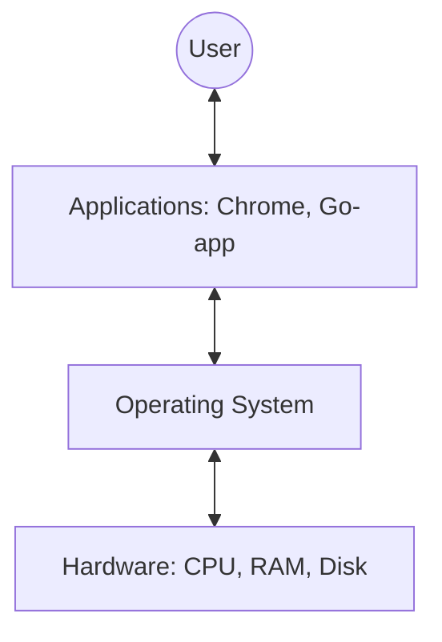
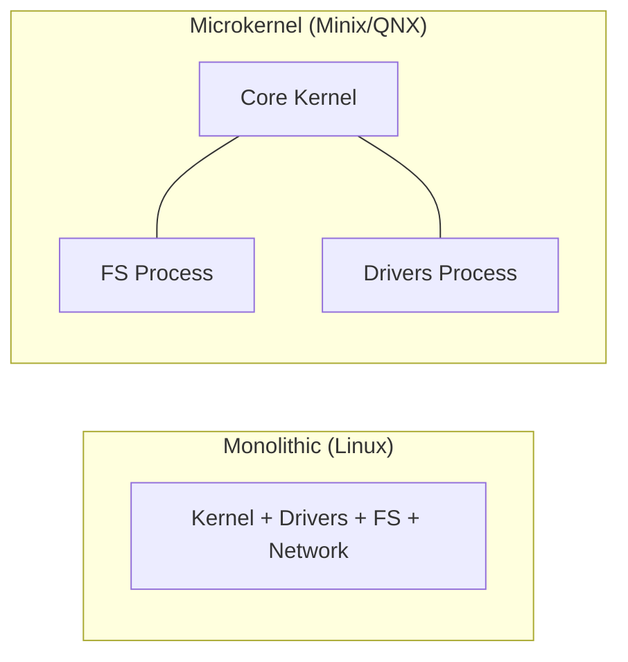
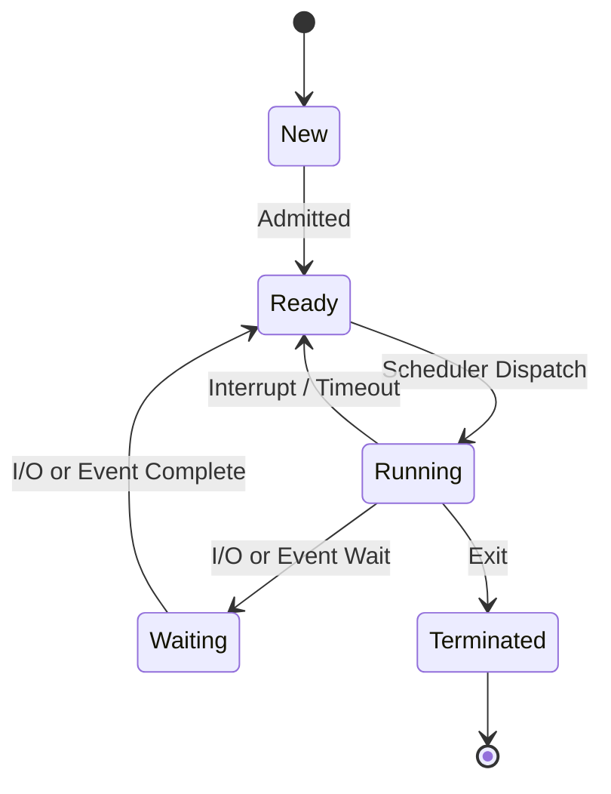
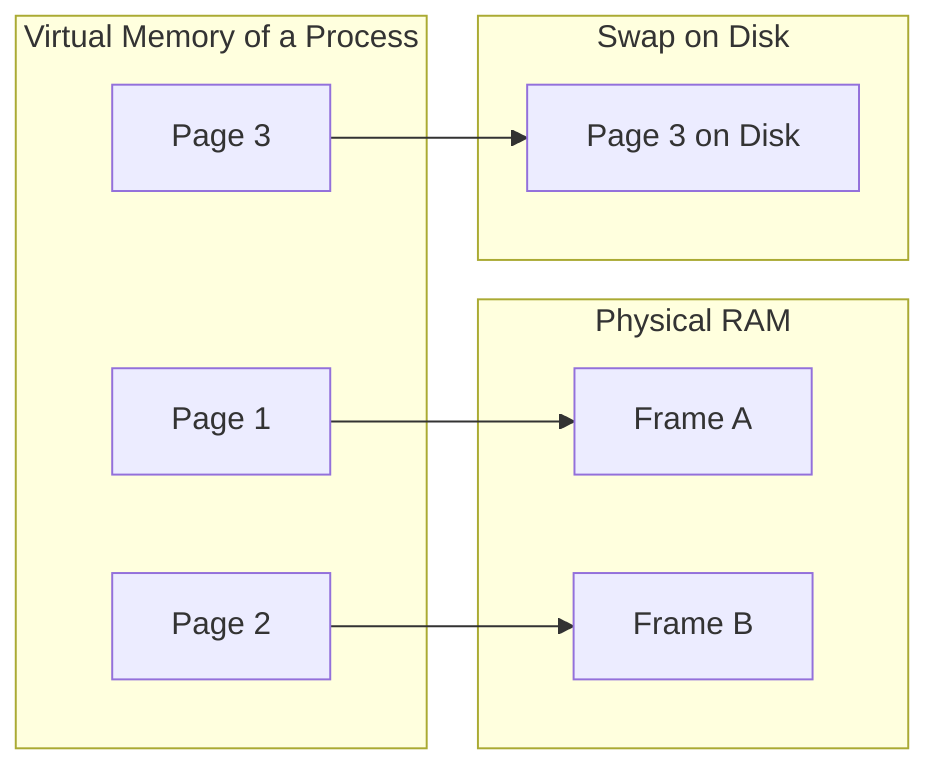

# 💻 Operating Systems (OS)

## 📑 Table of Contents
1. [Role and Functions of an OS](#role-and-functions-of-an-os)
2. [OS Kernel](#os-kernel)
3. [Processes and Threads](#processes-and-threads)
4. [Virtual Memory](#virtual-memory)
5. [File Systems](#file-systems)
6. [Key Takeaways](#key-takeaways)

---

An operating system is the primary manager of a computer. It ensures that programs can interact with hardware without interfering with one another.

---

## 1. 🛠️ Functions of an OS

- **Abstraction**: A programmer doesn't need to know the specifics of writing bytes to various SSD models; they simply call a high-level function like `file.Write()`.
- **Arbitration**: If two programs attempt to print a document simultaneously, the OS manages the queue.
- **Isolation**: If a single browser tab crashes, it should not bring down the entire system.

---

## 2. 🧠 Operating System Kernel

The kernel is the core code that remains in memory at all times and maintains complete control over the hardware.

### Types of Kernels:
- **Monolithic** (e.g., Linux): All drivers and core functions reside within a single, large binary. This is very fast, but a bug in one driver can potentially crash the entire kernel.
- **Microkernel** (e.g., L4, parts of macOS/Darwin): The kernel contains only the most essential services. Drivers run as isolated user programs. This is highly reliable but can be slower due to frequent context switching.

---

## 3. 🧵 Processes and Threads

| Concept | Definition | Resources |
|:---|:---|:---|
| **Process** | An instance of a running program | Its own memory space and file handles |
| **Thread** | A sequence of execution within a process | Shared memory with other threads of the same process |

### Process States:

---

## 4. 🏔️ Virtual Memory

A process "sees" an enormous amount of memory (e.g., 128 TB on a 64-bit system), even if the physical RAM is much smaller (e.g., 16 GB).

> [!IMPORTANT]
> **Paging**: The OS divides memory into small blocks called **pages** (typically 4 KB). If physical memory is insufficient, the OS moves rarely used pages to the disk (**Swap**).

---

## 5. 📁 File Systems

A file system is a method of organizing data on a storage device. Without it, a disk is just an unstructured collection of sectors.

- **NTFS** (Windows): Feature-rich and reliable, with built-in access controls.
- **ext4** (Linux): High-performance, widely used as the standard for servers.
- **APFS** (macOS): Optimized specifically for SSDs and fast snapshots.

> [!NOTE]
> **Journaling**: Before writing data, the file system records the operation in a journal. If power is lost during a write, the system can use the journal to restore data integrity.

---

## 🎯 Key Takeaways

- An **OS** is the intermediary layer between code and the physical world.
- The **Scheduler** decides which program gets CPU time at any given moment.
- **Virtual Memory** allows the execution of applications that are larger than the available physical RAM.
- The **Kernel** is the heart of the system, operating in a privileged mode (`Ring 0`).
