```mermaid
graph LR
    Head[Head] --> N1[Node 1<br/>data: 10<br/>next: →]
    N1 --> N2[Node 2<br/>data: 20<br/>next: →]
    N2 --> N3[Node 3<br/>data: 30<br/>next: nil]
```

# 📂 Algorithms and Data Structures

## 📑 Table of Contents
1. [Data Structures](#data-structures)
   - [Array](#1-array)
   - [Linked List](#2-linked-list)
   - [Stack](#3-stack)
   - [Queue](#4-queue)
   - [Hash Map](#5-hash-map)
   - [Binary Tree](#6-binary-tree)
   - [Binary Search Tree (BST)](#7-binary-search-tree-bst)
   - [Balanced Trees](#8-balanced-trees-avl-or-red-black)
   - [Heap](#9-heap)
   - [Trie](#10-trie)
   - [Graph](#11-graph)
2. [Algorithms](#algorithms)
   - [Search](#1-search)
   - [Sorting](#2-sorting)

---

# 🧱 Data Structures

Data structures are ways of organizing and storing data that allow for efficient access and modification operations.


---

## 1. 📋 Array

**Description**: An array is a fixed or dynamic (in Go — a slice) sequence of elements of the same type, stored in a contiguous memory area. Elements are accessed by index.

### Basic Operations

- Access (read/write by index)
- Insertion (at the end or in the middle, for dynamic arrays)
- Deletion (from the end or the middle)
- Search (linear, if the array is not sorted)

### Complexity

| Operation | Time Complexity (O) | Space Complexity (O) |
|:---|:---:|:---:|
| Access (by index) | O(1) | O(1) |
| Insertion (at the end) | O(1) amortized | O(1) |
| Insertion (in the middle) | O(n) | O(1) |
| Deletion (from the end) | O(1) | O(1) |
| Deletion (from the middle) | O(n) | O(1) |
| Search (unsorted) | O(n) | O(1) |
| Storage | — | O(n) |

> [!NOTE]
> **Access O(1)**: The index directly points to a memory cell. **Insertion/deletion O(n)**: In the middle of the array, it requires shifting elements.

> [!TIP]
> In Go, arrays have a fixed length, but slices (`[]T`) are usually used, which expand dynamically.

### Go Example

```go
package main

import "fmt"

func main() {
    // Creating a slice (dynamic array)
    arr := []int{1, 2, 3, 4}
    
    // Access O(1)
    fmt.Println(arr[2]) // Output: 3
    
    // Insertion at the end O(1) amortized
    arr = append(arr, 5)
    fmt.Println(arr) // [1 2 3 4 5]
    
    // Insertion in the middle O(n)
    index := 2
    arr = append(arr[:index], append([]int{10}, arr[index:]...)...)
    fmt.Println(arr) // [1 2 10 3 4 5]
}
```

### When to Use

✅ Fast access by index is needed  
✅ Data size is known in advance or changes rarely  
❌ Not suitable for frequent insertions/deletions in the middle

---

## 2. 🔗 Linked List

**Description**: A list of nodes where each node contains data and a reference to the next (singly linked) or to both the next and previous (doubly linked). There is no built-in implementation in Go, but it's easy to create.

### Visualization



### Complexity

| Operation | Time Complexity (O) | Space Complexity (O) |
|:---|:---:|:---:|
| Access (by index) | O(n) | O(1) |
| Insertion (at the beginning) | O(1) | O(1) |
| Insertion (at the end) | O(n)* | O(1) |
| Insertion (in the middle) | O(n) | O(1) |
| Deletion (from the beginning) | O(1) | O(1) |
| Deletion (from the end) | O(n)* | O(1) |
| Deletion (from the middle) | O(n) | O(1) |
| Search | O(n) | O(1) |
| Storage | — | O(n) |

> [!NOTE]
> *For a doubly linked list, insertion/deletion at the end is O(1) if a pointer to the tail is maintained.

### Go Example

```go
package main

import "fmt"

type Node struct {
    value int
    next  *Node
}

type LinkedList struct {
    head *Node
}

func (l *LinkedList) InsertFront(value int) {
    newNode := &Node{value: value}
    newNode.next = l.head
    l.head = newNode
}

func (l *LinkedList) Print() {
    for curr := l.head; curr != nil; curr = curr.next {
        fmt.Printf("%d -> ", curr.value)
    }
    fmt.Println("nil")
}

func main() {
    list := LinkedList{}
    list.InsertFront(3)
    list.InsertFront(2)
    list.InsertFront(1)
    list.Print() // 1 -> 2 -> 3 -> nil
}
```

### When to Use

✅ Frequent insertions/deletions at the beginning  
✅ Direct access by index is not needed  
✅ Doubly linked — if operations from the end are needed

---

## 3. 🥞 Stack

**Description**: A LIFO (Last In, First Out) data structure. Elements are added (push) and removed (pop) from the same end.

### Visualization


### Complexity

| Operation | Time Complexity (O) | Space Complexity (O) |
|:---|:---:|:---:|
| Push | O(1) | O(1) |
| Pop | O(1) | O(1) |
| Peek | O(1) | O(1) |
| Check if empty | O(1) | O(1) |
| Storage | — | O(n) |

> [!TIP]
> All operations are O(1) as they only work with the top. Implemented using an array or a linked list.

### Go Example

```go
package main

import "fmt"

type Stack struct {
    items []int
}

func (s *Stack) Push(value int) {
    s.items = append(s.items, value)
}

func (s *Stack) Pop() (int, bool) {
    if len(s.items) == 0 {
        return 0, false
    }
    value := s.items[len(s.items)-1]
    s.items = s.items[:len(s.items)-1]
    return value, true
}

func main() {
    stack := Stack{}
    stack.Push(1)
    stack.Push(2)
    if val, ok := stack.Pop(); ok {
        fmt.Println(val) // 2
    }
}
```

### When to Use

✅ For tasks with reverse processing order (undo, expression parsing)  
✅ Simple and efficient structure

---

## 4. 🚶‍♂️ Queue

**Description**: A FIFO (First In, First Out) data structure. Elements are added at the end (enqueue) and removed from the beginning (dequeue).

### Visualization


### Complexity

| Operation | Time Complexity (O) | Space Complexity (O) |
|:---|:---:|:---:|
| Enqueue | O(1) | O(1) |
| Dequeue | O(1) | O(1) |
| Peek | O(1) | O(1) |
| Check if empty | O(1) | O(1) |
| Storage | — | O(n) |

### Go Example

```go
package main

import "fmt"

type Queue struct {
    items []int
}

func (q *Queue) Enqueue(value int) {
    q.items = append(q.items, value)
}

func (q *Queue) Dequeue() (int, bool) {
    if len(q.items) == 0 {
        return 0, false
    }
    value := q.items[0]
    q.items = q.items[1:]
    return value, true
}

func main() {
    queue := Queue{}
    queue.Enqueue(1)
    queue.Enqueue(2)
    if val, ok := queue.Dequeue(); ok {
        fmt.Println(val) // 1
    }
}
```

### When to Use

✅ For tasks with processing order (job processing, BFS)  
✅ Circular buffer is efficient for fixed size

---

## 5. 🔑 Hash Map

**Description**: An associative array where data is stored as key-value pairs. Keys are hashed for fast access.

### Visualization


### Complexity

| Operation | Time Complexity (O) | Space Complexity (O) |
|:---|:---:|:---:|
| Insertion | O(1) average, O(n) worst | O(1) |
| Search | O(1) average, O(n) worst | O(1) |
| Deletion | O(1) average, O(n) worst | O(1) |
| Key Check | O(1) average, O(n) worst | O(1) |
| Storage | — | O(n) |

> [!IMPORTANT]
> **O(1) average**: A good hash function minimizes collisions. **O(n) worst**: When many collisions occur (e.g., all keys end up in the same bucket).

### Go Example

```go
package main

import "fmt"

func main() {
    hashMap := make(map[string]int)
    
    // Insertion
    hashMap["key1"] = 1
    hashMap["key2"] = 2
    
    // Search
    if val, exists := hashMap["key1"]; exists {
        fmt.Println(val) // 1
    }
    
    // Deletion
    delete(hashMap, "key2")
    fmt.Println(hashMap) // map[key1:1]
}
```

### When to Use

✅ Fast access by key  
✅ Suitable for dictionaries, caches, frequency counting  
❌ Avoid poor hash functions

---

## 6. 🌳 Binary Tree

**Description**: A tree where each node has up to two descendants (left and right).

### Visualization


### Complexity

| Operation | Time Complexity (O) | Space Complexity (O) |
|:---|:---:|:---:|
| Insertion | O(h) | O(h) (recursion) |
| Search | O(h) | O(h) (recursion) |
| Deletion | O(h) | O(h) (recursion) |
| Traversal | O(n) | O(h) (recursion) |
| Storage | — | O(n) |

> [!NOTE]
> **h** — tree height. For an unbalanced tree h = O(n) (worst case), for a balanced one — O(log n).

### Go Example

```go
package main

import "fmt"

type TreeNode struct {
    value int
    left  *TreeNode
    right *TreeNode
}

func inOrder(node *TreeNode) {
    if node == nil {
        return
    }
    inOrder(node.left)
    fmt.Printf("%d ", node.value)
    inOrder(node.right)
}

func main() {
    root := &TreeNode{value: 1}
    root.left = &TreeNode{value: 2}
    root.right = &TreeNode{value: 3}
    inOrder(root) // 2 1 3
}
```

---

## 7. 🔍 Binary Search Tree (BST)

**Description**: A binary tree where for each node, the left subtree contains smaller values and the right one contains larger ones.

### Visualization


### Complexity

| Operation | Time Complexity (O) | Space Complexity (O) |
|:---|:---:|:---:|
| Insertion | O(h) average O(log n), worst O(n) | O(h) |
| Search | O(h) average O(log n), worst O(n) | O(h) |
| Deletion | O(h) average O(log n), worst O(n) | O(h) |
| Traversal | O(n) | O(h) |
| Storage | — | O(n) |

> [!WARNING]
> **h** — height. In balanced cases O(log n), in degenerate cases (linear list) — O(n).

### Go Example

```go
package main

import "fmt"

type BSTNode struct {
    value int
    left  *BSTNode
    right *BSTNode
}

type BST struct {
    root *BSTNode
}

func (bst *BST) Insert(value int) {
    bst.root = insertNode(bst.root, value)
}

func insertNode(node *BSTNode, value int) *BSTNode {
    if node == nil {
        return &BSTNode{value: value}
    }
    if value < node.value {
        node.left = insertNode(node.left, value)
    } else {
        node.right = insertNode(node.right, value)
    }
    return node
}

func (bst *BST) Search(value int) bool {
    return searchNode(bst.root, value)
}

func searchNode(node *BSTNode, value int) bool {
    if node == nil {
        return false
    }
    if node.value == value {
        return true
    }
    if value < node.value {
        return searchNode(node.left, value)
    }
    return searchNode(node.right, value)
}

func main() {
    bst := BST{}
    bst.Insert(5)
    bst.Insert(3)
    bst.Insert(7)
    fmt.Println(bst.Search(3)) // true
    fmt.Println(bst.Search(4)) // false
}
```

---

## 8. ⚖️ Balanced Trees (AVL or Red-Black)

**Description**: Binary search trees with automatic balancing. AVL — strict condition (height difference between subtrees ≤ 1), Red-Black — more flexible.

### Balancing Visualization


### Complexity

| Operation | Time Complexity (O) | Space Complexity (O) |
|:---|:---:|:---:|
| Insertion | O(log n) | O(log n) (recursion) |
| Search | O(log n) | O(log n) (recursion) |
| Deletion | O(log n) | O(log n) (recursion) |
| Storage | — | O(n) |

> [!IMPORTANT]
> They guarantee O(log n) through rotations (AVL) or repainting/rotations (Red-Black). AVL is faster for searching, Red-Black is faster for insertion/deletion.

---

## 9. 🏔️ Heap

**Description**: A binary tree where the value of each node is greater (max-heap) or smaller (min-heap) than the values of its children. Stored in an array.

### Min-Heap Visualization


### Complexity

| Operation | Time Complexity (O) | Space Complexity (O) |
|:---|:---:|:---:|
| Insertion | O(log n) | O(1) |
| Extraction | O(log n) | O(1) |
| Peak Viewing | O(1) | O(1) |
| Heap Building | O(n) | O(1) |
| Storage | — | O(n) |

### Go Example

```go
package main

import (
    "container/heap"
    "fmt"
)

type IntHeap []int

func (h IntHeap) Len() int           { return len(h) }
func (h IntHeap) Less(i, j int) bool { return h[i] < h[j] }
func (h IntHeap) Swap(i, j int)      { h[i], h[j] = h[j], h[i] }
func (h *IntHeap) Push(x interface{}) {
    *h = append(*h, x.(int))
}
func (h *IntHeap) Pop() interface{} {
    old := *h
    n := len(old)
    x := old[n-1]
    *h = old[0 : n-1]
    return x
}

func main() {
    h := &IntHeap{2, 1, 5}
    heap.Init(h)
    heap.Push(h, 3)
    fmt.Println(heap.Pop(h)) // 1
}
```

### When to Use

✅ Priority queues  
✅ Algorithms like Dijkstra's or heap sort

---

## 10. 🌲 Trie

**Description**: A tree used for storing strings where each node represents a character. Used for autocompletion, dictionaries.

### Visualization


### Complexity

| Operation | Time Complexity (O) | Space Complexity (O) |
|:---|:---:|:---:|
| Insertion | O(m) | O(m) |
| Search (word) | O(m) | O(1) |
| Search (prefix) | O(m) | O(1) |
| Deletion | O(m) | O(1) |
| Storage | — | O(ALPHABET_SIZE \times N \times M) |

> [!NOTE]
> **m** — string length. Memory depends on alphabet size and number of strings.

### Go Example

```go
package main

import "fmt"

type TrieNode struct {
    children map[rune]*TrieNode
    isEnd    bool
}

type Trie struct {
    root *TrieNode
}

func NewTrie() *Trie {
    return &Trie{root: &TrieNode{children: make(map[rune]*TrieNode)}}
}

func (t *Trie) Insert(word string) {
    node := t.root
    for _, char := range word {
        if _, exists := node.children[char]; !exists {
            node.children[char] = &TrieNode{children: make(map[rune]*TrieNode)}
        }
        node = node.children[char]
    }
    node.isEnd = true
}

func (t *Trie) Search(word string) bool {
    node := t.root
    for _, char := range word {
        if _, exists := node.children[char]; !exists {
            return false
        }
        node = node.children[char]
    }
    return node.isEnd
}

func main() {
    trie := NewTrie()
    trie.Insert("hello")
    fmt.Println(trie.Search("hello")) // true
    fmt.Println(trie.Search("hell"))  // false
}
```

---

## 11. 🕸️ Graph

**Description**: A set of vertices connected by edges. Can be directed/undirected, weighted/unweighted. Stored as an adjacency list or an adjacency matrix.

### Visualization


### Complexity

| Operation | Adjacency List (O) | Adjacency Matrix (O) | Space Complexity |
|:---|:---:|:---:|:---:|
| Add Vertex | O(1) | O(V²) | O(V) / O(V²) |
| Add Edge | O(1) | O(1) | O(1) |
| Check Edge | O(V) | O(1) | O(1) |
| List Neighbors | O(degree) | O(V) | O(1) |
| Storage | — | — | O(V + E) / O(V²) |

> [!TIP]
> **V** — number of vertices, **E** — number of edges. Adjacency list saves memory for sparse graphs. Matrix is convenient for dense graphs.

### Go Example

```go
package main

import "fmt"

type Graph struct {
    adjList map[int][]int
}

func NewGraph() *Graph {
    return &Graph{adjList: make(map[int][]int)}
}

func (g *Graph) AddEdge(u, v int) {
    g.adjList[u] = append(g.adjList[u], v)
    g.adjList[v] = append(g.adjList[v], u) // Undirected graph
}

func main() {
    g := NewGraph()
    g.AddEdge(0, 1)
    g.AddEdge(1, 2)
    fmt.Println(g.adjList) // map[0:[1] 1:[0 2] 2:[1]]
}
```

---

# ⚙️ Algorithms

Algorithms are sequences of steps to solve specific problems.

```mermaid
graph TD
    Algo[Algorithms] --> Search[Search]
    Algo --> Sort[Sorting]
    
    Search --> Linear[Linear]
    Search --> Binary[Binary]
    
    Sort --> Simple[Simple O&#40;n²&#41;]
    Sort --> Advanced[Advanced O&#40;n log n&#41;]
    
    Simple --> Bubble[Bubble]
    Simple --> Selection[Selection]
    Simple --> Insertion[Insertion]
    
    Advanced --> Quick[Quick]
    Advanced --> Merge[Merge]
```



---

## 1. 🔍 Search

### Linear Search

**Description**: Checks each element of the array until it finds the target.

**Complexity**:

| Metric | Complexity (O) |
|:---|:---:|
| Time (average/worst) | O(n) |
| Space | O(1) |

**Go Example**:

```go
package main

import "fmt"

func linearSearch(arr []int, target int) int {
    for i, val := range arr {
        if val == target {
            return i
        }
    }
    return -1
}

func main() {
    arr := []int{4, 2, 7, 1, 9}
    fmt.Println(linearSearch(arr, 7)) // 2
}
```

**When to Use**: Unsorted data, small arrays.

---

### Binary Search

**Description**: Works on a sorted array by dividing it in half at each step.

**Visualization**:


**Complexity**:

| Metric | Complexity (O) |
|:---|:---:|
| Time (average/worst) | O(log n) |
| Space | O(1) iterative, O(log n) recursive |

**Go Example**:

```go
package main

import "fmt"

func binarySearch(arr []int, target int) int {
    left, right := 0, len(arr)-1
    for left <= right {
        mid := (left + right) / 2
        if arr[mid] == target {
            return mid
        }
        if arr[mid] < target {
            left = mid + 1
        } else {
            right = mid - 1
        }
    }
    return -1
}

func main() {
    arr := []int{1, 3, 5, 7, 9}
    fmt.Println(binarySearch(arr, 5)) // 2
}
```

**When to Use**: Sorted data, fast search in large arrays.

---

## 2. 📊 Sorting

### Comparison of Sorting Algorithms

| Algorithm | Best | Average | Worst | Memory | Stable |
|:---|:---:|:---:|:---:|:---:|:---:|
| Bubble | O(n) | O(n²) | O(n²) | O(1) | ✅ |
| Selection | O(n²) | O(n²) | O(n²) | O(1) | ❌ |
| Insertion | O(n) | O(n²) | O(n²) | O(1) | ✅ |
| Quick | O(n \log n) | O(n \log n) | O(n²) | O(\log n) | ❌ |
| Merge | O(n \log n) | O(n \log n) | O(n \log n) | O(n) | ✅ |

---

### Bubble Sort

**Description**: Compares adjacent elements and swaps them if the order is incorrect.

**Visualization**:


**Go Example**:

```go
package main

import "fmt"

func bubbleSort(arr []int) {
    n := len(arr)
    for i := 0; i < n-1; i++ {
        for j := 0; j < n-i-1; j++ {
            if arr[j] > arr[j+1] {
                arr[j], arr[j+1] = arr[j+1], arr[j]
            }
        }
    }
}

func main() {
    arr := []int{5, 2, 8, 1, 9}
    bubbleSort(arr)
    fmt.Println(arr) // [1 2 5 8 9]
}
```

---

### Selection Sort

**Description**: Finds the minimum in the unsorted part and places it at the beginning.

**Go Example**:

```go
package main

import "fmt"

func selectionSort(arr []int) {
    n := len(arr)
    for i := 0; i < n-1; i++ {
        minIdx := i
        for j := i + 1; j < n; j++ {
            if arr[j] < arr[minIdx] {
                minIdx = j
            }
        }
        arr[i], arr[minIdx] = arr[minIdx], arr[i]
    }
}

func main() {
    arr := []int{5, 2, 8, 1, 9}
    selectionSort(arr)
    fmt.Println(arr) // [1 2 5 8 9]
}
```

---

### Insertion Sort

**Description**: Gradually builds the sorted part by inserting elements in the correct place.

**Go Example**:

```go
package main

import "fmt"

func insertionSort(arr []int) {
    for i := 1; i < len(arr); i++ {
        key := arr[i]
        j := i - 1
        for j >= 0 && arr[j] > key {
            arr[j+1] = arr[j]
            j--
        }
        arr[j+1] = key
    }
}

func main() {
    arr := []int{5, 2, 8, 1, 9}
    insertionSort(arr)
    fmt.Println(arr) // [1 2 5 8 9]
}
```

---

### Quick Sort

**Description**: Picks a pivot element, divides the array into smaller and larger elements, and recursively sorts.

**Visualization**:


**Go Example**:

```go
package main

import "fmt"

func quickSort(arr []int, low, high int) {
    if low < high {
        pi := partition(arr, low, high)
        quickSort(arr, low, pi-1)
        quickSort(arr, pi+1, high)
    }
}

func partition(arr []int, low, high int) int {
    pivot := arr[high]
    i := low - 1
    for j := low; j < high; j++ {
        if arr[j] <= pivot {
            i++
            arr[i], arr[j] = arr[j], arr[i]
        }
    }
    arr[i+1], arr[high] = arr[high], arr[i+1]
    return i + 1
}

func main() {
    arr := []int{5, 2, 8, 1, 9}
    quickSort(arr, 0, len(arr)-1)
    fmt.Println(arr) // [1 2 5 8 9]
}
```

**When to Use**: General purpose, good average performance.

---

### Merge Sort

**Description**: Divides the array in half, sorts each half, and then merges them.

**Visualization**:


**Go Example**:

```go
package main

import "fmt"

func mergeSort(arr []int) []int {
    if len(arr) <= 1 {
        return arr
    }
    mid := len(arr) / 2
    left := mergeSort(arr[:mid])
    right := mergeSort(arr[mid:])
    return merge(left, right)
}

func merge(left, right []int) []int {
    result := make([]int, 0, len(left)+len(right))
    i, j := 0, 0
    for i < len(left) && j < len(right) {
        if left[i] <= right[j] {
            result = append(result, left[i])
            i++
        } else {
            result = append(result, right[j])
            j++
        }
    }
    result = append(result, left[i:]...)
    result = append(result, right[j:]...)
    return result
}

func main() {
    arr := []int{5, 2, 8, 1, 9}
    sorted := mergeSort(arr)
    fmt.Println(sorted) // [1 2 5 8 9]
}
```

**When to Use**: Guaranteed performance, external sorting (for large data).

---

---

## 🚀 Final Complexity Table

| Structure/Algorithm | Access | Search | Insertion | Deletion | Space |
|:---|:---:|:---:|:---:|:---:|:---:|
| **Array** | O(1) | O(n) | O(n) | O(n) | O(n) |
| **Linked List** | O(n) | O(n) | O(1) | O(1) | O(n) |
| **Stack** | — | O(n) | O(1) | O(1) | O(n) |
| **Queue** | — | O(n) | O(1) | O(1) | O(n) |
| **Hash Table** | — | O(1) | O(1) | O(1) | O(n) |
| **BST (average)** | O(\log n) | O(\log n) | O(\log n) | O(\log n) | O(n) |
| **AVL / RB-Tree** | O(\log n) | O(\log n) | O(\log n) | O(\log n) | O(n) |

## 🏁 Conclusion

> [!IMPORTANT]
> The choice of data structure and algorithm depends on the specific task. Consider time and space complexity, operation frequency, and data size.

**Key Points**:
- **Arrays** — fast access, slow insertion/deletion
- **Lists** — fast insertion, slow access
- **Hash Tables** — O(1) for most operations
- **Trees** — logarithmic complexity when balanced
- **Graphs** — for modeling relationships and networks
