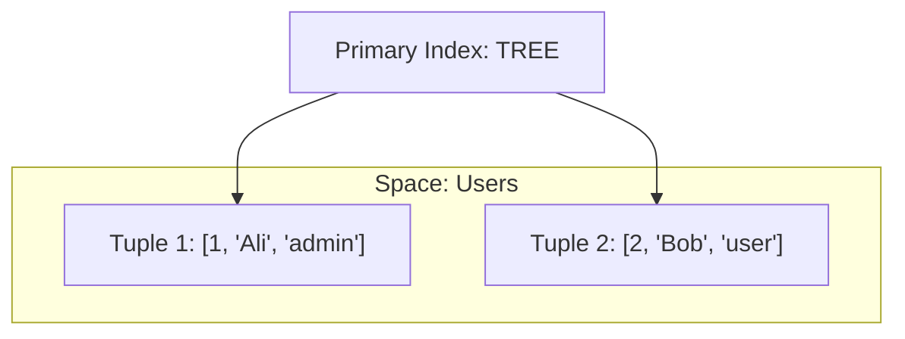

# 🕷️ Tarantool

## 📑 Table of Contents
1. [What is it? (DB + App Server)](#what-is-it-db--app-server)
2. [Data Structure (Tuple & Space)](#data-structure-tuple--space)
3. [Storage Engines (Memtx vs. Vinyl)](#storage-engines-memtx-vs-vinyl)
4. [Lua and Business Logic](#lua-and-business-logic)

---

## 1. 🤔 What is it? (DB + App Server)

**Tarantool** is not just a database (like Redis) or just an application server (like Node.js). It is **both**.
It is an In-Memory NoSQL database integrated with a full-featured **Lua** programming environment.

> [!NOTE]
> **Key Feature**: You can write your business logic (stored procedures) directly *inside* the database. The data resides in the same memory space as your code.
> **Result**: There is zero network overhead for data access, leading to near-zero latency.

---

## 2. 📦 Data Structure (Tuple & Space)

Tarantool does not use tables (like SQL) or key-value pairs (like Redis). Instead, it uses **Spaces** and **Tuples**.

### 🌌 Space
Similar to a **Table** in SQL or a **Collection** in MongoDB.

### 🍱 Tuple
Similar to a **Row**. It is essentially an array of arbitrary length.
*   Example: `[1, "Ivan", 25, "active"]`
*   Unlike JSON (MongoDB), tuples do not inherently have field names—they are indexed starting from 0. However, you can define a "Format" to map indices to names for easier access.



---

## 3. ⚙️ Storage Engines (Memtx vs. Vinyl)

Similar to MySQL's InnoDB/MyISAM, Tarantool provides different storage engines for different needs.

### 🚀 Memtx (In-Memory)
*   **Storage**: All data is stored in **RAM**.
*   **Performance**: Extremely fast.
*   **Durability**: Snapshots and transaction logs (XLOG) are written to disk to prevent data loss.

### 💾 Vinyl (On-Disk)
*   **Storage**: Data is stored on disk (**HDD/SSD**).
*   **Data Structure**: Uses an LSM-Tree (Log-Structured Merge Tree).
*   **Use Case**: Ideal when the dataset is larger than the available physical RAM.

---

## 4. 🌙 Lua and Business Logic

Instead of making numerous `SELECT` calls from an external application, you can write functions in Lua directly inside Tarantool.

**Example (Pseudocode):**
```lua
function transfer_money(from_id, to_id, amount)
    box.begin() -- Start Transaction
    
    local sender = box.space.users:get(from_id)
    local receiver = box.space.users:get(to_id)
    
    if sender.balance < amount then
        box.rollback()
        return error("Insufficient funds")
    end
    
    box.space.users:update(from_id, {{'-', 'balance', amount}})
    box.space.users:update(to_id, {{'+', 'balance', amount}})
    
    box.commit()
end
```

The application simply calls: `call transfer_money(1, 2, 100)`.

---

## 💡 Summary

Consider using Tarantool for **Highload** scenarios requiring complex, real-time data processing, such as billing systems, advanced session management, or game mechanics.