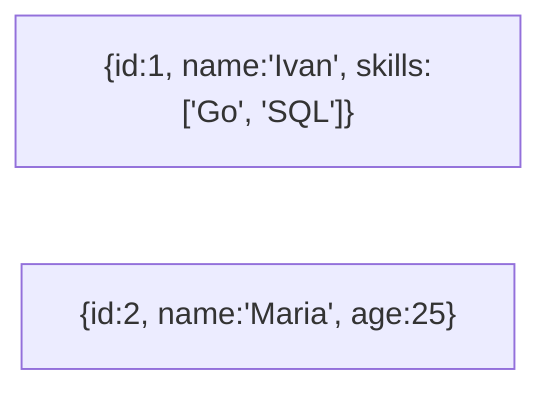

# 🍃 0. Introduction to NoSQL

## 📑 Table of Contents
1. [Why NoSQL?](#why-nosql)
2. [Primary Types of NoSQL](#primary-types-of-nosql)
3. [ACID vs. BASE](#acid-vs-base)
4. [The CAP Theorem in NoSQL](#the-cap-theorem-in-nosql)

---

## 1. 🚀 Why NoSQL?

**NoSQL = "Not Only SQL"**.
The industry developed NoSQL in response to the limitations that traditional RDBMSs faced during the rise of **Big Data** and massive social networks in the 2000s.

**Problems with SQL databases that NoSQL aims to solve:**
1.  **Rigid Schema**: In SQL, it is difficult to add a new field "on the fly" across millions of rows without downtime.
2.  **Scalability**: Standard SQL databases are notoriously difficult to distribute across hundreds of servers (sharding is complex and brittle).
3.  **Speed**: SQL systems invest significantly in maintaining ACID compliance, handling complex locks, and performing continuous data integrity checks.

**The NoSQL Philosophy:**
"Let's remove redundant checks, abandon complex JOINs and cross-table transactions, and in return, achieve **extreme performance** and the ability to scale seamlessly across thousands of servers."

---

## 2. 🗂️ Primary Types of NoSQL

### 1. Key-Value
The simplest type, functioning effectively like a massive `Map` or `Dictionary`.
*   **Examples**: **Redis**, **Memcached**.
*   **Core Principle**: If you know the key, you can retrieve the data with O(1) complexity (instantly). If you don't have the key, searching for data is impossible.
*   **Use Cases**: Session caching, real-time counters, shopping carts.

### 2. Document-Oriented
Data is stored as nested structures, typically in JSON format.
*   **Examples**: **MongoDB**.
*   **Core Principle**: Similar to rows in a table, but each "row" can have **its own unique structure**. It supports arrays and deep nesting.
*   **Use Cases**: Product catalogs (where each product has different attributes), user profiles, blogging platforms.

### 3. Column-Family (Wide-Column)
Data is stored by columns rather than by rows.
*   **Examples**: **Cassandra**, **HBase**, **ClickHouse** (primarily for OLAP).
*   **Core Principle**: Highly efficient for reading specific columns from enormous datasets.
*   **Use Cases**: Analytics, logging, time-series data, messenger systems (e.g., Discord uses ScyllaDB, a Cassandra clone).

### 4. Graph
Focuses on storing "nodes" and the "relationships" (edges) between them.
*   **Examples**: **Neo4j**.
*   **Core Principle**: Optimized for traversing complex connections, such as "friends of friends."
*   **Use Cases**: Social networks, recommendation engines, fraud detection.

---

## 3. ⚖️ ACID vs. BASE

In many NoSQL systems, the strict [ACID](../RDBMS/1.ACID.md) model is traded for a more flexible model called **BASE**:

*   **BA (Basically Available)**: The system guarantees a response to almost every request, though it may temporarily lack current data (see CAP).
*   **S (Soft state)**: The system's state may change over time automatically, even without new input (often due to background replication).
*   **E (Eventual consistency)**: **Final consistency**.
    *   If you "like" a post, a friend on another continent might not see the like immediately, but within a few seconds, the systems will sync, and everyone will see the update.

---

## 4. 🛡️ The CAP Theorem in NoSQL

NoSQL databases typically emphasize different aspects of the CAP theorem (see [RDBMS/2.Replication_and_CAP](../RDBMS/2.Replication_and_CAP.md)).

*   **RDBMS (Postgres, MySQL)** — Usually prioritize **CA** (Consistency and Availability) or **CP** (Consistency and Partition Tolerance).
*   **NoSQL (Cassandra, DynamoDB)** — Often prioritize **AP** (Availability).
    *   *The priority is to accept the write*. Even if part of the cluster is disconnected, the system will record the data in an available node and resolve any conflicts later during a read.

> [!TIP]
> **Conclusion**:
> Use **RDBMS** (like Postgres) as your default, primary database for most applications.
> Use **NoSQL** (like Redis or MongoDB) only for specific tasks where an RDBMS hits a bottleneck or becomes inconvenient (e.g., caching, flexible document structures, or high-velocity log streams).
