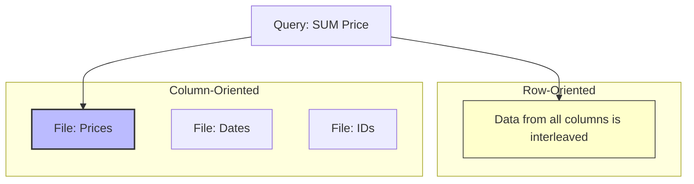

# 📊 ClickHouse

## 📑 Table of Contents
1. [What is it? (OLAP vs. OLTP)](#what-is-it-olap-vs-oltp)
2. [Rows vs. Columns](#rows-vs-columns)
3. [MergeTree (The Heart of ClickHouse)](#mergetree-the-heart-of-clickhouse)

---

## 1. 🤔 What is it? (OLAP vs. OLTP)

**ClickHouse** is a column-oriented DBMS designed for **OLAP** (Online Analytical Processing).

### OLTP (Postgres, MySQL)
*   **Goal**: To quickly insert an order or update a balance. Optimized for operations on **individual rows**.
*   **Sample Query**: `SELECT * FROM users WHERE id = 1`

### OLAP (ClickHouse)
*   **Goal**: High-performance analytics. For example, "What was our total revenue across all regions last year?" Optimized for processing **billions of rows** across a handful of columns.
*   **Sample Query**: `SELECT sum(price) FROM orders WHERE date > '2023-01-01'`

> [!NOTE]
> ClickHouse is incredibly fast. A query that might take 10 minutes to execute in Postgres can often be completed in ClickHouse in under 0.1 seconds.

---

## 2. 🏛️ Rows vs. Columns

Consider a table structure like this: `| Date | ID | Price |`

### Row-Oriented DBMS (e.g., MySQL)
Stores data sequentially, row by row:
`[2023-01-01, 1, 100], [2023-01-01, 2, 200], ...`
To calculate the total of the `Price` column, the disk must read **EVERY** part of the row (including the `Date` and `ID` fields, which are irrelevant to the query).

### Column-Oriented DBMS (e.g., ClickHouse)
Stores each column in its own separate file:
*   **Date File**: `[2023-01-01, 2023-01-01, ...]`
*   **ID File**: `[1, 2, ...]`
*   **Price File**: `[100, 200, ...]`

To calculate the total of the `Price` column, ClickHouse reads **only the Price file**.
*   **I/O Efficiency**: The system reads significantly less data (often 100x less).
*   **Compression**: Storing data of the same type (like numbers) together allows for much more effective compression.

---

## 3. 🌲 MergeTree (The Heart of ClickHouse)

The most robust and widely used table engine in ClickHouse is **MergeTree**.
It functions similarly to an LSM-Tree (Log-Structured Merge Tree).

1.  **Insertion**: Data is written in small, sorted "parts."
2.  **Background Processing**: ClickHouse continuously merges these small parts into larger, sorted files in the background.

> [!WARNING]
> ClickHouse is **not** designed for frequent, single-row insertions (`INSERT INTO ... VALUES (1)`).
> You must write data in batches of 1,000 to 10,000 rows. Otherwise, the server will be overwhelmed by the background merge operations.

---

## 💡 Summary

If you need to generate complex reports, build dashboards, or calculate metrics across terabytes of log data, **ClickHouse** is your best tool. Avoid using it as a primary transactional database for your application backend.