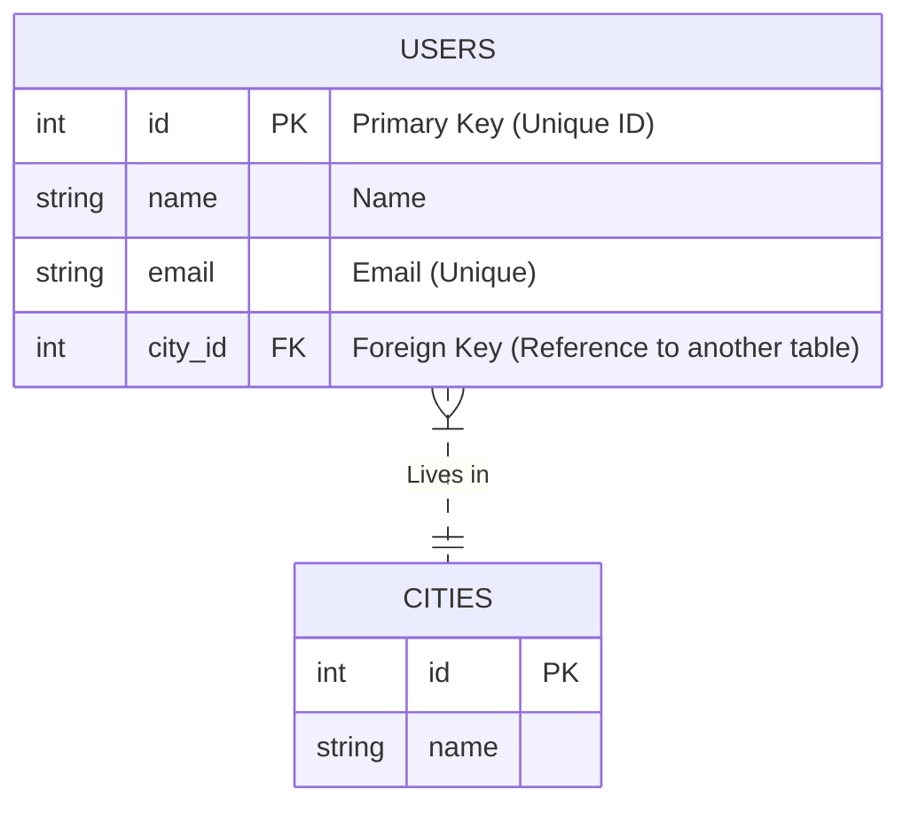

# 🗄️ 0. Introduction to Databases (DB & DBMS)

## 📑 Table of Contents
1. [What is a DB and a DBMS?](#what-is-a-db-and-a-dbms)
2. [A Brief History](#a-brief-history)
3. [Key RDBMS Concepts](#key-rdbms-concepts)
4. [SQL — The Language of Communication](#sql--the-language-of-communication)

---

## 1. 🤔 What is a DB and a DBMS?

These terms are often confused, but there is a distinct difference between them:

- **DB (Database)**: This is the data *storage* itself—an organized collection of information (usually files on a disk).
- **DBMS (Database Management System)**: This is the *software* that allows you to create databases, as well as read, update, and delete data within them. It acts as the "interface" between you and the data files.

> [!NOTE]
> **Analogy**: 
> *   **DB** is like a collection of folders in a basement archive.
> *   **DBMS** is the librarian who knows exactly where everything is and brings you the requested folder.
> *   **SQL** is the language you use to talk to the librarian (e.g., "Give me all books written by Pushkin in 1830").

**Examples of popular DBMSs**:
- **PostgreSQL** (Open Source, powerful, reliable) 🐘
- **MySQL / MariaDB** (Popular for web development) 🐬
- **SQLite** (Embedded, self-contained in a single file) 🪶
- **Oracle / MS SQL Server** (Commercial enterprise solutions) 🏢

---

## 2. 📜 A Brief History

1.  **File Systems**: Data was simply stored in `.txt` or `.csv` files.
    *   *Problem*: Hard to search, no relationships, significant data duplication.
2.  **Hierarchical and Network Models**: Data was structured like a tree or a graph.
    *   *Problem*: Difficult to change structure; highly dependent on physical storage.
3.  **Relational (RDBMS)**: Introduced in the 1970s by E.F. Codd. Data is organized into tables.
    *   *Outcome*: Became the de facto standard for over 40 years due to strict structure, relationships, and SQL.
4.  **NoSQL**: Emerged in the 2000s in response to Big Data and the need for flexibility.
    *   *Core Principle*: Sacrificing a rigid schema for higher speed and scalability.
5.  **NewSQL**: An attempt to combine the ACID guarantees of RDBMS with the horizontal scalability of NoSQL (e.g., CockroachDB, TiDB).

---

## 3. 🏗️ Key RDBMS Concepts

**RDBMS (Relational Database Management System)** — A relational database system stores data in **Tables** (also known as Relations).

### Structure

1.  **Table**: A collection of data centered around one topic (e.g., `Users`, `Orders`).
2.  **Row (Record / Tuple)**: A single entry in a table (e.g., One user: `id:1, name:Ivan`).
3.  **Column (Field / Attribute)**: A specific characteristic of the record (e.g., Name, Age, Email). Each column has a strict data type (Number, String, Date).
4.  **Schema**: The formal description of the database structure (which tables exist, and what fields and types they contain).

### Keys

-   **Primary Key (PK)**: A unique identifier for a row. It cannot be `NULL`. Usually an `id` field, it allows for fast retrieval of a specific record.
-   **Foreign Key (FK)**: A field that references the `Primary Key` of *another* table. This is how **relationships** between tables are established.

---

## 4. 🗣️ SQL — The Language of Communication

**SQL (Structured Query Language)** is a declarative language. You specify *WHAT* you want to retrieve, and the DBMS decides *HOW* to retrieve it.

The main groups of commands are:

1.  **DDL (Data Definition Language)**: Defining structure (Creating tables, deleting columns).
    *   `CREATE`, `ALTER`, `DROP`
2.  **DML (Data Manipulation Language)**: Working with data (Inserting, updating, deleting, searching).
    *   `INSERT`, `UPDATE`, `DELETE`, `SELECT`
3.  **DCL (Data Control Language)**: Managing access permissions.
    *   `GRANT`, `REVOKE`
4.  **TCL (Transaction Control Language)**: Managing transactions.
    *   `COMMIT`, `ROLLBACK`

---

> [!TIP]
> **Why is RDBMS still #1?**
> Because in business (banking, retail, accounting), **integrity** and **structure** are paramount. If you are transferring money, you want to be certain that it is deducted from your account and appears in the recipient's account (ACID), rather than "getting lost somewhere" in the name of speed.
