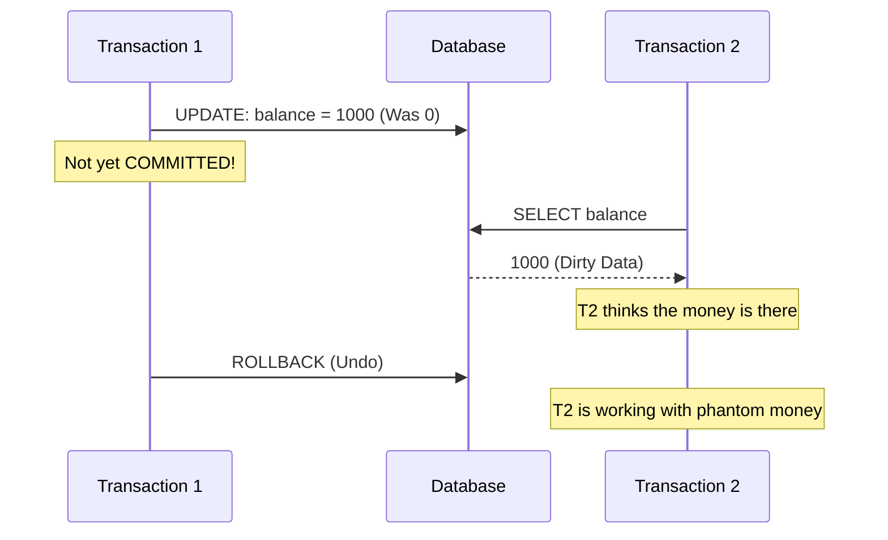
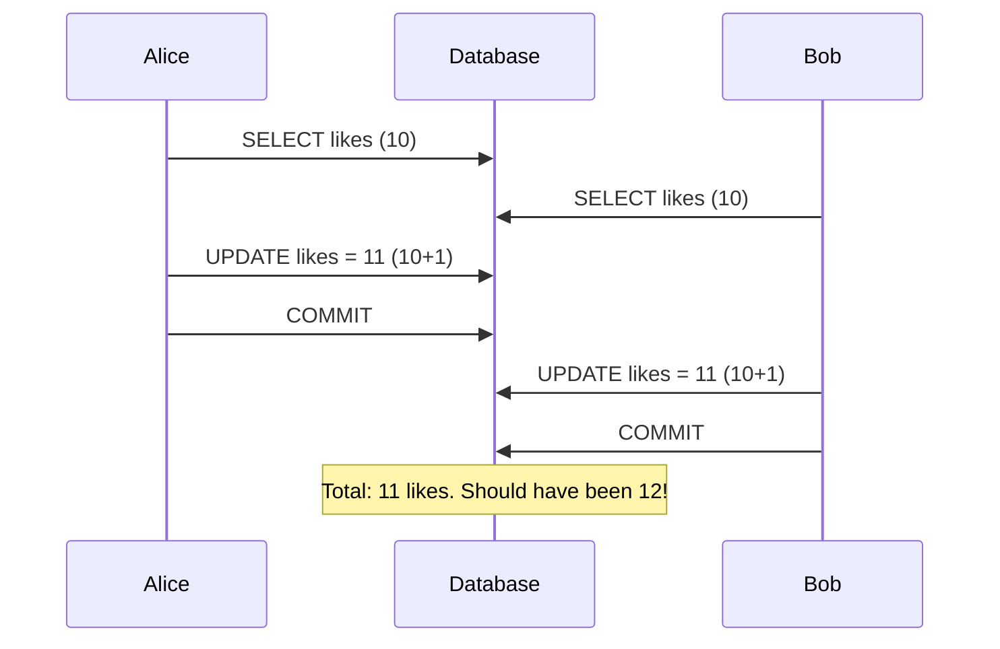
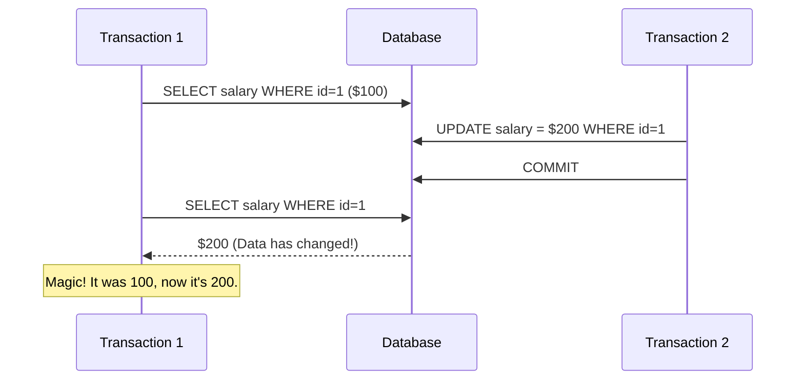
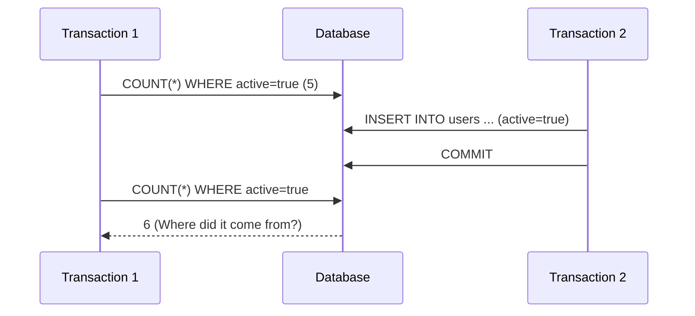

# 🧪 1. ACID: Reliability Guarantees

## 📑 Table of Contents
1. [What is ACID?](#what-is-acid)
    - [Atomicity](#1-atomicity)
    - [Consistency](#2-consistency)
    - [Isolation](#3-isolation)
    - [Durability](#4-durability)
2. [Transaction Anomalies](#transaction-anomalies)
3. [Transaction Example in PostgreSQL](#transaction-example-in-postgresql)

---

## 🤔 What is ACID?

ACID is a set of four requirements for a transactional system that ensure data integrity.
A **transaction** is a sequence of database operations that forms a single logical unit of work.

### 1. Atomicity
**"All or nothing"**.
A transaction cannot be executed partially. Either **all** operations within it are successfully completed, or **none** of them are.

> [!EXAMPLE]
> **Example**: Moving money between accounts.
> 1. Deduct $100 from Alice's account.
> 2. Credit $100 to Bob's account.
> 
> If an error occurs at step 2 (e.g., a power failure), step 1 must be **undone** (Rollback). The money must not simply vanish.

### 2. Consistency
**"Rules are not broken"**.
A transaction must move the database from one valid state to another.
This means that after a transaction, all data must adhere to defined rules (constraints):
-   Data types (e.g., you cannot write text into a numeric field).
-   Foreign Keys (e.g., you cannot reference a non-existent user).
-   Uniqueness (e.g., you cannot create two accounts with the same email).
-   Checks (e.g., a balance cannot be negative if such a constraint exists).

### 3. Isolation
**"I'm in my own house"**.
Concurrent transactions must not interfere with each other. The result of running multiple transactions simultaneously should be the same as if they were executed sequentially (one after the other).

There are four standard ANSI SQL isolation levels, ranging from weak to strong:
1.  **Read Uncommitted**: Allows reading uncommitted (dirty) data. *Dangerous!*
2.  **Read Committed** (Default in Postgres): Only committed changes are visible.
3.  **Repeatable Read**: If a row is read at the start of a transaction, it will not change throughout the transaction (even if another user modifies and commits it).
4.  **Serializable**: Completely simulates sequential execution. This is the most reliable but also the slowest level due to heavy locking.

### 4. Durability
**"Manuscripts don't burn"**.
Once a transaction is committed, its changes are **saved permanently**, even in the event of a total system failure or power loss a millisecond later.
This is achieved using a **WAL (Write-Ahead Log)**. The system first writes the intent (e.g., "change X to Y") to the log on the disk, and only then updates the actual data files.

---

## 🐘 Transaction Example in PostgreSQL

```sql
-- Start the transaction
BEGIN;

-- Operation 1: Deduct money from Alice (id=1)
UPDATE accounts 
SET balance = balance - 100.00
WHERE id = 1;

-- Operation 2: Credit money to Bob (id=2)
UPDATE accounts 
SET balance = balance + 100.00
WHERE id = 2;

-- If everything is correct, commit the changes
COMMIT;

-- If an error occurs, undo everything
-- ROLLBACK;
```

---

## 3. 🐛 Transaction Anomalies

Depending on the isolation level, various "glitches" known as anomalies may occur.

### 1. Dirty Read
A transaction reads data that another transaction **has not yet committed**. If the second transaction performs a rollback, the first transaction has read data that "never existed."



### 2. Lost Update
Two transactions modify the same record simultaneously, and one "overwrites" the result of the other.
**Example**: Two admins edit the same article at once. The version belonging to whoever clicks "Save" last is the one that persists.



### 3. Non-Repeatable Read
Within a single transaction, the same query is performed twice, but returns **different data** because another transaction modified (UPDATE) the row between the two reads.



### 4. Phantom Read
Similar to the above, but the issue isn't an update to existing rows; it's the **appearance of new rows (INSERT)** or the removal of rows (DELETE).
If you read a list (e.g., `WHERE price > 100`) and get 5 items, then run the same query again and get 6 items, a "phantom" has appeared.



---

## 4. 🛡️ Isolation Levels vs. Anomalies

| Level | Dirty Read | Non-Repeatable Read | Phantom Read |
| :--- | :---: | :---: | :---: |
| **Read Uncommitted** | ❌ (Allowed) | ❌ | ❌ |
| **Read Committed** (PG Default) | ✅ (Prevention) | ❌ | ❌ |
| **Repeatable Read** | ✅ | ✅ | ❌ (In Postgres: Prevention!) |
| **Serializable** | ✅ | ✅ | ✅ |

> [!NOTE]
> In **PostgreSQL**, the `Repeatable Read` level is actually more robust than the standard SQL definition and even protects against Phantom Reads.

> [!IMPORTANT]
> Without `BEGIN` and `COMMIT` (in autocommit mode), every command is its own transaction. If the first succeeds but the second fails, money could be deducted but not credited. Within a single multi-statement transaction, this is **impossible**.
