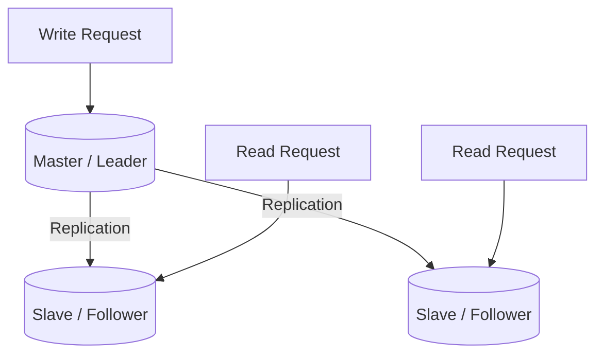
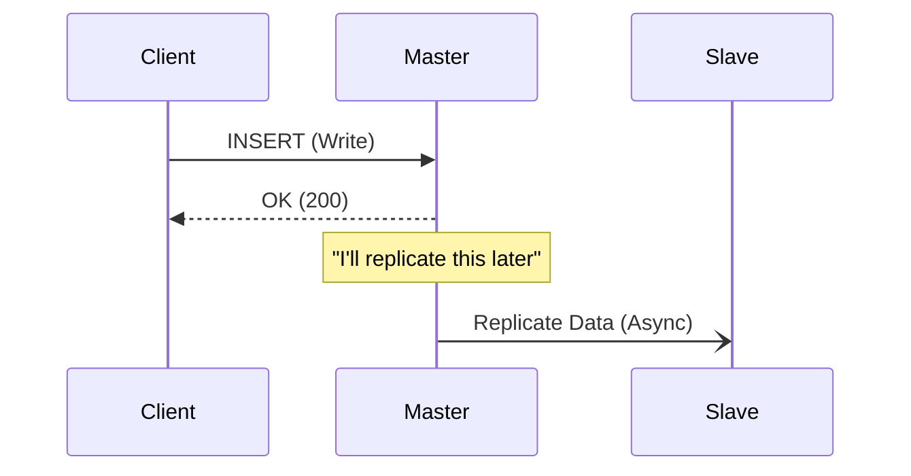
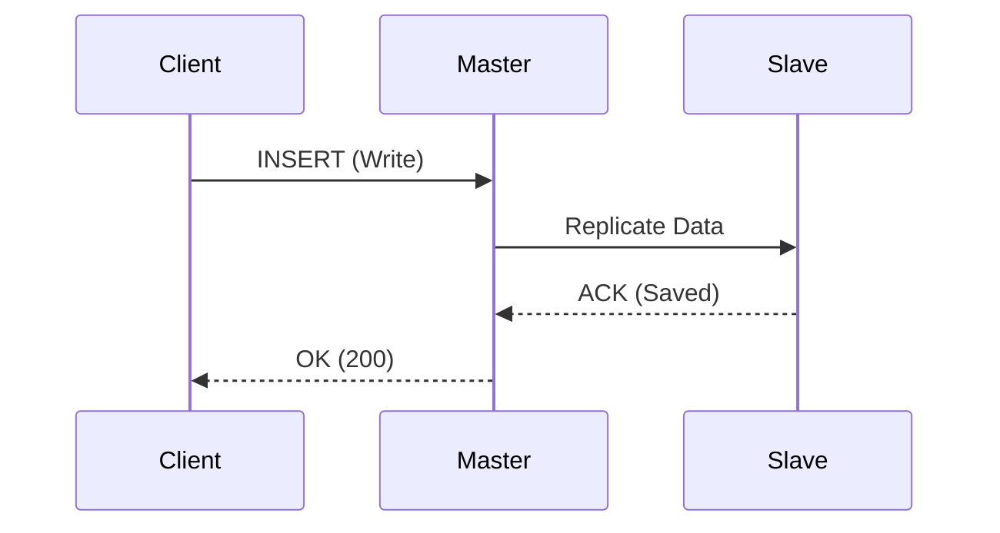

# 👯 2. Replication and the CAP Theorem

## 📑 Table of Contents
1. [Replication](#replication)
2. [Sync vs. Async](#sync-vs-async)
3. [CAP Theorem](#cap-theorem)
4. [Trade-offs: What to Choose?](#trade-offs-what-to-choose)

---

## 1. Replication

**Replication** is the process of copying data from one server to another (or across multiple servers) to achieve:
1.  **Fault Tolerance** (if one server fails, another takes its place).
2.  **Read Scalability** (one server handles writes, while several others handle read traffic).

### Master-Slave (Leader-Follower)
This is the most common replication scheme, used by systems like Postgres, MySQL, and Redis.

-   **All writes** are directed exclusively to the **Master** node.
-   **Reads** can be distributed across any of the **Slave** nodes.

---

## 2. Sync vs. Async

How does data move from the Master to the Slaves?

### Asynchronous Replication (Async) — *Fast but Risky*
1.  The client sends a write request to the Master.
2.  The Master responds with "OK."
3.  The Master sends the data to the Slaves in the background at a later time.

*Pros*: Excellent performance; the Master doesn't wait for Slaves.
*Cons*: Relies on "eventual consistency." If the Master fails before the data is successfully sent to the Slaves, **the data is lost**.

### Synchronous Replication (Sync) — *Reliable but Slow*
1.  The client sends a write request to the Master.
2.  The Master sends the data to the Slaves.
3.  The Slaves confirm: "Data saved."
4.  The Master responds to the client with "OK."

*Pros*: Guarantees that data exists on at least two servers simultaneously. Zero data loss.
*Cons*: Slower performance, as the speed is limited by the slowest slave. If a Slave fails, the Master cannot complete writes, potentially halting the entire system.

---

## 3. 🛡️ CAP Theorem

Proposed by Eric Brewer, the CAP theorem states that in a distributed data store, it is impossible to simultaneously provide more than two out of the following three guarantees:

*   **C (Consistency)**: Every read receives the most recent write or an error. All nodes see the same data at the same time.
*   **A (Availability)**: Every request receives a (non-error) response, without the guarantee that it contains the most recent write. The system is always "alive."
*   **P (Partition Tolerance)**: The system continues to operate despite an arbitrary number of messages being dropped or delayed by the network between nodes.

> [!WARNING]
> In real-world distributed systems, **Partition Tolerance (P)** is a requirement because network failures are inevitable. Therefore, we generally must choose between **CP** (Consistency) and **AP** (Availability).

---

## 4. ⚖️ Trade-offs: What to Choose?

Imagine a "Split-Brain" scenario where the network is cut and the Master and Slave can no longer see each other.
If a client sends a request to a Slave that is isolated from the Master:

**Scenario: Network Partition**

### Choosing CP (Consistency over Availability)
"I (the Slave) cannot see the Master and therefore cannot guarantee that my data is current. To ensure consistency, I will **refuse to respond**."
*   **Response**: `HTTP 500 Error` or Timeout.
*   **Use Case**: Banking transactions. It is better to fail a check of a balance than to show an incorrect balance and allow someone to withdraw more money than they actually have.

### Choosing AP (Availability over Consistency)
"I (the Slave) cannot see the Master, and my data may be outdated. However, **it is better to serve stale data than to serve nothing at all**."
*   **Response**: `HTTP 200 OK` (but the data might be, for example, 5 minutes old).
*   **Use Case**: Social media feeds, likes, or comments. If you don't see a new like for a few seconds, it isn't critical, as long as the site remains functional.
