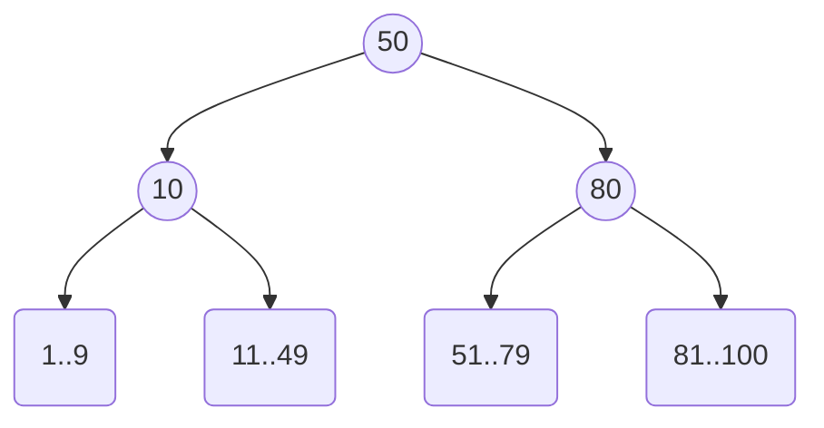

# 🔎 4. Indexes

## 📑 Table of Contents
1. [What is an Index?](#what-is-an-index)
2. [How Does it Work?](#how-does-it-work)
3. [Index Types](#index-types)
4. [Trade-off: Read vs. Write](#trade-off-read-vs-write)
5. [Selectivity](#selectivity)
6. [Composite Indexes](#composite-indexes)

---

## 1. 🤔 What is an Index?

An **index** is a specialized data structure that helps a database find specific rows much faster than it could by scanning through the entire table sequentially (Full Table Scan).

> [!NOTE]
> **Analogy**: A library's card catalog.
> *   Without an index (Full Scan): To find a book by *Tolstoy*, you would have to walk past every shelf and examine every single book until you find it.
> *   With an index: You go to the drawer labeled "T," find the "Tolstoy" card, which gives you the exact shelf and position of the book.

---

## 2. ⚙️ How Does it Work?

Imagine a `Users` table with 1,000,000 rows.
Query: `SELECT * FROM Users WHERE email = 'bob@x.com'`

### Without an Index
The DBMS reads the first row and checks the email, then the second, and so on, potentially up to the 1,000,000th row.
Complexity: **O(N)**. This is slow!

### With an Index
The DBMS navigates the index structure (usually a tree), makes a few efficient "jumps," and immediately retrieves the physical address of the required row on the disk.
Complexity: **O(log N)**. This is nearly instantaneous!

---

## 3. 🌳 Index Types

### B-Tree (Balanced Tree)
The most popular and default type of index (`CREATE INDEX`).
It is ideal for:
*   Exact matches (`=`)
*   Range searches (`>`, `<`, `BETWEEN`)
*   Sorting (`ORDER BY`)

*Since the data in a B-Tree is sorted, searching it is extremely efficient.*

### Hash Index
Functions like a standard hash table.
It is **only** suitable for exact equality matches (`=`).
*   It cannot perform range searches (e.g., `> 50`).
*   In PostgreSQL, it is rarely used compared to B-Trees.

### GIN / GiST (PostgreSQL Specifics)
Specialized for complex or unstructured data types:
*   **GIN (Generalized Inverted Index)**: Used for full-text search (similar to how Google works) and for `JSONB` data (searching for keys within JSON).
*   **GiST (Generalized Search Tree)**: Used for geometric data (e.g., finding all cafes within a 1km radius) and array types.

---

## 4. ⚖️ Trade-off: Read vs. Write

If indexes are so powerful, why not add them to every single column?

1.  **Slower Writes (INSERT / UPDATE / DELETE)**:
    *   Whenever you add a new row to a table, the DBMS must also update **ALL** associated indexes. If you have 10 indexes, a single insert becomes 11 write operations.
2.  **Storage Overhead**:
    *   Indexes take up disk space. In some cases, the index files can be larger than the tables they represent.

> [!TIP]
> Create indexes only on fields that are frequently used in **searches** (`WHERE`), **sorting** (`ORDER BY`), or **joining tables** (`JOIN`). Avoid over-indexing columns that aren't necessary for performance.

---

## 5. 🎯 Selectivity

**Selectivity** measures how effectively an index can "filter out" irrelevant rows.
*   **High Selectivity**: There are many unique values (e.g., Email, UUID, Passport Number). The index will return only 1-2 rows. **This is excellent!**
*   **Low Selectivity**: There are few unique values (e.g., Gender: M/F, Status: Active/Inactive). The index might return 50% of the table. **This is poor!**

> [!WARNING]
> If an index returns **more than 10-20%** of a table, the Query Planner will likely **ignore the index** and perform a Full Table Scan because performing Random I/O (jumping across the disk for each row) is more expensive than Sequential I/O (reading everything in order).
>
> **Example**: Do not create an index on an `is_active` (boolean) column if 90% of your users are active; it won't help performance.

---

## 6. 🎹 Composite Indexes

An index can be built across multiple columns simultaneously: `CREATE INDEX ON users (last_name, first_name, age);`

Two strict rules apply to composite indexes:

### 1. The "Leftmost Prefix" Rule
A composite index `(A, B, C)` functions like a sorted telephone book: first by last name, then by first name, then by age.

*   `WHERE A=1` — ✅ The index works.
*   `WHERE A=1 AND B=2` — ✅ The index works.
*   `WHERE B=2` — ❌ **The index DOES NOT work!** (You cannot search a phone book for everyone named "John" without knowing their last name first).

### 2. The Range Stop Rule
As soon as a range condition (`>`, `<`, `BETWEEN`) appears in your query, the index stops being used for any **subsequent** columns in the composite key.

For an index on `(age, balance)`:
*   `WHERE age = 25 AND balance = 100` — ✅ Performs an exact, fast search.
*   `WHERE age > 25 AND balance = 100` — ⚠️ The index is used only for `age > 25`. Within those results, the `balance` is not sorted, so the database must manually scan all rows that matched the age criteria.

> [!TIP]
> In a composite index, always place columns used for **exact matches** (`=`) at the **beginning**, and columns used for **ranges** (`>`) at the **end**.
