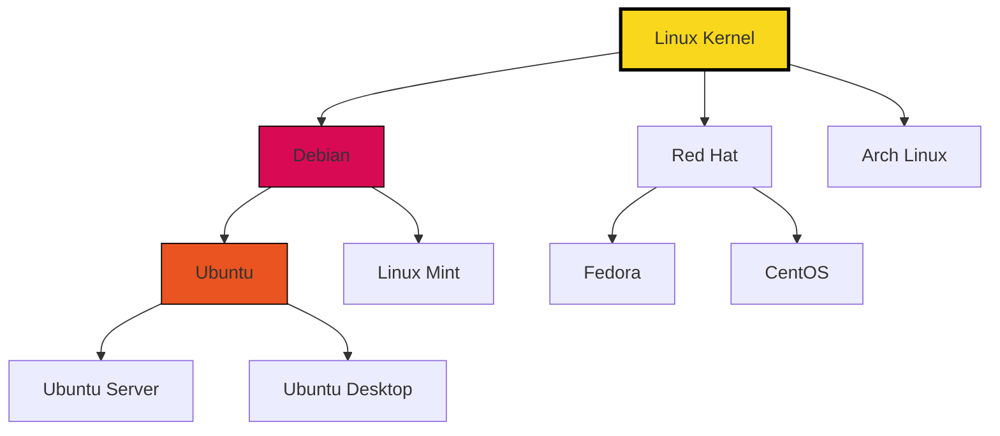
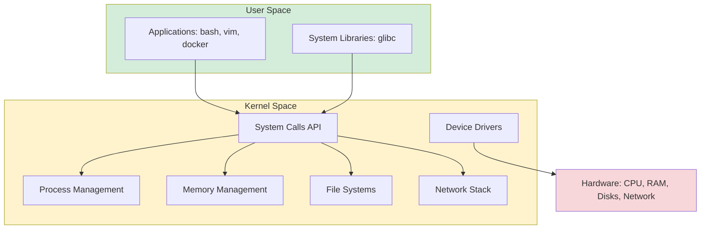
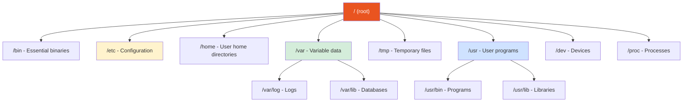
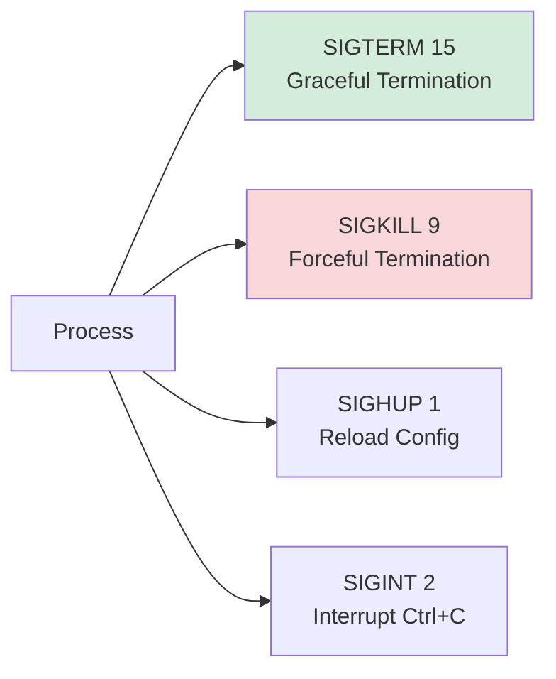
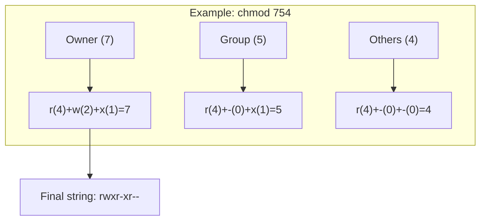

# 🐧 Linux: System Basics

## 📑 Table of Contents
1. [Introduction to Linux](#1-introduction-to-linux)
2. [Linux Architecture](#2-linux-architecture)
3. [File System](#3-file-system)
4. [File Management](#4-file-management)
5. [Working with Text](#5-working-with-text)
6. [Process Management](#6-process-management)
7. [Permissions](#7-permissions)
8. [Network Utilities](#8-network-utilities)
9. [User Management](#9-user-management)
10. [Practical Recipes](#10-practical-recipes)

---

## 1. 🏁 Introduction to Linux

**Linux** is a family of open-source, Unix-like operating systems based on the Linux kernel.

### Key Features
- **Open Source**: Anyone can study, modify, and distribute the code.
- **Multi-user System**: Supports multiple users simultaneously.
- **Multitasking**: Parallel execution of multiple processes.
- **Security**: A robust system of permissions and process isolation.
- **Stability**: Capable of running for months or years without a reboot.

### Popular Distributions



> [!NOTE]
> **Ubuntu** and **Debian** are most popular for servers. **Fedora** and **Arch** are favorites for developers and enthusiasts.

---

## 2. 🏗️ Linux Architecture

Linux consists of several layers of abstraction:



### Core Components

| Component | Purpose |
|:---|:---|
| **Kernel** | The heart of the system; manages resources. |
| **Shell** | Command interpreter (bash, zsh). |
| **System Libraries** | Libraries for interacting with the kernel. |
| **System Utilities** | Utilities for administration. |

---

## 3. 📂 File System

In Linux, "everything is a file": devices, processes, and sockets are all represented as files.

### Directory Structure



| Directory | Description |
|:---|:---|
| `/` | The root directory. |
| `/bin` | Essential executable files (ls, cp, mv). |
| `/sbin` | System binary files for the administrator. |
| `/etc` | System configuration files. |
| `/home` | Home directories for users. |
| `/root` | Home directory for the superuser (root). |
| `/var` | Variable data (logs, mail, queues). |
| `/tmp` | Temporary files (cleared on reboot). |
| `/usr` | Installed programs and libraries. |
| `/dev` | Device files. |
| `/proc` | Virtual FS containing process information. |
| `/sys` | Virtual FS containing system information. |
| `/boot` | Bootloader and kernel files. |
| `/lib` | System libraries. |
| `/opt` | Optional software. |
| `/mnt` | Mount points. |
| `/media` | Removable media. |

---

## 4. 📁 File Management

### Basic Commands

| Command | Description | Example |
|:---|:---|:---|
| `ls` | List directory contents | `ls -la` |
| `cd` | Change directory | `cd /home/user` |
| `pwd` | Print working directory | `pwd` |
| `mkdir` | Create directory | `mkdir -p dir/subdir` |
| `touch` | Create a file | `touch file.txt` |
| `cp` | Copy | `cp -r source/ dest/` |
| `mv` | Move/rename | `mv old.txt new.txt` |
| `rm` | Remove | `rm -rf directory/` |
| `cat` | Display content | `cat file.txt` |
| `file` | Determine file type | `file archive.tar.gz` |
| `ln` | Create links | `ln -s /path/to/file link` |
| `find` | Search for files | `find /home -name "*.log"` |
| `locate` | Quick search by database | `locate nginx.conf` |
| `du` | File/directory size | `du -sh *` |
| `df` | Disk usage | `df -h` |

> [!TIP]
> The `-h` (human-readable) option makes sizes easier to read, e.g., `1.5G` instead of `1572864`.

### Working with Archives

```bash
# Create a tar.gz archive
tar -czf archive.tar.gz directory/

# Extract
tar -xzf archive.tar.gz

# View contents without extracting
tar -tzf archive.tar.gz
```

---

## 5. ✍️ Working with Text

### Text Utilities

| Command | Purpose | Example |
|:---|:---|:---|
| `cat` | Output file | `cat file.txt` |
| `less` | Page-by-page viewing | `less large.log` |
| `head` | First lines | `head -n 20 file.txt` |
| `tail` | Last lines | `tail -f /var/log/syslog` |
| `grep` | Pattern search | `grep "error" app.log` |
| `sed` | Stream editor | `sed 's/old/new/g' file.txt` |
| `awk` | Column processing | `awk '{print $1}' data.txt` |
| `sort` | Sort | `sort -n numbers.txt` |
| `uniq` | Remove duplicates | `uniq -c sorted.txt` |
| `wc` | Count lines/words/bytes | `wc -l file.txt` |
| `diff` | Compare files | `diff file1.txt file2.txt` |

### Powerful Pipeline Combinations

```bash
# Top 10 IP addresses in Nginx logs
cat /var/log/nginx/access.log | cut -d' ' -f1 | sort | uniq -c | sort -rn | head -10

# Find the largest files
find / -type f -exec du -h {} + 2>/dev/null | sort -rh | head -20

# Number of processes by user
ps aux | awk '{print $1}' | sort | uniq -c | sort -rn
```

> [!NOTE]
> The `|` (pipe) operator passes the output of one command to the input of another, allowing you to build powerful processing chains.

---

## 6. ⚙️ Process Management

### Viewing Processes

```bash
# List all processes
ps aux

# Interactive monitoring
top       # Classic
htop      # Improved version (requires installation)
```

### Signals and Terminating Processes



| Command | Description | Example |
|:---|:---|:---|
| `kill` | Send signal by PID | `kill -15 1234` |
| `killall` | Terminate by name | `killall nginx` |
| `pkill` | Terminate by pattern | `pkill -f "python.*script"` |
| `xkill` | Terminate by click (GUI) | `xkill` |

> [!WARNING]
> `kill -9` (SIGKILL) does not allow the process to shut down cleanly. Use it only if `kill -15` fails.

### Background Tasks

```bash
# Run in background
command &

# Send to background (Ctrl+Z, then)
bg

# Bring to foreground
fg

# List tasks
jobs

# Run with disconnection from terminal
nohup command &
```

---

## 7. 🔑 Permissions

### Permissions Structure

In Linux, permissions are attributes that define who can do what with a file or directory.

```text
- rwx r-x r--  1 user group 4096 Jan 30 12:00 file.txt
│ └┬┘ └┬┘ └┬┘
│  │   │   └─ Others — all other users on the system
│  │   └───── Group — users in the file owner's group
│  └───────── Owner — typically the creator of the file
└──────────── File type (- regular, d directory, l link)
```

### 🔢 Calculating Permissions (Logic and Math)

Each permission has a specific weight in binary and octal systems, which is essential for understanding the `chmod` command.

| Permission | Symbol | Binary Weight | Octal Weight | Description |
|:---:|:---:|:---:|:---:|:---|
| **Read** | `r` | `100` | **4** | Read content. |
| **Write** | `w` | `010` | **2** | Write/modify. |
| **Execute** | `x` | `001` | **1** | Run file / Search directory. |
| **None** | `-` | `000` | **0** | No permissions. |

#### Step-by-step calculation for a group:
Sum the weights of the active permissions:

| Symbols | Sum | Total | Description |
|:---:|:---:|:---:|:---|
| `rwx` | 4 + 2 + 1 | **7** | Full access (read, write, execute). |
| `rw-` | 4 + 2 + 0 | **6** | Read and write. |
| `r-x` | 4 + 0 + 1 | **5** | Read and execute (common for programs/folders). |
| `r--` | 4 + 0 + 0 | **4** | Read only. |

### 🛠 Examples for full calculation

To get the three-digit number for `chmod`, calculate the sum for each of the three groups: **Owner - Group - Others**.



**Common Combinations:**
- `chmod 777` — NOT recommended! Opens access to everyone.
- `chmod 755` — Classic for scripts: owner can do anything, others can only read and run.
- `chmod 644` — Standard for regular files: owner edits, others only read.
- `chmod 600` — Confidential: only owner can read and edit (e.g., for SSH keys).

### 📂 Permissions for DIRECTORIES
Directory permissions work differently than file permissions:
- **r (read)** — allows listing files (`ls`).
- **w (write)** — allows creating and deleting files in the folder.
- **x (execute)** — allows "entering" the folder (`cd`) and accessing its files.

> [!IMPORTANT]
> If you have `r` but not `x` on a folder, you can see the file names via `ls`, but you cannot read them or view their sizes.

### 🔄 Commands to Change Permissions

```bash
# Octal format (fast and convenient)
chmod 755 script.sh    # rwxr-xr-x
chmod 644 file.txt     # rw-r--r--

# Symbolic format (when changing only one bit)
chmod u+x script.sh    # User: add (+) execute (x)
chmod g-w file.txt     # Group: remove (-) write (w)
chmod o=r file.txt     # Others: set only (=) read (r)
chmod a+r file.txt     # All: add read for everyone

# Batch change (Recursive)
chmod -R 755 my_project/
```

### Changing Ownership

```bash
# Change owner
chown user file.txt

# Change owner and group
chown user:group file.txt

# Recursive
chown -R user:group directory/
```

> [!IMPORTANT]
> Only the superuser (root) can change file ownership.

---

## 8. 🌐 Network Utilities

### Basic Commands

| Command | Purpose | Example |
|:---|:---|:---|
| `ip` | Network management | `ip addr show` |
| `ping` | Check availability | `ping -c 4 google.com` |
| `traceroute` | Trace route | `traceroute google.com` |
| `netstat` | Network connections (obsolete) | `netstat -tulpn` |
| `ss` | Network sockets (netstat replacement) | `ss -tulpn` |
| `curl` | HTTP requests | `curl -I https://api.com` |
| `wget` | File download | `wget https://file.tar.gz` |
| `nslookup` | DNS queries | `nslookup google.com` |
| `dig` | Detailed DNS info | `dig google.com` |
| `tcpdump` | Packet capture | `tcpdump -i eth0 port 80` |

### Network Traffic Monitoring

```bash
# Show processes using network
nethogs

# Interface statistics
iftop
```

---

## 9. 👤 User Management

```bash
# Create user
useradd -m -s /bin/bash username

# Delete user
userdel -r username

# Modify user
usermod -aG sudo username    # Add to sudo group

# Change password
passwd username

# Switch user
su - username

# Execute as root
sudo command
```

### Configuration Files

| File | Description |
|:---|:---|
| `/etc/passwd` | User database. |
| `/etc/shadow` | Encrypted passwords. |
| `/etc/group` | User groups. |
| `~/.bashrc` | User shell settings. |

---

## 10. 🍳 Practical Recipes

### Copying Between Servers

```bash
# Copy file to remote server
scp file.txt user@host:/path/to/destination

# Copy directory
scp -r directory/ user@host:/path/

# Copy from server
scp user@host:/path/file.txt ./
```

### Real-time Log Monitoring

```bash
# Follow a log
tail -f /var/log/syslog

# With pattern search
tail -f app.log | grep ERROR

# Last 100 lines with updates
tail -n 100 -f /var/log/nginx/access.log
```

### Top IP Addresses in Logs

```bash
# Nginx access log
awk '{print $1}' /var/log/nginx/access.log | sort | uniq -c | sort -rn | head -10

# Using cut
cut -d' ' -f1 /var/log/nginx/access.log | sort | uniq -c | sort -rn | head -10
```

### Searching Files and Executing Commands

```bash
# Find and delete old logs (>30 days)
find /var/log -name "*.log" -mtime +30 -delete

# Find large files (>100MB)
find / -type f -size +100M -exec ls -lh {} \; 2>/dev/null

# Change permissions for all .sh files
find . -name "*.sh" -exec chmod +x {} \;
```

### Disk Usage Analysis

```bash
# Top 10 largest directories
du -h / 2>/dev/null | sort -rh | head -10

# Size of each directory in the current location
du -sh */ | sort -rh

# Disk usage
df -h
```

### Process Troubleshooting

```bash
# Find PID by name
pgrep nginx

# Full process info
ps aux | grep nginx

# Kill all python processes
pkill -f python

# Process uptime
ps -p PID -o etime=
```

---

## 🧪 Useful Environment Variables

```bash
# View all variables
env

# Set a variable
export VAR_NAME="value"

# Add to PATH
export PATH="$PATH:/new/path"

# Make permanent (add to ~/.bashrc)
echo 'export VAR="value"' >> ~/.bashrc
source ~/.bashrc
```

---

## ⌨️ Bash Hotkeys

| Combination | Action |
|:---|:---|
| `Ctrl+C` | Interrupt command |
| `Ctrl+Z` | Pause command |
| `Ctrl+D` | Logout (EOF) |
| `Ctrl+L` | Clear screen |
| `Ctrl+A` | Move to start of line |
| `Ctrl+E` | Move to end of line |
| `Ctrl+U` | Delete to start from cursor |
| `Ctrl+K` | Delete to end from cursor |
| `Ctrl+R` | Search command history |
| `Tab` | Autocomplete |
| `!!` | Repeat last command |

---

> [!TIP]
> **Study man pages**: `man <command>` is the best source of information for any Linux command.

---

## 📚 Advanced Topics

For a deeper dive into specific Linux subsystems, refer to the following sections:

1.  [**File System and Descriptors**](file_System.md) — The "everything is a file" philosophy, Inodes, FD.
2.  [**Process Management**](process_Management.md) — Fork, Exec, Signals.
3.  [**Memory Management**](memory_Management.md) — Virtual memory, Swap, OOM Killer.
4.  [**System Calls**](system_Calls.md) — The kernel interaction interface.
5.  [**Networking and Sockets**](networking.md) — Socket Descriptors, iptables.
6.  [**Shell Scripting**](shell_Scripting.md) — Pipelines and redirections.
7.  [**Cron Jobs**](cron_Jobs.md) — Task scheduler.

---

> [!CAUTION]
> Commands like `rm -rf /`, `dd`, or disk formatting can **permanently destroy data**. Always double-check before execution!