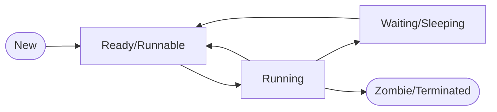

# ⚙️ Process Management

A process is an instance of a running program. In Linux, process management is one of the kernel's core responsibilities, enabling multitasking and resource isolation.

## 📑 Table of Contents
1. [Core Concepts](#1-core-concepts)
2. [Process States](#2-process-states)
3. [Life Cycle: Fork & Exec](#3-life-cycle-fork--exec)
4. [Zombies & Orphans](#4-zombies--orphans)
5. [Signals](#5-signals)
6. [Scheduling and Priorities](#6-scheduling-and-priorities)
7. [The /proc File System](#7-the-proc-file-system)
8. [Expert: Isolation (Namespaces & Cgroups)](#8-expert-isolation-namespaces--cgroups)
9. [Diagnostic Tools](#9-diagnostic-tools)

---

## 1. 🔍 Core Concepts

- **Program vs. Process**: A program is a static file residing on a disk. A process is a dynamic object in RAM with allocated system resources.
- **PID (Process ID)**: A unique identifier for a process.
- **PPID (Parent PID)**: The identifier of the process that created the current process.
- **init / systemd (PID 1)**: The first process started by the system, acting as the ancestor of all other processes.

---

## 2. 🚥 Process States

Throughout its existence, a process transitions through several states:

- **R (Running/Runnable)**: The process is currently being executed or is ready to run as soon as a CPU core becomes available.
- **S (Interruptible Sleep)**: The process is waiting for an event (e.g., user input). It can be interrupted and woken up by a signal.
- **D (Uninterruptible Sleep)**: The process is waiting for I/O (e.g., disk access). It will not respond to any signals until the I/O operation completes.
- **T (Stopped)**: The process has been suspended (e.g., via Ctrl+Z).
- **Z (Zombie)**: The process has finished executing, but its entry remains in the process table because the parent has not yet read its exit status.

> [!NOTE]
> A large number of processes in the **D** state typically indicates bottlenecks in the disk subsystem or issues with network-attached storage.

---

## 3. 🍴 Life Cycle: Fork & Exec

In Linux, the creation of a new process occurs in two primary stages:

1.  **fork()**: Creates an exact copy of the current process.
    - It utilizes a **Copy-on-Write (CoW)** mechanism: memory is only duplicated when one of the processes attempts to modify it. This makes the `fork()` operation extremely efficient.
2.  **exec()**: Replaces the memory space, code, and data of the current process with a new program.

> [!TIP]
> **clone()** is the underlying system call used by `fork()`. it allows for fine-grained control over which resources (such as memory or file descriptors) are shared between parent and child, which is how threads are implemented.

---

## 4. 🧟 Zombies & Orphans

- **Zombie**: A process that has finished (via `exit`) but still occupies an entry in the process table because the parent has not yet called `wait()`.
    - *How to remove*: Terminate the parent process (the zombie will then be adopted by `init`) or fix the parent process code to handle exit statuses correctly.
- **Orphan**: A process whose parent has terminated before it.
    - *What happens*: It is "adopted" by the `systemd` process (PID 1), which will correctly reap its status when it eventually terminates.

---

## 5. 🚥 Signals

Signals are software-level interrupts used to notify processes about specific events.

| Signal | Code | Description | Catchable? |
| :--- | :--- | :--- | :--- |
| **SIGHUP** | 1 | Terminal disconnected / Restart. | Yes |
| **SIGINT** | 2 | Interrupt (Ctrl+C). | Yes |
| **SIGKILL** | 9 | Immediate termination (Kill). | **No** |
| **SIGTERM** | 15 | Polite termination (Default). | Yes |
| **SIGCONT** | 18 | Continue execution. | Yes |
| **SIGINT** | 19 | Suspension (Stop). | **No** |

---

## 6. ⚖️ Scheduling and Priorities

Linux is a multitasking system. The scheduler determines which process gets CPU time.

- **Nice value (-20 to 19)**: A measure of how "nice" a process is to others.
    - `-20`: Highest priority.
    - `19`: Lowest priority.
- **Commands**: `nice` (start a process with a specific priority), `renice` (alter the priority of a running process).

---

## 7. 📂 The /proc File System

The `/proc` directory is a virtual interface into the kernel. Each process has its own subdirectory at `/proc/[PID]`.

- `/proc/[PID]/status`: Key information about the process.
- `/proc/[PID]/maps`: Memory map (lists loaded libraries).
- `/proc/[PID]/fd/`: A list of open file descriptors.
- `/proc/[PID]/environ`: The process's environment variables.

---

## 8. 🛡️ Expert: Isolation (Namespaces & Cgroups)

These technologies are the foundations of modern containerization (Docker, Kubernetes).

### Namespaces
Namespaces isolate what a process can **see**:
- **PID**: Its own set of PIDs (a process in a container can think it is PID 1).
- **NET**: Its own network interfaces and ports.
- **MNT**: Its own mount points (private file system).
- **UTS**: Its own hostname.

### Cgroups (Control Groups)
Cgroups restrict what a process can **consume**:
- CPU usage limits.
- RAM usage limits.
- Disk I/O limits.

---

## 9. 🛠️ Diagnostic Tools

- `ps aux`: Lists all running processes.
- `top` / `htop`: Interactive real-time monitoring.
- `strace -p [PID]`: Trace the system calls made by a process.
- `lsof -p [PID]`: List all files opened by the process.
- `kill -9 [PID]`: Force-kill a process.
- `pstree`: Visualizes processes in a tree hierarchy.
