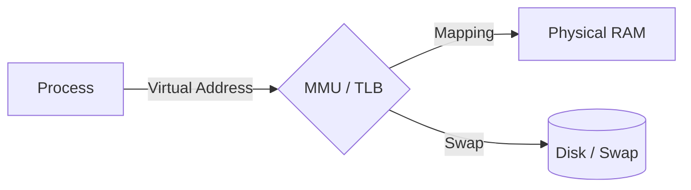

# 🧠 Memory Management

Memory management in Linux is a sophisticated system that ensures process isolation, efficient RAM utilization, and abstraction of the underlying physical hardware.

## 📑 Table of Contents
1. [Virtual Memory and Pages](#1-virtual-memory-and-pages)
2. [Process Memory Anatomy (Layout)](#2-process-memory-anatomy-layout)
3. [Allocation Mechanisms: brk vs. mmap](#3-allocation-mechanisms-brk-vs-mmap)
4. [Page Faults and Copy-on-Write](#4-page-faults-and-copy-on-write)
5. [OOM Killer and Swap](#5-oom-killer-and-swap)
6. [Expert: Kernel Allocators (Buddy & Slab)](#6-expert-kernel-allocators-buddy--slab)
7. [Expert: Optimizations (NUMA & Huge Pages)](#7-expert-optimizations-numa--huge-pages)
8. [Diagnostic Tools](#8-diagnostic-tools)

---

## 1. 👻 Virtual Memory and Pages

Processes do not interact with physical RAM directly; instead, they use **Virtual Addresses**.

- **Page**: Memory is divided into fixed-size blocks, typically **4 KB** each.
- **MMU (Memory Management Unit)**: The hardware component that translates a process's virtual addresses into physical addresses in RAM on the fly.
- **TLB (Translation Lookaside Buffer)**: A specialized cache in the CPU designed to speed up this address translation.

---

## 2. 🏛️ Process Memory Anatomy (Layout)

A process's address space is divided into several distinct segments:

- **Stack**: Grows downwards. Stores local variables and function arguments. It is extremely fast.
- **Heap**: Grows upwards. Used for dynamic memory allocation (e.g., `malloc` in C, `make/new` in Go).
- **BSS / Data**: Stores global and static variables.
- **Text (Code)**: The actual executable machine code of the program (marked as read-only).

---

## 3. 🛠️ Allocation Mechanisms: brk vs. mmap

When a program requires more heap memory, it triggers a system call:

1.  **brk / sbrk**: Simply moves the upper boundary of the heap higher. Typically used for smaller allocations.
2.  **mmap**: Creates a entirely new mapping in the address space. Used for large memory blocks or for mapping files directly into memory.

> [!NOTE]
> In high-level languages like Go, developers rarely call these directly; instead, the language's runtime allocator handles these operations.

---

## 4. ⚙️ Page Faults and Copy-on-Write

### Page Fault
A situation where a process attempts to access a page that is not currently present in RAM.
- **Minor Page Fault**: The page is in memory (e.g., used by another process), and the system only needs to update the page table.
- **Major Page Fault**: The system must read the data from the disk (which is significantly slower).

### Copy-on-Write (CoW)
When a `fork()` is executed, the parent's memory is not immediately copied to the child. Both processes initially point to the same physical pages. Duplication only occurs when one of the processes attempts a **write** operation. This mechanism saves gigabytes of RAM.

---

## 5. 🔪 OOM Killer and Swap

### Swap
If RAM is exhausted, the kernel moves rarely used pages to the disk. While this prevents the system from crashing immediately, it significantly degrades performance.

### OOM Killer (Out of Memory)
If both RAM and Swap are fully utilized, the OOM Killer is activated. It analyzes running processes and terminates the "worst" offender (typically a non-critical process consuming large amounts of memory).
- You can inspect a process's OOM priority score at `/proc/[pid]/oom_score`.

---

## 6. 🛠️ Expert: Kernel Allocators (Buddy & Slab)

The kernel manages memory using a two-tier approach:

1.  **Buddy System**: Operates on whole pages (4KB, 8KB, 16KB, etc.). It tracks and manages free blocks of physical memory.
2.  **Slab Allocator**: Operates *within* pages. It caches frequently used kernel objects (such as process structures and open file metadata) to avoid the overhead of constant allocation and deallocation.
    - Linux implementations include: **SLAB**, **SLUB** (the current default), and **SLOB**.

---

## 7. 🚀 Expert: Optimizations (NUMA & Huge Pages)

- **Huge Pages**: Instead of the standard 4KB pages, the system can use **2MB** or **1GB** pages. This reduces TLB misses and significantly accelerates database performance (e.g., PostgreSQL, Oracle).
- **NUMA (Non-Uniform Memory Access)**: In multi-processor servers, memory is "local" to a specific CPU. Accessing local memory is faster than accessing memory attached to a different CPU. The Linux kernel attempts to schedule processes on the CPU closest to their data.

---

## 8. 🛠️ Diagnostic Tools

- `free -h`: Displays how much memory is currently free.
- `vmstat 1`: Provides real-time statistics on page usage and Swap.
- `top` / `htop`: Monitors memory consumption per process (RES: Resident memory; VIRT: Virtual memory).
- `cat /proc/meminfo`: Detailed kernel-level memory statistics.
- `smem`: Reports **PSS** (Proportional Set Size) — a more accurate measure of a process's memory footprint that accounts for shared libraries.
