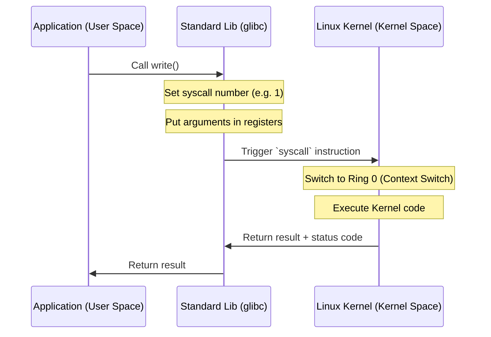

# 📞 System Calls

System calls (syscalls) serve as the programmatic interface between an application and the Linux kernel. They are the only legitimate way for a program to request the kernel to perform privileged operations.

## 📑 Table of Contents
1. [User Space vs. Kernel Space](#1-user-space-vs-kernel-space)
2. [How a Syscall Works (Mechanics)](#2-how-a-syscall-works-mechanics)
3. [Main Categories of Calls](#3-main-categories-of-calls)
4. [Expert: Optimizations (vDSO & vsyscall)](#4-expert-optimizations-vdso--vsyscall)
5. [The Cost of a System Call](#5-the-cost-of-a-system-call)
6. [Diagnostic Tools](#6-diagnostic-tools)

---

## 1. 🛡️ User Space vs. Kernel Space

Modern processors support different levels of privilege, known as **Protection Rings**:
- **Ring 3 (User Mode)**: Where standard applications run. They have restricted access to memory and hardware.
- **Ring 0 (Kernel Mode)**: Where the kernel resides. It has unrestricted access to all system resources.

A system call is essentially a "toggle" that switches the CPU from Ring 3 to Ring 0.

---

## 2. ⚙️ How a Syscall Works (Mechanics)

When a program invokes a function that requires kernel assistance (e.g., `write`), the following sequence occurs:

1.  **Preparation**: The specific syscall number and its arguments are placed into the processor's registers.
2.  **Trap**: A special CPU instruction is executed (the modern `syscall` instruction or the legacy `int 0x80`).
3.  **Context Switching**: The kernel saves the current state of the application and begins executing its own privileged code.
4.  **Result**: Once complete, the kernel returns the CPU to User Mode, and the result is passed back to the program.

---

## 3. 📂 Main Categories of Calls

| Category | Examples |
| :--- | :--- |
| **File Management** | `open`, `read`, `write`, `close`, `stat` |
| **Process Management** | `fork`, `execve`, `wait`, `exit`, `getpid` |
| **Networking** | `socket`, `bind`, `connect`, `send`, `recv` |
| **Memory Management** | `mmap`, `brk`, `munmap` |
| **Signals / Timers** | `kill`, `sigaction`, `nanosleep` |

---

## 4. 🚀 Expert: Optimizations (vDSO & vsyscall)

Switching to Kernel Mode is "expensive" (costing hundreds of nanoseconds). To optimize frequently used calls that don't require high privilege (e.g., getting the current time), Linux employs several optimization techniques:

### vDSO (virtual Dynamic Shared Object)
This is a small segment of kernel memory that is mapped into the address space of every application. It contains the code for certain syscalls (e.g., `gettimeofday`), allowing them to be executed directly in **User Space** without a context switch.
- **Pros**: Near-zero latency.
- **Cons**: Only suitable for reading safe, predefined kernel data.

### vsyscall
The obsolete predecessor to vDSO. It used fixed memory addresses, which posed security risks (Vulnerability to certain attacks). It has since been replaced by the more flexible vDSO.

---

## 5. 💰 The Cost of a System Call

Why are system calls considered "expensive"?
1.  **Context Switching**: The CPU must flush caches and update page tables (TLB).
2.  **Validation**: The kernel must rigorously validate all arguments to ensure the application cannot compromise system integrity.
3.  **Security Mitigations**: Modern security patches (e.g., for Spectre/Meltdown) have made these transitions even slower.

> [!TIP]
> In high-performance (High Load) systems, developers aim to minimize syscalls by using buffering (e.g., writing data in 4KB chunks rather than 1 byte at a time) or modern asynchronous I/O mechanisms like **io_uring**.

---

## 6. 🛠️ Diagnostic Tools

- **strace**: The essential tool for debugging. It displays all system calls made by a program in real-time.
    - `strace ls`: See everything the `ls` command does under the hood.
    - `strace -c ./my_app`: Calculate the frequency and time spent on each syscall.
- **perf**: A powerful performance profiling tool that helps identify where syscalls are bottlenecking the system.
- **man 2 [syscall]**: The official developer documentation (e.g., `man 2 open`).
