# 📈 Big O Notation

## 📑 Table of Contents
1. [What is it and why do we need it?](#1-what-is-it-and-why-do-we-need-it)
2. [Complexity Classes](#2-complexity-classes)
3. [Go Code Examples](#3-go-code-examples)
4. [Growth Visualization](#4-growth-visualization)
5. [Space Complexity](#5-space-complexity)
6. [Other Notations (Omega, Theta)](#6-other-notations-omega-theta)
7. [How to Optimize Your Code](#7-how-to-optimize-your-code)
8. [Cheat Sheet](#8-cheat-sheet)

---

## 1. 🤔 What is it and why do we need it?

**Big O** is a mathematical notation used to describe how the execution time (or memory consumption) of an algorithm changes as the size of the input data ($n$) increases.

> [!IMPORTANT]
> We don't measure time in seconds. We measure the **number of operations**. This is because seconds depend on the hardware, while the number of operations depends on the algorithm itself.

### Three Common Cases

*   **Best Case**: Typically the least interesting (e.g., the element is found immediately).
*   **Average Case**: Crucial for real-world performance assessment.
*   **Worst Case** = **Big O**: The most critical! "It won't get any worse than this."

> [!TIP]
> **Why Worst Case?** Because in production, you must be prepared for the worst-case scenario. If an algorithm has a worst-case complexity of $O(n^2)$, it could potentially "crash" your system when processing large datasets.

---

### 🎯 Pro-tip: Constants and coefficients are dropped!

Big O is only concerned with the **growth rate** as $n$ increases, not the exact number of operations.

**Rules for Simplification:**

1. **Drop constants**:
   - $O(5n)$ → $O(n)$
   - $O(100)$ → $O(1)$
   - $O(2n^2)$ → $O(n^2)$

2. **Drop lower-order terms**:
   - $O(n^2 + n)$ → $O(n^2)$ (as $n$ grows, the squared term dominates the linear term)
   - $O(n^3 + n^2 + n + 100)$ → $O(n^3)$
   - $O(\log n + 5)$ → $O(\log n)$

**Examples:**

```go
// Example 1: O(2n) → O(n)
func example1(arr []int) {
    // First pass
    for i := 0; i < len(arr); i++ {
        fmt.Println(arr[i])
    }
    
    // Second pass
    for i := 0; i < len(arr); i++ {
        fmt.Println(arr[i] * 2)
    }
}
// Formally: n + n = 2n operations
// Big O: O(2n) → O(n) ✅

// Example 2: O(n² + n) → O(n²)
func example2(arr []int) {
    // Cycle O(n)
    for i := 0; i < len(arr); i++ {
        fmt.Println(arr[i])
    }
    
    // Nested cycles O(n²)
    for i := 0; i < len(arr); i++ {
        for j := 0; j < len(arr); j++ {
            fmt.Println(arr[i], arr[j])
        }
    }
}
// Formally: n + n² operations
// Big O: O(n + n²) → O(n²) ✅
// Because at n=1000: n²=1,000,000 >> n=1000
```

> [!NOTE]
> **Why is this so?** Consider when $n = 1,000,000$:
> - $O(2n) = 2,000,000$ operations
> - $O(100n) = 100,000,000$ operations
>
> While there is a 50x difference, the **growth rate is identical** — it's linear. Both lines on a graph are parallel, which is why their Big O is the same: $O(n)$.

---

## 2. 🐢 Complexity Classes (from Best to Worst)

### $O(1)$ — Constant Time ⚡

The execution time **does not depend** on the size of the input data. It is always equally fast.

**Examples:**
*   Accessing an array element by index: `arr[5]`
*   Retrieving a value from a HashMap: `m["key"]`
*   Appending an element to a slice (if capacity is sufficient): `append(slice, item)`

---

### $O(\log n)$ — Logarithmic Time 🚀

At each step, **half** of the remaining data is discarded. Extremely efficient!

**Examples:**
*   Binary Search in a sorted array.
*   Searching in a balanced tree (AVL, Red-Black Tree).
*   Operations in a heap.

> [!NOTE]
> $\log_2(1,000,000) \approx 20$. This means that for a million elements, only about 20 operations are needed!

---

### $O(n)$ — Linear Time 📏

The algorithm needs to process every element **once**.

**Examples:**
*   Finding the maximum value in an array.
*   Linear search for an element in an unsorted array.
*   Calculating the sum of all elements.

---

### $O(n \log n)$ — Linearithmic Time ⚙️

The standard for **efficient** sorting algorithms.

**Examples:**
*   Merge Sort.
*   Quick Sort (average case).
*   Heap Sort.

**Concept**: We perform an $O(\log n)$ action $n$ times.

---

### $O(n^2)$ — Quadratic Time 🐌

Nested loops. For every element, we check all other elements.

**Examples:**
*   Bubble Sort.
*   Selection Sort.
*   Naively searching for duplicates by comparing every pair.

> [!WARNING]
> At $n = 10,000$, you'll end up with 100,000,000 operations! This is very slow for large datasets.

---

### $O(2^n)$ — Exponential Time 💣

Adding a single element **doubles** the execution time. This is disastrous for large $n$.

**Examples:**
*   Recursive calculation of Fibonacci numbers (without memoization).
*   Generating all subsets of a set (Power Set).
*   Solving problems via pure brute force.

---

### $O(n!)$ — Factorial Time ☠️

The absolute worst. Practically impossible for $n > 15$.

**Examples:**
*   Traveling Salesman Problem (TSP) via brute force search.
*   Generating all permutations of a string or array.

> [!CAUTION]
> $10! = 3,628,800$, but $20! \approx 2.4 \times 10^{18}$ — that's trillions upon trillions of operations!

---

## 3. 💻 Go Code Examples

### $O(1)$ — Constant Time

```go
// Accessing an array element
func getElement(arr []int, index int) int {
    return arr[index] // O(1)
}

// Map insertion
func insertToMap(m map[string]int, key string, value int) {
    m[key] = value // O(1) on average
}
```

---

### $O(\log n)$ — Logarithmic Time

```go
// Binary search in a sorted array
func binarySearch(arr []int, target int) int {
    left, right := 0, len(arr)-1
    
    for left <= right {
        mid := left + (right-left)/2
        
        if arr[mid] == target {
            return mid // Found
        } else if arr[mid] < target {
            left = mid + 1 // Search right half
        } else {
            right = mid - 1 // Search left half
        }
    }
    
    return -1 // Not found
}
```

**Why is it O(\log n)?** Each iteration divides the search space in half. For 1,000 elements, you need $\approx 10$ iterations ($\log_2(1000) \approx 10$).

---

### $O(n)$ — Linear Time

```go
// Finding the maximum in an array
func findMax(arr []int) int {
    if len(arr) == 0 {
        return 0
    }
    
    max := arr[0]
    for _, num := range arr { // Iterate through each element once
        if num > max {
            max = num
        }
    }
    return max
}

// Calculating sum
func sum(arr []int) int {
    total := 0
    for _, num := range arr { // O(n)
        total += num
    }
    return total
}
```

---

### $O(n \log n)$ — Linearithmic Time

```go
// Merge Sort
func mergeSort(arr []int) []int {
    if len(arr) <= 1 {
        return arr
    }
    
    mid := len(arr) / 2
    left := mergeSort(arr[:mid])   // Recursion: log(n) levels
    right := mergeSort(arr[mid:])
    
    return merge(left, right)      // Merging: O(n)
}

func merge(left, right []int) []int {
    result := make([]int, 0, len(left)+len(right))
    i, j := 0, 0
    
    for i < len(left) && j < len(right) {
        if left[i] < right[j] {
            result = append(result, left[i])
            i++
        } else {
            result = append(result, right[j])
            j++
        }
    }
    
    result = append(result, left[i:]...)
    result = append(result, right[j:]...)
    return result
}
```

---

### $O(n^2)$ — Quadratic Time

```go
// Bubble Sort
func bubbleSort(arr []int) {
    n := len(arr)
    
    for i := 0; i < n; i++ {           // Outer loop: n times
        for j := 0; j < n-i-1; j++ {   // Inner loop: n times
            if arr[j] > arr[j+1] {
                arr[j], arr[j+1] = arr[j+1], arr[j] // Swap
            }
        }
    }
}

// Finding all pairs with a specific sum (naive approach)
func findPairs(arr []int, target int) [][2]int {
    pairs := [][2]int{}
    
    for i := 0; i < len(arr); i++ {        // n iterations
        for j := i + 1; j < len(arr); j++ { // n iterations
            if arr[i]+arr[j] == target {
                pairs = append(pairs, [2]int{arr[i], arr[j]})
            }
        }
    }
    
    return pairs
}
```

---

### $O(2^n)$ — Exponential Time

```go
// Fibonacci (naive recursion)
func fibonacci(n int) int {
    if n <= 1 {
        return n
    }
    // Each call generates 2 new calls
    return fibonacci(n-1) + fibonacci(n-2) // O(2^n) - BAD!
}

// Improved version with Memoization - O(n)
func fibonacciMemo(n int, memo map[int]int) int {
    if n <= 1 {
        return n
    }
    
    if val, ok := memo[n]; ok {
        return val // Already calculated
    }
    
    memo[n] = fibonacciMemo(n-1, memo) + fibonacciMemo(n-2, memo)
    return memo[n]
}
```

---

## 4. 📊 Growth Visualization

Let's see how execution time scales as $n$ increases:

```mermaid
graph LR
    subgraph "n = 10"
        O1_10["O(1): 1"]
        Olog_10["O(log n): 3"]
        On_10["O(n): 10"]
        Onlogn_10["O(n log n): 33"]
        On2_10["O(n²): 100"]
        O2n_10["O(2ⁿ): 1024"]
    end
    
    subgraph "n = 100"
        O1_100["O(1): 1"]
        Olog_100["O(log n): 7"]
        On_100["O(n): 100"]
        Onlogn_100["O(n log n): 664"]
        On2_100["O(n²): 10,000"]
        O2n_100["O(2ⁿ): 10³⁰ 💀"]
    end
    
    subgraph "n = 1000"
        O1_1000["O(1): 1"]
        Olog_1000["O(log n): 10"]
        On_1000["O(n): 1000"]
        Onlogn_1000["O(n log n): 9966"]
        On2_1000["O(n²): 1,000,000"]
        O2n_1000["O(2ⁿ): ∞ ☠️"]
    end
```



| n | O(1) | O(log n) | O(n) | O(n log n) | O(n²) | O(2ⁿ) |
|:---:|:---:|:---:|:---:|:---:|:---:|:---:|
| **10** | 1 | 3 | 10 | 33 | 100 | 1,024 |
| **100** | 1 | 7 | 100 | 664 | 10,000 | 10³⁰ 💀 |
| **1,000** | 1 | 10 | 1,000 | 9,966 | 1,000,000 | ∞ ☠️ |
| **10,000** | 1 | 13 | 10,000 | 132,877 | 100,000,000 | — |

---

## 5. 💾 Space Complexity

Identical to time complexity, but applied to **memory** consumption. How much **additional** memory does the algorithm require?

### Examples

```go
// O(1) Space - Constant Memory
func reverseInPlace(arr []int) {
    left, right := 0, len(arr)-1
    for left < right {
        arr[left], arr[right] = arr[right], arr[left]
        left++
        right--
    }
    // Uses only 2 extra variables (left, right) regardless of n
}

// O(n) Space - Linear Memory
func mergeSortExample(arr []int) []int {
    if len(arr) <= 1 {
        return arr
    }
    
    mid := len(arr) / 2
    left := mergeSort(arr[:mid])
    right := mergeSort(arr[mid:])
    
    // Creates a new array of size n
    return merge(left, right) // O(n) additional memory
}
```

> [!TIP]
> **In-place algorithms** ($O(1)$ space) are preferred in memory-constrained environments, such as embedded systems.

---

## 6. 📐 Other Notations (Omega, Theta)

Big O is not the only notation! Here are the others you might encounter:

### $\Omega$ (Omega) — Lower Bound

Describes the **best-case** scenario. The algorithm cannot run **faster** than this bound.

*   **Example**: Finding the minimum in an unsorted array is $\Omega(n)$ because you must look at every element at least once.

---

### $\Theta$ (Theta) — Tight Bound

The algorithm runs **exactly** at this complexity (best and worst cases converge).

*   **Example**: Summing an array is $\Theta(n)$, as you always traverse all $n$ elements.

---

### $o$ (Little-o) — Strict Upper Bound

The algorithm runs **strictly faster** than the specified function.

*   **Example**: $O(n)$ is also $o(n^2)$, because $n$ grows strictly slower than $n^2$.

---

### Summary Comparison

| Notation | Meaning | Intuitive Description |
|:---|:---|:---|
| **O (Big-O)** | Worst Case ($\le$) | "No slower than..." |
| **$\Omega$ (Omega)** | Best Case ($\ge$) | "No faster than..." |
| **$\Theta$ (Theta)** | Exact Limit ($=$) | "Exactly..." |
| **$o$ (Little-o)** | Strictly less than ($<$) | "Strictly faster than..." |

> [!NOTE]
> In 99% of professional contexts, **Big O** is used because developers are primarily concerned with the worst-case performance.

---

## 7. 🛠️ How to Optimize Your Code

### Optimization Rules

1. **Avoid nested loops** ($O(n^2)$):
   ```go
   // ❌ BAD: O(n²)
   for i := 0; i < len(arr); i++ {
       for j := 0; j < len(arr); j++ {
           // ...
       }
   }
   
   // ✅ GOOD: O(n) using a HashMap
   seen := make(map[int]bool)
   for _, num := range arr {
       if seen[num] {
           // Duplicate found
       }
       seen[num] = true
   }
   ```

2. **Choose the right data structures**:
   - Fast lookup → HashMap ($O(1)$)
   - Sorted lookups → Binary Search ($O(\log n)$)
   - Prioritization → Heap ($O(\log n)$)

3. **Use Memoization for recursion**:
   ```go
   // Cache results to avoid re-calculation
   memo := make(map[int]int)
   result := fibonacciMemo(50, memo) // O(n) instead of O(2^n)
   ```

4. **Early Exit from loops**:
   ```go
   // If the target is found, exit immediately
   for _, num := range arr {
       if num == target {
           return true // Don't keep searching
       }
   }
   ```

---

## 8. 📝 Cheat Sheet

| Complexity | Name | When $n$ increases $10\times$, time... | Common Applications |
|:---|:---|:---|:---|
| **O(1)** | Constant | Stays the same | HashMap, array access |
| **O(\log n)** | Logarithmic | Increases slightly | Binary Search, Trees |
| **O(n)** | Linear | Increases $10\times$ | Simple search, summation |
| **O(n \log n)** | Linearithmic | Increases slightly more than $10\times$ | Merge Sort, Quick Sort |
| **O(n^2)** | Quadratic | Increases $100\times$ | Bubble Sort, nested loops |
| **O(2^n)** | Exponential | 💀 Explosion (10→1024) | Naive Fibonacci, brute force |
| **O(n!)** | Factorial | ☠️ Catastrophe | Permutations, TSP |

---

## 💡 Key Takeaways

1. **Always consider Big O** when writing code.
2. **$O(n \log n)$ is good** for sorting tasks.
3. **$O(n^2)$ is poor** for large datasets.
4. **$O(2^n)$ and $O(n!)$ are catastrophic**; avoid them wherever possible.
5. **HashMaps are your primary tool** for optimizing $O(n^2)$ logic into $O(n)$.
