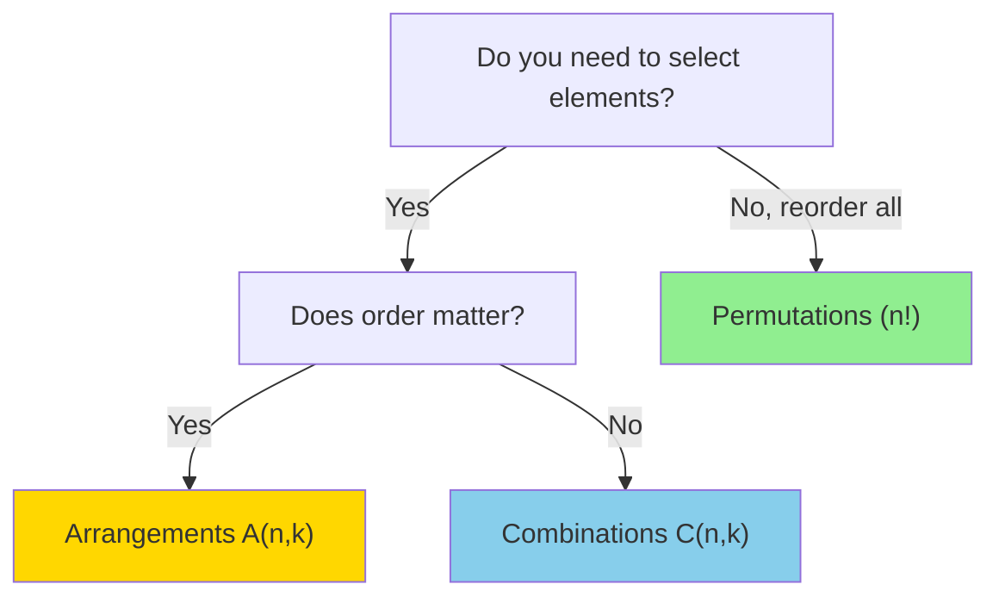

# 🎲 Combinatorics

## 📑 Table of Contents
1. [What is it and why do we need it?](#1-what-is-it-and-why-do-we-need-it)
2. [The Sum and Product Rules](#2-the-sum-and-product-rules)
3. [Permutations](#3-permutations)
4. [Combinations](#4-combinations)
5. [Arrangements](#5-arrangements)
6. [Implementation in Go](#6-implementation-in-go)
7. [Cheat Sheet](#7-cheat-sheet)

---

## 1. 🤔 What is it and why do we need it?

**Combinatorics** is the branch of mathematics that answers the question: *"In how many ways can we...?"*.

For a developer, this is essential for:
*   Assessing algorithm complexity (how many variations need to be iterated over?).
*   Cryptography (calculating the number of possible keys).
*   Testing (determining the number of test cases required for full coverage).
*   Solving combinatorial search and optimization problems.

---

## 2. ➕ The Sum and Product Rules

These rules form the foundation of most combinatorial problems.

### The Sum Rule (OR)

If an element *A* can be selected in **M** ways, **OR** an element *B* can be selected in **N** non-overlapping ways, then there are **M + N** ways to choose either *A* or *B*.

*   *Example*: You have 3 shirts and 2 t-shirts. How many choices do you have for a single top? $3 + 2 = 5$.

### The Product Rule (AND)

If an element *A* can be selected in **M** ways, **AND** following this, an element *B* can be selected in **N** ways, then the pair (*A*, *B*) can be selected in **M × N** ways.

*   *Example*: You have 3 shirts and 2 pairs of pants. How many distinct outfits can you create? $3 \times 2 = 6$.

```go
// Example: Calculating PIN code combinations
func countPinCombinations(digits int) int {
    // Each position has 10 options (0-9)
    // Product Rule: 10 × 10 × 10 × ...
    result := 1
    for i := 0; i < digits; i++ {
        result *= 10
    }
    return result
}

func main() {
    fmt.Println(countPinCombinations(4)) // 10,000 combinations for a 4-digit PIN
    fmt.Println(countPinCombinations(6)) // 1,000,000 combinations for a 6-digit PIN
}
```

---

## 3. 🔄 Permutations

In how many ways can we reorder $n$ distinct objects? In permutations, the **order matters**.

**Formula**: $P_n = n!$ (n factorial)

$n! = 1 \times 2 \times 3 \times ... \times n$

*   *Example*: In how many ways can you arrange 3 books on a shelf?
    $(ABC, ACB, BAC, BCA, CAB, CBA)$
    $3! = 3 \times 2 \times 1 = 6$.

> [!NOTE]
> **Factorial grows extremely quickly!**
> $10! = 3,628,800$, and $13!$ already exceeds the capacity of a 32-bit integer.

### Factorial Implementation in Go

```go
// Iterative version
func factorial(n int) int {
    if n < 0 {
        return 0
    }
    if n == 0 || n == 1 {
        return 1
    }
    
    result := 1
    for i := 2; i <= n; i++ {
        result *= i
    }
    return result
}

// Recursive version
func factorialRecursive(n int) int {
    if n <= 1 {
        return 1
    }
    return n * factorialRecursive(n-1)
}

func main() {
    fmt.Println(factorial(5))  // 120
    fmt.Println(factorial(10)) // 3,628,800
}
```

### Application: Password Strength Estimation

```go
// How many unique 8-character passwords exist using 26 lowercase letters?
// Without repetition: P(26, 8) = 26! / (26-8)! 
// With repetition: 26^8 (Product Rule)

func passwordCombinations(alphabetSize, length int) int {
    result := 1
    for i := 0; i < length; i++ {
        result *= alphabetSize
    }
    return result
}

func main() {
    // Lowercase (26) + uppercase (26) + digits (10) = 62 characters
    combinations := passwordCombinations(62, 8)
    fmt.Printf("Possible 8-character passwords: %d\n", combinations)
    // Output: 218,340,105,584,896 (over 218 trillion!)
}
```

---

## 4. 🥣 Combinations

In how many ways can we choose $k$ elements from a set of $n$ elements when the **order DOES NOT matter**? This is like picking a team: it doesn't matter who is picked first, only who is on the squad.

$$C_n^k = \binom{n}{k} = \frac{n!}{k!(n-k)!}$$

*   *Example*: Picking 2 fruits from 3 (Apple, Banana, Pear).
    Possible sets: (A,B), (A,P), (B,P).
    $C_3^2 = \frac{3!}{2! \cdot 1!} = \frac{6}{2} = 3$.

### Properties of Combinations

*   $C_n^0 = 1$ (One way to choose nothing).
*   $C_n^n = 1$ (One way to choose everything).
*   $C_n^k = C_n^{n-k}$ (Symmetry).

### Application: Lottery Probability

```go
// "5 out of 36": choosing 5 unique numbers from 36
// Jackpot probability = 1 / C(36, 5)

func combinations(n, k int) int {
    if k > n || k < 0 {
        return 0
    }
    if k == 0 || k == n {
        return 1
    }
    
    // C(n, k) optimization: use the smaller k to reduce iterations
    if k > n-k {
        k = n - k
    }
    
    result := 1
    for i := 0; i < k; i++ {
        result *= (n - i)
        result /= (i + 1)
    }
    
    return result
}

func main() {
    lottery := combinations(36, 5)
    fmt.Printf("Possible combinations in a '5 of 36' lottery: %d\n", lottery)
    fmt.Printf("Winning probability: 1/%d ≈ %.7f%%\n", lottery, 100.0/float64(lottery))
    // Output: 376,992 combinations, probability ≈ 0.0002652%
}
```

---

## 5. 📦 Arrangements (k-Permutations)

In how many ways can we choose $k$ elements from a set of $n$ when the **order IS IMPORTANT**?

$$A_n^k = \frac{n!}{(n-k)!}$$

*   *Example*: Selecting 2 people from a group of 3 for the roles of "Lead" and "Assistant".
    Options: (A,B), (B,A), (A,C), (C,A), (B,C), (C,B) — 6 total.
    $A_3^2 = \frac{3!}{(3-2)!} = \frac{6}{1} = 6$.

**Key Difference**: In arrangements, (A,B) and (B,A) are **distinct** items; in combinations, they are considered the **same** set.

---

## 6. 💻 Implementation in Go

### Generating All Permutations

```go
func permute(nums []int) [][]int {
    result := [][]int{}
    
    var backtrack func(start int)
    backtrack = func(start int) {
        if start == len(nums) {
            // Create a deep copy of the current state
            perm := make([]int, len(nums))
            copy(perm, nums)
            result = append(result, perm)
            return
        }
        
        for i := start; i < len(nums); i++ {
            // Swap to next variation
            nums[start], nums[i] = nums[i], nums[start]
            backtrack(start + 1)
            // Restore original state (backtrack)
            nums[start], nums[i] = nums[i], nums[start]
        }
    }
    
    backtrack(0)
    return result
}

func main() {
    nums := []int{1, 2, 3}
    perms := permute(nums)
    fmt.Println("All permutations of [1,2,3]:")
    for _, perm := range perms {
        fmt.Println(perm)
    }
    // Output includes: [1 2 3], [1 3 2], [2 1 3], [2 3 1], [3 2 1], [3 1 2]
}
```

### Generating All Combinations

```go
func combine(n, k int) [][]int {
    result := [][]int{}
    current := []int{}
    
    var backtrack func(start int)
    backtrack = func(start int) {
        if len(current) == k {
            // Deep copy of the found combination
            comb := make([]int, k)
            copy(comb, current)
            result = append(result, comb)
            return
        }
        
        for i := start; i <= n; i++ {
            current = append(current, i)
            backtrack(i + 1)
            current = current[:len(current)-1] // Backtrack step
        }
    }
    
    backtrack(1)
    return result
}

func main() {
    combs := combine(4, 2)
    fmt.Println("All combinations C(4,2):")
    for _, comb := range combs {
        fmt.Println(comb)
    }
    // Output: [1 2], [1 3], [1 4], [2 3], [2 4], [3 4]
}
```

---

## 7. 📝 Cheat Sheet

| Type | Order Sensitive? | Uses All Elements? | Formula | Practical Example |
|---|:---:|:---:|---|---|
| **Permutation** | ✅ Yes | ✅ Yes (all $n$) | $n!$ | People in a queue |
| **Arrangement** | ✅ Yes | ❌ No (only $k$ of $n$) | $\frac{n!}{(n-k)!}$ | Podium finishers (1st, 2nd, 3rd) |
| **Combination** | ❌ No | ❌ No (only $k$ of $n$) | $\frac{n!}{k!(n-k)!}$ | Picking a starting hand in cards |

### How to Choose the Right Concept?



---

## 💡 Practical Use Cases

### 1. Test Case Generation

```go
// How many test cases exist for all parameter combinations?
// 3 Browsers, 2 OS models, 4 Languages
func testCases(browsers, os, languages int) int {
    return browsers * os * languages // Product Rule application
}

func main() {
    fmt.Println(testCases(3, 2, 4)) // 24 total test cases
}
```

### 2. Cybersecurity

```go
// Time needed to brute-force a 4-digit PIN?
// 10,000 combinations
// At 1000 attempts per second: 10 seconds
func bruteForceTime(combinations, attemptsPerSec int) float64 {
    return float64(combinations) / float64(attemptsPerSec)
}

func main() {
    time := bruteForceTime(10000, 1000)
    fmt.Printf("PIN brute-force time: %.1f seconds\n", time)
}
```

---

## 💡 Conclusion

| Problem Type | Formula | Go Reference |
|:---|:---|:---|
| **Factorial** | $n!$ | `factorial(n)` |
| **Permutations** | $n!$ | `permute(arr)` |
| **Combinations** | $C_n^k$ | `combinations(n, k)` |
| **Arrangements (A)** | $A_n^k$ | `arrange(n, k)` |

> [!TIP]
> Go doesn't include a standard factorial function for generic integers; implement a simple loop or use `math/big` for large-scale calculations!
