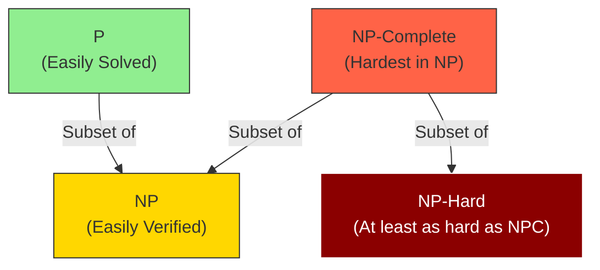

# 🤯 Computational Complexity

## 📑 Table of Contents
1. [What is it?](#1-what-is-it)
2. [P vs. NP](#2-p-vs-np)
3. [NP-Complete](#3-np-complete)
4. [NP-Hard](#4-np-hard)
5. [Why should a developer care?](#5-why-should-a-developer-care)

---

## 1. 🤔 What is it?

**Computational Complexity** is a branch of computer science that classifies problems based on **how difficult they are to solve**.

Rather than focusing on a specific algorithm, complexity theory examines the **inherent difficulty of the problem itself**: is it possible to solve it quickly (in polynomial time) at all?

---

## 2. 🐢 P vs. NP

### P (Polynomial Time) — "Easily Solved" ✅

Problems in the **P** class can be solved in **polynomial time**: $O(n)$, $O(n^2)$, $O(n^3)$, etc.

**Examples:**
- Sorting an array (Merge Sort) — $O(n \log n)$
- Searching in a sorted array (Binary Search) — $O(\log n)$
- Shortest path search (Dijkstra's Algorithm) — $O(E \log V)$

> [!TIP]
> The P class represents "tractable" problems. They can be solved efficiently even for large inputs.

---

### NP (Nondeterministic Polynomial) — "Easily Verifiable" ❓

Problems in the **NP** class are those where a given solution can be **verified** in polynomial time, but **finding** that solution might not be fast.

**Example:**
- **Problem**: Is the number $N = 1234567$ prime?
  - **To Solve**: You need to check all divisors up to $\sqrt{N}$, which takes a long time for massive $N$.
  - **To Verify**: If someone provides the answer "No, it is divisible by 127," checking this is simple: $1234567 \div 127 = ?$

**Another Example** — The Knapsack Problem:
- **Given**: A backpack with a 50 kg capacity and items with specific weights and values.
- **Goal**: Can you achieve exactly $100$ units of value within the weight limit?
- **To Solve**: You have to iterate through every possible combination of items (very slow).
- **To Verify**: If someone tells you, "Yes, take items 2 and 3," you can quickly sum their weights and values to confirm.

---

### P = NP? — The Million Dollar Question 🏆

> [!IMPORTANT]
> **The greatest unsolved problem in CS**: Is P = NP?
> 
> If **P = NP**, then any problem whose solution can be quickly verified could also be **quickly solved**. This would revolutionize the world:
> - Modern cryptography would become obsolete (RSA keys could be cracked easily).
> - Extremely complex optimization and scheduling problems would be solved instantly.
>
> Most scientists suspect that **P ≠ NP**, but this has **not been proven**!

---

## 3. 🐉 NP-Complete

**NP-Complete** problems are the **hardest problems within the NP class**. They possess a unique and powerful property:

> If a **fast** (polynomial-time) algorithm is found for **any single** NP-Complete problem, then **all** problems in NP can be solved quickly ($P = NP$).

### Characteristics of NP-Complete Problems:

1. They reside within the NP class (solutions are easily verified).
2. Every other NP problem can be reduced to them in polynomial time.

### Classic NP-Complete Examples

#### 1. Traveling Salesman Problem (TSP)

**Scenario**: A salesman needs to visit a set of cities.  
**Question**: Is there a route that visits every city once and returns to the start, traveling no more than $K$ kilometers?

**Complexity**: Solving this exactly requires testing all permutations — $O(n!)$ (factorial growth!).

```go
// Naive TSP solution - O(n!)
func tspBruteForce(cities [][]int) int {
    // cities[i][j] = distance from city i to city j
    n := len(cities)
    minDistance := math.MaxInt
    
    // Generate all city permutations
    permutations := generatePermutations(n)
    
    for _, perm := range permutations {
        distance := 0
        for i := 0; i < n-1; i++ {
            distance += cities[perm[i]][perm[i+1]]
        }
        distance += cities[perm[n-1]][perm[0]] // Return to start
        
        if distance < minDistance {
            minDistance = distance
        }
    }
    
    return minDistance
}
```

#### 2. Knapsack Problem
**Input**: A set of items, each with a weight and a value, plus a maximum weight $W$.  
**Goal**: Select a collection of items that maximize the total value without exceeding $W$.

#### 3. SAT (Boolean Satisfiability)
**Input**: A logical expression like $(A \lor B) \land (\neg A \lor C)$.  
**Goal**: Can you assign true/false values to the variables such that the entire expression is true?

**Impact**: SAT was the **first** problem proven to be NP-Complete (Cook's Theorem, 1971).

#### 4. Graph Coloring
**Input**: A graph.  
**Goal**: Can you color the vertices using $K$ colors such that no two adjacent vertices share the same color?

---

## 4. 🔥 NP-Hard

**NP-Hard** problems are **at least as difficult** as the hardest problems in NP, but they don't necessarily belong to NP themselves (i.e., you might not even be able to verify a solution quickly).

> [!NOTE]
> NP-Complete $\subset$ NP-Hard. Every NP-Complete problem is NP-Hard, but the reverse is not true.

**Examples:**
- The Halting Problem — **undecidable** (impossible to solve for all inputs).
- The optimization version of TSP ("Find the **absolute shortest** route possible").



---

## 5. 💼 Why should a developer care?

### 1. Recognizing Limitations
If you realize a problem you've been tasked with is NP-Complete, don't waste time hunting for a "perfect" algorithm. It likely doesn't exist.

### 2. Practical Strategies
For NP-Complete problems, industry professionals use:

- **Heuristics**: Approximate solutions that are "good enough" even if they aren't optimal.
  ```go
  // A Greedy approach to the Knapsack problem (fast, but not always optimal)
  func greedyKnapsack(weights []int, values []int, capacity int) int {
      // Prioritize items with the highest value-to-weight ratio
      // O(n log n) complexity instead of O(2^n)
  }
  ```

- **Dynamic Programming**: Provides pseudo-polynomial solutions for specific cases.
- **Meta-heuristics**: Genetic algorithms, Simulated Annealing, etc.

### 3. Problem Reduction
If your task can be reduced to an NP-Complete problem (like TSP or SAT), you immediately know:
- A polynomial-time exact solution is highly improbable.
- You should prioritize approximation methods.
- Brute force is only viable for very small inputs.

---

## 💡 Summary Table

| Class | Solvable Quickly? | Verifiable Quickly? | Examples |
|:---|:---:|:---:|:---|
| **P** | ✅ Yes | ✅ Yes | Sorting, BFS, Binary Search |
| **NP** | ❓ Unknown | ✅ Yes | Sudoku, Graph Coloring |
| **NP-Complete** | ❌ No* | ✅ Yes | TSP, SAT, Knapsack |
| **NP-Hard** | ❌ No | ❌ Not Necessarily | Halting Problem, TSP Optimization |

\* *Assuming $P \neq NP$*

> [!CAUTION]
> If someone claims to have found a polynomial-time solution for TSP, they are either mistaken or they have just solved the $P$ vs. $NP$ problem and earned a million dollars! 💰
